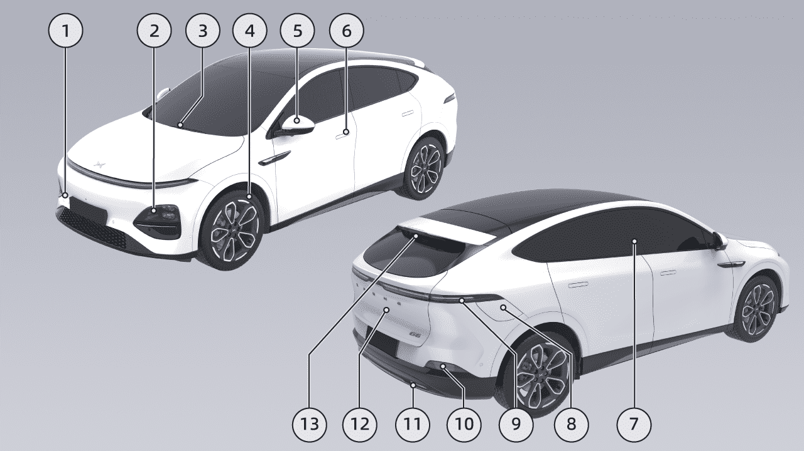
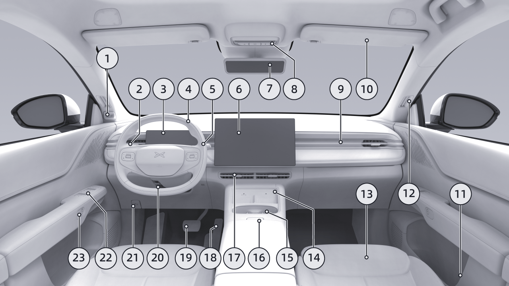
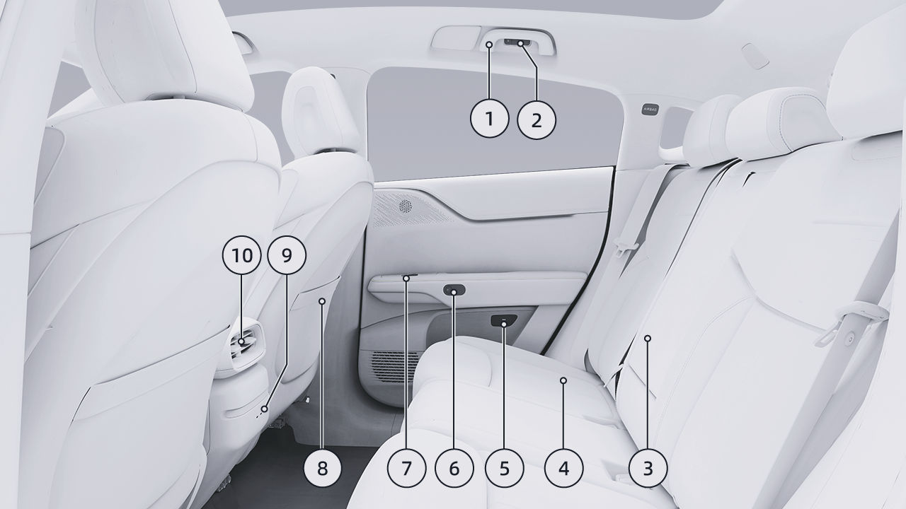
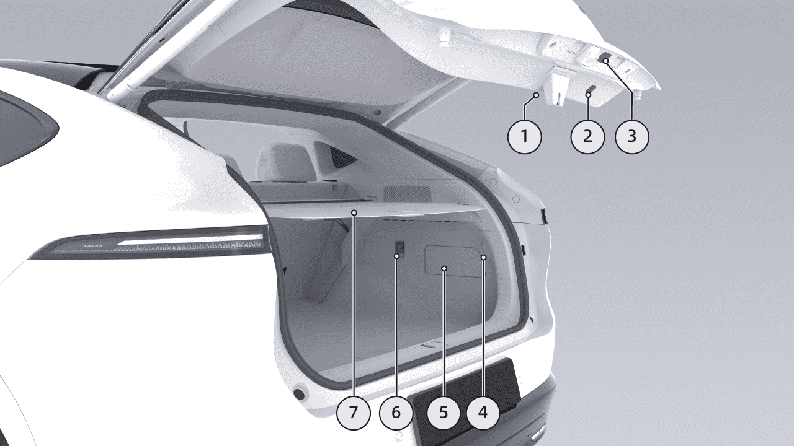
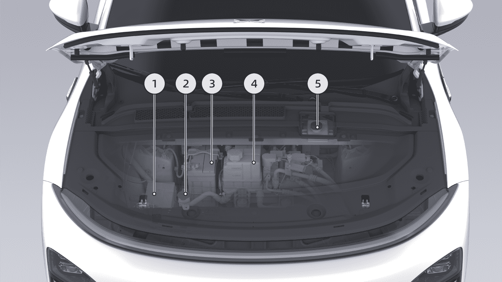
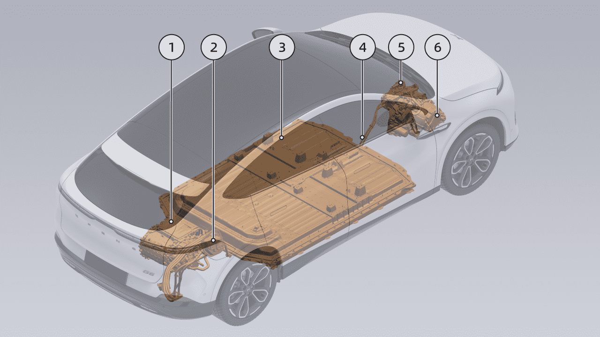
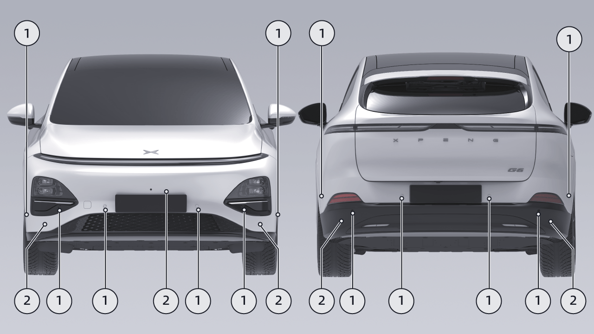
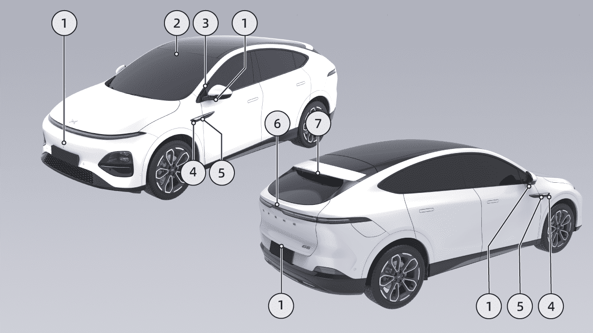

# Perfil del Vehículo

Perfil del Vehículo

Apariencia

• Reemplazo de las Escobillas del Limpiaparabrisas Ver página 318

Introducción

4. Ruedas

• Introducción a los Neumáticos Ver página 323

• Parámetros de los neumáticos Ver página 357

5. Espejo Lateral

• Calefacción del Espejo Lateral

• Ajuste del Espejo Lateral Ver página 219

6. Puerta

• Confirmación de Bloqueo/Desbloqueo Ver página 180

1. Cubierta del gancho de remolque

2. Faros

• Entrada Sin Llave Ver página 192

• Bloqueo/Desbloqueo de Emergencia

• Luces laterales, Luz baja, Luz alta Ver página 223

• Manijas de Puerta Eléctricas Ocultas Ver página 197

• Luz Alta Inteligente (IHB) Ver página 240

7. Área de lectura de tarjeta NFC

8. Cubierta del puerto de carga

3. Limpiaparabrisas

• Apertura y Cierre de la Tapa del Puerto de Carga Ver página 294

• Control del Limpiaparabrisas Ver página 226

Perfil del Vehículo

9. Luz trasera

10. Luz de Freno y Retrorreflector Trasero

11. Luces antiniebla traseras/Luces de marcha atrás

12. Maletero

• Apertura o Cierre del Maletero Ver página 202

13. Limpiaparabrisas Trasero

• Control del Limpiaparabrisas Ver página 226

• Reemplazo de las Escobillas del Limpiaparabrisas Ver página 318

Perfil del Vehículo

Frente

Introducción

1. Cámara interior del vehículo

• Operación de las Luces Ver página 223

• Monitoreo del Estado del Conductor (DSM)* Ver página 145

3. Tablero de instrumentos

• Control del Limpiaparabrisas Ver página 226

2. Palanca de Luces y Limpiaparabrisas

• Interfaz, Luz indicadora Ver página 20

Perfil del Vehículo

4. Volante

• Luz de lectura Ver página 265

• Luces de advertencia Ver página 334

• Botones del volante, bocina Ver página 255

• E-call* Ver página 350

• Airbag delantero del conductor Ver página 159

• Dirección Asistida Ver página 238

9. Luces de Ambiente Ver página 266

• Apagado de emergencia Ver página 272

5. Cambio de marchas

11. Manija de emergencia de la puerta delantera

10. Parasol y Espejo de Cortesía Ver página 262

• Control del Cambio de Marchas Ver página 228

• Control de Crucero Adaptativo (ACC) Ver página 90

12. Salidas de descongelamiento laterales

• Control de Centrado de Carril (LCC) Ver página 96

13. Fila Delantera

• Ajuste del Asiento Ver página 212

6. CID

• Ventilación del Asiento Ver página 269

• Interfaz del CID Ver página 27

• Calefacción del Asiento Ver página 267

• Masaje del Asiento* Ver página 269

7. Espejo Retrovisor Interior

• Espejo Retrovisor Interior Antideslumbrante Manual* Ver página 242

14. Carga Inalámbrica Ver página 272

15. Portavasos

• Streaming de Medios Dentro del Espejo Retrovisor* Ver página 244

16. Interruptor del apoyabrazos central delantero

17. Salidas de aire acondicionado

• Ajuste de las Salidas de Aire Ver página 250

8. Luz de techo delantera

18. Pedal del Acelerador

Perfil del Vehículo

19. Pedal de Freno

• Regeneración Ver página 236

• Ajuste de la Sensación del Pedal Ver página 236

20. Ajuste de la Posición del Volante

• Ajuste de la Posición del Volante Ver página 241

21. Manija de apertura del capó delantero Ver página 309

22. Interruptor de la puerta

• Ventana Ver página 259

• Interruptor del seguro de la puerta

23. Apertura/Cierre de las Puertas Eléctricas Ver página 199

Perfil del Vehículo

Trasero

Introducción

1. Manija del techo

• Ajuste del Asiento Ver página 212

2. Luz de lectura Trasera Ver página 265

3. Apoyabrazos central trasero

5. Anillo de apertura de emergencia de la puerta Ver página 334

• Calefacción del Asiento* Ver página 267

4. Fila Trasera

Perfil del Vehículo

6. Apertura/Cierre de las Puertas Eléctricas Ver página 199

7. Interruptores de las ventanillas Consultar página 258

8. Bolsillo para mapas en el respaldo de los asientos del conductor y del acompañante

9. Puerto de carga Type-C

10. Salidas de aire del aire acondicionado

• Ajuste de las salidas de aire Consultar página 250

Perfil del vehículo

Maletero

Introducción

1.
Tapa del maletero

• Apertura/cierre del maletero

2. Interruptor interior del maletero

• Dispositivo de emergencia del maletero

3. Interruptor exterior del maletero

• Apertura/cierre del maletero

4. Luz trasera del maletero

Perfil del vehículo

5. Placa de cubierta de mantenimiento del maletero

6. Puerto de alimentación de 12 V

• Desbloqueo de emergencia del puerto de carga

7. Cubierta para carga del maletero

Perfil del vehículo

Maletero delantero

5. Depósito de líquido de frenos

• Modelo y cantidad de llenado

Introducción

• Inspección y rellenado

• Modelo y cantidad de llenado

1.
Caja de fusibles del maletero delantero

2. Depósito de líquido lavaparabrisas

• Inspección y rellenado

3. Batería

• Cantidad de llenado

4. Depósito de refrigerante

• Inspección y rellenado

Perfil del vehículo

Componentes de alto voltaje

Introducción

1.
Sistema de transmisión eléctrica trasero

• Apertura y cierre de la tapa del puerto de carga

2. Puerto de carga

• Tipo y parámetros

• Operación de carga

• Desbloqueo de emergencia del puerto de carga

• Descarga externa

Perfil del vehículo

3. Batería de tracción

4. Mazo de cables de alto voltaje

5. Procesador del compresor de aire

• Mantenimiento de la batería de tracción

• Requisitos y procedimientos de reciclaje de la
batería de tracción

6. Sistema de transmisión eléctrica delantero*

advertencia

No toque ni retire el mazo de cables de alto voltaje ni los componentes de alto voltaje conectados al
mazo de cables de alto voltaje, ya que existe riesgo de descarga eléctrica.

Perfil del vehículo

Asistente inteligente de conducción - hardware

Radar

1.
Radar ultrasónico

2. Radar de onda milimétrica*

Perfil del vehículo

Cámara
1.
Cámara de visión envolvente

2. Cámara binocular

3. Cámara inteligente interior*

4. Cámara delantera lateral*

5. Cámara trasera lateral*

6. Cámara trasera*

7. Cámara del espejo interior CMS*

advertencia

Con la funcionalidad de radar y cámara limitada, la función de Asistencia a la Conducción no se activará o no
funcionará con normalidad.

