# XOS

XOS

Visualización del Tablero

Pantalla de la Página

1.
Luz Indicadora

2. Velocidad

• Las luces indicadoras están ubicadas en
diferentes posiciones del tablero de
instrumentos para reflejar el estado de las
funciones del vehículo.

3. Marcha

4. Modo de Conducción Inteligente

• Muestra el estado del vehículo.

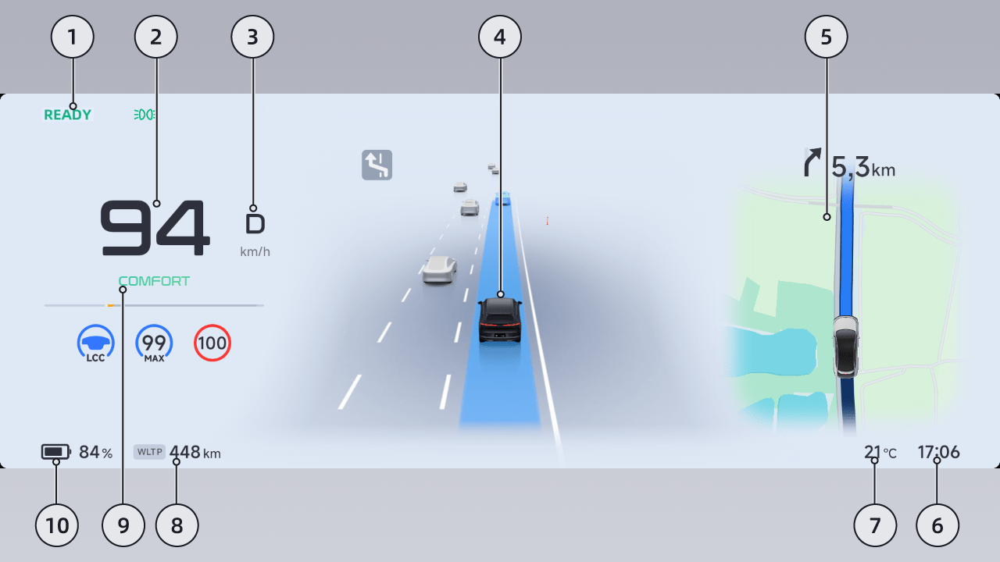

XOS

• Muestra el entorno exterior simulado del
vehículo.

5. Área de información del lado derecho

• La información mostrada se puede cambiar
utilizando la rueda de desplazamiento del
volante, y puede elegir el estado del
vehículo, el consumo de energía, el
kilometraje, la navegación, la música, etc.

6. Hora

7. Temperatura ambiente exterior

8. Autonomía

• En la interfaz del CID “ 
 →Carga
y Descarga→Carga”, se puede
cambiar la visualización entre Dinámica y WLTP.

9. Modos de Conducción Ver página 236

10. Carga

• En la interfaz del CID “ 
 →Carga
y Descarga→Carga”, se puede
activar/desactivar la “Visualización del Porcentaje de Batería”.

XOS

Indicadores del Tablero
Después de encender el vehículo, algunos indicadores se iluminarán. Una vez que el sistema completa la
autoverificación, estos indicadores se apagarán si el sistema funciona con normalidad. Algunos indicadores se iluminan para mostrar
el estado actual de las funciones del sistema del vehículo, no una falla del sistema. Si hay algo que no quede claro durante el uso diario
del vehículo, consulte el Centro de Servicio de XPENG.

indicator_high_beam(ON)
Falla del SRS

indicator_smart_high_beam(ON)
Cinturón de seguridad del conductor sin abrochar

indicator_smart_high_beam_error
Cinturón de seguridad del pasajero delantero sin abrochar

indicator_smart_high_beam_standby
Cinturón de seguridad del pasajero trasero izquierdo
sin abrochar

indicator_left_turn_lamp
Cinturón de seguridad del pasajero trasero central
sin abrochar

indicator_right_turn_lamp
Cinturón de seguridad del pasajero trasero derecho
sin abrochar

XOS

indicator_low_beam(ON)
Límite de velocidad en la señal de límite de velocidad

indicator_fog_lights(ON)
Límite de velocidad del radar electrónico

indicator_parking_lamp(ON)
Sistema de alta tensión listo y vehículo en
estado conducible

indicator_auto_elow_beam(ON)
Falla de la batería

indicator_lane_departure_failure
Límite de potencia de conducción

indicator_charge_light(Connected)
Falla del tren motriz

indicator_timer_charge(ON)
Sobrecalentamiento del motor y del controlador

indicator_eps_warn
Falla del motor y del controlador

XOS

Encendido fijo: Función de estacionamiento activada
Parpadeando: Estado incorrecto de la pinza de freno
Temperatura de la batería de tracción demasiado baja

Encendido fijo: falla del freno de estacionamiento
Parpadeando: Sistema de estacionamiento en
modo de mantenimiento

Temperatura de la batería de tracción demasiado alta

AUTO HOLD activado
SOC de la batería de tracción demasiado bajo

Falla de AUTO HOLD
Falla de la batería de tracción

Falla del sistema de frenos
Batería de tracción desconectada

Parpadeando: Programa Electrónico de Estabilidad
activado
Encendido fijo: Falla del Programa Electrónico de
Estabilidad

Falla de la Advertencia de Colisión Frontal

Programa Electrónico de Estabilidad OFF
Advertencia de Colisión Frontal OFF

XOS

Hay demasiados indicadores encendidos al
mismo tiempo, y todas las posiciones de visualización
de indicadores están ocupadas.

Falla del Sistema Antibloqueo de Frenos

Degradación del rendimiento de frenado
Falla del sistema de asistencia al conductor

HDC activado
Presión de neumáticos anormal o falla del Sistema de
Monitoreo de Presión de Neumáticos

Falla de HDC
Alguna puerta, el capó delantero o el baúl
sin cerrar

Sin señal de límite de velocidad
Control de Centrado de Carril activado

Velocidad máxima límite de ACC/LCC, y
alguna función activada

El Control de Centrado de Carril puede ser
activado

Velocidad máxima límite de ACC/LCC, y
ambas no activadas
Asistente Inteligente de Estacionamiento activado

XOS

Lámpara indicadora de falla de LCC
El Asistente Inteligente de Estacionamiento puede ser
activado

Indicador de función de remolque no
activada*
Control de Crucero Adaptativo activado

Lámpara indicadora de falla de remolque*
El Control de Crucero Adaptativo puede ser
activado

Indicador de función de remolque normal*
Control de Crucero Adaptativo no disponible

Activación del Sistema de Asistencia de Velocidad
Excede el límite de velocidad de la señal de
límite de velocidad

Piloto Guiado de Navegación Inteligente no
disponible
Asistente Inteligente de Estacionamiento no disponible

Control de Centrado de Carril no disponible
Indicador de nivel bajo de líquido lavaparabrisas

XOS

Pantalla Central de Información (CID)

Visualización de páginas
La CID muestra de forma predeterminada un estado de pantalla dividida, con la interfaz de navegación del mapa a la izquierda y la
interfaz de conducción inteligente global a la derecha.

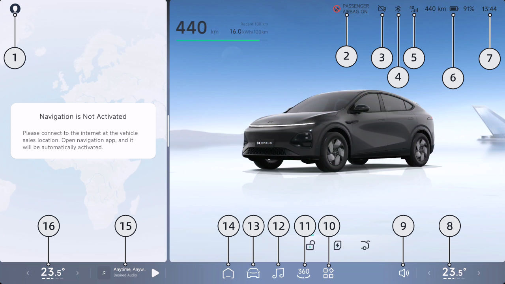

XOS

1.
Cuenta y hábitos Ver página 54

10. Centro de aplicaciones

11. Imagen panorámica 360° AVM Ver página 73

• Haga clic en Iniciar sesión para mostrar el avatar de su cuenta.

• Configure los hábitos de uso del vehículo.

12. Aplicación de música Ver página 57

2. Interruptor de desactivación del airbag del acompañante

3. Grabadora de conducción*

13. Configuración

• Acceso a la configuración del control del vehículo.

• Muestra el estado actual del video de conducción Ver
página 83

14. Página de inicio

4. Bluetooth

15. Componente de música Ver página 57

• Haga clic para volver al escritorio.

5. Red

6. Batería de tracción

• Muestra la carátula del medio que se está reproduciendo,
el nombre del medio y la fuente de reproducción.

• Muestra la autonomía actual y la
carga restante de la batería.

• Haga clic para pausar o reanudar la reproducción de música.

7. Hora

• Deslice hacia la izquierda o la derecha para ir a la canción anterior o
siguiente.

8. Componentes del aire acondicionado del acompañante

16. Componentes del aire acondicionado del conductor Ver página 252

• Muestra el estado actual de temperatura y volumen de aire
del aire acondicionado del lado del acompañante.

• Muestra el estado actual de temperatura y volumen de aire
del aire acondicionado del conductor principal.

• Haga clic para ajustar el aire acondicionado

9. Ajuste del volumen

• Haga clic para ajustar el aire acondicionado Ver página 252

XOS

Multitarea en pantalla dividida

Deslice para volver a la página anterior de la
ventana correspondiente.

Arrastre la línea de pantalla dividida para alternar entre pantalla
completa y pantallas divididas, y cambiar el tamaño de la ventana
de la pantalla dividida. Cuando la pantalla dividida se
cambia a pantalla completa, se memorizará la última aplicación abierta con
pantalla dividida.

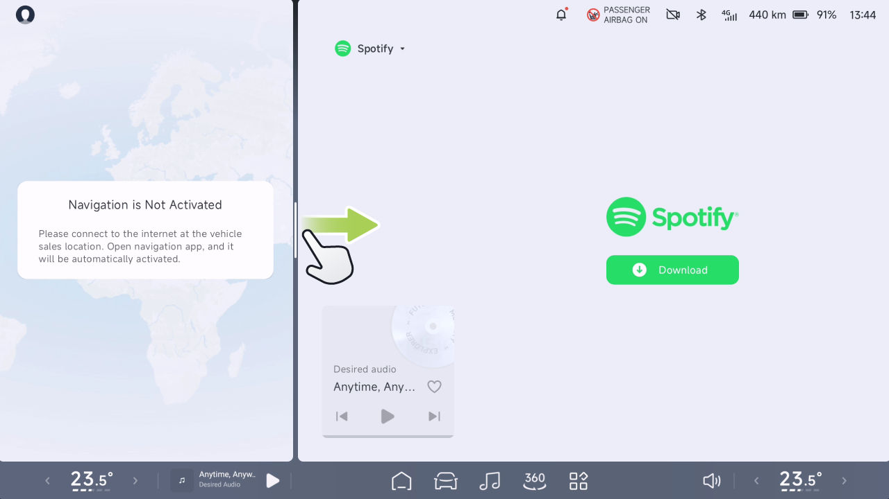

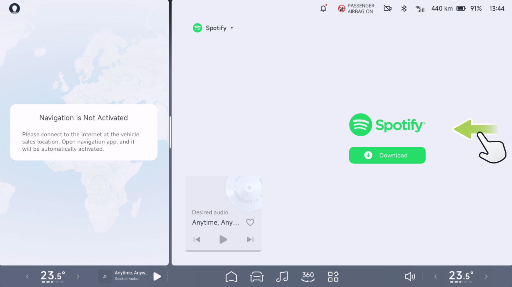

XOS

Toque la línea de pantalla dividida para fijar el modo de
ventana pequeña. En la ventana pequeña, se pueden mostrar Asistente de Realidad
Virtual en tiempo real, Mapa, Música y Navegador.

En el modo de pantalla dividida, se pueden abrir diferentes aplicaciones
en ventanas grandes, lo que permite, por ejemplo, que
el conductor vea la interfaz de navegación y
el acompañante delantero mire videos, escuche
música y lea letras simultáneamente.

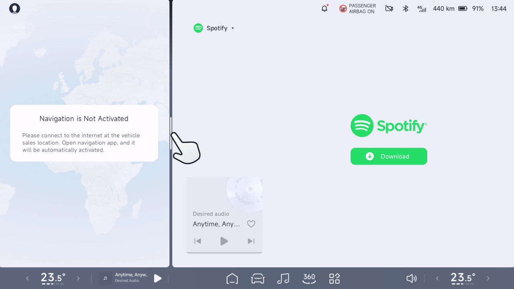

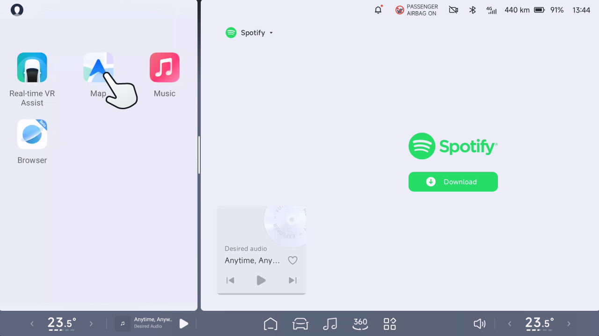

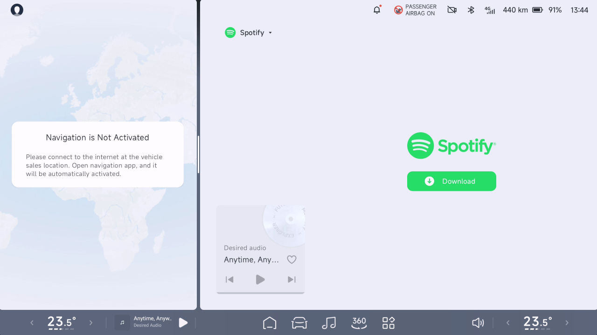

XOS

Interacción por gestos

Deslizar con tres o cuatro dedos hacia la izquierda o la derecha permite
cambiar entre diferentes ventanas de aplicaciones. Sin embargo,
no funciona en modo de pantalla completa.

Tres dedos deslizando hacia abajo permite salir de la
aplicación abierta en la ventana grande en el modo de
pantalla dividida y luego regresar a la página de inicio
correspondiente.

Consejos

El área de la barra de tareas inferior no participa
en los gestos. La barra de estado y la barra de tareas
inferior no se ocultan durante el intercambio.

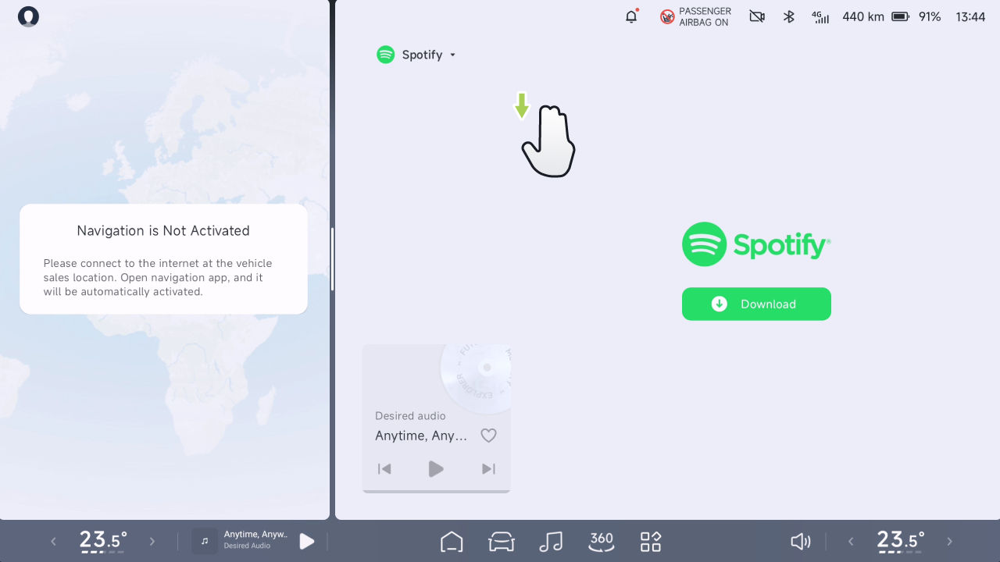

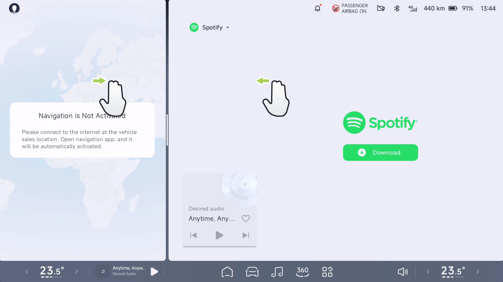

XOS

Personalizar la barra de tareas inferior

4. Toca “Listo” o toca el espacio en blanco de la
barra de tareas inferior para salir del estado
personalizado.

Centro de Aplicaciones

1.
Para personalizar la barra de tareas inferior, mantén
presionada cualquier área del icono de la barra de
tareas inferior.

2. Puedes arrastrar el control de funciones y los
iconos de componentes de acceso directo en
Aplicaciones, Ventanas y Puertas, Asientos y A/A al
espacio en blanco de la barra de tareas inferior.

1.
En la barra de tareas inferior, toca el icono 
 para
abrir el Centro de Aplicaciones, y toca cualquier
espacio en blanco del Centro de Aplicaciones para
salir rápidamente.

3. En el estado personalizado, toca 
 en la esquina
superior derecha o arrastra el icono al Centro de
Aplicaciones y suéltalo para quitar el icono de la
barra de tareas inferior.

2. Toca el icono de la aplicación para abrirla. Las
aplicaciones que se están descargando e instalando
también tienen una visualización de estado
correspondiente.

3. Mantén presionado el icono de la aplicación o un
espacio en blanco para entrar en el estado
personalizado del Centro de Aplicaciones. En este

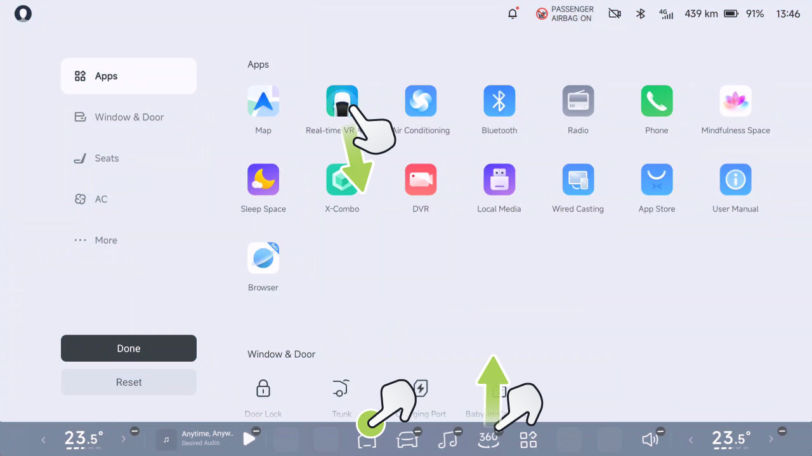

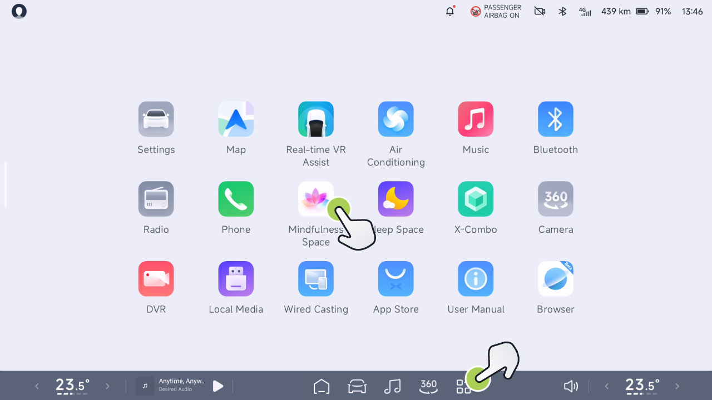

XOS

momento, puedes arrastrar el icono para ordenarlo en la
lista de aplicaciones.

Configuración de pantalla

Panel de accesos directos

Ajuste de brillo

Para las funciones de uso frecuente, puedes operar
directamente desde el panel de accesos directos sin abrir
la aplicación. Desliza hacia abajo desde la parte superior
de la pantalla para desplegar el panel de accesos directos,
y desliza hacia arriba para plegarlo. El panel de accesos
directos se pliega cuando tocas un espacio en blanco o
abres una nueva pantalla.

En la CID, ve a la interfaz “ 
 →Pantalla”, y
puedes ajustar el brillo de la pantalla táctil y de la
pantalla del tablero mediante los controles deslizantes.

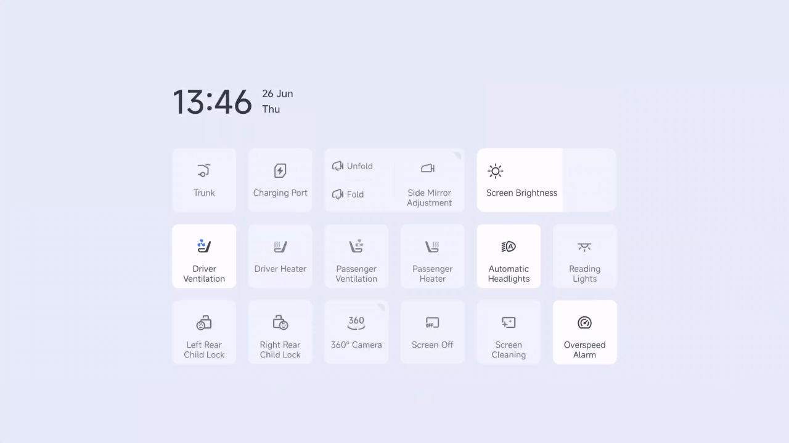

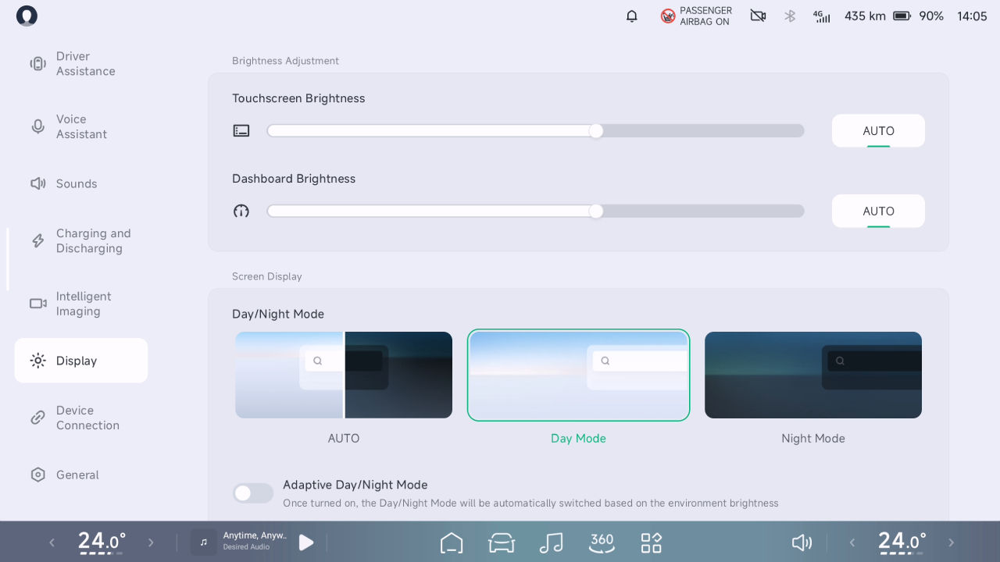

XOS

Modo de visualización

Modo de espera

En la CID, ve a la interfaz “ 
 →Pantalla”, y
puedes cambiar entre Automático, Modo Día y
Modo Noche. También puedes activar o desactivar
el “Modo Día/Noche Adaptativo”. Después de activarlo,
cambiará automáticamente al Modo Día/Noche
según la luz ambiental.

En la CID, ve a la interfaz “ 
 →Pantalla”,
y puedes entrar en el “Modo de espera”. En el
“Modo de espera”, los faros, la pantalla táctil
y el tablero se apagarán.

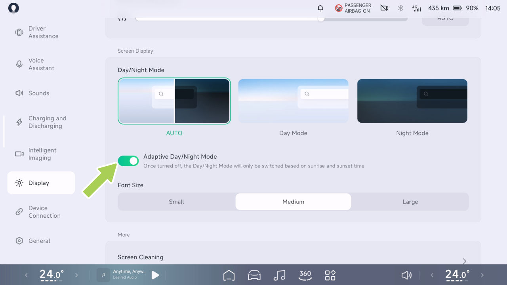

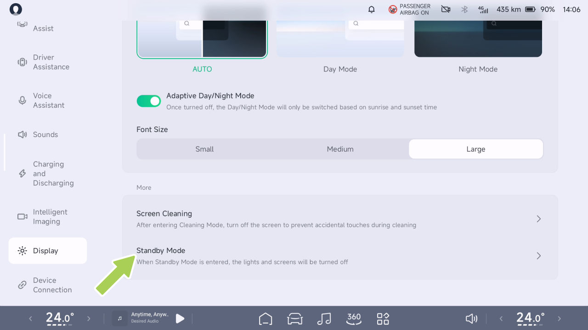

XOS

Asistente de voz

Modo de activación

Introducción

Xpeng puede activarse de las siguientes maneras:

• Botón de voz en el volante

• “Hey XPENG”

En la CID, ve a la interfaz “ 
 →Asistente de voz”,
y puedes activar o desactivar “Hey XPENG”. Después
de habilitar la función, agrega “Hey XPENG” antes o
después de un comando para iniciar el servicio Xpeng
en cualquier momento. Por ejemplo:

• Hey XPENG, enciende el A/A.

• Navega a casa, Hey XPENG.

En la CID, andá a la interfaz “
 →Asistente de Voz”
y podés activar “Asistente de Voz”.
Esta función admite la activación de funciones como
“Hey XPENG y Respuesta Instantánea”.

• ¿Cuánto tiempo tardaré en llegar al
destino? Hey XPENG.

• Hey XPENG, reproducí una canción.

Solo después de activar el “Asistente de Voz” se pueden
habilitar otras funciones del Asistente de Voz.

Selección de Idioma del Asistente de Voz

En la CID, andá a la interfaz “
 →Asistente de Voz”
y tocá “Selección de Idioma del Asistente de Voz”.
Podés seleccionar el idioma del Asistente de Voz,

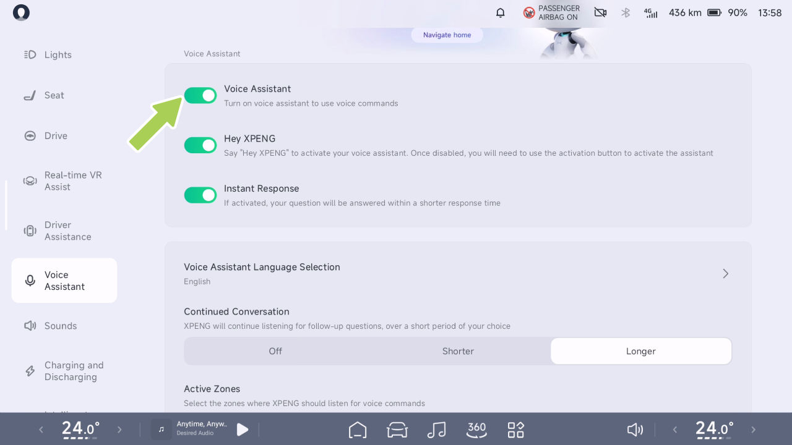

XOS

descargar e instalar un nuevo paquete de idioma,
y cambiar a un nuevo idioma.

• Más largo: Después de seleccionar la opción, Xpeng
puede seguir escuchando durante un período de tiempo después de
ejecutar la tarea anterior. En este momento,
Xpeng puede emitir nuevos comandos
directamente sin necesidad de despertarlo
repetidamente.

Modo de diálogo

Zonas de Activación

El Asistente de Voz admite el reconocimiento de diálogo de voz
de cuatro zonas en dos filas del
vehículo, y cada pasajero del vehículo
puede despertar a Xpeng en cualquier momento para mantener un
diálogo. Mediante la localización de la fuente de sonido
y la capacidad de separación de voz de las seis
zonas de reconocimiento de voz, Xpeng puede distinguir
con precisión qué posición da los comandos y
proporciona los servicios correspondientes. El diálogo
entre los pasajeros no interfiere entre sí.

En la CID, andá a la interfaz “
 →Asistente de Voz”
y podés seleccionar "Desactivado"、"Más corto" o
"Más largo".

• Desactivado: El modo de diálogo se desactivará después
de seleccionar la opción.

• Más corto: Después de seleccionar la opción, Xpeng solo
puede ejecutar un comando por
cada diálogo.

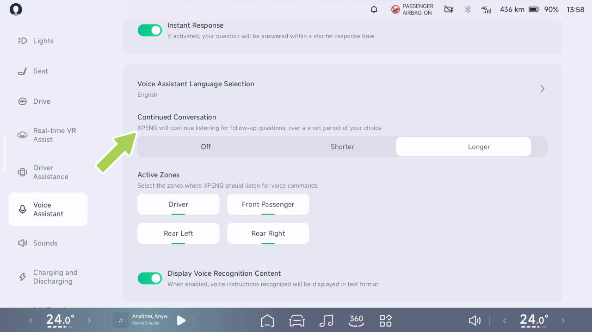

XOS

brindarte servicios de voz básicos, incluyendo
entre otras las siguientes funciones:

• Control por voz del A/A

• Control por voz de los asientos

• Control por voz de puertas y ventanillas

• Control por voz de la iluminación

• Control por voz de la navegación

Unirse al Programa de Mejora de la Experiencia
del Usuario del Asistente XPENG

En la CID, andá a la interfaz “
 →Asistente de Voz”
y podés cerrar la zona de reconocimiento
de voz. Después de cerrarla, el sistema ya no
aceptará comandos de voz de esta zona de
reconocimiento de voz.

Para hacer a Xpeng cada vez más inteligente, te
invitamos sinceramente a unirte al “Programa de Mejora
de la Experiencia del Usuario del Asistente XPENG”.

Diálogo sin Internet

En entornos con mala conexión de red como
estacionamientos subterráneos, autopistas y túneles,
algunos servicios de conversación que dependen en gran medida
de Internet (como reproducir música) están
temporalmente no disponibles. Sin embargo, Xpeng todavía puede

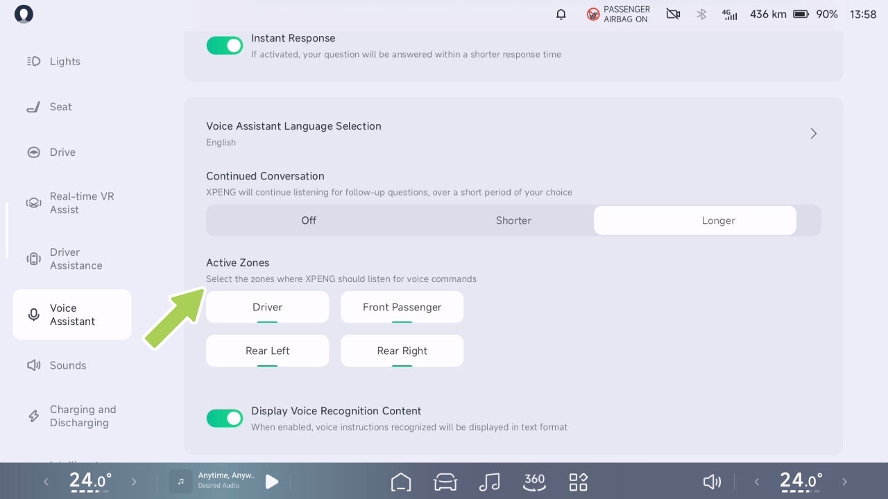

XOS

Antes de habilitar esta función, necesitás
revisar y aceptar el Programa de Mejora de la
Experiencia del Usuario del Asistente XPENG. Después de
habilitar esta función, el sistema puede recopilar
información de uso de voz para mejorar tu experiencia
de interacción por voz.

Control por voz

Voice Control permite al conductor controlar las
funciones del vehículo mientras conduce. Utilizá
los comandos de voz para evitar distracciones y
mejorar la seguridad y la comodidad al conducir.

En la CID, andá a la interfaz “ 
 →General→Seguridad y
Privacidad”, donde podés activar o desactivar
“Unirse al Plan de Mejora de la Experiencia del Usuario para el
Asistente de Voz”.

Comandos de control por voz comunes (inglés)

Categoría
Función
Ejemplos de comandos de control
por voz

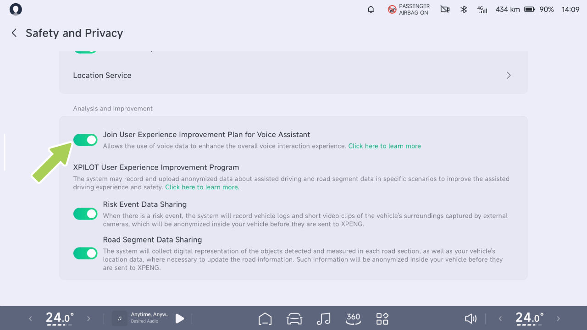

XOS

Sube más el asiento del conductor

Mueve el asiento del conductor hacia
adelante

Asientos

Activa el masaje del asiento del conductor

Cambia el modo de masaje del asiento
de la segunda fila

Activa el masaje delantero en intensidad baja

Enciende el aire acondicionado

Sube la temperatura del aire
acondicionado del conductor

Activa el aire acondicionado automático del conductor

Enciende el purificador

Activa la recirculación

Vehículo

Activa la refrigeración máxima

Activa la calefacción máxima

Activa el modo de ventilación

Activa la ventilación del asiento

XOS

Hacer una llamada

Teléfono
/

Llama a Anna

Devuelve la llamada

Navegar a

Navegación
/

Salir de la navegación

Llévame a casa

Siguiente canción

Multimedia
/

Pausar

Apaga la música

Reproduce música

XOS

Sube el brillo de la pantalla principal
un 10%

Pantalla

Cambia al modo diurno

Aumenta el brillo del tablero

Otros

Activa el Bluetooth del conductor

Dispositivo

Enciende el Wi-Fi

Enciende la cámara

Gängige Sprachsteuerungsbefehle (Deutsch)

Categoría
Función
Ejemplos de comandos de control
por voz

XOS

Verstelle den rechten Rücksitz
nach vorne

Neige die Rückenlehne des
Fahrers nach vorne

Sitz

Aktiviere die Sitzmassage des
Fahrers

Aktiviere wave Massage des
Vordersitzes

Stelle die Massageintensität auf
Stufe hoch ein

Schalte die Klimaanlage des
ganzen Fahrzeugs aus

Senke die Temperatur auf der
Beifahrerseite

Erhöhe den Luftstrom

Stelle Klimaanlage auf
Automatikmodus ein

Fahrzeug

Klimaanlage

Schalte die Umluft aus

Reinige die Luft

XOS

Mache einen Anruf

Telefon
/

Rufe Anna

Rufe 101

Rufe zurück

Navigation
/

Wo ist die Seite für Klimaanlage

Schalte Navigation aus

Bringe mich nach Hause

Vorheriges Lied

Media
/

Pausiere

Spiele Musik

Schalte Sotify ein

XOS

Erhöhe die Bildschirmhelligkeit
um 20%

Bildschirm

Erhöhe die Heiligkeit des
Armaturenbrettes

Sonstiges

Erhöhe die Bildschirmhelligkeit
des Armaturenbretts

Schalte Bluetooth ein

Geräteverbindung

Schalte 360° Kamera aus

Commandes de contrôle vocal courantes
(français)

Categoría
Función
Ejemplos de comandos de control
por voz

XOS

Monte le siège passager

Incline le dossier du siège
conducteur vers l'avant

Active le massage, s'il te plaît

Sièges

Donne-moi un autre type de
massage

Active le massage du siège
conducteur à faible intensité

Allume toutes les climatisations

Augmente la température de la
climatisation

Accrois le volume d'air

Active la climatisation
automatique du conducteur

Climatisation

Ferme le purificateur d'air

Véhicule

Active la recirculation de l'air

Arrête le dégivrage

Refroidissement max

XOS

Passe un appel téléphonique

Téléphone
/

Appelle le service client

Appeler 123

Recompose

Navigation
/

Termine la navigation

Navigue vers

Rentrer à la maison

La chanson précédente

Média
/

Arrête la diffusion de la radio

Joue de la musique

XOS

Augmente la luminosité de
l'écran

Écrans

Mets la luminosité du tableau de
bord en mode automatique

Tableau de bord plus lumineux

Autres

Active le Bluetooth

Appareils

Ouvre la caméra

Active le WIFI

คำสั่งควบคุมดวยเสียงทั่วไป (ภาษาไทย)

หมวดหมู
การทำงาน
ตัวอยางคำสั่งควบคุมดวยเสียง

XOS

ปรับเบาะนั่งไปขางหลังหนอย

ปรับพนักพิงหลังผูโดยสารดานหนา
ไปขางหลังสุด

เบาะ

เปดฟงกชันการนวดเบาะนั่งของคน
ขับ

ปรับแรงนวดของเบาะคนขับใหสูงขึ้น
นิดหนอย

ปดเครื่องปรับอากาศทั้งคันรถ

ปรับอุณหภูมิของที่นั่งคนขับสูงขึ้น
เล็กนอย

เครื่องปรับอากาศ

เพิ่มความเร็วลมของเครื่องปรับ
อากาศในที่นั่งดานหลัง

เปดการไลฝากระจกหลัง

รถยนต

ปดการอุนเบาะของผูโดยสารดาน
หนา

เปดไฟสรางบรรยากาศ

ปดไฟตัดหมอก

ตั้งไฟสรางบรรยากาศเปนสีแดง

XOS

โทรศัพท

โทรศัพท
/

โทรหาผูติดตอ

โทร 123

โทรหมายเลขเมื่อกี้

การนำทาง
/

นำทางไปที่

ไปที่บาน

นำทางไปบริษัท

รายการวิทยุกอนหนา

สื่อ
/

เพลงถัดไป

เลนเพลง

หยุดเลน

XOS

เปดหนาจอทั้งหมดในรถ

หนาจอ

ปรับหนาจอใหสวางขึ้น

เปดความสวางอัตโนมัติของหนาจอ
ดานหนา

อื่น

เปดบลูทูธ

อุปกรณ

เปดกลอง

เปดกลองหนา

X-Combo

Introducción

Para garantizar la experiencia funcional, se
recomienda actualizar la aplicación Xpeng
Motors a la versión 2.34.0 o superior. El
sistema del vehículo debe actualizarse a la
versión 5.4.5 o superior.

precaución

La función X-Combo permite personalizar de
forma individual las funciones del habitáculo
según tus hábitos de conducción. Por ejemplo,
a la hora del almuerzo en días laborables,
cuando tu vehículo está en la oficina, puedes
preactivar el aire acondicionado remoto para
ajustar la temperatura interior y, al entrar en el
vehículo, la posición del asiento se ajusta
automáticamente al modo siesta.

XOS

App del vehículo

para incluir el combo en tu colección. En el
cuadro de búsqueda de la parte superior
derecha, puedes buscar tarjetas de Combo
mediante códigos de Combo y palabras clave.

Acceso a la función

Mis Combos

En la CID, inicia sesión en tu cuenta y podrás
activar, desactivar, eliminar, restaurar o
ejecutar combos.

Edición de Combos

El X-Combo admite la edición personalizada de
tarjetas en Mis Combos.

1.
En la CID, inicia sesión en tu cuenta y, en la
interfaz Mis Combos, toca la Tarjeta de Combo
para acceder a los detalles de la tarjeta.

En la CID, toca « 
 » y luego toca «X-Combo» en
el Centro de Apps para entrar en la interfaz X-Combo.

2. Toca el icono 
 y, en el menú desplegable,
selecciona «Modificar Combo».

Seleccionar Combo

3. Usa la App XPENG para buscar un código de
Combo o escanear el código QR para editarlo.

El X-Combo ofrece una selección de combos de
conducción innovadores y prácticos. Puedes
seleccionar combos en la interfaz «Tienda
recomendada». Toca «Tarjeta de Combo» para
ver sus detalles. En la CID central, inicia sesión
en tu cuenta y toca «Agregar»

Consejos

Después de modificar una escena, solo se
puede actualizar de forma sincronizada una vez
que tanto el IVI

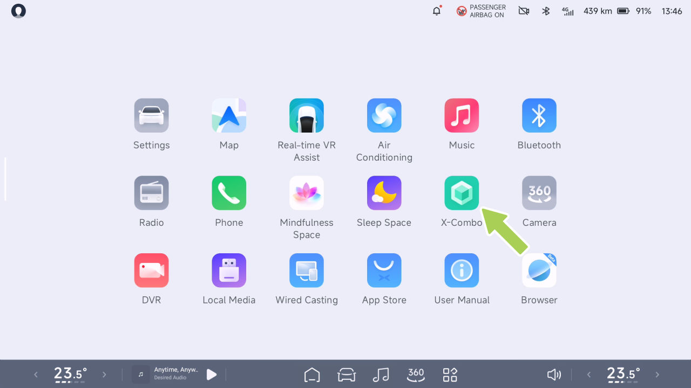

XOS

como el dispositivo móvil estén conectados a la
red.

CID, seleccioná el combo correspondiente y tocá
“Restaurar” para detener el combo y volver al
estado original.

Vista en ejecución

• Una vez completado el combo, también podés
ir a “ 
 →X-Combo→Mis Combos” en la pantalla
de control central, seleccionar el combo
que quieras restaurar y tocar “Restaurar” para detener
el combo y volver al estado original.

Los combos habilitados realizarán automáticamente
una o más funciones continuas cuando el
vehículo cumpla las condiciones de activación especificadas.
Podés tocar “X-Combo en ejecución” en la barra de estado
en la parte superior del CID para ver, detener o restaurar
el combo en ejecución.

Consejos

Restauración con un botón

Las capacidades atómicas actualmente compatibles son
el control de climatización, las posiciones de los asientos, las pantallas,
y se irán agregando más capacidades atómicas
recuperables en versiones posteriores.

Podés restaurar el estado previo al escenario durante
o después del funcionamiento del escenario inteligente
mediante los siguientes métodos:

• Mientras el combo está activo, podés tocar “X-
Combo en ejecución” en la esquina superior izquierda
del CID. En la tarjeta en vivo expandida, seleccioná el
combo que quieras restaurar y tocá “Restaurar”
para detener el combo y volver al estado
original.

Aplicación móvil

Acceso a la función

En la App de XPENG, andá a la interfaz “XPENG→X-Combo”,
y podés personalizar tus propios
combos.

• Mientras el combo está en ejecución, también podés
ir a “ 
 →X-Combo→Mis Combos” en la

XOS

Seleccionar Combo

admite varios activadores de automatización, incluidos
comandos de voz, hora, entorno, estado del
vehículo y más. Los usuarios pueden configurar una amplia
variedad de acciones de ejecución, como ajustes del
modo de conducción y configuraciones del aire acondicionado.

X-Combo ofrece una selección de combos de conducción
innovadores y prácticos. Podés seleccionar
combos en la interfaz “Tienda Recomendada”.
Tocá “Tarjeta de Combo” para ver sus detalles. Tocá “+Agregar”
para incluir el combo en Mis Combos. También podés
ajustar el combo usando el botón “Personalizar”
según tus hábitos de conducción. En el
cuadro de búsqueda en la parte superior derecha, podés buscar
tarjetas de Combo usando códigos de Combo y palabras clave.

A través de la opción “Avanzado”, podés configurar
combos de aplicación avanzados adicionales, como
detección continua de múltiples condiciones, ejecución sincrónica
de múltiples tareas y ejecución de instrucciones con retardo.

Consejos

precaución

Después de modificar un escenario, solo puede
actualizarse de forma sincronizada una vez que tanto el IVI
como el dispositivo móvil estén conectados a la
red.

• Asegurá la seguridad de los vehículos y las personas
cuando los escenarios estén activos.

• En la interfaz “Crear un Escenario”, se
recomienda seleccionar ““””. Este modo
evalúa el nivel de seguridad del escenario según
la condición del vehículo antes de la ejecución.
Si se detecta un riesgo para la seguridad de conducción, como
ajustar el modo de conducción en la posición D,
X-peng preguntará a través de la tarjeta de recomendación
inteligente de la pantalla de control central
si se debe continuar. Si se selecciona ““””,

Personalización individual

X-Combo admite la personalización individual
de las funciones del habitáculo. Tocá “X-Combo→+→Crear un
combo” para comenzar la personalización personal.

El sistema X-Combo

El sistema ofrece dos métodos de activación para
la ejecución de combos: "En el vehículo" y "Remoto".

XOS

el escenario se ejecutará de inmediato cuando
se cumplan las condiciones de activación. Tené
presente los riesgos de seguridad asociados.

Autorización→Agregar", ingresá el número de
teléfono de la persona que querés autorizar y
configurá el período de validez según lo necesites.
De esta manera, podés compartir los derechos de
acceso del vehículo con tu familia y amigos. Tras
iniciar sesión en la App XPENG, el usuario autorizado
puede crear una llave Bluetooth o usar las funciones
de control remoto del vehículo. Se puede autorizar
a un máximo de 5 familiares y amigos para usar el
vehículo.

Cuenta de Usuario

Tipo de Cuenta

Descargá la App XPENG e iniciá sesión con tu
número de teléfono para completar el registro de
la cuenta. Si deseás usar todas las funciones del
vehículo (por ejemplo, la memoria de cuenta),
completá la vinculación de la cuenta del vehículo.

Cuenta del Propietario

Podés abrir la App XPENG e ir a la interfaz
"Autorización del Vehículo" para ver o gestionar
los usuarios autorizados. Después de encontrar
al usuario que querés desautorizar, tocá
"Desautorizar". Entonces se cancela la autorización
del usuario.

Después de comprar el vehículo, durante el
proceso de entrega, la primera cuenta vinculada
y activada será la cuenta del propietario. Un
vehículo solo puede vincularse a una cuenta de
propietario, pero una cuenta puede vincular
múltiples vehículos.

Modo Visitante

Modo visitante: Este es el modo cuando la cuenta
del vehículo no tiene la sesión iniciada. En este
modo, solo se puede acceder a las funciones sin
restricciones de permiso de cuenta (por ejemplo,
A/A, calefacción de asientos y masaje de asientos*).

Después de iniciar sesión en la App XPENG, como
propietario del vehículo, podés tocar "XPENG→
Configuración→Vehículo

Cuentas de Familia y Amigos

XOS

Cuenta de Inicio de Sesión

Tocá "Gestionar Hábitos" y podés eliminar o
renombrar cualquier preferencia de conducción
guardada.

Cuando varias personas comparten un vehículo,
iniciar sesión en la cuenta correspondiente
ajustará automáticamente el asiento, la posición del
espejo lateral y otras configuraciones para el usuario.
Podés iniciar sesión en tu cuenta mediante
cualquiera de los siguientes métodos:

Navegación a Bordo

Navegación Sin Interrupciones

• Iniciá sesión en la App XPENG en tu teléfono.
Cuando desbloqueás el vehículo con una llave
Bluetooth, la cuenta de usuario iniciará sesión
automáticamente.

Introducción

Después de iniciar sesión y vincular con tu App
móvil, la navegación sin interrupciones te permite
enviar una dirección al vehículo desde tu teléfono
móvil para iniciar la navegación de inmediato.

• Tocá el avatar gris predeterminado (sin sesión
iniciada) en la esquina superior izquierda de la
pantalla de control central, y escaneá el código QR
para iniciar sesión después de iniciar sesión en la
App XPENG en tu teléfono.

Operación

Memoria de Cuenta

Tomando la App XPENG como ejemplo, la navegación
sin interrupciones se puede realizar mediante las
siguientes operaciones:

Una vez que inicies sesión en tu cuenta, podés
guardar preferencias de conducción personales
como las posiciones del asiento y del espejo lateral*.
Cada cuenta puede almacenar hasta seis preferencias
de conducción. Después de seleccionar tu foto de
perfil en el CID, podés elegir rápidamente las
preferencias de conducción que deseás activar para
esta sesión.

1.
En la App móvil, cambiá a la interfaz “XPENG”
y tocá “Buscar estaciones de carga y
destinos” para entrar a la interfaz de
Posicionamiento del Vehículo o Cuadro de
Búsqueda. En esta interfaz, configurá el
destino de navegación.

XOS

2. Tocá “Enviar al vehículo” para enviar la
información del destino a la pantalla de control
central del vehículo.

tiempos de recarga y la duración. Tocá “Iniciar
navegación” para comenzar el viaje.

3. Una vez que el CID recibe la información de
navegación enviada por el teléfono móvil,
aparecerá una tarjeta de confirmación. Tocá
“Aceptar” para lograr una navegación fluida.

Consejos

Si el SOC actual es suficiente para llegar
al destino, no se agregarán estaciones de carga
automáticamente.

3. Durante la conducción, la distancia a la
estación de carga y la hora estimada de
llegada se actualizarán de forma dinámica.

Para viajes de larga distancia, el sistema puede
planificar automáticamente las rutas de
conducción y carga según la preferencia de
carga.

Planificación de carga

1.
En la interfaz del mapa del CID, tocá
“Configuración del mapa” para ajustar por
separado los SOC mínimos para la llegada a la
estación de carga y al destino en
“Configuración de preferencia de ruta de
carga”.

2. En la interfaz de Planificación de ruta, tocá
“Cargar” para entrar a la interfaz de
Planificación inteligente de carga. El sistema
planificará automáticamente las estaciones de
carga a lo largo del camino, y mostrará
información como la información de la estación
de carga, la distancia del intervalo de
conducción,

XOS

App de Música

Radio

Introducción

Cambiá la fuente de audio a “Radio” para
reproducir estaciones de radio locales.

El vehículo admite radio FM local.

Bluetooth

Cambiá la fuente de audio a “Bluetooth” y
tocá “Conectar Bluetooth” para conectar el
Bluetooth del móvil. Luego podés escuchar
canciones de tu teléfono móvil en el vehículo.

Proyección por cable

XPENG ofrece apps de música personalizadas,
compatibles con fuentes de audio como Spotify,
Radio y Bluetooth.

Introducción

Disfrutá de la funcionalidad de proyección por
cable que te permite proyectar la pantalla desde
dispositivos como consolas de videojuegos y
computadoras (incluyendo Switch y MacBook) a la
pantalla de control central IVI para una
experiencia visual sin precedentes.

En la barra de tareas inferior de la pantalla de
control central, tocá “ 
 ” para cambiar y
reproducir la fuente de audio en la entrada de
fuente de audio, en la esquina superior izquierda
de la interfaz de música.

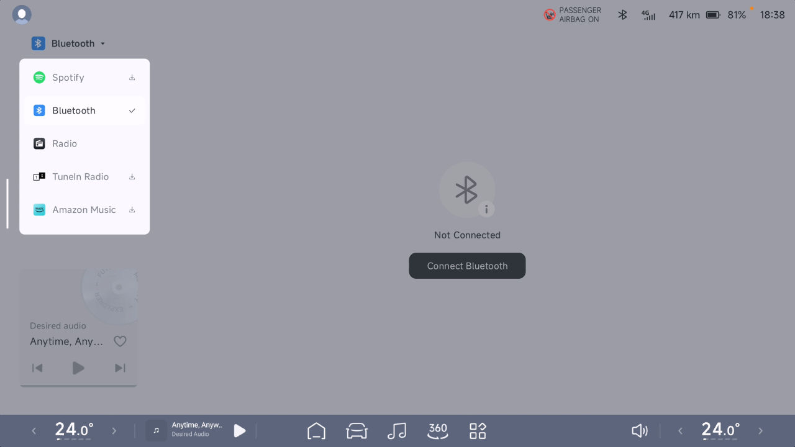

XOS

Operación

HDMI, y el otro extremo conectado al puerto
C del terminal IVI.

3. Una vez conectado correctamente, la imagen
se mostrará en la pantalla.

4. Proyección por cable:

• Deslizá hacia arriba o abajo en el lado
izquierdo de la pantalla para ajustar el brillo
de la pantalla.

• Deslizá hacia arriba o abajo en el lado
derecho de la pantalla para ajustar el volumen
multimedia.

• Se admite la función de activar el sonido.

1.
Tocá el “ 
 ” del CID y tocá “Proyección por
cable” en el centro de aplicaciones.

5. Tocá la pantalla, tocá “Salir” en la esquina
superior izquierda para salir de la proyección
por cable.

2. Usá un cable HDMI y una tarjeta capturadora
de video para conectar a la interfaz Type-C o
Type-A de la fila delantera.

Consejos

Para dispositivos como Sony PS y Xbox,
que requieren un voltaje más alto, no se
recomienda usar el puerto de transmisión del
vehículo para la duplicación de pantalla.
Después de estacionar, puedes usar el puerto
de fuente de alimentación externa para
alimentar el dispositivo y realizar la duplicación
de pantalla.

Consejos

La Switch requiere un cable de carga PD
adicional para alimentarse, con un extremo
conectado a la tarjeta de captura de video o

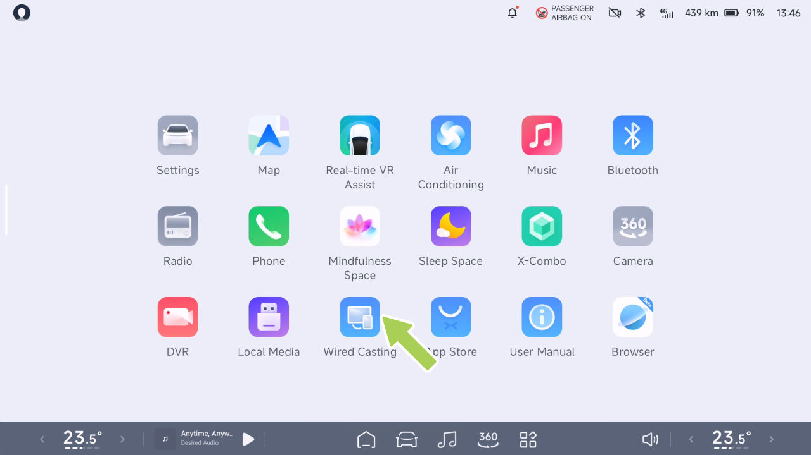

XOS

Configuración de sonido

5. Ajusta el volumen del tono de llamada.

Introducción

En la CID, ve a la interfaz “ 
 →Sonidos”, y
podrás configurar los sonidos del vehículo.

Ajuste de volumen

6. Ajuste de volumen del volante: Toca para
configurar el tipo de ajuste de volumen
controlado por el botón de desplazamiento del
volante.

7. Modo silencio: Toca para silenciar el audio del
multimedia delantero o trasero para reducir la
interferencia entre las zonas de pasajeros
delanteros y traseros durante la reproducción
multimedia.

1.
Ajusta el volumen del multimedia.

2. Ajusta el volumen de la voz.

8. Ajuste de volumen según la velocidad: Toca
para activar el ajuste automático de volumen
en función de la velocidad del vehículo para
contrarrestar el ruido, o elige

3. Ajusta el volumen de la navegación.

4. Ajusta el volumen de las llamadas.

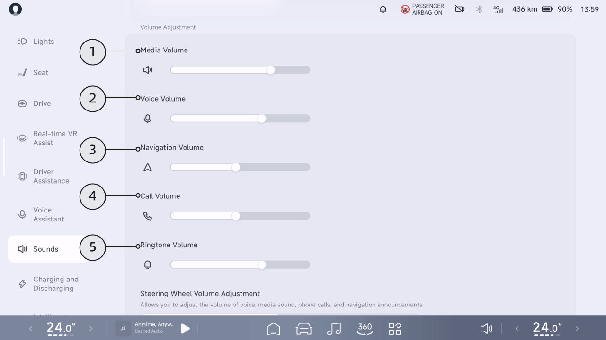

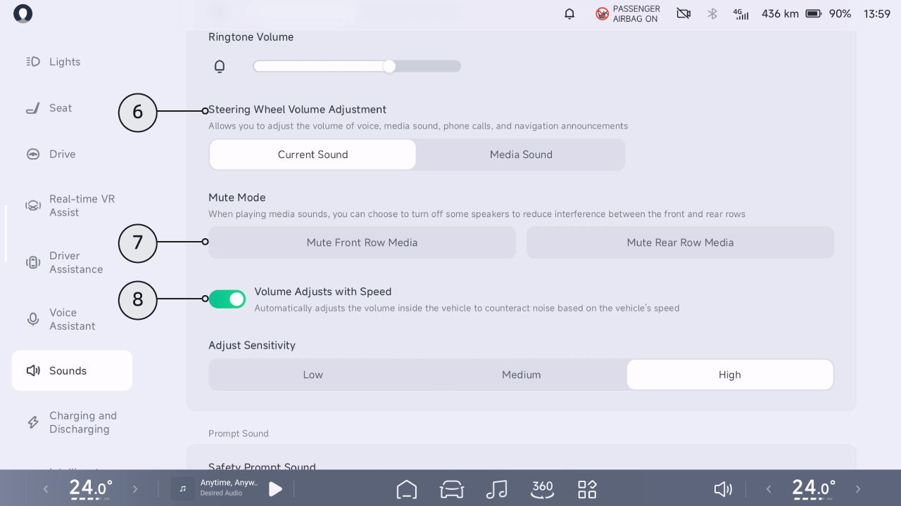

XOS

diferentes niveles de sensibilidad para
adaptarse a tus hábitos de conducción.

3. Sonido de aviso espacial: Una vez activado, los
sonidos de aviso que indican señales
espaciales, como las luces intermitentes y las
alertas del radar, se originarán en sus
respectivas ubicaciones de activación.

Sonido de aviso

Control inteligente

1.
Sonido de aviso de seguridad: Toca para
configurar el sonido de aviso y los niveles de
volumen para fallas del vehículo y advertencias
de conducción.

1.
Reducción de volumen durante la
navegación: Después de tocar para activar la
función, el volumen del multimedia se reducirá
automáticamente durante la reproducción de la
navegación, tanto en modo compartido como
privado.

2. Sonido de aviso del sistema: Una vez activado
el sonido de aviso del sistema, el sonido de
aviso de teclas, el sonido de aviso de cambio
de marcha, el sonido de aviso del enchufe de
carga externa y los efectos de sonido del modo
de conducción se pueden activar o desactivar
en “y más sonidos de aviso”.

2. Reducción de volumen al abrir la puerta:
Después de tocar para activar la función, el
multimedia

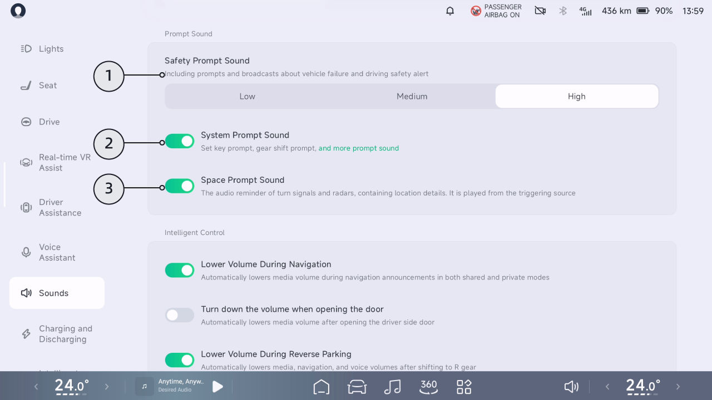

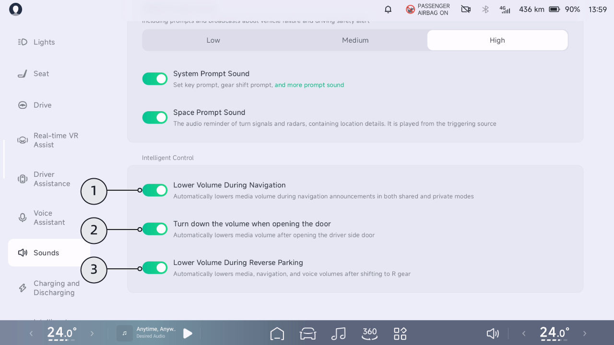

XOS

el volumen se reducirá automáticamente
cuando se abra la puerta del conductor.

En la interfaz de Dispositivo Bluetooth, puedes
seleccionar el dispositivo móvil que se vinculará
y completar la vinculación según las indicaciones
de la interfaz.

3. Reducción de volumen durante el retroceso:
Después de tocar para activar la función y
cambiar a la posición R, los volúmenes del
multimedia, la navegación y la voz
disminuirán automáticamente.

Una vez que la vinculación sea exitosa, puedes
confirmar en tu teléfono para sincronizar los
datos de comunicación (como contactos y
registros de llamadas) del dispositivo móvil al
vehículo. Esto facilita responder y hacer
llamadas, mejorando la experiencia de la función
de teléfono integrada. La música de tu teléfono
móvil también se puede reproducir a través del
sistema de audio del vehículo.

Conexión de dispositivos

Introducción

Puede conectar el dispositivo mediante el Bluetooth
incorporado, el Wi-Fi o el punto de acceso incorporado.

Red inalámbrica

Funcionamiento

En la CID, vaya a la interfaz “ 
 →Conexión de Dispositivos” o toque la barra de estado en la parte superior de la pantalla de control central. Puede activar o desactivar la red inalámbrica.

En la CID, vaya a la interfaz “ 
 →Conexión de Dispositivos” o toque la barra de estado en la parte superior de la CID para activar o desactivar el Bluetooth. Después de activar la función “Permitir Detección”, otros dispositivos Bluetooth pueden detectar el Bluetooth de este vehículo.

Bluetooth

Después de activarla, el vehículo buscará automáticamente redes inalámbricas; puede seleccionar la red deseada e introducir la contraseña para establecer una conexión.

XOS

Consejos

Consejos

• Puede conectarse y utilizar los puntos de acceso personales compartidos por su teléfono a través de la red inalámbrica, y tener en cuenta el consumo de datos al utilizarlos.

Se recomienda elegir primero la banda de 5 GHz; activar la banda de 2,4 GHz puede ser compatible con más dispositivos, pero el rendimiento de la red se verá reducido.

• La intensidad de la señal de la red conectada actualmente puede verse desde el icono de red inalámbrica en la barra de estado; si la intensidad de la señal es baja, el vehículo puede ser lento para acceder a internet.

Apple CarPlay

Apple CarPlay permite a los usuarios acceder a los servicios de forma más segura y cómoda mientras conducen, asignando las funciones principales del iPhone a la CID.

Punto de acceso incorporado

1.
Entre en el “Centro de APP” y haga clic en “Apple CarPlay”

En la pantalla de control central, vaya a la interfaz “ 
 →Conexión de Dispositivos”, y podrá activar o desactivar el punto de acceso incorporado y seleccionar el modo del punto de acceso 5 GHz o 2,4 GHz.

Puede utilizar otros dispositivos móviles para buscar el punto de acceso incorporado del vehículo, e introducir la contraseña para conectarse.

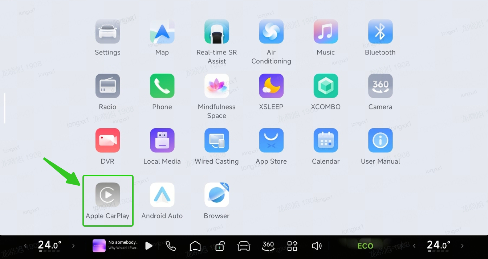

XOS

Active Apple CarPlay según las indicaciones en la CID

Actualización del Sistema

a. Método 1: Empareje el Bluetooth de su teléfono en la página de la lista de Bluetooth.

Introducción

b. Método 2: Conecte su iPhone con un cable USB.

El vehículo se puede actualizar de forma remota a través de la CID o la App móvil para obtener las funciones más recientes. Se recomienda que actualice el sistema lo antes posible después de recibir el aviso de la nueva versión.

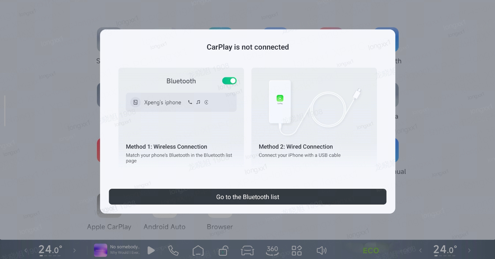

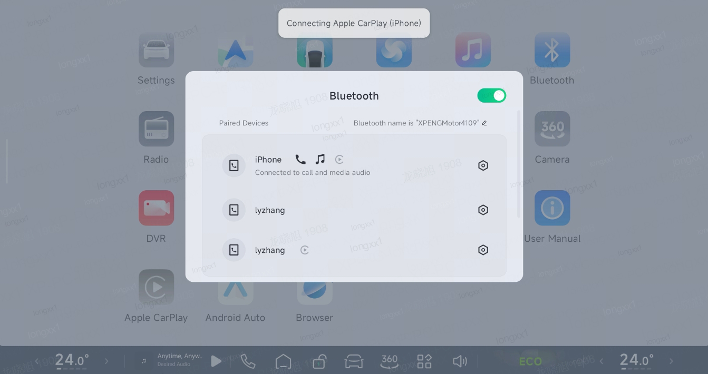

XOS

Consejos

para ver los detalles de la versión actual del sistema de infoentretenimiento.

• Asegúrese de que el vehículo esté conectado a la red, ya que no recibirá actualizaciones hasta que el vehículo esté conectado a la red.

Configuración de actualización

• Si tiene alguna otra pregunta, póngase en contacto con el Centro de Servicio de XPENG.

Toque “Configuración de Actualización” para configurar la función “Actualización Automática”. Cuando el vehículo detecte una nueva actualización más adelante, se actualizará automáticamente a las 3:00 a. m. sin confirmación manual.

Versión del Sistema

Consejos

Se recomienda activar la función de actualización automática para mantener los sistemas del vehículo actualizados en todo momento.

Método de Actualización

When a new version is available, the system will
push a notification to remind you that there are
new versions for update. The “System Update”
Cuando haya una nueva versión disponible, el
sistema enviará una notificación para recordarte
que hay nuevas versiones para actualizar. La
barra “Actualización del sistema” mostrará el
ícono “Nueva versión”. El ícono de Actualización
del sistema aparecerá en la barra de estado en
la parte superior del CID 
.

En el CID, ve a “ 
 →General” y toca el número
de versión de XOS “” en la parte superior de la
interfaz

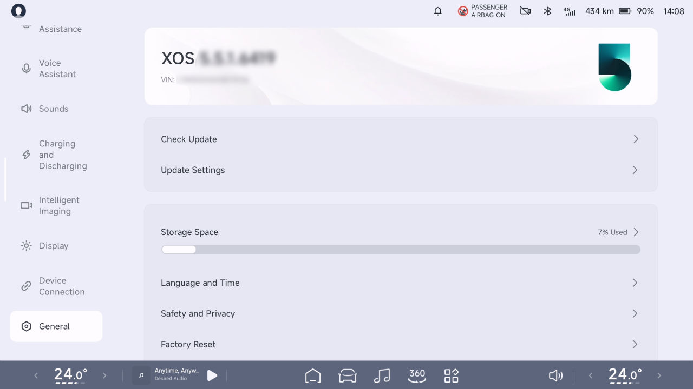

XOS

Toca el ícono Actualizar 
 en la barra de estado
del CID, o toca la barra “Actualización del
sistema” para ver la descripción de actualización
de una nueva versión.

Después de programar la actualización, la página
de actualización del sistema mostrará la
información de la reserva. Antes de que comience
la actualización, puedes tocar “Cancelar reserva”
en cualquier momento y reservar otro horario de
actualización del sistema.

Cuando haya una nueva versión para actualizar,
puedes actualizar el sistema de las siguientes
tres maneras:

Actualización remota mediante la aplicación móvil

Actualizar ahora

El vehículo admite actualizaciones remotas del
sistema con la “XPENG App”. Cuando haya una
nueva versión para actualizar, la App enviará una
notificación con un mensaje, y la interfaz de
control del vehículo mostrará la tarjeta de la
nueva versión, o se mostrará el ícono “Nueva
versión” en la esquina superior izquierda del
control del vehículo. Toca el botón de la tarjeta
o el ícono “Nueva versión” para entrar en la
interfaz de actualización remota del sistema, y
toca “Actualizar ahora” para completar la
actualización.

En la página de instrucciones de actualización de
la nueva versión, toca “Actualizar ahora”. El
sistema te advertirá que el “vehículo no puede
usarse durante el proceso de actualización”, así
que asegúrate de que el vehículo esté estacionado
en una zona segura y reserva tiempo suficiente.

Toca “Confirmar” para entrar inmediatamente en
la preparación de la actualización. En esta etapa,
puedes verificar las condiciones de la
actualización. Después de la confirmación, el
proceso no se puede suspender.

Actualización programada

Precauciones y limitaciones

En la página de instrucciones de actualización de
la nueva versión, toca “Reservar actualización”
para establecer el período en el que no necesitas
usar el vehículo. Toca “Confirmar”, y el sistema
se actualizará cuando el vehículo esté bloqueado
durante el período establecido.

• Antes de actualizar, asegúrate de que el SoC
del vehículo sea mayor al 10 %, la palanca de
cambios esté en la posición P, y el vehículo esté
estacionado en una zona segura.

XOS

• Una vez que comienza la actualización, no se
puede detener y el vehículo no puede usarse
durante la actualización. Deja tiempo suficiente
para esperar a que se complete la actualización.

• El vehículo no se puede cargar durante la
actualización. Organiza de manera razonable el
tiempo para la actualización y la carga.

• Una falla en la actualización del sistema puede
causar que algunas funciones funcionen de
manera anormal. Si la actualización falla, no
uses el vehículo. Toca “Reintentar” para volver a
intentar la actualización. Si fallan varios
intentos, comunícate con el Centro de Servicio
XPENG o el Centro de Atención al Cliente.

1.
Cerradura de la puerta

• Una vez actualizado, el sistema no se puede
revertir a versiones anteriores.

• Cuando la llave del teléfono no está activada,
toque "Activar llave" para activar la llave del
teléfono. Tras la activación exitosa, el estado
original "Activar llave" cambia a "Bloqueo de
puertas".

Aplicación XPENG

• Cuando el Bluetooth no está conectado, toque
para seleccionar "Solo desbloquear" o
"Desbloquear y arrancar".

Introducción

• Cuando el Bluetooth está conectado, toque
"Desbloquear el vehículo" y luego engrane una
marcha dentro de los 20 minutos para arrancar
el vehículo.

Después de descargar e iniciar sesión en la
aplicación XPENG en su teléfono móvil, puede
verificar de forma remota el estado del vehículo
y controlar ciertas funciones del vehículo.

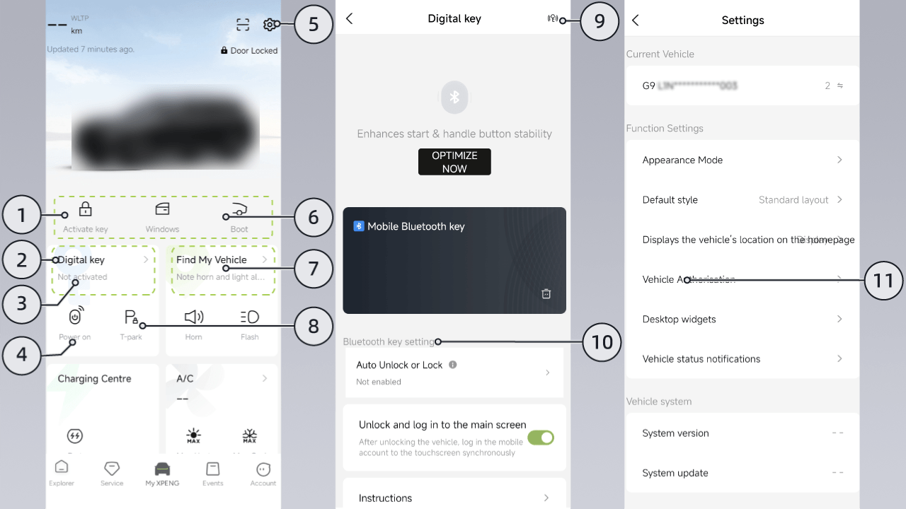

XOS

Consejos

Bluetooth sin emparejar en la pantalla de
control central.

• No salga de la aplicación móvil después de
desbloquear, y mantenga la aplicación móvil
ejecutándose en segundo plano; de lo
contrario, podría ser imposible engranar
una marcha.

• Normalmente, el rango de conexión Bluetooth
en un campo abierto es de unos 20 metros,
lo que puede variar debido a factores
como el hardware Bluetooth del móvil,
la obstrucción del entorno y la
interferencia.

• Si no se puede engranar la marcha, intente
volver a abrir la aplicación móvil.

2. Llave digital: Toque para acceder a la
interfaz de la llave digital para los ajustes de
la llave Bluetooth y las verificaciones de la
llave.

4. Arranque remoto: Toque para desbloquear la
puerta, presione el pedal del freno dentro de los
2 minutos para engranar una marcha y luego el
vehículo puede arrancarse para que otros lo
conduzcan temporalmente.

3. Estado del Bluetooth: Cuando la llave del
teléfono está conectada al Bluetooth del
vehículo, es azul; cuando no está conectada, es
gris.

6. Barra de accesos directos: Mantenga
presionada esta área para personalizar las
funciones de la barra de accesos directos, con
un máximo de 8 funciones.

5. Ajuste: Toque para acceder a la interfaz de
ajustes.

Consejos

• Cuando la llave del teléfono está conectada
al Bluetooth del vehículo, también se puede
usar en entornos sin señal de red, como un
garaje.

7. Ubicación del vehículo/mapa

• Solo la cuenta del propietario puede ver la
ubicación en tiempo real del vehículo.

• El vehículo está equipado tanto con Bluetooth
multimedia como con Bluetooth de llave. La
llave del teléfono se conectará automáticamente al

8. Parada temporal: Cuando la función "Apagar
automáticamente" en el CID está desactivada y
el vehículo está en estado encendido, la
palanca de cambios está en la posición P. Abra

XOS

la aplicación móvil, vaya a la interfaz "XPENG"
y toque "Parada temporal". En la ventana
emergente, toque "Confirmar". El vehículo se
bloqueará, y la pantalla táctil y el A/A
permanecerán disponibles.

precaución

La autorización del vehículo necesita estar
conectada a Internet y puede haber
retraso en la respuesta. En caso de
cualquier problema, vuelva a intentarlo. Para
responder más rápido al desbloqueo y
bloqueo, habilite los siguientes permisos
para la aplicación XPENG Automobile en los
ajustes de permisos del sistema:

Si ha activado "Apagar automáticamente"
en el CID, el vehículo se apagará
automáticamente después de una hora.

9. Verificación de la llave: Cuando acercás el
teléfono-llave al vehículo, el Bluetooth se
conecta automáticamente. Si no se conectó o
no se puede arrancar el vehículo al engranar
una marcha, podés tocar "Verificación de la llave"
para obtener una guía que te ayude a resolver el problema.

• Sistema no iOS: permiso de Bluetooth, permiso
de autoarranque y permiso de ejecución en
segundo plano.

• Sistema iOS: información de ubicación: siempre
permitida; actualización de Apps en segundo
plano; servicio de ubicación (configuración del
teléfono móvil → privacidad → servicio de
ubicación).

10. Configuración de la llave Bluetooth: Después de
activar el teléfono-llave, podés configurar el
Desbloqueo o Bloqueo automático.

11. Autorización del vehículo: Autorizá el vehículo a
otras cuentas de XPENG; se puede autorizar un
máximo de 5 cuentas.