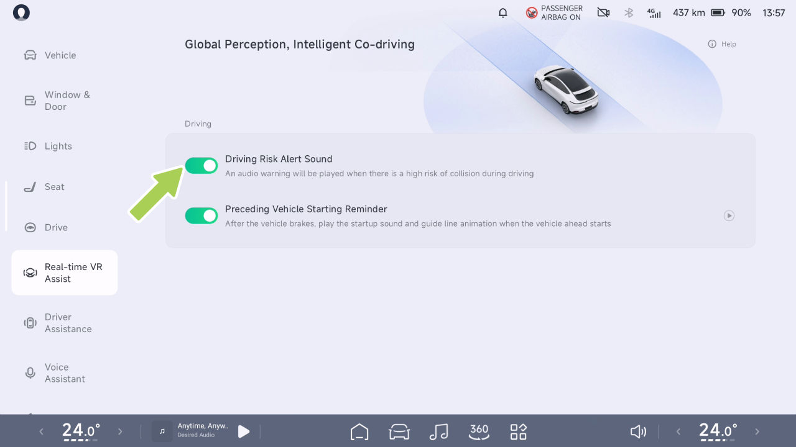
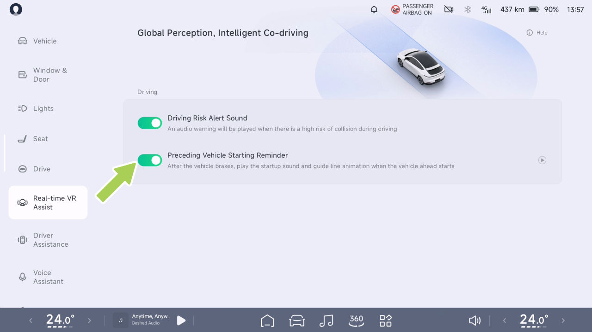

# Asistencia de Realidad Virtual en Tiempo Real

Real-time Virtual Reality Assist

Visualización de simulación del entorno SR

advertencia

Introducción

El SR no funciona en los siguientes
escenarios:

El sistema utiliza sensores para detectar las condiciones
de la carretera exterior y el estado actual del vehículo,
y muestra información en tiempo real, como otros
participantes de la vía, en el cuadro de instrumentos y
en la CID, creando así una interfaz de visualización virtual
centrada en el vehículo.

• Cámara restringida

• El vehículo circula por una curva pronunciada o en
malas condiciones de la carretera.

El SR puede presentar las siguientes situaciones:

advertencia

• Sonido de alerta de riesgo de conducción

La interfaz del SR incluye las siguientes funciones:

• Un objeto de un tipo se muestra
incorrectamente como un objeto de otro tipo.

• Recordatorio de arranque del vehículo precedente

• Muestra un objeto en la dirección equivocada,
simulación de distancia.

• Recordatorio de luz verde para arrancar

Advertencias, precauciones y limitaciones

advertencia

Las advertencias, precauciones y limitaciones
anteriores no cubren todas las condiciones que pueden afectar el
funcionamiento normal del SR.

El SR es únicamente una función de asistencia a la conducción y usted,
como conductor del vehículo, es responsable de
la seguridad en la conducción y no debe confiar en esta función
para controlar el vehículo, ya que podrían producirse
lesiones o la muerte.

Real-time Virtual Reality Assist

Sonido de alerta de riesgo de conducción

Funcionamiento

Introducción

Cuando el sistema de asistencia a la conducción no está activado
y el vehículo está en posición D, si los obstáculos
dinámicos del entorno se acercan al vehículo o
existen posibles riesgos de seguridad, la interfaz del SR
emitirá una advertencia.

La advertencia de obstáculo de riesgo medio se pondrá roja,
y la de riesgo alto también se pondrá roja con un
sonido de aviso.

En la CID, vaya a la interfaz “ 
 →Real-time VR Assist”,
y podrá activar o desactivar el “Sonido de
alerta de riesgo de conducción”.

Advertencias, precauciones y limitaciones

La función de Sonido de alerta de riesgo de conducción solo se utiliza
para advertir, y el conductor tiene la responsabilidad
de observar el entorno circundante y
tomar decisiones en consecuencia.

Real-time Virtual Reality Assist

advertencia

Funcionamiento

Es posible que no se active una alerta de peligro de la marcha en las
siguientes situaciones. Esto incluye, entre otros:

• Radar o cámara restringidos.

• Circulación por una superficie de carretera con una curva pronunciada.

• Al circular por superficies de carretera en malas
condiciones y circunstancias.

Las advertencias, precauciones y limitaciones anteriores no
cubren todas las situaciones que afectan el funcionamiento normal
de la función de Sonido de alerta de riesgo de conducción.

En la CID, vaya a la interfaz “ 
 →Real-time VR Assist”,
y podrá activar o desactivar el “Recordatorio
de arranque del vehículo precedente”.

Recordatorio de arranque del vehículo precedente

Cuando el ADAS no está activado y el vehículo
está en posición D, si se encuentra en un tramo de carretera congestionado y
el vehículo precedente se aleja una cierta distancia,
la interfaz del SR mostrará un efecto de animación
y reproducirá un sonido de aviso para recordar al
conductor que arranque.

Introducción

Advertencias, precauciones y limitaciones

La Alerta de Arranque Delantero puede no activarse si:

advertencia

• Hay peatones, bicicletas, motocicletas,
etc. delante de usted.

Asistente de Realidad Virtual en Tiempo Real

• No hay vehículos delante.

• El vehículo está en una marcha distinta de D.

funcionamiento de la función de Recordatorio de
Arranque del Vehículo Precedente.

• La velocidad del vehículo es superior a 0 km/h.

• El vehículo de delante está a una gran distancia
del vehículo de delante.

• El vehículo delantero y el trasero están detenidos
durante un breve período de tiempo.

advertencia

La alerta de arranque del vehículo delantero puede
inhibirse en determinadas condiciones, incluidas,
entre otras, las siguientes:

• Mala visibilidad de noche.

• Mala visibilidad debido a condiciones meteorológicas
adversas como lluvia intensa, nieve intensa, niebla,
arena, etc.

• Luz intensa, contraluz, reflejos en el agua,
contraste de luz extremo.

• Cámara restringida

Las advertencias, precauciones y limitaciones
anteriores no cubren todas las condiciones que afectan
al funcionamiento normal