# Imágenes Inteligentes

Imágenes Inteligentes

Imagen Panorámica 360° AVM

Funcionamiento

Introducción

Activar o desactivar el AVM

Puede activar la función AVM mediante cualquiera
de los siguientes métodos:

El Monitor de Vista Envolvente 360° (AVM) capta
el entorno que rodea al vehículo a través de las
cámaras de visión envolvente situadas alrededor
del vehículo y muestra ese entorno en el CID.

• El AVM se activa automáticamente cuando se
cambia la marcha al modo Reversa (R).

Las cámaras de visión envolvente están instaladas
sobre las placas de matrícula delantera y trasera
y debajo de los espejos laterales izquierdo y
derecho.

• En la barra de tareas inferior del CID, toque el
icono (si está configurado).

advertencia

• Utilice comandos de voz como "Activar el
AVM" para encender el AVM.

El AVM es una función de asistencia que sirve
únicamente como referencia y no reemplaza la
visión del conductor del entorno circundante.
El AVM no puede manejar todas las condiciones
de tráfico, clima y carretera, y usted, como
conductor del vehículo, es responsable de
conducir de manera segura; no confíe en esta
función para controlar el vehículo. No hacerlo
podría provocar lesiones.

• Si la tecla de acceso directo del volante en la
pantalla de control central está configurada en
"Activar o desactivar la cámara 360", puede usar
la tecla de acceso directo del volante para
activar la cámara 360.

Puede desactivar la función AVM mediante cualquiera
de los siguientes métodos:

• En la interfaz de la Cámara 360, toque
 en la
esquina superior izquierda para apagar la cámara 360.

• Utilice comandos de voz como "Desactivar el
AVM" para apagar el AVM.

Imágenes Inteligentes

• Si la tecla de acceso directo del volante en la
pantalla de control central está configurada en
"Activar o desactivar la cámara 360", puede usar
la tecla de acceso directo del volante para
desactivar la Cámara 360.

• Si no se produce ninguna interacción con la
pantalla en un plazo de 5 s, los iconos se
ocultarán automáticamente. Toque el área de
vista superior para volver a mostrarlos.

3. Interfaz del modo de línea

auxiliar dinámica

• El ancho del vehículo se indica mediante dos
líneas blancas finas.

• En la vista delantera o trasera, se utilizan
líneas de escala segmentadas para indicar la
distancia entre los vehículos y los objetos.

• Las distancias indicadas por cada línea de
escala, de cerca a lejos, son de aproximadamente
0,6 m, 1 m y 1,5 m respectivamente.

4. Superficie de rodada de neumáticos

• Indica la ruta de conducción de las ruedas.

1.
Cambio entre modo 3D/2D.

5. Línea de parada de seguridad

• Indica la posición ubicada aproximadamente a
0,3 m detrás del vehículo.

2. Icono de cambio de vista.

• En el modo 2D, puede tocar
 en el modelo
del vehículo para alternar entre las vistas
delantera, trasera, izquierda, derecha y de los
cubos de rueda.

Detenga el vehículo cuando la línea de parada de
seguridad entre en contacto con un obstáculo.

advertencia

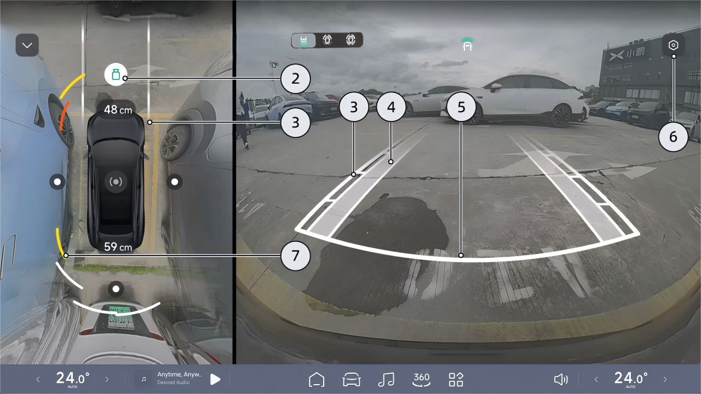

Imágenes Inteligentes

6. Ajustes de Imagen

Interfaz del modo 3D

Toque " 
 " para ir a la interfaz de "Imágenes
Inteligentes", donde puede configurar las
funciones relacionadas con la imagen.

7. Monitoreo de Distancia

• Simula la visualización según la distancia y la
dirección de los obstáculos.

• Cuando se muestra el color blanco, la distancia
es larga.

• Cuando se muestra el color rojo, la distancia es
muy corta.

• La distancia entre el vehículo y el obstáculo más cercano también se mostrará como un valor numérico delante y detrás del vehículo respectivamente.

• Después de cambiar el sistema al modo 3D, integrará el modelo virtual 3D en la imagen del entorno real.

• Podés deslizar el anillo del modelo de la izquierda alrededor
 o
deslizar directamente el modelo de la derecha para lograr una rotación libre de 360°.

• Si no se realiza ninguna operación en la pantalla durante 5 segundos, el círculo y el ícono se ocultarán automáticamente. Tocá el área de la vista superior para volver a mostrar el círculo y el ícono.

Imagen Inteligente

Retención de imagen de marcha atrás al cambiar a la marcha R

Mientras hacés marcha atrás, tocá el ícono de cambio de vista del buje de la rueda en el CID para alternar entre la vista trasera, la vista del buje de la rueda delantera y las vistas de los bujes de las ruedas delanteras y traseras.

En el CID, entrá a la interfaz “ 
 →Asistencia al Conductor→Estacionamiento” y podés activar o desactivar “Retención de Imagen de Marcha Atrás”.

Cuando la función está activada y se cambia de la marcha R a la D, el AVM cambiará a la vista delantera. Cuando se cambia a la marcha P o la velocidad del vehículo supera los 10 km/h, el AVM saldrá automáticamente.

Apagado automático de la cámara de 360

Alternar el cambio de vista del buje de la rueda durante la marcha atrás

En el CID, entrá a la interfaz “ 
 →Imagen Inteligente” y podés activar o desactivar “Apagado Automático de la Cámara de 360”.

Una vez habilitada la función, encendé manualmente el AVM. Si no se realiza ninguna operación durante 5 s cuando la velocidad supera los 30 km/h, el AVM se apagará automáticamente.

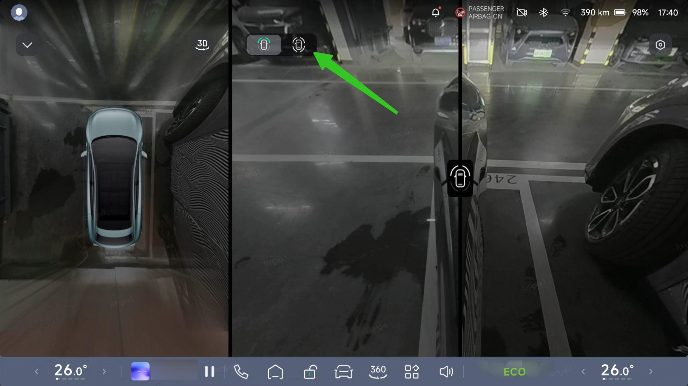

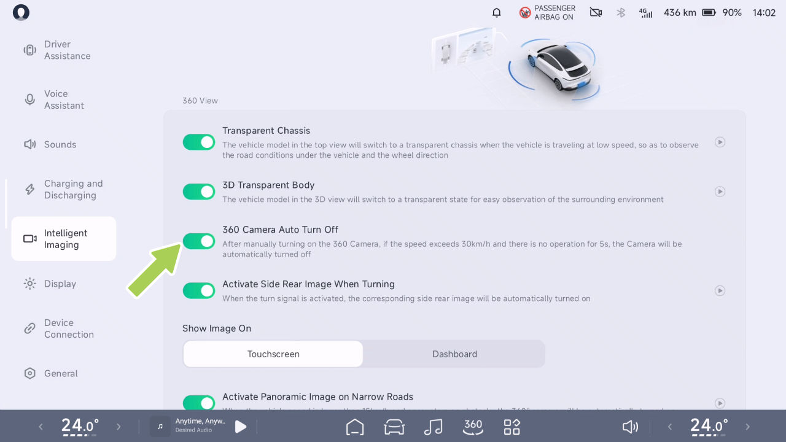

Imagen Inteligente

Advertencias, Precauciones y Limitaciones

Carrocería Transparente 3D

Los objetos en la imagen del AVM se ven deformados respecto a los objetos reales.

advertencia

Introducción

• Cámara restringida

El AVM puede no funcionar en los siguientes casos:

• Cámara bloqueada (polvo, cubierta, etc.) o malas condiciones climáticas (por ejemplo, lluvia intensa, nieve intensa, niebla densa).

Las advertencias, precauciones y limitaciones anteriores no cubren todas las condiciones que pueden afectar el funcionamiento normal del AVM.

Cuando la función de carrocería transparente 3D está habilitada y la interfaz del AVM se cambia al modo de visualización 3D, el modelo 3D del vehículo a la derecha se volverá semitransparente, ayudando a evaluar los riesgos de colisión alrededor del vehículo.

La Carrocería Transparente 3D es una ayuda solo de referencia y no reemplaza la visión del conductor del

advertencia

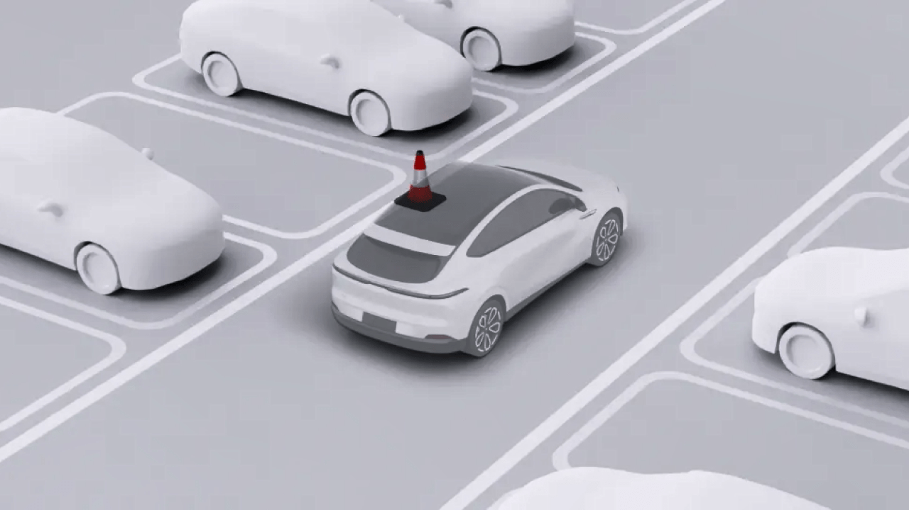

Imagen Inteligente

entorno circundante. La carrocería transparente 3D no puede manejar todas las condiciones de tránsito, clima y carretera; vos, como conductor del vehículo, sos responsable de la seguridad al conducir, no confíes en esta función para controlar el vehículo. No hacerlo podría provocar lesiones.

En el CID, entrá a la interfaz “ 
 →Imagen Inteligente” y podés activar o desactivar “Carrocería Transparente 3D”.

Chasis Transparente

Operación

Introducción

Activar o desactivar la Carrocería Transparente 3D

When the transparent chassis feature is enabled...

Cuando la función de chasis transparente está
activada y el vehículo circula a baja velocidad, la
vista superior del lado izquierdo cambiará al modo
de chasis transparente. Esto muestra un modelo
virtual del vehículo superpuesto sobre las
condiciones reales de la vía en tiempo real,

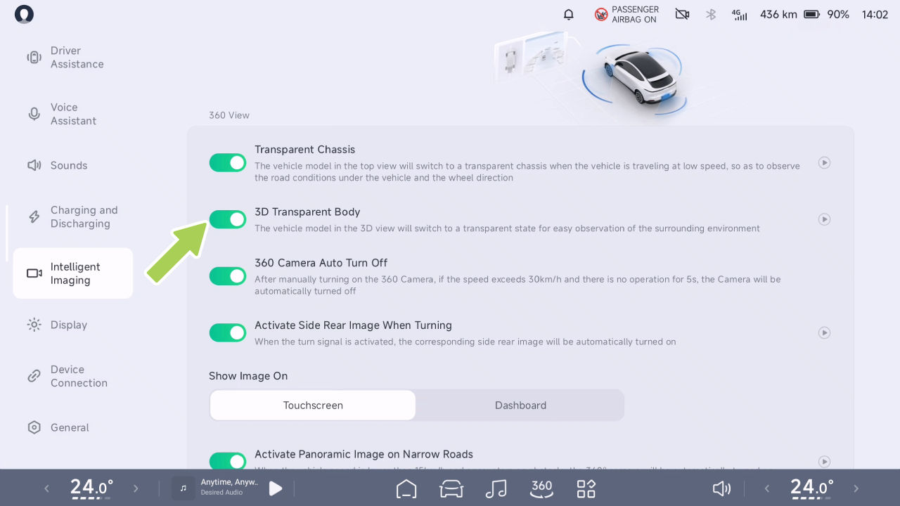

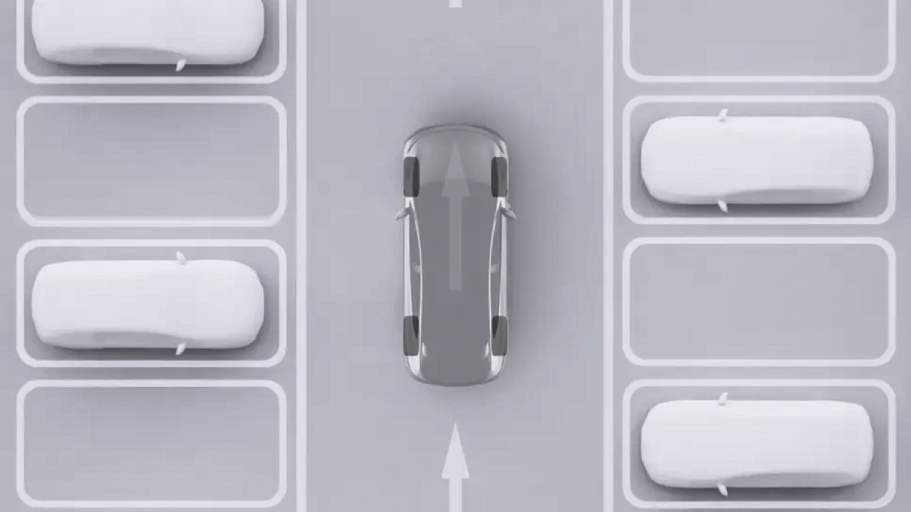

Imagen inteligente

lo que facilita identificar cualquier posible riesgo
de colisión alrededor del vehículo.

Funcionamiento

advertencia

Activar o desactivar el chasis transparente

El chasis transparente es una ayuda
únicamente informativa y no reemplaza la
visión del conductor del entorno circundante.
El chasis transparente no puede gestionar
todas las condiciones de tráfico, climáticas y
de la vía, y usted, como conductor del
vehículo, es responsable de conducir de forma
segura; no confíe en esta función para
controlar el vehículo. No hacerlo podría
provocar lesiones.

En el CID, vaya a la interfaz “ 
 →Imagen inteligente”, donde podrá activar o
desactivar el “Chasis transparente”.

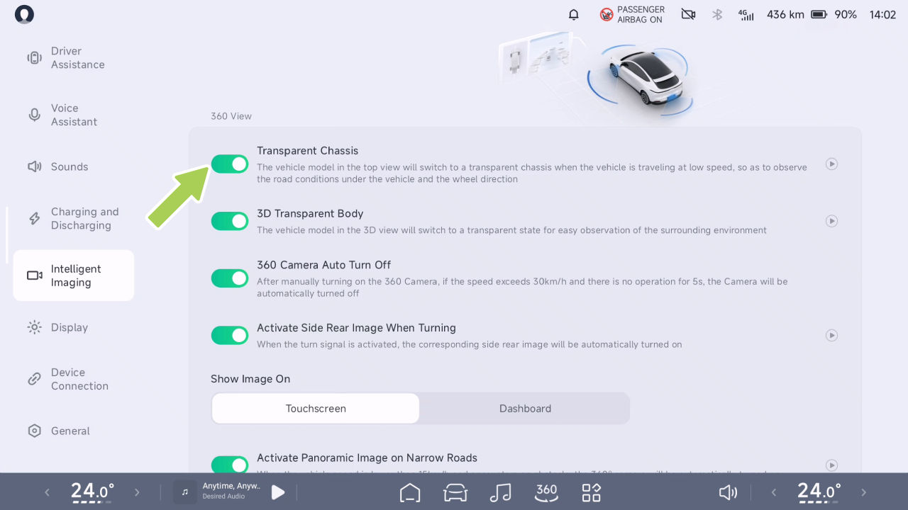

Imagen inteligente

Activar la imagen panorámica en
caminos estrechos

advertencia

Introducción

La panorámica activa de banda estrecha es
una función de asistencia únicamente de
referencia y no reemplaza la visión del
conductor del entorno circundante. Usted es
responsable de conducir de forma segura
como conductor del vehículo, y no debe confiar
en esta función para controlar el vehículo. No
hacerlo podría provocar lesiones.

Funcionamiento

Activar o desactivar la imagen panorámica en
caminos estrechos

Cuando el vehículo está en la marcha D y la
velocidad es inferior a 15 km/h, si se detectan
obstáculos a ambos lados de la parte delantera y
trasera del vehículo, este activará la imagen
panorámica en caminos estrechos como asistencia
a la conducción.

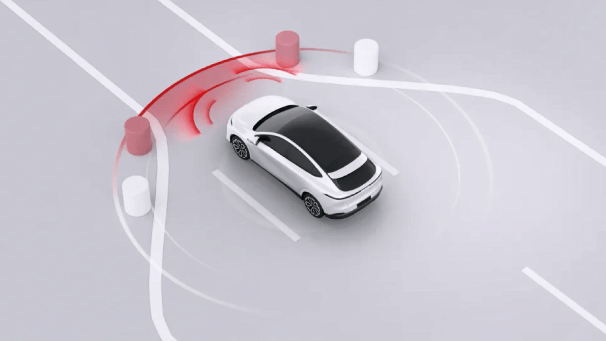

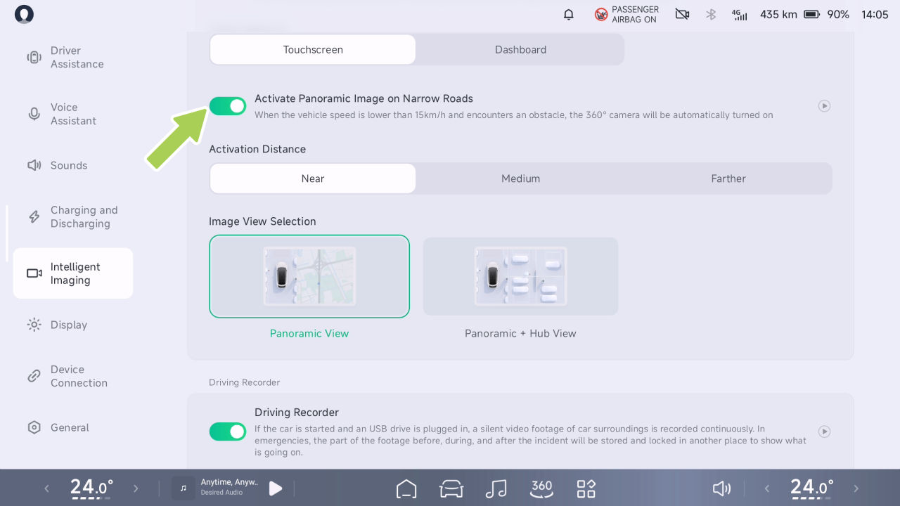

Imagen inteligente

En el CID, vaya a la interfaz “ 
 →Imagen inteligente”, donde podrá activar o
desactivar la “Imagen panorámica en caminos
estrechos” y seleccionar la distancia de activación
y la vista de la imagen según sus hábitos de
conducción.

Activar la imagen lateral trasera al
girar

Introducción

Distancia de activación: cercana unos 50 cm,
media unos 60 cm y lejana unos 75 cm.

La vista de la imagen se puede configurar en
“Vista panorámica” o “Vista panorámica + Vista
del cubo”.

Cuando el vehículo está en la posición D y se
activa el intermitente, la imagen trasera del lado
correspondiente se activará automáticamente para
que el conductor vea el punto ciego trasero de ese
lado y como asistencia a la conducción.

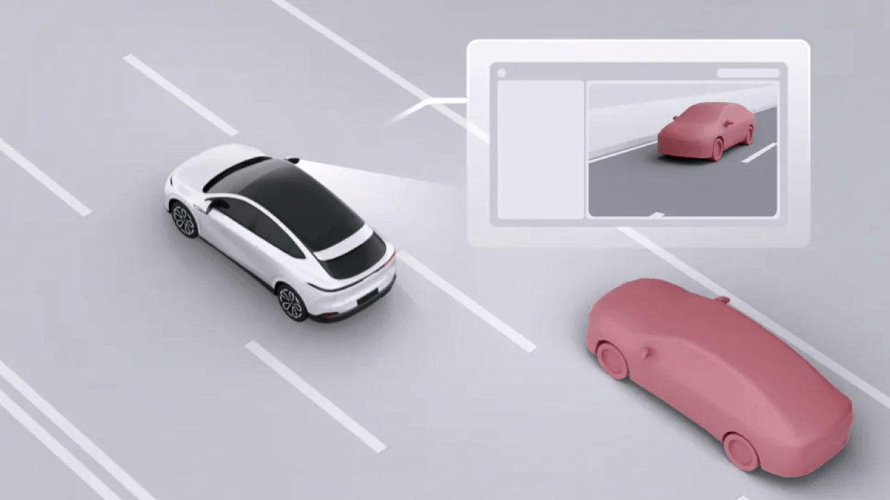

Imagen inteligente

advertencia

En el CID, vaya a la interfaz “ 
 →Imagen inteligente”, donde podrá activar o
desactivar la “Imagen lateral trasera al girar”.

Rear View en el lado activo de la dirección
es una función de asistencia que sirve solo
como referencia y no reemplaza la visión del
conductor del entorno circundante. Como
conductor del vehículo, usted es responsable de
conducir de forma segura, y no debe depender de
esta función para controlar el vehículo. No hacerlo
podría provocar lesiones.

Visualización de la interfaz en la pantalla de control central

Operación

Activar o desactivar Activar imagen lateral trasera
al girar

La imagen se puede arrastrar a diferentes posiciones.
Puede tocar 
 en la interfaz de imagen para acercar
o alejar.

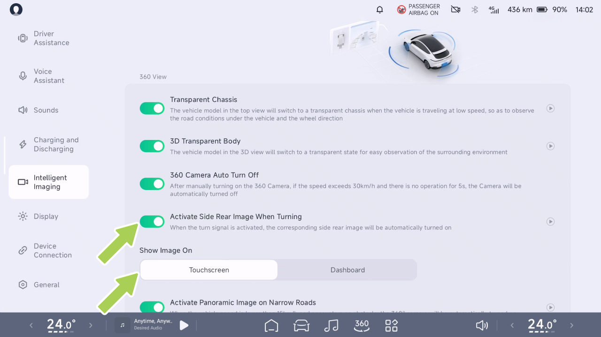

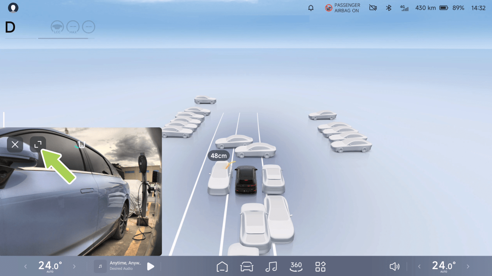

Generación de imágenes inteligente

Visualización de la interfaz del cuadro de instrumentos

La función de grabadora de conducción permite
grabar video durante la conducción y almacena los
videos en una unidad USB. Los archivos de video se
pueden usar para revisar información pasada o para
ayudar con la recopilación de pruebas en caso de
un accidente.

Operación

Activar o desactivar la grabadora de conducción

Grabadora de conducción*

Introducción

En la CID, vaya a la interfaz “ 
 →Generación de
imágenes inteligente” y podrá activar o desactivar
la “Grabadora de conducción”.

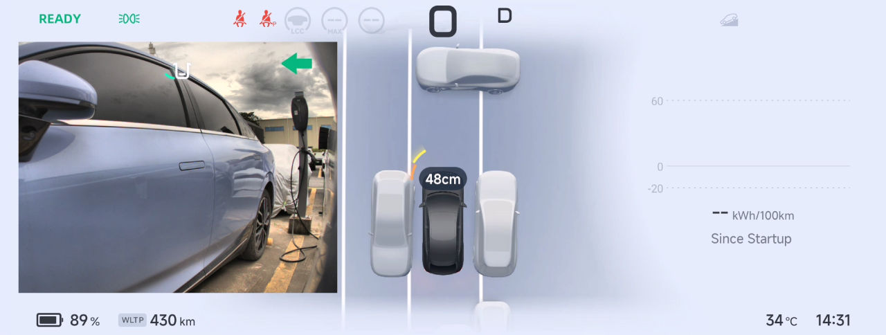

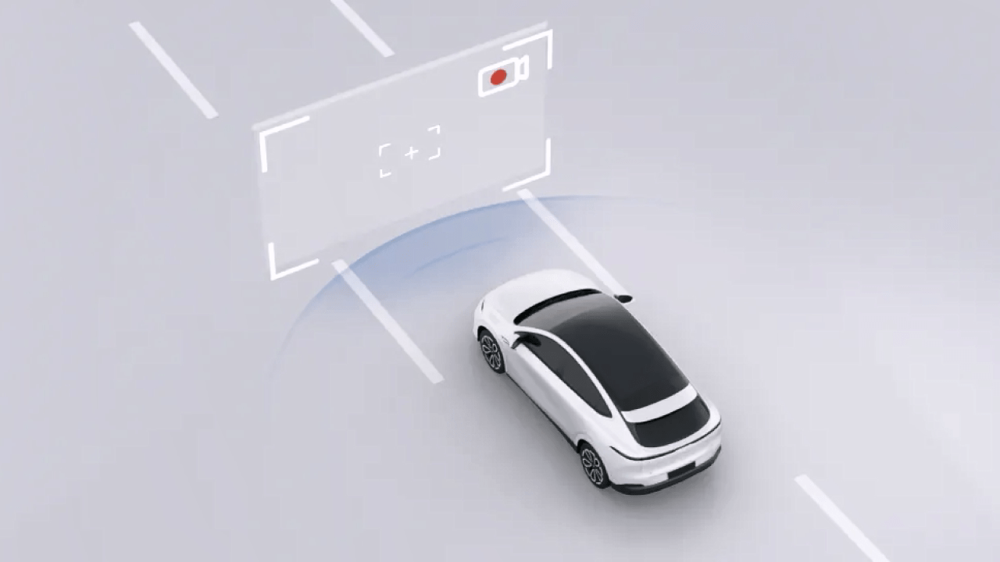

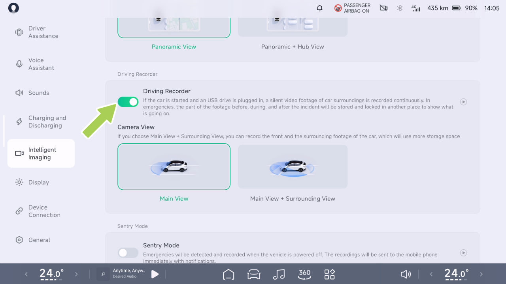

Generación de imágenes inteligente

La función de grabadora de conducción admite la
grabación de la “Vista principal” o “Vista principal +
Vista del entorno”.

Ver el estado de la grabadora de conducción

Toque el icono 
 en la barra de estado de la parte
superior de la CID y podrá ver el estado de la
grabadora de conducción.

Activación automática: En la CID, cuando la
“Grabadora de conducción” está activada y la
grabadora está funcionando, el vehículo iniciará
automáticamente la grabación de emergencia y
guardará el video al detectar un riesgo de colisión.

Grabación de conducción de emergencia

Cuando la grabadora de conducción está
activada y en curso

Cuando la grabadora de conducción está
desactivada

Activación manual: En la CID, cuando la “Grabadora
de conducción” está activada y la grabadora está
funcionando, puede tocar el icono 
 en la barra
de estado de la parte superior de la CID y luego
tocar “Grabación de emergencia” en el icono del
menú desplegable, o tocar el icono 
 (p. ej.,
configuración personalizada) en la barra de tareas
inferior de la CID para grabar un video de
emergencia.

Cuando la grabadora de conducción no está
disponible y es necesario revisar la unidad
USB

Exportar videos de conducción a un teléfono móvil

En la CID, vaya a la interfaz “ 
 →DVR”, toque
“Seleccionar” para elegir el video que desea
transferir, toque “ 
 ” (o el icono 
 en la esquina
inferior derecha de la interfaz de video) para entrar
en la interfaz de transferencia de archivos y siga las
indicaciones para completar la transferencia:

Ubicación de almacenamiento del video de
emergencia: En la pantalla de control central, vaya a
“ 
 →Grabadora de conducción→Grabación de
emergencia” y podrá ver y exportar los videos de
emergencia.

Imágenes Inteligentes

1.
Conectá el teléfono móvil al hotspot del IVI;

2. Abrí la app XPENG e iniciá sesión en tu
cuenta;

la unidad no está instalada, la Grabadora de Conducción no se
puede usar correctamente.

3. Seleccioná el dispositivo al que se
transfiere el archivo desde la pantalla de control central;

4. Después de que aparezca una ventana emergente en la
app móvil, tocá “Recibir” para transferir el archivo
al álbum del teléfono móvil.

Consejos

• Durante la transferencia de archivos, la pantalla de control
central y la app móvil deben permanecer
en la interfaz de transferencia y mantener el
WiFi del teléfono móvil encendido para evitar la
desconexión.

El puerto de fuente multimedia USB y el puerto de alimentación
Type-C ubicados en la parte delantera de la caja de almacenamiento del apoyabrazos
central admiten la función de transmisión de datos.
Una vez que se inserta una unidad USB, se puede usar la función
de Grabadora de Conducción.

• Durante la transferencia de archivos, el teléfono no
podrá acceder a Internet y se
reanudará una vez que la transferencia se complete y se
desconecte.

Solo se reconoce una unidad USB para la
grabación de video de conducción a la vez. El vehículo
priorizará la unidad USB utilizada antes del apagado anterior
en cada encendido. Si la unidad USB
utilizada anteriormente no se reconoce

Instalar dispositivo de almacenamiento externo

Los datos de video de conducción se almacenarán en un
dispositivo de almacenamiento externo (unidad USB). Si la USB

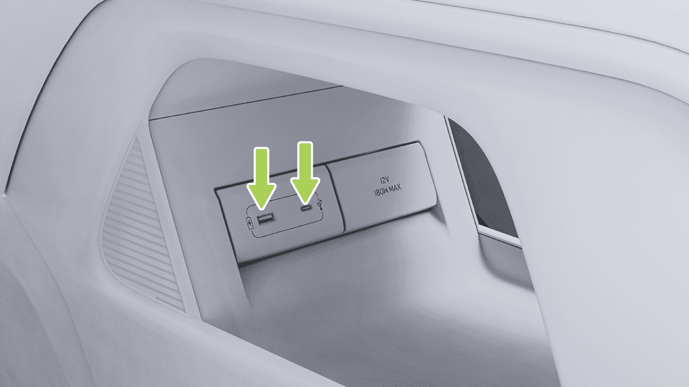

Imágenes Inteligentes

dentro de los tres segundos posteriores al encendido, el
vehículo usará la primera unidad USB detectada en
la secuencia de lectura como la unidad activa.

pueden perderse, y puede haber daños en la
unidad U, o los datos de video pueden corromperse o
perderse. Por favor, intentá evitar el uso de adaptadores o
estaciones de acoplamiento, ya que pueden causar conexiones
inestables.

Advertencias, Precauciones y Limitaciones

• Cada segmento de video dura aproximadamente tres
minutos de forma predeterminada. Si durante la grabación ocurren operaciones como
bloquear el vehículo, apagarlo, expulsar
la unidad USB, borrar videos, formatear,
o cambiar las vistas de grabación,
la grabación se interrumpirá. En
tales casos, el video actual se guardará,
y comenzará a grabarse un nuevo video, que puede
ser más corto que un minuto.

• Cuando la Grabadora de Conducción está encendida, los videos se
grabarán en bucle, sobrescribiéndose los videos más antiguos
una vez que el almacenamiento esté lleno. Para asegurar que los
videos importantes no se sobrescriban, por favor
exportalos a otros dispositivos como teléfonos
móviles o computadoras a tiempo cuando sea necesario.

• Para una mejor compatibilidad, por favor usá una unidad
USB con una capacidad de 32GB o superior, USB
2.0 o superior, y una velocidad de escritura de 10MB/s o
superior.

• Evitá el apagado de emergencia durante la grabación,
ya que esto impedirá que el video actual se
guarde.

• Solo se admiten unidades USB formateadas en FAT16, FAT32 o
NTFS. Para las unidades USB que no estén en los
formatos mencionados anteriormente, se recomienda
formatear la unidad de forma proactiva. Formatear una unidad
USB eliminará todos sus archivos, así que guardá los datos
importantes antes de formatear.

• Los videos de la grabadora de conducción se
almacenan en un disco U independiente. No
extraiga el disco U directamente. Para retirarlo,
primero vaya a la CID, a la interfaz “ 
 →Grabadora de Conducción→Gestión de
Almacenamiento” y toque “Expulsión Segura”.
De lo contrario, el video que se está grabando
en ese momento

• Las unidades USB tienen una vida útil limitada
de escritura/borrado y se consideran un producto
consumible. Si

Imagen Inteligente

nota velocidades de lectura de video lentas o
pérdidas frecuentes de video después de seis
meses de uso, reemplace la unidad USB por una
nueva.

después del bloqueo y apagado. Si se detecta una
aproximación continua o una vibración anormal,
se activará una alarma (la pantalla de control
central se enciende y las luces del vehículo
parpadean) y se grabarán videos antes y después
de cualquier riesgo potencial, documentando
eficazmente posibles peligros de seguridad y
actos de daño malicioso. Para los eventos de
vibración, los usuarios serán notificados de
inmediato mediante notificaciones push de la App
móvil y videos de centinela de alto riesgo
desensibilizados para garantizar alertas
oportunas.

• Para su seguridad al conducir, tenga cuidado al
ver el contenido de los videos cuando el vehículo
está en marcha.

Modo Centinela

Introducción

Puede realizar las siguientes acciones en el modo
centinela:

• Activar o desactivar y configurar el modo
centinela en la CID.

• Ver los videos de centinela en la CID.

• Activar o desactivar el modo centinela mediante
la App móvil.

Una vez activada, la función monitoreará
continuamente el entorno alrededor del vehículo

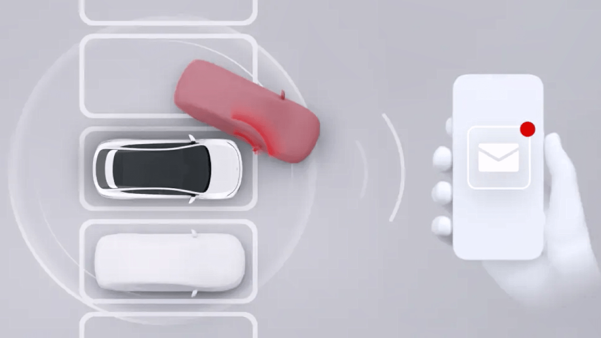

Imagen Inteligente

Operación

Ver el video de centinela en la pantalla de control
central

Activar o desactivar y configurar el modo
centinela en la pantalla de control central

En la CID, vaya a “ 
 →DVR→Grabaciones del
Modo Centinela” para ver las grabaciones
originales del Centinela.

precaución

La grabación puede fallar si el sistema se queda
sin espacio.

Activar o desactivar el modo centinela mediante
la App móvil

En la app móvil, vaya a la interfaz “XPENG” y
podrá activar o desactivar el Modo Centinela.

En la CID, vaya a la interfaz “ 
 →Imagen
inteligente” y podrá activar o desactivar el “Modo
Centinela” y configurar su sensibilidad.

Advertencias, Precauciones y Limitaciones

• Al usar el modo centinela, el sistema accederá a
los permisos de la cámara para monitorear el
entorno del vehículo. Asegúrese de cumplir con
las leyes y regulaciones locales, así como con las
regulaciones de uso de cámaras de su ubicación
al usar el modo centinela, y asuma toda la
responsabilidad por su uso.

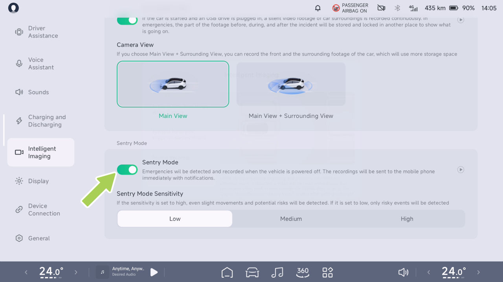

Imagen Inteligente

• Una vez activado el modo centinela, la alarma
antirrobo del vehículo también puede activarse
simultáneamente en respuesta a intrusiones
ilegales, como intentos de forzar la puerta o el
maletero.

• El modo centinela solo permanece activo durante
un único período de ausencia del vehículo y se
desactivará automáticamente cuando el vehículo
se encienda.

• El modo centinela consume cierta cantidad de
energía de la batería. Actívelo solo cuando sea
necesario.

• El modo Centinela consumirá energía de la batería de forma continua durante su funcionamiento. El modo Centinela se desactivará automáticamente cuando la autonomía de conducción del vehículo descienda por debajo de los 50 km.