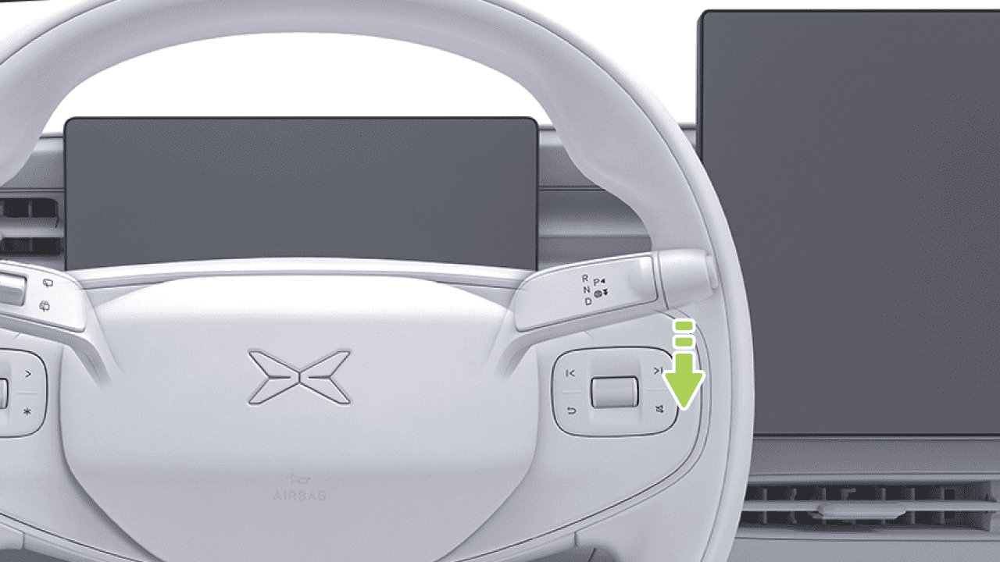
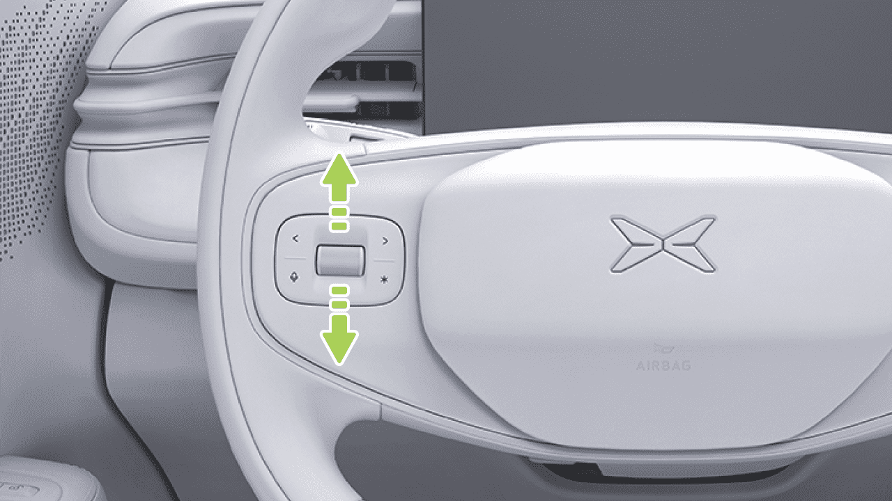
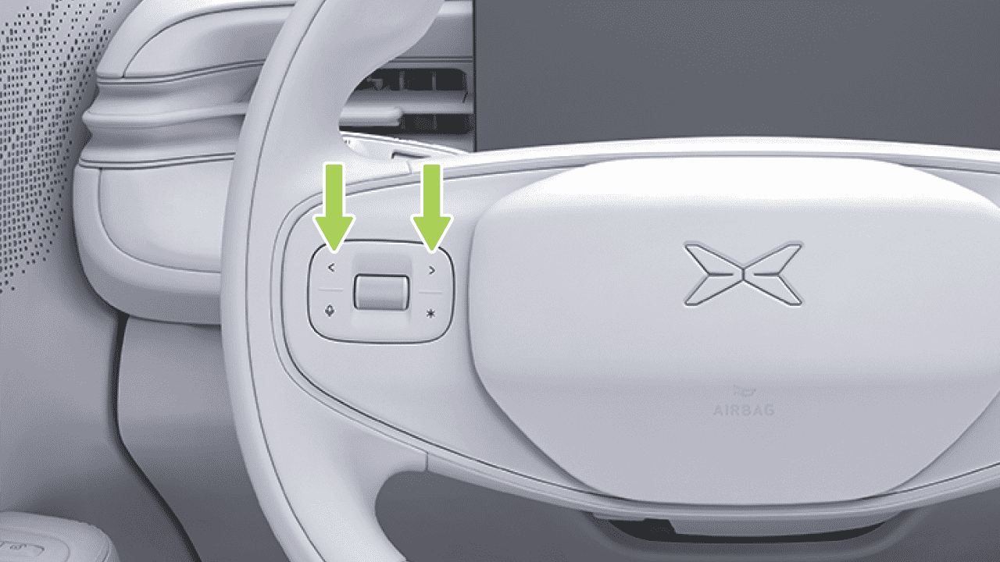
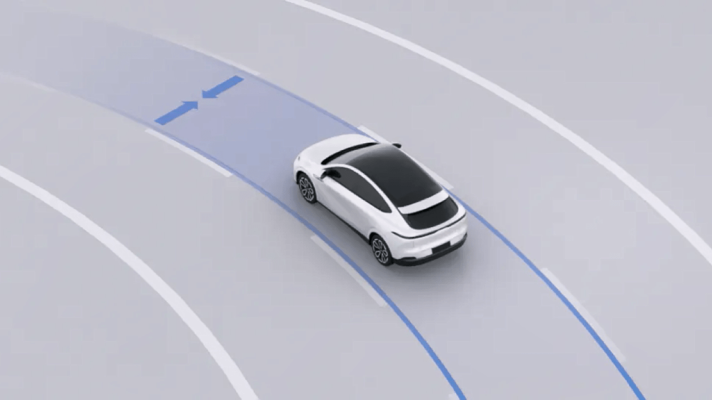
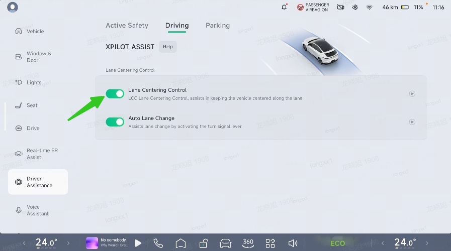
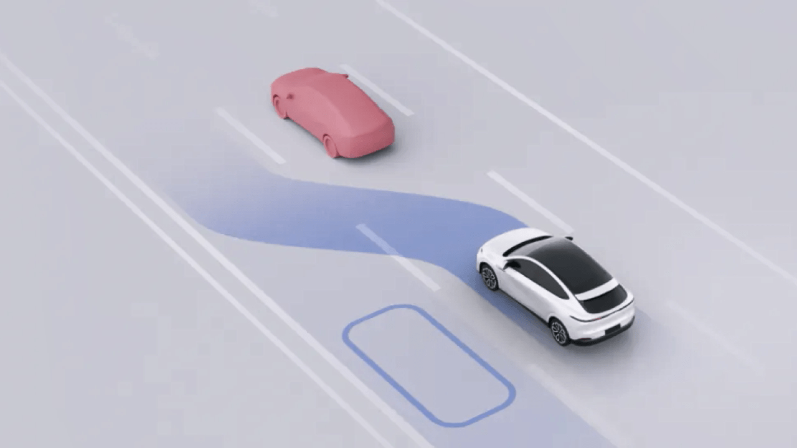
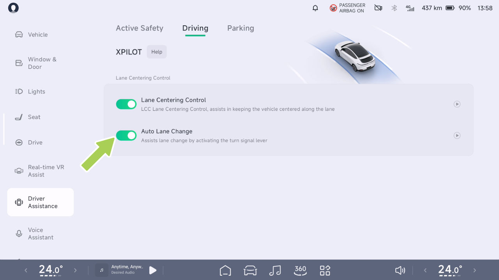
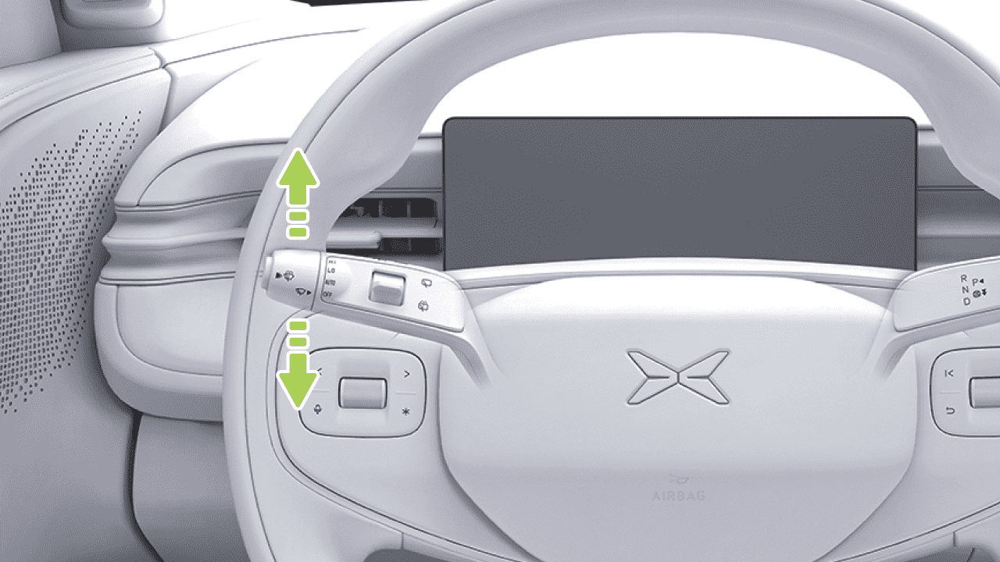

# Asistencia a la conducción

Asistencia a la Conducción

Control de Crucero Adaptativo (ACC)

advertencia

Introducción

El ACC es solo una ayuda a la conducción y no
puede gestionar todas las condiciones de tráfico,
clima y entorno, y usted, como conductor de su
vehículo, es responsable de conducir de forma
segura. Sujete el volante por completo, observe
la vía y tome el control en caso de peligro. No
confíe en esta función para controlar el vehículo,
ya que podría provocar lesiones o la muerte.

El ACC puede controlar el vehículo para seguir a
otros vehículos según la distancia establecida. Si el
vehículo precedente se detiene, el vehículo actual
puede dejar de seguirlo. Si el vehículo precedente
arranca, el vehículo actual puede empezar a
seguirlo. Si no hay ningún objetivo a seguir por
delante, el vehículo arrancará y circulará a la
velocidad de crucero máxima establecida.

El ACC también dispone de la función de crucero
adaptativo en curvas (ATC). El ATC obtiene la
curvatura de la vía que tiene por delante a través
de la cámara. Cuando el ACC está activado y
el vehículo sigue la línea del carril o el vehículo
precedente toma una curva, el ATC mejora el
confort y la estabilidad en las curvas ajustando la
velocidad.

Indicadores en el Tablero

El ACC no está disponible.

El ACC puede activarse cuando se cumplen
las condiciones de activación del ACC.

• La luz de freno se ilumina cuando el ACC
desacelera activamente para alejarse del
vehículo de delante, y el pedal del acelerador
no se mueve cuando el ACC acelera
activamente.

Consejos

Límite de velocidad máxima del ACC/LCC,
y cualquier función activada.

Límite de velocidad máxima del ACC/LCC
no activado.

Asistencia a la Conducción

indicator_xpilot_fault

Consejos

El ACC se activa si se cumplen las siguientes
condiciones:

Funcionamiento

• Los componentes relacionados con el ACC
están operativos y tienen una visión despejada.

Activar el ACC

Cuando el ACC pueda activarse, el indicador 
 del
tablero se iluminará.

• Los limpiaparabrisas no están en HI.

• El pedal de freno no está pisado.

• No hay riesgos de seguridad, incluidos, entre
otros:

– Abrocharse el cinturón de seguridad
correctamente.

– Sujetar el volante con firmeza con ambas
manos.

– Todas las puertas están cerradas.

– Las presiones de los neumáticos son normales.

– El ABS, AEB, etc. no están activos.

Si no se cumple alguna de las condiciones
anteriores, el ACC no puede activarse.

– Conducir sin fatiga.

Tire de la palanca de cambios hacia abajo hasta
el final una vez para activar el ACC, y el icono 
 de
la interfaz SR se iluminará.

Asistencia a la Conducción

Establecer la Velocidad de Crucero Máxima

la palanca de cambios para establecer la velocidad
actual del vehículo como nueva velocidad de
crucero. Si no tira de la palanca de cambios hacia
arriba y la mantiene, sino que suelta el pedal del
acelerador, el vehículo desacelerará hasta la
velocidad previamente establecida y continuará
en crucero.

Cuando el ACC está activado, la velocidad de
crucero máxima puede establecerse mediante el
botón de desplazamiento izquierdo del volante o el
Sistema de Asistencia de Velocidad (SAS).

Establecer la Distancia de Seguimiento

Si gira el botón de desplazamiento lentamente, la
tasa máxima de cambio de la velocidad de crucero es de 1 km/h o 1 milla/h.
Si lo gira rápido, la tasa máxima de cambio es de 5
km/h o 5 millas/h.

Cuando el ACC está activado, puede ajustar la
distancia de seguimiento presionando el botón izquierdo o derecho del
lado izquierdo del volante. Hay 5
niveles para seleccionar.

Como alternativa, pise el pedal del acelerador. Después de
que la velocidad del vehículo aumente, tire hacia abajo y mantenga

Asistencia a la Conducción

Consejos

el pedal y el vehículo desacelerará hasta la
velocidad previamente ajustada y continuará en crucero.

Cuando se ajusta la distancia de seguimiento, el cuadro
de instrumentos muestra la posición del nivel del intervalo.

• Presione el pedal de freno: el ACC se desactiva y el
vehículo desacelera.

Alarma y toma de control

• Tire hacia arriba de la palanca de cambios: el ACC se desactiva
y la regeneración reducirá la velocidad del vehículo.

• Si el vehículo emite una solicitud de toma de control mediante
la interfaz SR, anuncio por voz, etc., tome
el control de inmediato.

advertencia

Además, cuando el ACC está activado, si las condiciones de
activación del ACC cambian de cumplidas a
no cumplidas, el ACC se desactivará. Tome el control.

• En caso de peligro, o en caso de
una situación que requiera la toma de control, tome el control
de inmediato y no espere a que el vehículo
emita una solicitud de toma de control.

Advertencias, Precauciones y Limitaciones

Lea todos los capítulos sobre el ACC en
este manual, y debe comprender estas
restricciones antes de utilizar la función.

Cuando el ACC está activado, puede tomar el control
mediante los siguientes métodos:

El ACC está diseñado para la comodidad y
conveniencia de la conducción, no como un sistema de advertencia
o de prevención de colisiones. El conductor tiene la
responsabilidad de mantenerse alerta en todo momento, garantizar
la seguridad de la conducción y controlar el vehículo. No
confíe en el sistema para reducir la velocidad del vehículo
lo suficiente como para evitar colisiones. Asegúrese de observar
las condiciones de la carretera por delante y esté listo para

• Pise el pedal del acelerador: la velocidad
del vehículo se controla temporalmente. Después de que la
velocidad del vehículo aumente, tire hacia abajo de la
palanca de cambios para fijar la velocidad actual como una
nueva velocidad de crucero; o suelte el acelerador

Asistencia a la Conducción

tomar medidas correctivas en cualquier momento; de lo contrario,
pueden producirse lesiones graves o incluso la muerte.

advertencia

Es su responsabilidad determinar y mantener siempre
una distancia de seguimiento segura. No confíe únicamente
en el ACC para mantener una distancia de seguimiento precisa o
adecuada.

El ACC no responde completamente en las siguientes
condiciones especiales, condiciones difíciles de la carretera,
mal tiempo o condiciones de luz deficientes, asegúrese
de prestar atención al entorno y las
condiciones. Manténgase alerta, coloque siempre la mano en
el volante y tome el control del vehículo en
cualquier momento, incluyendo, entre otros:

advertencia

El ACC es una ayuda a la conducción y no puede manejar todas
las condiciones de tráfico, clima y carretera, no use
ni active el ACC en los siguientes escenarios:

• De repente, otro vehículo se mueve rápidamente o
a corta distancia hacia el frente del vehículo.

• Cuando los vehículos del carril contiguo solo
tienen parte de la carrocería invadiendo el frente
del vehículo (especialmente vehículos grandes
como autobuses, camiones, etc.).

• Carreteras con condiciones variables, como
curvas y giros (curvas en S, curvas en U
continuas, etc.).

• Carreteras en mal estado, como carreteras con
hielo o resbaladizas.

• El vehículo de adelante frena bruscamente.

• En condiciones meteorológicas adversas, como
lluvia intensa, nieve intensa, niebla densa, etc.

• Hacer un giro en U o atravesar conduciendo
entre el vehículo.

• Carreteras urbanas.

• Al conducir por túneles o de noche, cuando hay
camiones, autobuses o vehículos con cargas
sobredimensionadas en el carril lateral.

• Al aproximarse o tomar una curva en una
carretera, cuando hay varios vehículos en
paralelo.

Asistencia a la Conducción

• Para vehículos u objetos estacionarios, como
obstáculos en la superficie de la carretera,
especialmente si el vehículo de adelante
abandona su carril de conducción dejando el
vehículo u objeto de adelante estacionario.

– Semáforos.

– Muros, barreras de carretera.

– Vehículos de dos ruedas (bicicletas,
motocicletas, autos eléctricos, etc.), vehículos
de tres ruedas.

• En un tramo en subida.

– Otros objetos que no sean vehículos.

• Aumento de la velocidad sobre el terreno al
descender una pendiente, cuando el vehículo
supera una velocidad establecida o el límite de
velocidad de la carretera.

• Vehículo u objeto al otro lado de la rampa.

– Objetivo en la zona ciega del sensor.

• En caso de un vehículo que circula en sentido
contrario.

advertencia

• Cuando el vehículo de adelante lleva instalado
un objeto que sobresale de su carrocería.

El ACC no puede reconocer ni responder
completamente a los siguientes entornos y
objetivos; es importante prestar atención al
entorno y a las condiciones de la carretera y
tomar el control del vehículo de manera oportuna
para garantizar una conducción segura en los
siguientes escenarios. Esto incluye, entre otros:

Las advertencias, precauciones y limitaciones
anteriores no cubren todas las condiciones que
pueden afectar el funcionamiento normal del ACC.

• En caso de obras, accidentes, etc.

• Se encuentran los siguientes objetivos delante
del vehículo, incluidos, entre otros:

– Personas, animales.

Asistencia a la Conducción

Control de Centrado de Carril (LCC)

en la mayor medida posible en una carretera recta
con líneas de carril claras a ambos lados y una
carretera de curvatura estándar.

Introducción

• Cuando el LCC está activo, el ALC puede usarse
para asistir en el cambio de carril.

Consejos

• Cuando el LCC está activo, la velocidad de
crucero y la distancia de seguimiento pueden
ajustarse mediante las teclas del volante de la
misma manera que el ACC.

advertencia

El LCC es solo una función de asistencia a la
conducción y no puede gestionar todas las
condiciones de tráfico, meteorológicas y de la
carretera; usted, como conductor del vehículo, es
responsable de conducir de manera segura.
Mantenga el volante sujeto en todo momento,
observe la carretera y tome el control en caso de
peligro. No confíe en esta función para controlar el
vehículo, ya que podría provocar lesiones o la
muerte.

El LCC es una función de asistencia al conductor
cómoda, que puede ayudar al conductor a controlar
el volante y mantener el vehículo centrado en el
carril actual en la mayor medida posible.

Cuando se activa el LCC, el ACC se activará
de forma sincronizada. La velocidad longitudinal y
la distancia son controladas por el ACC. El LCC asiste al
conductor en el control del volante para mantener
el vehículo centrado dentro del carril actual para

Asistencia a la conducción

Indicadores en el tablero

Operación

El LCC no está disponible.

Apertura y cierre

El LCC se puede activar cuando se cumplen las
condiciones de activación del LCC.

LCC activado.

El LCC se desactivará con un retardo.

El sistema presenta una falla.

En el CID, vaya a la interfaz “
 →Asistencia al
conductor→Conducción”, y podrá activar
o desactivar el “Control de Centrado de Carril”.

Activar el LCC

Cuando el LCC se pueda activar, el indicador
 en el tablero se iluminará.

Asistencia a la conducción

• El pedal de freno no está presionado.

• No hay riesgos de seguridad, incluyendo pero
no limitándose a:

– Abrochar el cinturón de seguridad correctamente.

– Sujetar el volante firmemente con ambas
manos.

– Todas las puertas están cerradas.

– Las presiones de los neumáticos son normales.

Tire de la palanca de cambios hacia abajo hasta el final
dos veces para activar el LCC, y el ícono
 en la interfaz SR se iluminará.

– El ABS, AEB, etc. no están activos.

– Conducir sin fatiga.

Si no se cumple alguna de las condiciones anteriores, el LCC
no se puede activar.

Consejos

Alerta de detección de manos fuera del volante

El LCC se activa si se cumplen las siguientes condiciones:

Durante el uso de la función, el sistema
monitoreará continuamente en tiempo real el agarre del conductor sobre el
volante. Si el conductor retira
sus manos del volante durante un cierto
período de tiempo, el sistema emitirá un aviso de “"Por favor
sujete el volante"”. En ese momento,

• Los componentes relacionados con el LCC están funcionando
y tienen una visión despejada.

• Líneas de carril claras.

• Limpiaparabrisas no en HI.

Asistencia a la conducción

el conductor debe volver a sujetar el volante para
desactivar la alarma.

debe mantenerse concentrado en la conducción y responder
al mensaje de alerta del sistema.

Si el conductor aún no sujeta el volante,
el sistema intensificará los recordatorios mediante alertas visuales,
auditivas y táctiles. Cuando las manos permanezcan fuera del volante de forma continua
hasta alcanzar la duración especificada, el
sistema emitirá un aviso de “"Por favor tome el control del
vehículo de inmediato"”. En ese momento,
el conductor debe responder de inmediato a la solicitud de toma de control del
vehículo y controlar rápidamente
la dirección del vehículo. Durante el ciclo de conducción actual,
si se activa una solicitud de toma de control manual
del vehículo debido a un período prolongado con las manos fuera del volante,
la función de asistencia a la conducción se
desactivará durante el resto del viaje. Para restaurar
la funcionalidad, cambie a la marcha P para habilitar la
función.

• El conductor, en su calidad de conductor del
vehículo, tiene la responsabilidad de conducir
de forma segura; durante la conducción debe
cumplir con las disposiciones de las normas
de tránsito, mantener conscientemente ambas
manos sobre el volante durante todo el trayecto
y no utilizar ningún medio para engañar al
sistema de detección de manos fuera del volante.

Alarma y toma de control

advertencia

• Si el vehículo emite una solicitud de toma de
control mediante la interfaz SR, etc., tome el
control de inmediato.

• En caso de peligro, o ante una situación que
requiera la toma de control, tome el control
de inmediato y no espere a que el vehículo
emita una solicitud de toma de control.

• La alerta de detección de manos fuera del
volante es solo una función de asistencia
y no reemplaza el criterio del conductor
respecto al momento de tomar el control; el
conductor

advertencia

Para conocer el método de ajuste de la velocidad
de crucero y la distancia de seguimiento mediante
LCC, consulte las

Asistencia a la Conducción

descripciones en “Configurar la Velocidad Máxima
de Crucero” y “Configurar la Distancia de
Seguimiento” en ACC.

Advertencias, Precauciones y Limitaciones

Cuando el LCC está activado, puede tomar el
control mediante los siguientes métodos:

Lea todo el contenido sobre el LCC en
este manual; debe comprender estas
restricciones antes de utilizar la función.

• Girar el volante: para controlar
temporalmente el volante. Después de que el
vehículo cambie a un nuevo carril, el LCC se
puede reactivar automáticamente.

El LCC está diseñado para brindar comodidad y
conveniencia en la conducción, y no puede hacer
frente a situaciones peligrosas repentinas. El
conductor tiene la responsabilidad de mantenerse
alerta en todo momento, garantizar la seguridad
en la conducción y controlar el vehículo. No
confíe en el sistema para hacer frente a
emergencias. Asegúrese de observar las
condiciones de la vía más adelante y esté
preparado para tomar medidas correctivas en
cualquier momento; de lo contrario, pueden
producirse lesiones graves o incluso la muerte.

• Pisar el pedal del acelerador: para controlar
temporalmente la velocidad del vehículo.

• Pisar el pedal del freno: para desactivar el
ACC y el LCC.

• Levantar la palanca de cambios: para
desactivar el ACC y el LCC.

En las siguientes combinaciones, el LCC se
degradará a ACC. En ese caso, prepárese para
tomar el control del vehículo:

advertencia

El LCC no puede hacer frente a todo el tránsito,
las condiciones de la vía ni las condiciones
meteorológicas; no utilice ni active el LCC en los
siguientes escenarios:

• La línea del carril no es clara.

Si el estado actual del vehículo no cumple con las
condiciones de activación del ACC, el LCC saldrá
directamente.

• Vías con condiciones variables, como curvas y
recodos.

• En el cruce o la divergencia de la vía.

100

Asistencia a la Conducción

• Vías que han sido construidas o
modificadas.

advertencia

• Cuando la línea del carril desaparece o se
interrumpe.

El LCC no responde completamente en las
siguientes condiciones especiales, tramos de
vía complejos, condiciones meteorológicas o de
mala iluminación; asegúrese de prestar atención
al entorno y a las condiciones. Manténgase
alerta, coloque siempre la mano sobre el volante
y tome el control del vehículo en cualquier
momento, incluyendo, entre otros:

• Cuando la línea del carril está borrosa,
desaparecida o cubierta.

• Una carretera con un cambio brusco en la
dirección del carril más adelante, como
divergencia de la calzada, fusión de carriles,
aumento o disminución repentina del ancho del
carril.

Condiciones especiales de la carretera o
tramos viales complejos:

• Carreteras en mal estado, como baches, hielo
o calzadas resbaladizas.

• En una carretera con pendiente, o en un tramo
de bajada.

• Carreteras urbanas.

• En una intersección de tráfico.

• Curvas a alta velocidad o curvas cerradas.

• Cuando el vehículo de adelante gira o un
vehículo se desplaza por delante del vehículo.

• La intersección tiene una escena de
carretera/carretera/línea cebra/flecha.

• Un tramo donde puede haber peatones o
ciclistas.

• Ausencia de líneas de carril o desgaste
excesivo o bloqueo, sobreescritura o
desaparición de las líneas de carril.

• Con mal tiempo, como lluvia, nieve o niebla.

• Ajuste temporal o cambio rápido debido a
obras en la carretera (por ejemplo, bifurcación,
cruce o fusión de carriles).

• Cuando el vehículo está en mal estado, por
ejemplo: alineación anormal de las cuatro
ruedas, presiones anormales de los neumáticos,
etc.

101

Asistencia a la Conducción

• Escenarios especiales de cambio de carril,
como desvíos de carril, derivaciones, zonas de
desvío, ensanchamiento de carriles, etc.

• Vehículos grandes como camiones, autobuses,
etc. se encuentran al lado o delante.

• Hay texto o señales de tráfico en la superficie
de la carretera o texto denso, señales de tráfico,
aceite de asfalto, marcas de frenado en la
calzada, marcas de neumáticos, surcos, etc.

Malas condiciones meteorológicas o de
iluminación:

• Objetos o características del paisaje se
proyectan sobre la calzada formando grandes
sombras.

• La calzada es demasiado ancha o estrecha.

• Cuando una luz brillante, como la luz de los
faros de un vehículo que viene de frente o la luz
solar directa, impide que la cámara vea su
campo de visión.

• El límite de la carretera separado por conos de
hielo, barreras de agua, montículos de cemento,
etc.

• El parabrisas bloquea el campo de visión de la
cámara (vaho, suciedad, calcomanías, etc.).

Condiciones de carretera complicadas:

• Cuando hay un gran flujo de aire lateral o
viento fuerte en un lado del vehículo.

• En carreteras congestionadas.

• Pueden aparecer carreteras de peatones o
ciclistas.

• Cuando otros vehículos se desplazan por
delante del vehículo.

Radar o cámara limitados:

• Radar limitado

• De repente un vehículo cambia rápidamente de
carril cerca de la parte delantera del vehículo.

• Cámara limitada

• Cuando el vehículo de adelante abandona el
carril.

• Radar o cámara bloqueados (polvo, cubierta,
etc.) o malas condiciones meteorológicas (por
ejemplo, lluvia intensa, nieve intensa, niebla
densa).

• El vehículo de adelante bloquea la vista de la
cámara o bloquea la línea de carril.

102

Asistencia a la Conducción

advertencia

línea de carril u otras líneas u objetos en la
superficie del carril que se asemejan a una
línea de carril, y debe tomar el control del
vehículo a tiempo.

El LCC no puede identificar ni responder por
completo a los siguientes entornos y objetivos;
es importante prestar atención al entorno y a las
condiciones de la carretera, y tomar el control
del vehículo de manera oportuna en los
siguientes escenarios para garantizar una
conducción segura. Esto incluye, entre otros:

Las advertencias, precauciones y limitaciones
anteriores no cubren todas las condiciones que
pueden afectar el funcionamiento normal del
LCC.

• Dependencia del sistema.

Cambio de Carril Automático (ALC)*

Introducción

• Se usa cuando las líneas del carril no son
claras o las condiciones de luz son deficientes.

• Se usa en entornos donde hay gran cantidad de
peatones, ciclistas o animales.

• Quite ambas manos del volante.

• Línea de visión fuera de la carretera.

• Cuando hay quitamiedos, barreras o cordones
a un lado de la carretera.

• El LCC ocasionalmente podrá asistir al
vehículo cuando no se requiera dirección
secundaria o cuando usted no tenga intención
de girar, debido a la falta de claridad e
irregularidad en el

103

Asistencia a la Conducción

Cuando el LCC está activado y la luz de giro
está encendida, el ALC puede asistir al conductor
en el cambio de carril.

Funcionamiento

Activación y desactivación

El ALC es solo una ayuda a la conducción y no
puede manejar todas las condiciones de tráfico
y clima, y usted, como conductor de su vehículo,
es responsable de conducir de manera segura.
Por favor, sostenga el volante por completo,
observe la carretera y tome el control en caso
de peligro. No confíe en esta función para
controlar el vehículo, ya que podría producirse
una lesión o la muerte.

advertencia

En el CID, vaya a la interfaz “ 
 →Asistencia
al Conductor→Conducción”, y podrá activar o
desactivar el “Cambio de Carril Automático”.

104

Asistencia a la Conducción

Usar el ALC

lado opuesto del semáforo/luz de giro
nuevamente.

• El ALC no puede cambiar de carril cruzando
una línea continua.

• Una vez iniciado el ALC, buscará el momento
adecuado para que la situación permita el
cambio de carril, y cuando se cancele, la
pantalla SR muestra “cambio de carril
cancelado” como recordatorio.

• Las luces de tráfico/giro se apagarán
automáticamente cuando el cambio de carril se
complete o se cancele usando el ALC.

Alarma y toma de control

1.
Verifique el entorno del cambio de carril para
confirmar la seguridad del cambio de carril.

advertencia

2. Encienda la luz de giro del lado correspondiente.

• Si el vehículo emite una solicitud de toma de
control a través de la interfaz SR, etc., por
favor tome el control inmediatamente.

3. Si se cumplen las condiciones de cambio de
carril del ALC, el ALC asistirá al conductor en el
cambio de carril. Si no se cumplen las
condiciones de cambio de carril, se mostrará un
aviso en la interfaz SR.

• En caso de peligro, o en caso de una
situación que requiera una toma de control,
por favor tome el control inmediatamente y no
espere a que el vehículo emita una solicitud de
toma de control.

• El ALC solo puede cambiar de carril uno a la
vez; para volver a cambiar de carril, encienda la

Consejos

105

Asistencia a la Conducción

Después de activar el ALC, el cambio de carril se
puede cancelar mediante las siguientes operaciones:

Observe siempre la carretera por delante y esté
preparado para tomar medidas correctivas en
cualquier momento, ya que no hacerlo podría
resultar en lesiones graves o incluso la muerte.

• Girar el volante: cancela el cambio de carril
y controla temporalmente el volante. Después
de que se cumplan las condiciones, el LCC se
reactivará.

El ALC puede desactivarse de forma inesperada en
cualquier momento por razones desconocidas. Asegúrese
de observar la situación de seguridad vial y esté listo
para tomar las medidas adecuadas. El conductor es
siempre responsable de la seguridad en el cambio de carril.

• Pise el pedal del freno: cancela el cambio de carril y sale
del ACC y del LCC.

Advertencias, precauciones y limitaciones

advertencia

El ALC es una función de asistencia al conductor y
no permite la conducción autónoma. Cuando el
ALC está activado, el conductor aún debe observar
la seguridad del entorno de cambio de carril para tomar
el control del vehículo a tiempo cuando exista un
peligro potencial.

Lea toda la información sobre el ALC de este
manual y debe conocer estas
limitaciones antes de utilizar esta función.

• El ALC no puede gestionar todas las condiciones
de tráfico, clima y carretera, y no debe utilizarse
con mal tiempo (por ejemplo, lluvia, nieve, niebla)
ni donde pueda haber peatones o ciclistas
presentes.

El ALC está diseñado para la comodidad y
conveniencia de la conducción, y no puede afrontar
situaciones peligrosas repentinas. El conductor tiene la
responsabilidad de mantenerse alerta en todo momento, garantizar
la seguridad de la conducción y controlar el vehículo. No confíe
en el sistema para hacer frente a emergencias repentinas.

• No utilice el ALC cuando haya un vehículo
delante o junto al lateral del
vehículo, ya que podría colisionar con otros vehículos.

106

Asistencia a la conducción

• Durante el uso del ALC, si otros vehículos
cambian de carril al mismo tiempo y hacia el
mismo carril al que el vehículo está a punto de
cambiar, la función no puede evitar el
riesgo de colisión en ese momento; el conductor
debe observar siempre el entorno del cambio
de carril de forma segura e intervenir oportunamente
en el control del vehículo. El conductor es el único
responsable de cambiar de carril de forma segura para
evitar colisiones.

• El ALC ocasionalmente reconoce una
condición que permite el cambio de carril como que
no lo permite, lo que requiere que usted
cambie de carril manualmente.

• Es posible que el ALC no pueda detectar con
precisión los cambios de tráfico en tramos de alto
tráfico; utilice el ALC con precaución.

• No utilice el ALC en carriles marcados como
línea continua u otros tramos de carretera con cambios
de tráfico restringidos.

• No utilice el ALC cuando el vehículo esté en
malas condiciones, por ejemplo: alineación anormal
de las cuatro ruedas, presión anormal de los neumáticos,
etc.

• Al utilizar el ALC, el conductor debe
tomar el control de inmediato si otro vehículo
se aproxima rápidamente al vehículo, y el ALC
no puede evitar una posible colisión.

• No utilice el ALC en rampas, accesos o
desvíos de autopistas u otras carreteras.

• No utilice el ALC cuando haya otros
vehículos en el ángulo muerto trasero lateral de este
vehículo o en el carril de un cambio de tráfico.

• Utilice el ALC con precaución en curvas; el
sistema puede no admitir la asistencia al cambio de carril.

• No utilice el ALC en carreteras urbanas ni en
condiciones difíciles.

• Hay curvas cerradas en la carretera, o la
carretera está en malas condiciones, como carreteras
irregulares, resbaladizas o heladas.

• No utilice el ALC en curvas cerradas, baches,
hielo o superficies resbaladizas, donde el sistema no
pueda estabilizar la asistencia al cambio de carril.

• En una carretera con pendiente.

• Pueden aparecer caminos con peatones o ciclistas.

107

Asistencia a la conducción

• Oscuridad (iluminación deficiente) o mala visibilidad (debido a lluvia intensa, nieve, niebla densa, etc.).

• Radar o cámara bloqueados (polvo, cubierta, etc.) o malas condiciones meteorológicas (por ejemplo, lluvia intensa, nieve intensa, niebla densa).

• Cuando una luz brillante, como la luz de los faros de un vehículo que se aproxima o la luz solar directa, impide que la cámara vea su campo de visión.

• El rendimiento puede verse comprometido cuando hay un gran flujo de aire lateral o viento fuerte en un lado del vehículo, lo cual no es adecuado para el uso del ALC.

• El vehículo de adelante bloquea la visión de la cámara.

• El vidrio del parabrisas bloquea el campo de visión de la cámara (vaho, suciedad, calcomanías, etc.).

Las advertencias, precauciones y limitaciones anteriores no cubren todas las condiciones que pueden afectar el funcionamiento normal del ALC.

• Desgaste excesivo u obstrucción de las líneas del carril, sobreescritura, superposición de marcas viejas y nuevas, ajuste temporal o cambio rápido debido a obras viales (por ejemplo, carriles que se dividen, se cruzan o se fusionan).

• Objetos o elementos del paisaje que se proyectan sobre la calzada formando grandes sombras.

• Conos de advertencia, señales de advertencia u otros objetos colocados sobre la superficie de la carretera.

• Radar limitado

108