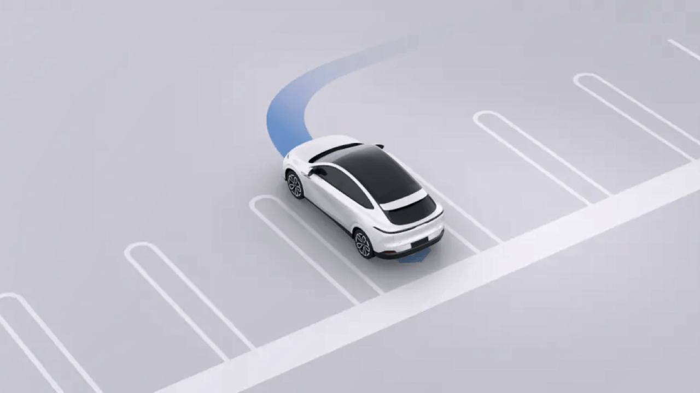
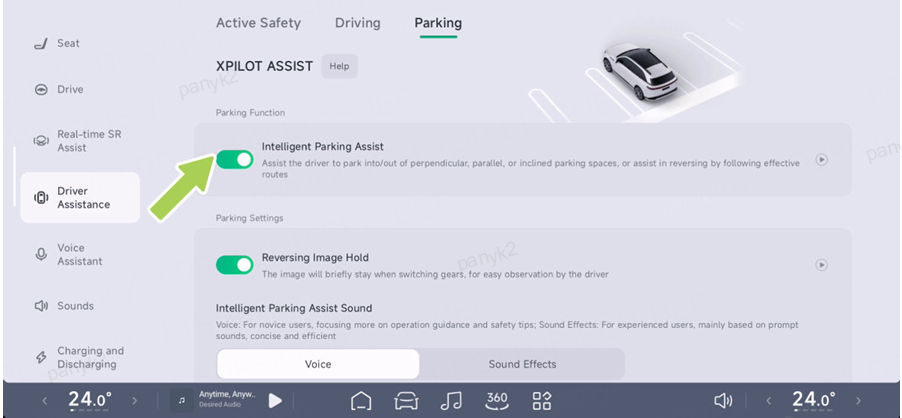
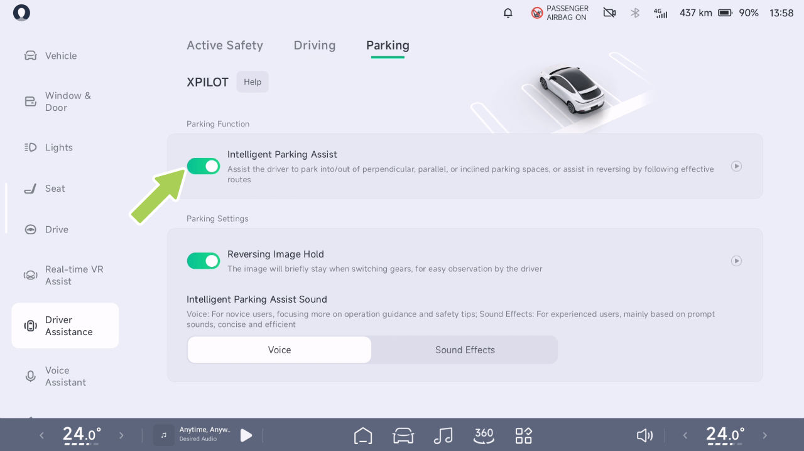

# Estacionamiento asistido

Estacionamiento Asistido

Monitoreo de Distancia Delantera/Trasera

• El radar avisa incluso si el obstáculo es
blando (como hierbas altas) y no daña
el vehículo.

Introducción

Cuando el vehículo está estacionado o circula a
baja velocidad, el radar ultrasónico puede detectar
la distancia entre el vehículo y los obstáculos
circundantes, y emite una advertencia
a través de la interfaz SR y un sonido de aviso.

Advertencias, Precauciones y Limitaciones

Es posible que las alertas del radar no funcionen correctamente en los
siguientes casos:

advertencia

precaución

• Radar limitado

• Cuando se muestra una barra roja, el obstáculo
está cerca del vehículo y requiere
atención adicional.

• El vehículo se acerca al obstáculo a una
velocidad mayor.

• A medida que disminuye la distancia del vehículo respecto al
obstáculo, la frecuencia del
tono de advertencia aumentará gradualmente.

Las advertencias, precauciones y limitaciones anteriores no
cubren todas las situaciones que afectan el funcionamiento
normal de la advertencia del radar.

Consejos

• El radar solo le avisará si su vehículo está
en marcha D a una velocidad inferior a 12 km/h;
no hay límite de velocidad para la alarma del radar
cuando está en marcha R.

109

Estacionamiento Asistido

Asistente Inteligente de Estacionamiento APA

advertencia

Introducción

El APA es solo una ayuda a la conducción y no puede manejar
todas las condiciones de tráfico, clima y entorno, y usted, como
conductor de su vehículo, es responsable de la
seguridad en la conducción. Por favor, sostenga el volante
en todo momento, observe la carretera y tome el control
en caso de peligro. No confíe en esta función
para controlar el vehículo, ya que podría provocar lesiones o la muerte.

Indicadores en el cuadro de instrumentos

El APA se puede activar

El APA puede ayudar al conductor a estacionar y salir
de plazas de estacionamiento verticales, paralelas y diagonales
con marcos cableados o inalámbricos. Admite los
siguientes métodos de activación:

APA activado

• CID

APA no disponible

• Llave por teléfono*

• Llave inteligente a distancia*

110

Estacionamiento Asistido

Operación

La "Asistencia de Realidad Virtual" entrará
automáticamente en el modo de estacionamiento.

Activación y desactivación

• Pulse la tecla de acceso directo del volante.

• Cuando la interfaz SR muestre el icono de la plaza
de estacionamiento, deténgase y cambie a la marcha R.

• Diga "Hey Xpeng, necesito estacionar".

El vehículo solo entrará en modo de estacionamiento si se cumplen las
siguientes condiciones:

• La velocidad del vehículo se mantiene por debajo de 30 km/h durante 5
segundos

• La ubicación de navegación no es (autopista/
carretera comarcal/camino rural/vía rápida/
calle principal/vía principal).

En el CID, vaya a la interfaz "
 →Asistencia a la
Conducción→Estacionamiento", donde podrá activar
o desactivar el APA.

2. Conduzca para buscar la plaza de estacionamiento objetivo.

Usar el APA

1.
Puede activar el modo de estacionamiento en
la interfaz "Asistencia a la Conducción→Estacionamiento"
usando cualquiera de los siguientes métodos:

Consejos

• Por favor, mantenga la distancia lateral entre
el vehículo y la plaza de estacionamiento
entre 1 y 2 metros mientras busca una
plaza de estacionamiento.

• Cambio automático. Cuando el vehículo
entra en un entorno de estacionamiento, como un
estacionamiento subterráneo, la función "En tiempo

111

Estacionamiento Asistido

• Al buscar un espacio de estacionamiento,
la velocidad del vehículo no debe superar los 24
km/h.

activada, presione dos veces el botón de
estacionamiento de la llave de control remoto.

• Llave de teléfono*: Cambie a la posición P, baje
del vehículo y cierre las puertas. Abra el
módulo de estacionamiento inteligente de la
aplicación móvil y toque "Estacionamiento remoto". Una vez que
los espejos laterales se plieguen y las luces de
emergencia se enciendan, toque "Iniciar
estacionamiento".

3. Cuando el espacio de estacionamiento objetivo esté resaltado,
presione el pedal de freno y toque en la CID para
seleccionar el espacio de estacionamiento objetivo.

4. En este momento, puede estacionar en el espacio
mediante los siguientes métodos:

• CID: Toque "Iniciar estacionamiento" en la pantalla
de control central y, a continuación, suelte el pedal
de freno.

• Al estacionar en un espacio usando el
llavero/control, el vehículo cambia automáticamente
a P, bloqueando el vehículo y
cortando la energía.

Consejos

Consejos

Cuando la tarjeta de estacionamiento muestre la opción de
desplazamiento lateral, confirme el desplazamiento lateral
antes de tocar "Iniciar estacionamiento".

• Al estacionar en un espacio usando el
llavero/llave del control, la llave inteligente/
el control debe mantenerse en las
proximidades del vehículo o la función se cancelará.

• Llave de control remoto*: Cambie a la posición P,
baje del vehículo y cierre las
puertas, mantenga presionado el botón de
estacionamiento de la llave de control remoto. Una vez que los espejos
laterales se plieguen y las luces de emergencia estén

• Al estacionar en un espacio con la llave
móvil, se permite abrir la puerta/el maletero
durante cinco minutos después de que el estacionamiento
remoto se suspenda, y la puerta

112

Estacionamiento Asistido

puede cerrarse para acceder y tocar
Continuar para completar el estacionamiento remoto.

• En caso de peligro, o en caso de
una situación que requiera tomar el control, tome el control
de inmediato y no espere a que el vehículo
emita una solicitud de toma de control.

• Si el vehículo solicita la toma de control a través de
la interfaz SR u otro medio, tome el control
de inmediato.

• Asegúrese de que no haya nadie en el vehículo
antes de estacionar en un espacio usando la Llave
Remota*/Aplicación Móvil.

Si se detecta un peligro, o surge una situación
que requiera la toma de control, tome el control de inmediato;
no espere a que el vehículo emita una
solicitud de toma de control.

• Al usar la Salida de Estacionamiento, baje del vehículo y
cierre la puerta, verifique si hay niños u otros
objetos importantes olvidados en los asientos traseros.

Antes de estacionar usando la aplicación móvil, siempre
asegúrese de que no haya nadie dentro del vehículo.

Cuando la APA está activada, puede pausarse de
las siguientes maneras:

Al usar la función de salida de estacionamiento, antes de
bajar del auto y cerrar la puerta,
verifique el asiento trasero para detectar niños
u otros objetos de valor olvidados.

• Estacionamiento con CID: Presione el pedal de freno en cualquier momento
para suspender la APA.

Alarma y toma de control

• Estacionamiento con llave de control remoto*: Presione brevemente
cualquier tecla de la llave inteligente.

advertencia

• Estacionamiento con Llave de Teléfono*: Toca la
tecla “Pausa” en la página correspondiente de la App
móvil.

• Si el vehículo envía una solicitud de toma de control
mediante un indicador, anuncio de voz, etc., toma el
control de inmediato.

Cuando se confirme la seguridad, el APA puede
restablecerse mediante:

• Estacionamiento en el CID: Toca “Continuar” en el CID.

113

Estacionamiento Asistido

• Estacionamiento con llave de control remoto*: Presiona el
botón de estacionamiento de la llave de control remoto dos veces.

• Condiciones meteorológicas adversas (p. ej., lluvia
intensa, nieve intensa, niebla densa, etc.).

• Estacionamiento con Llave de Teléfono*: Toca “Continuar” en la
App móvil.

• La superficie de la carretera es irregular, está helada o resbaladiza.

El APA se desactivará si:

• El material del bordillo no es de piedra o el bordillo
no se puede detectar.

• giras el volante manualmente.

• Presionas el pedal de freno.

• Hay superficies en mal estado (p. ej., precipicios, plataformas
elevadas, aceras orientadas hacia la calle, etc.).

• El APA se pausa y no se recupera después de 30
segundos.

• Equipado con cadenas antideslizantes o ruedas de repuesto.

• El objeto cargado sobresale del
vehículo.

• Se abre la puerta, se acciona el pedal del acelerador o
el pedal de freno, lo que provoca que el APA se
pause 3 veces.

• Cualquiera de los lados de los espejos exteriores izquierdo o derecho
está dañado o en una posición incorrecta.

• Plazas de estacionamiento en calles estrechas, o plazas de
estacionamiento estrechas.

Advertencias, Precauciones y Limitaciones

No uses el APA en los siguientes escenarios:

advertencia

• Las modificaciones del vehículo o las reparaciones
realizadas en un Centro de Servicio que no sea de XPENG
Automobile afectan el funcionamiento normal
del vehículo.

• La carretera es una rampa.

• Uno o más sensores ultrasónicos, la
Cámara Envolvente están sucios u obstruidos (p. ej.,
lodo, nieve o agua adherida).

114

Estacionamiento Asistido

advertencia

Las advertencias, precauciones y limitaciones anteriores
no cubren todas las condiciones que pueden afectar el
funcionamiento normal del APA.

En los siguientes escenarios, el APA puede no ser
capaz de tomar medidas de seguridad y debes tomar
el control del vehículo de inmediato:

• Cuando el instrumento o la pantalla de control
central te envíe una solicitud de toma de control.

Salida Automática de Estacionamiento Asistido (AEP)

• Cuando el APA se desactive inesperadamente.

Introducción

Los siguientes métodos pueden utilizarse para sacar el
vehículo de una plaza de estacionamiento si no se ha
movido después de estacionar con la APP Introducción

• Se encontraron vehículos, peatones y objetos
durante el estacionamiento y la evasión automática
o el frenado no se completaron a
tiempo.

• CID: Sube al vehículo, cierra la puerta, cambia
a marcha R y toca “Iniciar Salida de Estacionamiento” en el
CID.

advertencia

El APA puede presentar las siguientes situaciones, por favor
ten en cuenta la toma de control:

• Llave de control remoto: Mantén presionado el
botón de estacionamiento de la llave de control remoto.
Una vez que los espejos laterales se plieguen y las
luces de emergencia se activen, presiona el botón de
estacionamiento de la llave de control remoto dos veces.

• Obstrucción por encima y sobre la altura del
espejo exterior.

• Obstrucciones colgantes, pequeñas y de poco
ancho.

• Llave de teléfono: Abre la App móvil, toca “Estacionamiento
Remoto”, y toca “Iniciar Salida de Estacionamiento” después de que
los espejos laterales se plieguen y las luces de advertencia
de emergencia se enciendan.

• Un objetivo en un punto ciego de la cámara o el radar.

• Peatones o animales.

115

Estacionamiento Asistido

Consejos

Llamada Remota del Vehículo*(Si
corresponde)

Para acceder a la función Park Out, inicie sesión
con el número de cuenta del propietario en la
pantalla de control central y active el interruptor
de estacionamiento superinteligente.

Introducción

Puede usar la llave de control remoto o la llave
del teléfono para mover el vehículo hacia
adelante o hacia atrás, lo que facilita que el
vehículo entre y salga de espacios de
estacionamiento estrechos donde las personas no
pueden subir o bajar cómodamente.

advertencia

• El AEP es solo una ayuda a la conducción y no
puede manejar todas las condiciones de tráfico,
clima y situaciones, y usted, como conductor de
su vehículo, es responsable de conducir de
forma segura. Sostenga el volante en todo
momento, observe la carretera y tome el control
en caso de peligro. No confíe en esta función
para controlar el vehículo, ya que podría
provocar lesiones o la muerte.

Consejos

La Llamada Directa tiene una función de
evasión de obstáculos, que puede suspenderse
de forma activa si se encuentra un obstáculo.

advertencia

• Las advertencias, alarmas y tomas de control
del APA, etc., también se aplican al AEP.

La Llamada Directa es solo una ayuda a la
conducción y no puede manejar todas las
condiciones de tráfico, clima y carretera, y usted,
como conductor de su vehículo, es responsable de
conducir de forma segura. No confíe en esta
función para controlar el vehículo, ya que podría
provocar lesiones o la muerte.

116

Estacionamiento Asistido

Operación

2. Mantenga presionado el interruptor para
controlar el movimiento del vehículo hacia
adelante o hacia atrás. Suelte el interruptor para
detener el vehículo.

Apertura y cierre

3. Después de que el vehículo entre o salga del
espacio de estacionamiento, toque Atrás para
salir de la función.

Alarma y toma de control

advertencia

En caso de peligro o de una situación que requiera
una toma de control, la función debe suspenderse
de inmediato y nunca esperar a que se active la
evasión.

La llamada en línea recta saldrá en los siguientes
casos:

En la pantalla de control central, vaya a la
interfaz “ 
 →Asistencia a la Conducción→
Estacionamiento”, y podrá activar o desactivar el
APA.

• La llave del teléfono móvil está demasiado lejos
del vehículo.

Llamada en línea recta con la llave del teléfono

1.
Abra la App móvil, toque “Llamada Remota del
Vehículo”, y los espejos laterales del vehículo se
plegarán y se encenderán las luces de
emergencia.

• El Bluetooth entre el teléfono móvil y el
vehículo está desconectado.

• La evasión de obstáculos se activa 3 veces
durante un solo uso.

117

Estacionamiento Asistido

• El vehículo no se controla para moverse hacia
adelante o hacia atrás durante más de 30 s.

• Se encuentran vehículos, peatones y objetos
durante el estacionamiento y la evasión activa o
el frenado no se completa a tiempo.

Advertencias, Precauciones y Limitaciones

advertencia

• La Llamada en línea recta sale inesperadamente.

No use una llamada en línea recta en los
siguientes escenarios:

No realice lo siguiente al usar una llamada en
línea recta:

advertencia

• Uno o más sensores ultrasónicos, la Cámara
Envolvente están sucios u obstruidos (p. ej.
barro, nieve o agua adherida).

• Malas condiciones climáticas (p. ej. lluvia
intensa, nieve intensa, niebla densa, etc.).

• Línea de visión alejada del vehículo.

• Depender por completo de la llamada directa para estacionar.

• La superficie de la carretera es irregular, está helada o resbaladiza.

Las advertencias, precauciones y limitaciones anteriores no cubren todas las condiciones que afectan el funcionamiento normal de la llamada en línea recta.

• La carretera es una rampa.

advertencia

Asistencia de Retroceso（RA）

En los siguientes escenarios, una llamada directa puede no ser segura y se debe tomar el control del vehículo de inmediato:

Introducción

• Se le solicita que tome el control del vehículo.

El retroceso con seguimiento es una función que ayuda al conductor a retroceder por la ruta original. Después de entrar en condiciones de carretera difíciles, como callejones sin

118

Estacionamiento Asistido

salida y carreteras estrechas, puede usar el retroceso con seguimiento para salir del apuro.

Funcionamiento

precaución

Apertura y cierre

El retroceso con seguimiento incluye una función de evasión de obstáculos, que se detiene de forma activa si se encuentra un obstáculo.

El Retroceso con Seguimiento es solo una ayuda a la conducción y no puede manejar todas las situaciones de tráfico, clima y condiciones, y usted, como conductor de su vehículo, es responsable de conducir de forma segura. No dependa de esta función para controlar el vehículo, ya que esto puede provocar un accidente.

advertencia

En el CID, vaya a la interfaz “ 
 →Asistencia al Conductor→Estacionamiento”, y puede activar o desactivar el APA.

Usar el retroceso con seguimiento

1.
Al conducir hacia adelante a una velocidad inferior a 20 km/h, el sistema recordará automáticamente la última ruta disponible.

2. Detenga el vehículo y cambie a la marcha R.

119

Estacionamiento Asistido

3. En el CID, toque el botón “Retroceso→Asistencia de Retroceso→Iniciar Retroceso”.

• Malas condiciones meteorológicas (p. ej., lluvia intensa, nieve intensa, niebla densa, etc.).

4. El sistema retrocederá automáticamente a baja velocidad según la ruta válida.

• La superficie de la carretera es irregular, está helada o resbaladiza.

precaución

• Hay superficies en mal estado (p. ej., acantilados, plataformas elevadas, aceras que dan a la calle, etc.).

• Es probable que una ruta de conducción en D por debajo de 20 km/h se registre como una ruta válida de hasta 100 m.

advertencia

• Antes de activar el seguimiento, retroceder, girar el volante demasiado o conducir en una pendiente borrará una ruta válida.

En las siguientes situaciones en las que una maniobra de retroceso con seguimiento puede no ser segura, tome el control del vehículo de inmediato:

• El sistema solicita tomar el control del vehículo.

Advertencias, Precauciones y Limitaciones

• Cuando el retroceso sale de forma inesperada.

• Se encuentran vehículos, peatones y objetos durante el retroceso y la evasión automática o el frenado no se completan a tiempo.

No use el retroceso con seguimiento en los siguientes escenarios:

advertencia

• Uno o más sensores ultrasónicos o la Cámara Envolvente están sucios u obstruidos (p. ej., con lodo, nieve o agua adherida).

• La carretera es una rampa.

advertencia

Preste atención a la toma de control, ya que puede experimentar lo siguiente al usar el retroceso con seguimiento:

120

Estacionamiento Asistido

• Obstrucciones por encima de la altura del espejo exterior.

• Obstrucciones colgantes, pequeñas y de ancho reducido.

• Un objetivo en un punto ciego de la cámara o el radar.

• Aproximación repentina de un peatón o un animal.

advertencia

No confíe únicamente en el seguimiento cuando utilice los rastros de seguimiento.

Las advertencias, precauciones y limitaciones anteriores no cubren todas las condiciones que afectan el funcionamiento normal del retroceso con seguimiento.

121