# Seguridad activa

Active safety → I'll translate preserving all formatting.

Seguridad activa

Advertencia de colisión frontal
(FCW y AEB)

advertencia

Introducción

La advertencia de colisión frontal no funciona cuando
el vehículo está en marcha atrás.

Cuando el sistema detecta un riesgo de colisión,
emitirá alertas a través de la interfaz SR y un
sonido de aviso.

• Para peatones y vehículos de dos ruedas, la FCW
funciona a velocidades de aproximadamente 10 a
85 km/h.

advertencia

• Para vehículos, la FCW funciona a velocidades de
aproximadamente 10 a 150 km/h.

• Cuando el vehículo emite una advertencia, el conductor
debe tomar medidas de inmediato y no
esperar a que intervenga el AEB.

La advertencia de colisión frontal incluye la advertencia
de colisión frontal (FCW) y la frenada de emergencia
automática (AEB), que pueden reducir el riesgo de
colisiones del vehículo o reducir la velocidad antes de
una colisión, mejorando así la seguridad en la conducción.

Si el riesgo aumenta aún más, y el conductor sigue
sin frenar o la fuerza de frenado es demasiado pequeña,
el vehículo frenará de forma activa para reducir las colisiones
y las lesiones.

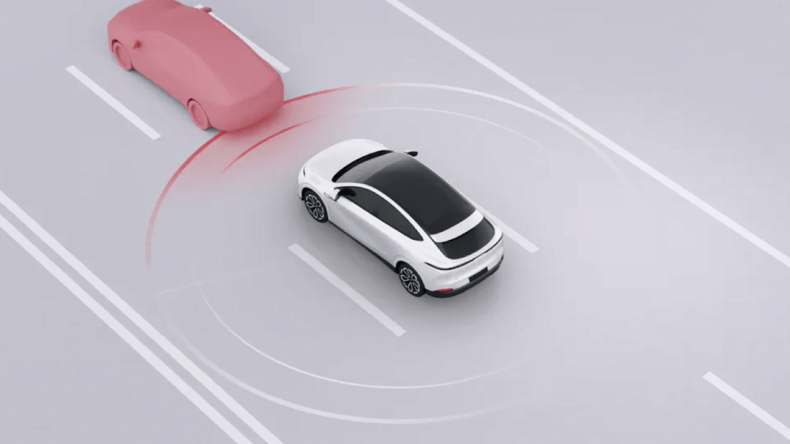

Seguridad activa

advertencia

y el conductor es totalmente responsable de
la seguridad en la conducción. Observe siempre las
condiciones de la carretera mientras conduce y no confíe
en las advertencias de colisión frontal para advertir o evitar
posibles colisiones. Varios factores pueden
degradar o afectar el rendimiento, lo que da lugar
a advertencias innecesarias, inexactas o ineficaces,
intervenciones de frenado o advertencias omitidas. La
confianza en la advertencia de colisión frontal para advertir de posibles colisiones y
evitar posibles lesiones graves o la muerte.

• Para peatones y vehículos de dos ruedas, el AEB
funciona a velocidades de aproximadamente 8 a 85
km/h.

• Para vehículos en movimiento, detenidos o que se mueven
lentamente, el AEB funciona entre
aproximadamente 4 y 150 km/h del
vehículo.

• Si el AEB frena el vehículo, este
permanecerá detenido durante un breve periodo de tiempo
y el conductor debe tomar el control
lo antes posible.

• La frenada de emergencia autónoma no
está diseñada para evitar colisiones. Solo puede
minimizar el impacto de un choque frontal
intentando reducir al máximo la velocidad en
carretera. Confiar en la frenada de emergencia
autónoma para evitar colisiones puede provocar lesiones
graves o la muerte.

• La aplicación del pedal del acelerador por parte del
conductor durante la intervención del AEB en el
frenado del vehículo puede provocar una interrupción del
frenado.

• La advertencia de colisión frontal es una ayuda que
no funciona en todas las condiciones de conducción, tráfico, clima
y carretera. No hay sustituto
para una conducción concentrada y un juicio preciso,

advertencia

Indicadores en el cuadro de instrumentos

Advertencia de colisión frontal DESACTIVADA

Seguridad activa

Inicialización de la advertencia de colisión
frontal

“Advertencia de colisión frontal”. Una vez habilitada esta función,
puede ajustar la sensibilidad de la advertencia de colisión
frontal.

Fallo de la advertencia de colisión frontal

La advertencia de colisión frontal se activa
automáticamente cada vez que conduce, y se
recomienda mantenerla siempre activada para
su seguridad.

Consejos

Funcionamiento

Activación y desactivación

Before using FCW, the driver should refer to this... — aquí está la traducción:

Antes de usar el FCW, el conductor debe consultar
este capítulo para obtener orientación y conocer las
restricciones sobre el uso de las funciones
correspondientes.

Advertencias, precauciones y limitaciones

advertencia

No confíe únicamente en la función de
advertencia de colisión frontal en los siguientes
escenarios, en los que puede verse limitada o
quedar inoperativa:

En la CID, vaya a la interfaz "
 →Asistencia a la conducción→Seguridad
activa", donde podrá activar o desactivar

• Radar o cámara restringidos.

• Oscuridad o mala visibilidad. Por ejemplo, malas
condiciones de iluminación, lluvia intensa, nieve
intensa, niebla densa, etc.

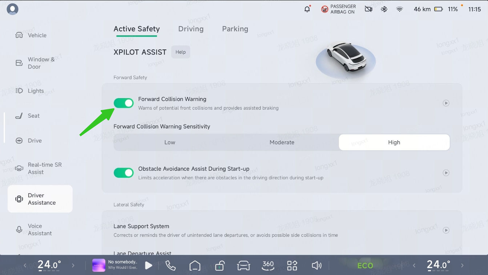

Seguridad activa

• Cuando una luz intensa obstruye la visión de
la cámara. Por ejemplo, la luz de los faros de
un vehículo que viene de frente o la luz solar
directa.

• Al pasar junto a un objeto estacionario al
costado de la carretera o al adelantar al
cambiar de carril.

• El parabrisas bloquea el campo de visión de la
cámara (vaho, suciedad, calcomanías, etc.).

• Los vehículos de adelante cambian de carril
después de frenar.

• Vehículos retrocediendo más adelante.

• El vehículo atraviesa una banda reductora de
velocidad, una fuga en el suelo o una reja de
hierro en el garaje.

• El vehículo circula por curvas amplias o en
malas condiciones de la carretera.

• Cuando el vehículo pasa por viaductos,
pasarelas peatonales o debajo de carteles.

• El objetivo aparece de repente. Por ejemplo,
cuando hay un movimiento rápido y repentino
de otro vehículo o un movimiento cercano
hacia la parte delantera del vehículo.

• Cuando el vehículo atraviesa juntas de
viaductos, barreras metálicas al costado de la
carretera, etc.

• Semáforos más adelante, agua de un
aspersor, salpicaduras de agua, postes de
hierro en la carretera, tubos de acero en el
aire, bolsas de plástico flotando, latas rodando
en la carretera, estacionamientos
subterráneos, peajes de autopista, tapas de
alcantarilla, etc.

• Superposición insuficiente del objetivo
(coincidencia del ancho delantero y trasero del
vehículo de adelante).

• El conductor frena, pisa a fondo el acelerador
o realiza maniobras rápidas o amplias con el
volante.

• Hay un vehículo estacionario en la entrada y
salida de la curva.

Las advertencias, precauciones y limitaciones
anteriores no cubren todas las condiciones que
pueden afectar el funcionamiento normal del
FCW y AEB.

• Al conducir en una curva, el vehículo que se
aproxima reduce la velocidad de repente.

• Un vehículo que adelanta desde el frente en
una curva.

Seguridad activa

Detección de punto ciego (BSD)

Introducción

Cuando el vehículo está en posición D y la
velocidad actual del vehículo es superior a 10 km/h,
si hay un vehículo en el punto ciego o un vehículo
que se aproxima rápidamente por detrás del punto
ciego, la luz de advertencia del espejo lateral
correspondiente permanecerá encendida de forma
fija. En ese momento, si se activan las luces de giro
del lado correspondiente, la luz de advertencia del
espejo lateral parpadeará para dar una advertencia.

La asistencia de seguridad de punto ciego incluye
la detección de punto ciego (BSD) y la alerta de
cambio de carril (LCA), que pueden monitorear los
carriles a ambos lados del vehículo y dar una
advertencia cuando existe riesgo al cambiar de
carril.

advertencia

La asistencia de seguridad de punto ciego es una
ayuda a la conducción y no puede hacer frente a
todas las condiciones de tráfico, climáticas y

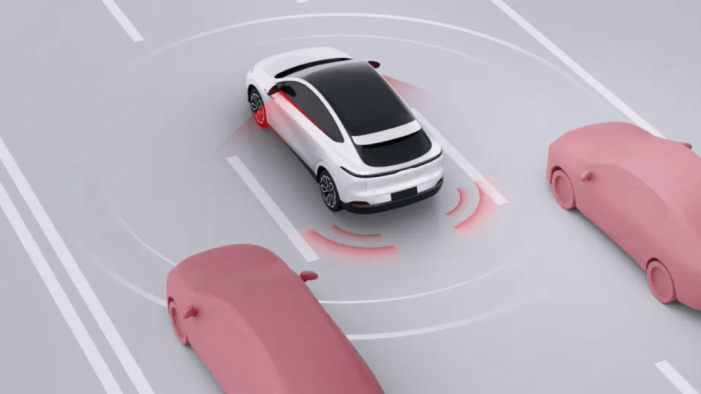

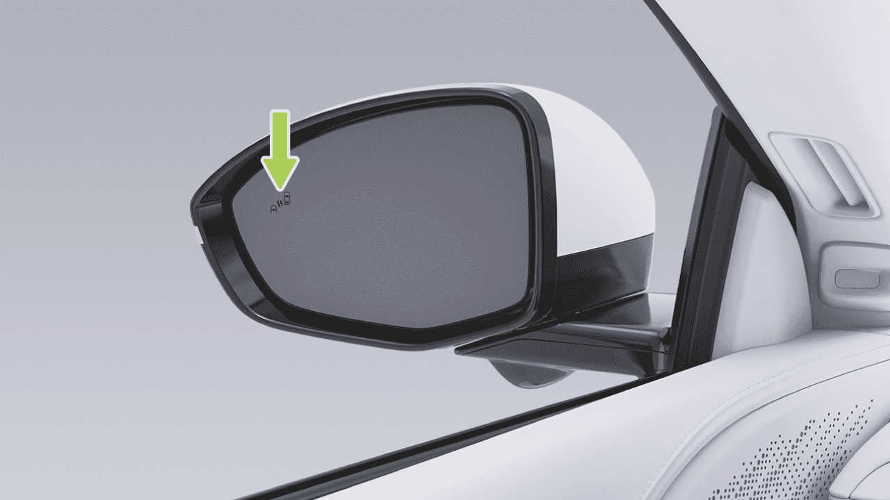

Seguridad activa

condiciones, y no sustituye la concentración del
conductor ni un juicio acertado. Tampoco está
destinada a reemplazar el uso de los espejos
interiores y exteriores. Usted, como conductor del
vehículo, es responsable de conducir de forma
segura, y siempre es responsabilidad del conductor
cambiar de carril de manera segura. No confíe en
esta función para controlar el vehículo, ya que podría
provocar lesiones o la muerte.

En el CID, vaya a la interfaz "
 →Asistencia al Conductor→Seguridad
Activa", donde puede activar o desactivar
la "Detección de Punto Ciego".

Advertencias, precauciones y limitaciones

La asistencia de seguridad en el área de punto ciego
puede no funcionar en los siguientes escenarios:

advertencia

• Radar limitado

Apertura y cierre

Funcionamiento

• Curvas cerradas.

• Al dar marcha atrás.

• Hay objetos metálicos grandes en movimiento
en el área de punto ciego.

Las advertencias, precauciones y limitaciones
anteriores no cubren todas las condiciones que pueden
afectar el funcionamiento normal de la función de
Detección de Punto Ciego.

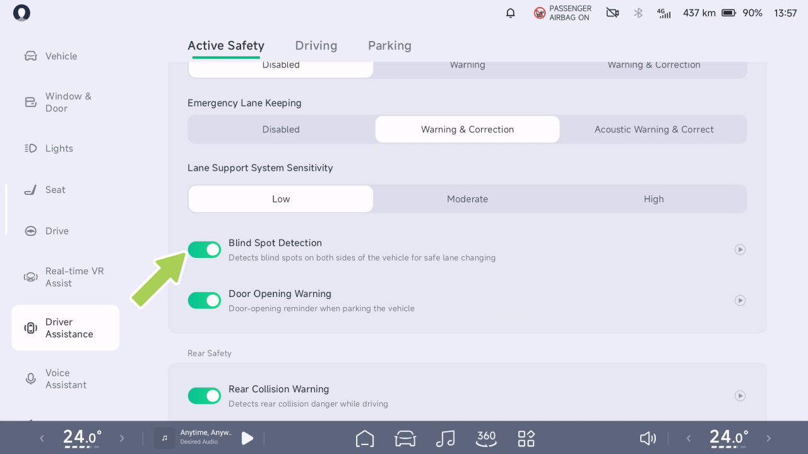

Seguridad activa

Advertencia de Apertura de Puertas (DOW)

Introducción

Si el conductor o el pasajero continúa abriendo
la puerta del lado correspondiente, se activa una
alarma de Nivel II, acompañada de la interfaz
SR, un sonido de advertencia y el parpadeo de las
luces ambientales de la puerta como recordatorio.

Cuando existe riesgo de colisión al abrir la
puerta, la DOW puede advertir al conductor y a
los pasajeros.

Cuando la velocidad del vehículo está entre 0 y 5
km/h y vehículos, peatones o vehículos de dos
ruedas se aproximan dentro del rango de detección,
la DOW activa una advertencia de nivel I,
indicada por la iluminación constante de la luz
de advertencia en el espejo lateral correspondiente.

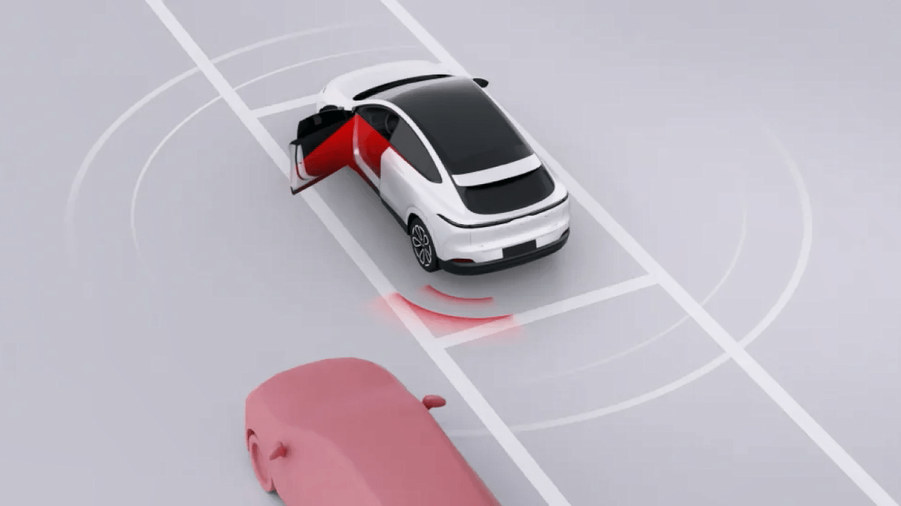

Seguridad activa

en esta función para controlar el vehículo, ya que
podría provocar lesiones o la muerte.

Funcionamiento

Apertura y cierre

• La luz ambiental de la puerta parpadea.

advertencia

La DOW es únicamente una función de asistencia a la
conducción diseñada para alertar a los ocupantes
sobre la seguridad de la puerta al abrirla y no puede
gestionar todas las condiciones de tráfico, clima y
carretera. No está destinada a reemplazar la
observación visual del conductor y los pasajeros,
ni la función de los espejos interiores y exteriores.
Usted, como conductor del vehículo, es
responsable de la seguridad en la conducción y no debe confiar

En el CID, vaya a la interfaz "
 →Asistencia al Conductor→Seguridad
Activa", donde puede activar o desactivar
la "Advertencia de Apertura de Puertas".

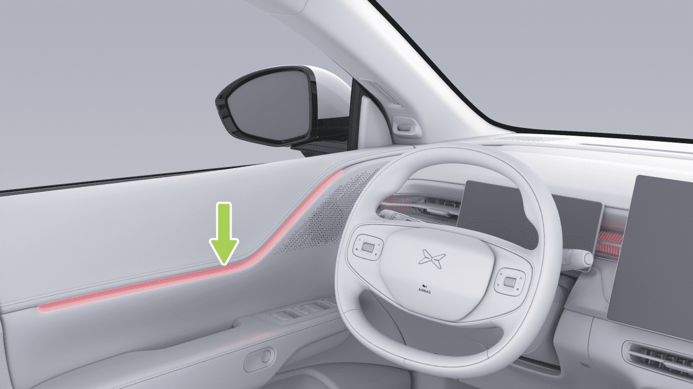

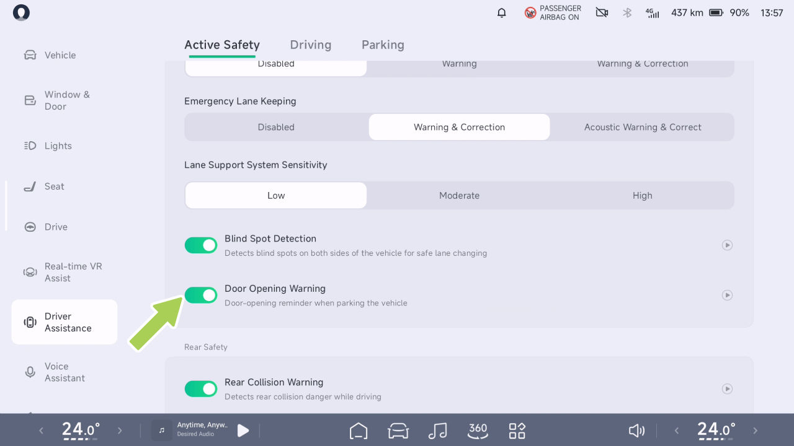

Seguridad activa

Advertencias, precauciones y limitaciones

Advertencia de Colisión Trasera (RCW)

La DOW puede no funcionar en los siguientes escenarios:

advertencia

Introducción

• Radar limitado

• Objetivos más pequeños u objetivos estacionarios.

• Velocidad del objetivo demasiado alta o
comportamiento de la dirección. Por ejemplo:
El vehículo objetivo cambia de carril justo
detrás del vehículo propio, y otros vehículos
cambian de carril repentinamente justo detrás
del vehículo propio y ahora se encuentran en la
zona de monitoreo.

• Otros vehículos, ciclistas que aparecen justo
detrás del vehículo.

• El vehículo está estacionado en una esquina o
cerca de una pared.

Durante la conducción, el RCW puede detectar y
advertir el riesgo de colisión detrás del vehículo.

Cuando la velocidad actual del vehículo es de
15~160 km/h, hay vehículos, peatones y bicicletas
que se aproximan a cierta velocidad dentro del
rango de detección, y existe riesgo de colisión, el
RCW emitirá una advertencia a través de la interfaz
SR y un sonido de aviso, y le recordará a los

Las advertencias, precauciones y limitaciones
anteriores no cubren todas las condiciones que
puedan afectar el funcionamiento normal del DOW.

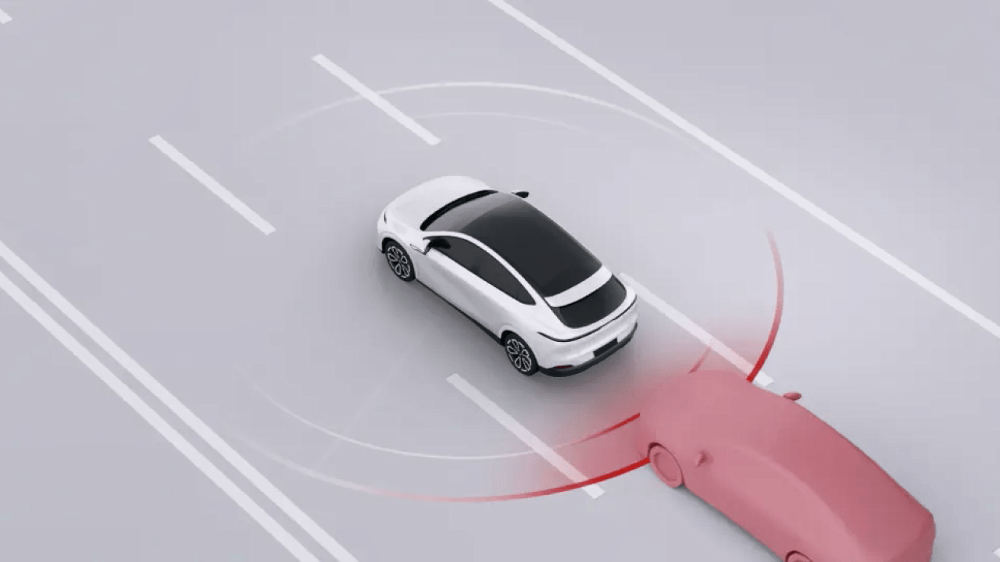

Seguridad activa

vehículos que circulan detrás encendiendo las
luces de advertencia de emergencia.

Operación

advertencia

Activación y desactivación

El RCW es una ayuda a la conducción y no puede
manejar todas las condiciones de tráfico, clima y
carretera, y no sustituye la concentración del
conductor ni un juicio preciso. Tampoco pretende
reemplazar el uso de los espejos interiores y
exteriores. Usted, como conductor del vehículo, es
responsable de la seguridad en la conducción y no
debe confiar en esta función para controlar el
vehículo, ya que podría provocar lesiones o la
muerte.

En la pantalla de control central, vaya a la interfaz
" 
 →Asistencia a la conducción→Seguridad activa",
y podrá activar o desactivar la "Advertencia de
colisión trasera".

Advertencias, precauciones y limitaciones

En los siguientes escenarios, el RCW puede no
funcionar correctamente:

advertencia

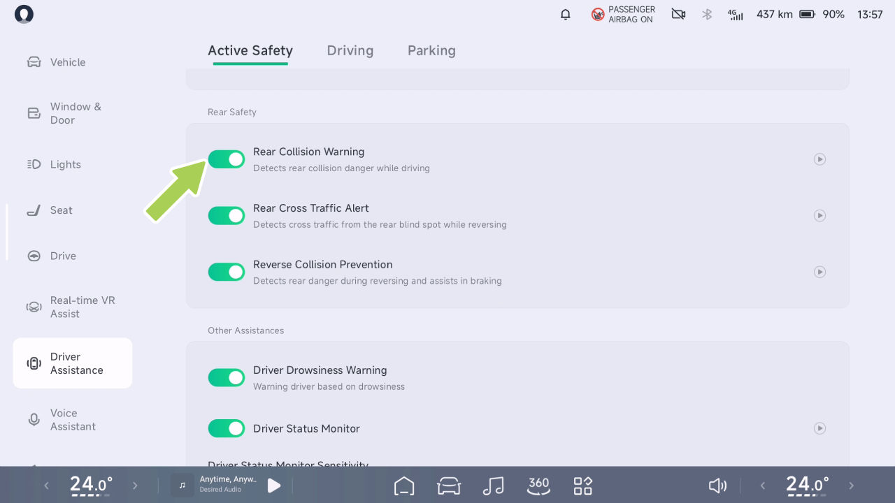

Seguridad activa

• Radar limitado

• La velocidad de detección del objeto es
demasiado alta.

Prevención de colisión en marcha atrás RAEB

• Hay objetos metálicos grandes en movimiento
en la zona ciega.

Introducción

• Curvas cerradas.

Las advertencias, precauciones y limitaciones
anteriores no cubren todas las condiciones que
puedan afectar el funcionamiento normal del RCW.

El sistema de prevención de colisión en marcha
atrás detecta los riesgos de colisión detrás del
vehículo mientras se da marcha atrás y proporciona
alertas, junto con asistencia de frenado.

Cuando el vehículo está en marcha atrás (R) y
circula a velocidades de 0 a 18 km/h, y peatones
que se aproximan a cierta velocidad dentro del
rango de detección representan un riesgo de
colisión, el RAEB avisará a través de la interfaz SR
y un sonido de aviso.

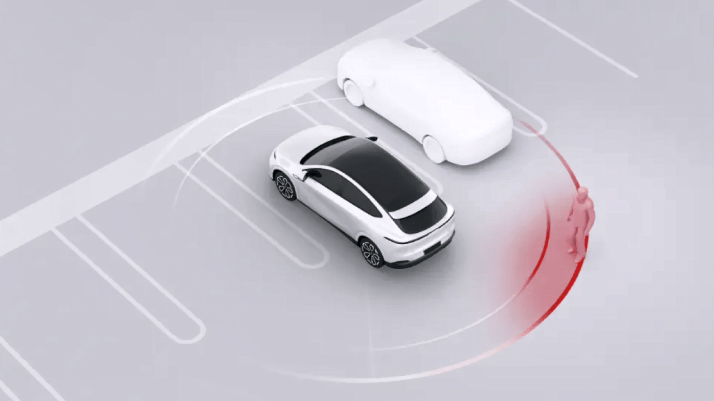

Seguridad activa

Si el riesgo continúa aumentando y el conductor no
frena o aplica una fuerza de frenado insuficiente, el
sistema RAEB activará la asistencia de frenado para
mitigar o evitar lesiones relacionadas con la
colisión.

Operación

advertencia

La función RAEB es una ayuda a la conducción y
puede no funcionar en todas las situaciones, ni
sustituye la atención del conductor, quien debe
dar marcha atrás de forma segura. No utilice el
sistema cuando la visibilidad esté obstruida y
las condiciones del tránsito sean difíciles de
observar, como en una vía con mucho tránsito o
al cruzar varios carriles, ya que el sistema puede
no identificar con precisión a ciclistas y
peatones. Por eso, siempre debe estar atento a
su entorno.

En el CID, vaya a la interfaz “ 
 →Asistencia a la Conducción→Seguridad
Activa” y podrá activar o desactivar
“Prevención de Colisión en Marcha Atrás”.

precaución

Advertencias, precauciones y limitaciones

Una vez que el RAEB aplica el freno de
estacionamiento, los frenos se mantienen
durante un período de tiempo y el conductor
debe tomar el control del vehículo lo antes
posible.

El RAEB puede no funcionar correctamente en
todos los casos y puede generar advertencias
innecesarias, inoportunas o ineficaces por
diversos motivos. O bien omitir advertencias,
como por ejemplo:

advertencia

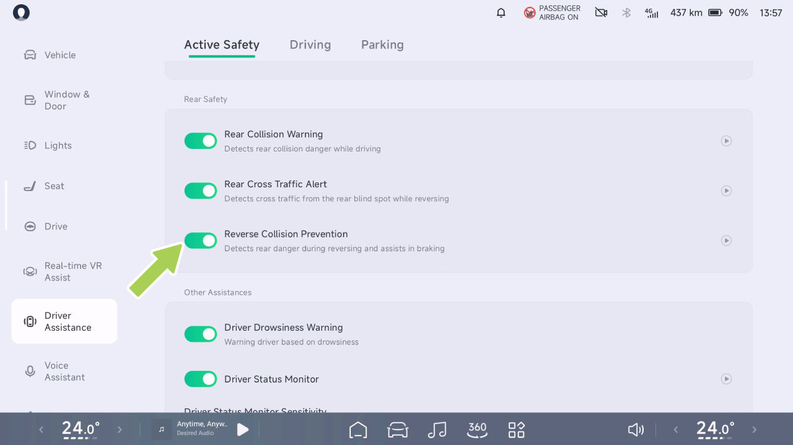

Seguridad activa

• Radar limitado

• Objetos metálicos grandes en movimiento en
la zona del punto ciego.

Cuando la visibilidad en marcha atrás es
limitada, el RCTA puede avisar al conductor
sobre los vehículos que se aproximan en los
puntos ciegos a ambos lados por detrás.

Las advertencias, precauciones y limitaciones
anteriores no abarcan todas las condiciones que
pueden afectar el funcionamiento normal del
RAEB.

• El objeto que debe detectarse se mueve
demasiado rápido.

Cuando el vehículo está en marcha R o N,
desplazándose en reversa a una velocidad de
2~15 km/h, y se detecta un vehículo, peatón o
vehículo de dos ruedas que se aproxima a cierta
velocidad dentro del rango de detección y que
representa un riesgo de colisión, se activa el
RCTA y se proporcionan alertas a través de la
interfaz SR y un sonido de aviso.

Alerta de Tránsito Cruzado Trasero (RCTA)

Introducción

advertencia

El RCTA es solo una ayuda a la conducción y no
puede hacer frente a todas las condiciones de
tránsito, clima y vía, y no sustituye la atención
ni el criterio preciso del conductor. Tampoco
pretende reemplazar el uso de los espejos
interiores y exteriores. No se arriesgue a
conducir solo porque el sistema mejora el
confort; dar marcha atrás de forma segura es
siempre responsabilidad del conductor, y no
confíe en esta función para controlar el vehículo,
ya que podrían producirse lesiones o la muerte.

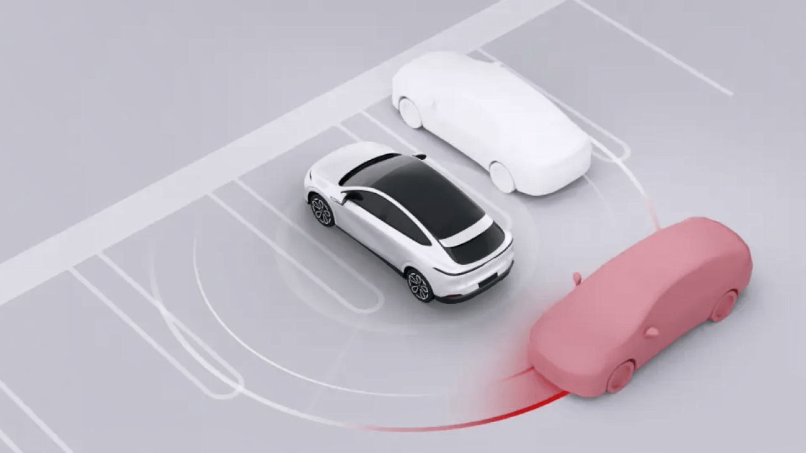

Seguridad activa

Funcionamiento

• Las condiciones del tránsito son complejas,
como vías con mucho tránsito o al cruzar varios
carriles.

Activación y desactivación

advertencia

El RCTA puede no funcionar en los siguientes
casos:

• Radar limitado

• La velocidad de detección del objeto es
demasiado rápida.

• Hay objetos metálicos grandes en movimiento
en la zona ciega.

advertencia

El RCTA puede presentar las siguientes
condiciones:

En la pantalla de control central, vaya a la
interfaz “ 
 →Asistencia a la
Conducción→Seguridad Activa” y podrá activar
o desactivar “Alerta de Tránsito Cruzado
Trasero”.

• Los transeúntes y los vehículos de dos ruedas
no se identifican con precisión.

Las advertencias, precauciones y limitaciones
anteriores no abarcan todas las condiciones que
pueden afectar el funcionamiento normal del
RCTA.

Advertencias, precauciones y limitaciones

No utilice el RCTA en los siguientes casos:

advertencia

• Campo de visión limitado.

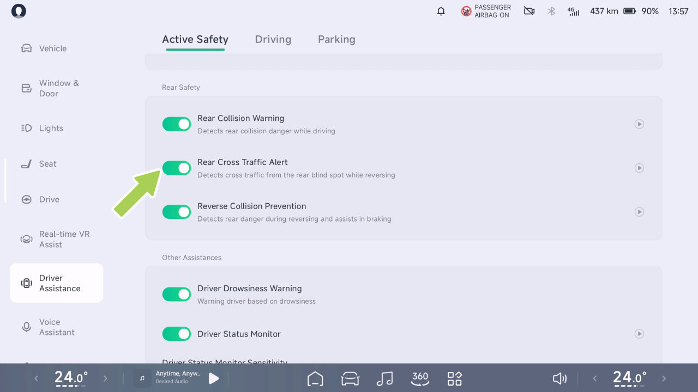

Seguridad activa

Asistente de seguridad al arrancar

advertencia

Introducción

El Asistente de Prevención de Arranque es únicamente una función de ayuda a la conducción y no sustituye la observación visual directa; no confíe demasiado en el Asistente de Arranque. Cuando la función está activada, la aceleración del vehículo se limita solo hasta cierto punto y usted aún debe controlar activamente el vehículo para detenerlo, de lo contrario igualmente se producirá una colisión. Es su responsabilidad permanecer atento, estar consciente del entorno de arranque del vehículo y prestar atención en todo momento a otros usuarios de la vía, ya que podrían producirse lesiones graves o la muerte.

Prevención de obstáculos al arrancar: cuando el vehículo arranca, si se detecta un obstáculo en la dirección de marcha y el conductor pisa el pedal del acelerador demasiado rápido, la respuesta dinámica del vehículo se limitará para evitar un choque con el obstáculo debido a una aceleración demasiado rápida del vehículo eléctrico.

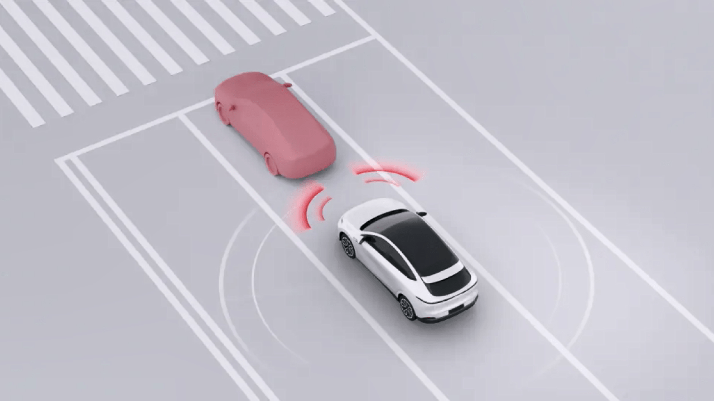

Seguridad activa

Funcionamiento

Advertencias, precauciones y limitaciones

Apertura y cierre

El Asistente de Prevención de Arranque no funciona siempre en todas las situaciones y puede provocar advertencias innecesarias, inexactas o ineficaces, u omisiones, por diversas razones, tales como:

advertencia

• Radar limitado

• Hay grandes objetos metálicos en movimiento en la zona ciega.

• La velocidad de detección del objeto es demasiado alta.

En la pantalla de control central, vaya a la interfaz “ 
 →Asistencia a la conducción→Seguridad activa” y podrá activar o desactivar “Asistente de prevención de obstáculos durante el arranque”.

Las advertencias, precauciones y limitaciones anteriores no cubren todas las condiciones que pueden afectar el funcionamiento normal del asistente de prevención de obstáculos al arrancar.

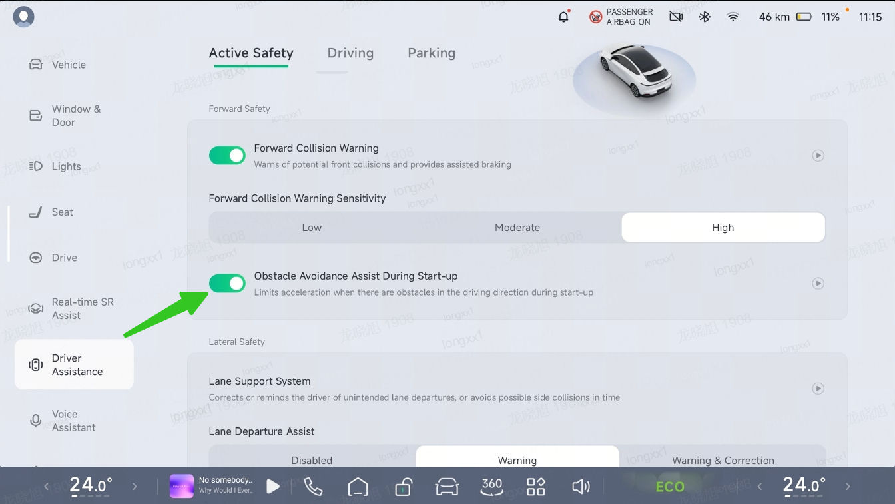

Seguridad activa

Asistente de mantenimiento de carril LSS

no puede reemplazar la conducción dedicada y el juicio preciso del conductor. Usted, como conductor del vehículo, es responsable de la seguridad en la conducción y no debe confiar en esta función para controlar el vehículo, ya que podrían producirse lesiones o la muerte.

Introducción

Si se selecciona el modo de advertencia temprana, solo se activará el LDW; si se selecciona el modo de corrección, se activarán todos: LDW, LDA y ELK:

• LDW: cuando la velocidad actual del vehículo es de 60~150 km/h y el vehículo se desvía del carril sin las correspondientes luces de giro activadas, la función emitirá una advertencia a través de la interfaz SR, un sonido de aviso y vibración del volante hasta que el conductor corrija la posición del vehículo.

El LSS incluye la advertencia de cambio de carril (LDW), el asistente de mantenimiento de carril (LDA) y el asistente de emergencia de mantenimiento de carril (ELK), que pueden advertir y corregir una salida de carril inconsciente o un posible choque lateral en caso de maniobra de emergencia.

advertencia

El LDW solo alerta y no corrige el vehículo de vuelta al carril; corrija la posición del vehículo a tiempo ante la alarma del LDW.

El LSS es una ayuda a la conducción y no puede hacer frente a todas las condiciones de tráfico, climáticas y de la vía, y

• LDA: Cuando la función LDA está activada y la
velocidad actual del vehículo es de 60~150 km/h y

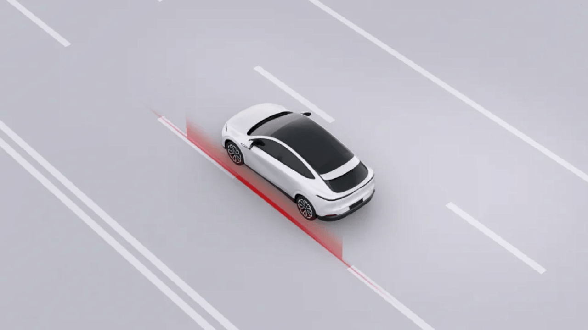

Seguridad activa

el vehículo se desvía del carril sin las
señales de giro correspondientes encendidas, el LDA
emitirá una advertencia a través de la interfaz SR y
un sonido de aviso, e intervendrá en el control del
volante para corregir y devolver el vehículo al
carril.

• Tanto los limpiaparabrisas como las luces intermitentes dobles
inhiben la activación de la función.

Operación

Configurar LSS

• ELK: Cuando la función ELK está activada y la
velocidad actual del vehículo es de 60~150 km/h y
el vehículo está a punto de chocar contra el bordillo,
vehículos que vienen de frente o vehículos que adelantan,
el ELK emitirá una advertencia a través de la
interfaz SR y un sonido de aviso, e intervendrá en el
control del volante para una
evasión de emergencia.

precaución

• Cuando las señales de giro están encendidas o el conductor
tiene una intención clara de girar (por ejemplo, girar el
volante rápidamente, frenar, acelerar
con el pedal del acelerador a fondo, encender
las luces de emergencia, etc.), la Asistencia de
Salida de Carril no alertará ni intervendrá
en la salida del carril.

En la pantalla de control central, vaya a la interfaz “ 
 →Asistencia al Conductor→Seguridad Activa”, y
podrá configurar el modo de asistencia y las condiciones
de activación de la Asistencia de Salida de Carril (LDA).

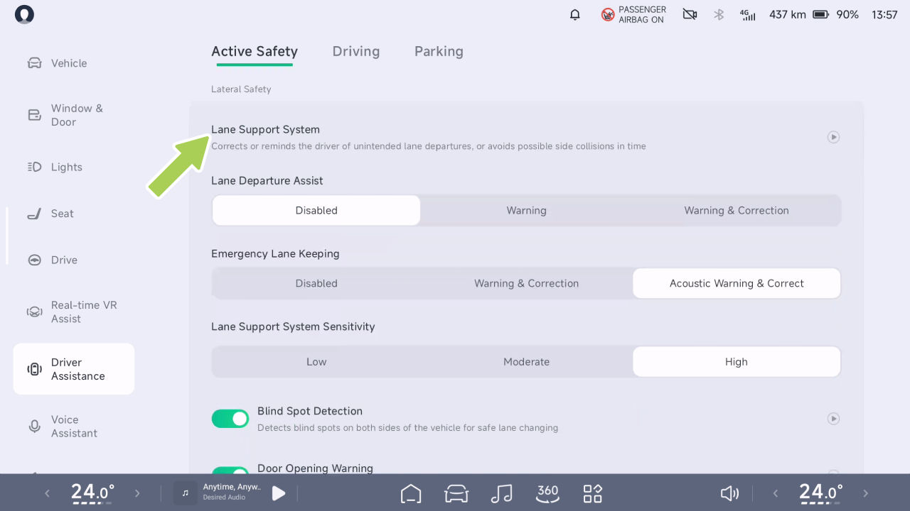

Seguridad activa

Si la Asistencia de Salida de Carril está configurada en Advertencia, solo
se activará el LDW; si está configurada en Advertencia
y Corrección, se activará el LDA.

• Oscuridad (mala iluminación) o mala visibilidad (debido a
lluvia intensa, nieve, niebla densa, etc.).

• Cuando una luz brillante, como la luz de los faros
de un vehículo que viene de frente o la luz solar directa, impide
que la cámara vea su campo de visión.

Si la función ELK se desactiva, se
activará nuevamente la próxima vez que el vehículo se
encienda.

Consejos

• Objetos o características del paisaje se proyectan
sobre la calzada formando grandes sombras.

Advertencias, Precauciones y Limitaciones

• La línea del carril no se pudo reconocer o
se identificó incorrectamente debido a causas de luz,
como luz intensa que provoca reflejos en las líneas del
carril, mal tiempo, mala visibilidad de
noche o falta de luz, etc.

advertencia

Condiciones de carretera especiales o tramos de carretera
complejos:

El LSS puede no funcionar en los siguientes escenarios:

Cámara restringida

• Cámara restringida

• Desgaste excesivo en las líneas del carril, superposición de marcas
antiguas y nuevas, ajustes temporales
o cambios rápidos debido a obras viales
(por ejemplo, bifurcación, cruce o fusión de carriles).

• Cuando la cámara está bloqueada (polvo, cubierta,
etc.).

• Cuando hay un vehículo delante que puede
obstruir la visión de la cámara.

Malas condiciones meteorológicas o de iluminación:

• Cuando hay un gran flujo de aire lateral o viento fuerte
en un lado del vehículo.

advertencia

El LSS puede presentar las siguientes condiciones:

Seguridad activa

• Advertencia previa o frenado sin riesgo de
colisión.

navegación, que se muestra en la interfaz SR. El TSR también emitirá una advertencia
cuando el vehículo exceda la velocidad.

The above warnings, cautions, and limitations... let me translate.

Las advertencias, precauciones y limitaciones
anteriores no cubren todas las condiciones que
pueden afectar el funcionamiento normal del LSS.

El TSR puede identificar el límite de velocidad a
partir de las señales de tránsito y de los sistemas
inteligentes de monitoreo de infracciones de
tránsito, y dar un aviso con diferentes íconos:

Aviso de límite de velocidad

Reconocimiento de Señales de Tránsito (TSR)

Introducción

Límite de velocidad en la señal de
límite de velocidad

Límite de velocidad del ojo
electrónico

Exceso del límite de velocidad en la
señal de límite de velocidad

Sin señal de límite de velocidad

El TSR puede identificar las señales de límite de
velocidad en la carretera y obtener la información
del límite de velocidad en función de

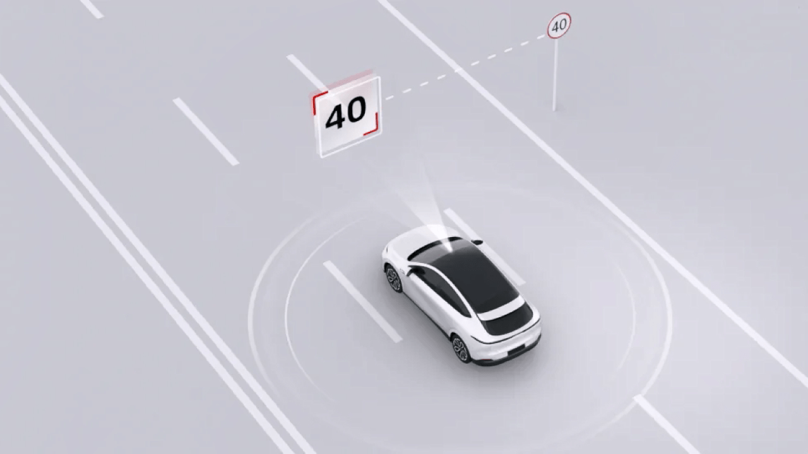

Seguridad activa

Consejos

Operación

Las señales que el TSR puede identificar incluyen:
identificación de límite de velocidad, identificación
de límite de velocidad variable, des-identificación
de límite de velocidad, identificación de límite de
velocidad por zona, señal de límite de velocidad
multicarril, señal de múltiples límites de velocidad,
señal de límite de velocidad de rampa de salida de
alta velocidad.

Alarma de exceso de velocidad

Cuando el TSR identifica un límite de velocidad de
la carretera:

• Durante la conducción manual o la conducción
asistida por ACC/LCC, si se excede el límite de
velocidad de la carretera, el ícono de límite de
velocidad en el tablero parpadeará y activará una
alerta sonora.

1.
Seleccione Asistente Inteligente de Límite de
Velocidad→Pantalla. Solo el ícono parpadea como
alarma.

advertencia

2. Seleccione Asistente Inteligente de Límite de
Velocidad→Alarma→Pitidos. El sonido de la alarma
se emitirá cada vez que cambie el límite de velocidad.

El TSR es solo una ayuda a la conducción y no
puede manejar todas las condiciones de tránsito,
clima y demás, y usted, como conductor de su
vehículo, es responsable de conducir de forma
segura. No confíe en esta función para controlar el
vehículo, ya que podría producirse lesiones o la
muerte.

3. Seleccione Asistente Inteligente de Límite de
Velocidad→Alarma→Sonido de Alarma. El sonido de
la alarma se emitirá cada vez que se exceda el límite
de velocidad.

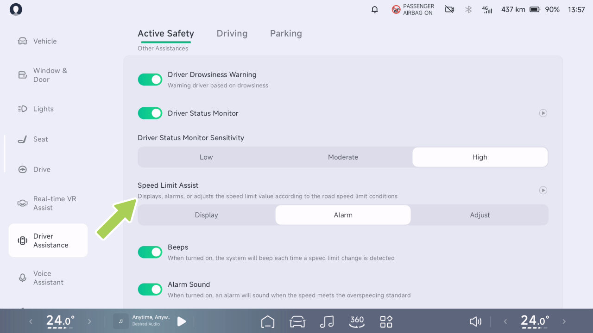

Seguridad activa

Advertencias, precauciones y limitaciones

Sistema de Asistencia de Velocidad (SAS)

En los siguientes escenarios, el TSR puede no
funcionar:

advertencia

Introducción

• Radar o cámara restringidos.

• Cuando las señales de carretera o de límite de
velocidad han cambiado recientemente.

• Cuando las señales de tránsito están en mal estado.

Las advertencias, precauciones y limitaciones
anteriores no cubren todas las condiciones que
pueden afectar el funcionamiento normal del TSR.

El SAS puede establecer la velocidad máxima de
crucero de forma sincronizada con el límite de
velocidad de la carretera identificado por el TSR.

El SAS es solo una ayuda a la conducción y no
puede manejar todas las condiciones de tránsito,
clima y carretera, y usted, como conductor de su
vehículo, es responsable de la seguridad en la
conducción. No confíe en esta función

advertencia

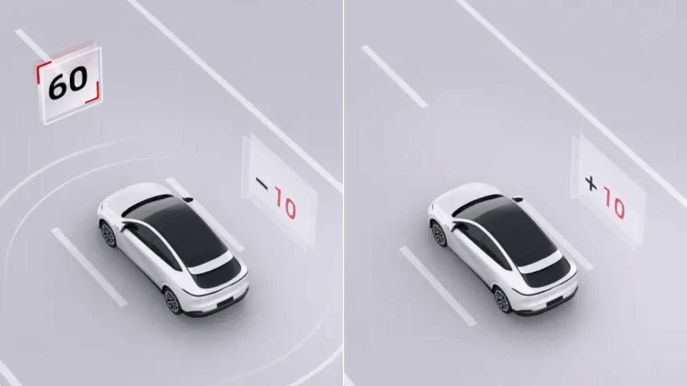

Seguridad activa

para controlar el vehículo, ya que podría producirse
lesiones o la muerte.

solo puede ejecutarse después de que el conductor
confirme cada cambio del límite de velocidad.

Operación

• Cuando selecciona Ajustar para Asistente de Límite
de Velocidad y desactiva Confirmar Antes de Ajustar
la Velocidad, y si el ACC/LCC está activado, el límite
de velocidad puede ejecutarse automáticamente sin
la confirmación del conductor en cada cambio de
límite de velocidad.

Opening and closing

Advertencias, precauciones y limitaciones

El SAS puede no funcionar plenamente o
proporcionar información imprecisa en las
siguientes condiciones:

warning

• Cámara obstruida.

• Cambios recientes en las carreteras o en los
límites de velocidad, como obras, normativas,
etc.

En la CID, ingresá a la interfaz “
 →Asistencia al Conductor→Seguridad
Activa”, donde podés configurar el modo de
asistencia del SAS.

• Señales de tránsito deficientes: rotas,
descoloridas, borrosas o no colocadas según
lo requerido.

• Cuando seleccionás Ajustar según Asistencia
de Límite de Velocidad y activás Confirmar
Antes de Ajustar la Velocidad, y si el ACC/LCC
está activado, el límite de velocidad

Las advertencias, precauciones y limitaciones
anteriores no abarcan todas las condiciones que
pueden afectar el funcionamiento normal del SAS.

Seguridad activa

Sistema de Monitoreo del Conductor (DMS)*

aumentará la sensibilidad del LDW y el FCW
para brindar al conductor más tiempo de reacción.

Introducción

Funcionamiento

Interruptor

Cuando el vehículo está en marcha, el DSM
monitorea el estado del conductor. Una vez que
el conductor muestra distracción o fatiga, el
sistema emite una advertencia.

En la CID, ingresá a la interfaz “
 →Asistencia al Conductor→Seguridad
Activa”, donde podés activar o desactivar el
DSM. El DSM ofrece sensibilidad alta, media y
baja, con un valor predeterminado medio al
momento de la entrega. Los usuarios pueden
ajustarla según sus preferencias de conducción.
El sistema recordará la selección de sensibilidad
del usuario.

Cuando el conductor experimenta fatiga o
distracción, el sistema proporciona recordatorios
mediante texto y sonido en el tablero de
instrumentos. Mientras el conductor está
fatigado o distraído, el sistema

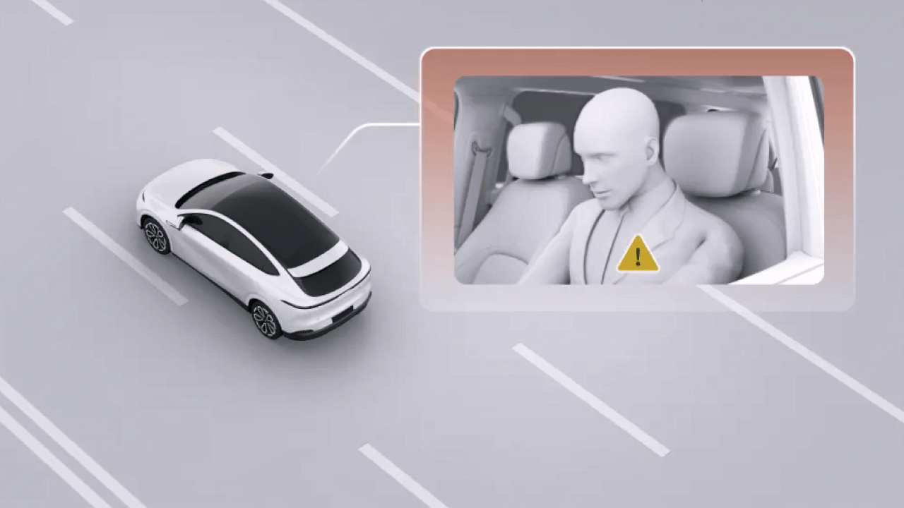

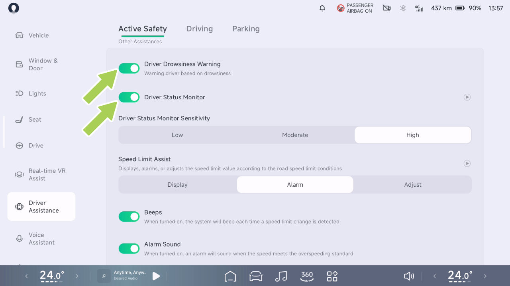

Seguridad activa

Consejos

• El DSM/DDW es una función auxiliar y no
debe depender de los recordatorios de fatiga
y distracción para hacer frente a todas las
situaciones; el conductor siempre debe
mantener el control del vehículo y la
visión del entorno vial.

El interruptor del DDW solo puede
desactivarse durante cada viaje, después de
que se haya activado la alarma.

Advertencia de Somnolencia del Conductor (DDW)

• Mantené la vista en la carretera y nunca
conduzcas cansado. Cuando el sistema
indique "Mantené la vista en la carretera",
pedile al conductor que ajuste su
comportamiento de conducción de inmediato
o que busque cuanto antes un lugar seguro o
una estación de servicio para detenerse y
descansar.

El DDW se utiliza para monitorear la
somnolencia del conductor. Cuando el conductor
se encuentra en estado de somnolencia, el
sistema emite una alarma para recordarle que se
concentre o tome otras medidas para aliviar la
somnolencia y evitar conducir somnoliento.

Cuando el DSM/DDW está en funcionamiento, la
cámara interior no almacena ni transmite datos
de privacidad personal como audio y video.

caution

El DSM/DDW no funciona en todas las
situaciones, y varios factores pueden provocar
que la función falle, como:

warning

warning

• Voltaje de alimentación alto o bajo;

• Cuando el DSM/DDW está desactivado, no se
podrá monitorear al conductor para detectar
fatiga o distracción ni advertirle que la
seguridad de conducción está comprometida;
desactívelo con precaución.

• Desconexión de la línea de hardware;

• Cámara interior bloqueada o defectuosa.

Las advertencias, precauciones y limitaciones
anteriores no cubren todas las condiciones que
podrían interferir con el sistema de advertencia
de fatiga del conductor, y

Seguridad activa

diversos factores pueden impedir que funcione
como se espera. Manténgase alerta y vigile
siempre las condiciones del camino.

