# Viajar con tranquilidad

Reassuring Travel → "Viaje con tranquilidad"

Viaje con tranquilidad

Qué hacer después de un accidente de tránsito

3. Saque el triángulo de advertencia del baúl
y colóquelo en una posición adecuada detrás del
vehículo.

Introducción

Si su vehículo presenta alguno de los siguientes
problemas, comuníquese con el Centro de Servicio
de Xpeng Motors:

Cuando un vehículo sufre daños graves en un
accidente, preste atención a las siguientes
advertencias para garantizar la seguridad personal:

• El vehículo se ve involucrado en accidentes como
colisión, daño por agua o roce de los bajos.

• Nunca toque el mazo de cables de alta tensión
ni ninguno de los componentes de alta tensión del
vehículo.

• El tablero muestra una alarma de falla grave
(como falla de la batería de potencia, sobrecalentamiento
de la batería de potencia, sobrecalentamiento del
motor y del controlador, falla del sistema eléctrico,
temperatura demasiado alta del puerto de carga, etc.).
Consulte la página 20.

• No entre en contacto con líquido que esté goteando.

• Nunca intente inspeccionar el vehículo usted mismo.

• Si es necesario remolcar el vehículo,
comuníquese con el Centro de Servicio de Xpeng Motors.

Cuando el vehículo se avería u ocurre un accidente,
para llamar la atención del vehículo que circula
detrás, utilice el dispositivo de emergencia.
Consulte la página 334 y siga los pasos a continuación:

• Si el vehículo ha estado sumergido en agua, no
lo vuelva a energizar, ya que esto puede provocar un
cortocircuito dentro de la batería de potencia. Para
garantizar la seguridad personal y evitar daños
secundarios al vehículo, comuníquese de inmediato con un
Centro de Servicio de Xpeng Motors para que inspeccione
el sistema de la batería de potencia y un profesional
evalúe los daños.

1.
Detenga el vehículo en un lugar seguro y encienda
las luces de advertencia de emergencia.

2. Saque del baúl y póngase su chaleco de seguridad.

148

Viaje con tranquilidad

• Si el vehículo comienza a emitir humo,
aléjese del vehículo de inmediato y
comuníquese con el Centro de Servicio de Xpeng Motors a la
brevedad.

Pautas de seguridad para el uso de los sistemas
de asistencia a la conducción

Limitaciones del radar y la cámara

• Si el vehículo se incendia, aléjese del
vehículo de inmediato y llame a la
policía a tiempo. Al llamar a la policía,
debe informar que el vehículo es un
vehículo eléctrico puro de nueva energía.

Consejos

Asegúrese de que las superficies del radar y la cámara estén
limpias y despejadas antes de usar la función de
asistencia a la conducción cada vez.

• Si el tablero muestra una falla del sistema
de la batería de potencia, debe detenerse de forma segura,
alejarse del vehículo y comunicarse con el Centro de Servicio de Xpeng
Motors para su atención.

Las siguientes condiciones pueden hacer que el radar o
la cámara no reconozcan el objetivo, lo reconozcan con retraso
o lo identifiquen de forma incorrecta:

advertencia

• Si alguien en el vehículo resulta herido, debe
comunicarse con los servicios de emergencia según la
gravedad de la lesión.

• El radar o la cámara está obstruido o sucio,
por ejemplo, por nieve, escarcha, lluvia, objetos
extraños como agua, suciedad, etc. adheridos.

• Si el vehículo se ve involucrado en un
accidente como un raspón o una colisión, la
estructura interna de la batería de potencia
puede dañarse, lo que representa un grave
peligro para la seguridad. Debe contactar de
inmediato al Centro de Servicio de Xpeng
Motors para inspeccionar el sistema de la
batería de potencia y que un profesional
evalúe el daño.

• Radar, cámara o componente asociado
defectuoso.

• Baches en el camino u otras causas que hacen
que el vehículo se balancee.

• Clima severo, como lluvia, nieve, niebla, etc.

149

Viaje Tranquilo

• Hay interferencia de fuentes acústicas de la
misma frecuencia alrededor del vehículo.

• Entornos oscuros como la noche, el amanecer,
el atardecer, túneles, etc.

• Objetos en las cercanías del vehículo que
pueden hacer que el sonido se refleje de forma
incorrecta.

advertencia

• El objetivo detectado por el radar está
cubierto de sustancias que absorben las
ondas sonoras, como copos de nieve,
espumas, objetos de algodón, etc.

Los siguientes objetivos de radar/cámaras no
se reconocen:

• Vehículos especiales, como vehículos con la
parte trasera cubierta, vehículos dañados o
vehículos de forma irregular.

• El objeto detectado es demasiado pequeño.

• En casos excepcionales poco frecuentes,
pueden producirse falsas alarmas en algunas
barreras metálicas, franjas verdes, muros de
cemento, etc.

• Cuando se encuentre con animales, semáforos,
muros y otros obstáculos desconocidos en su
trayecto.

• Algunas barreras metálicas, franjas verdes,
muros de cemento, etc.

• Cuando cambia el brillo ambiental, como al
entrar o salir de un túnel.

• Instalaciones de prueba de carretera, conos,
amortiguadores de impacto, trípodes, placas
pequeñas de construcción, etc.

• Grandes sombras proyectadas por edificios,
paisajes o vehículos grandes.

• El vehículo ha chocado y la posición de
montaje del radar o la cámara ha cambiado.

• Obstáculos estáticos, como conos de tránsito,
tambores, columnas de tránsito, triángulo de
advertencia u otro bloqueo de carretera).

• Luz intensa, como faros de vehículos que se
aproximan o luz solar directa.

• Objetos estáticos, como una barredora lenta o
detenida, un camión de accidente volcado,
piedras grandes,

150

Viaje Tranquilo

Trípodes, franjas de separación, peatones
cruzando la calle, etc.

• Integridad del registro de datos del evento.

• Intervalo de tiempo entre este evento y el
evento anterior.

Registrador de Datos de Eventos (EDR)

Introducción

• Número de hardware de la ECU para registrar
los datos del EDR.

• Número de serie de la ECU para registrar los
datos del EDR.

El vehículo está equipado con un registrador de
datos de eventos (EDR).

• Número de software de la ECU para registrar
los datos del EDR.

• Aceleración lateral.

El EDR puede registrar automáticamente la
información del funcionamiento del vehículo y
del estado del sistema de seguridad del vehículo
dentro de un período de tiempo antes y después
de la ocurrencia de eventos del vehículo, tales
como:

• Velocidad de guiñada.

• Ángulo de dirección.

• Marcha.

• Velocidad del vehículo.

• Posición del pedal de freno.

• Estado del sistema de estacionamiento.

• Estado del pedal de freno.

• Tiempo de despliegue del airbag.

• Aceleración longitudinal.

• Estado del cinturón de seguridad del conductor.

• Tiempo de despliegue del pretensor del
cinturón de seguridad.

• Estado del cinturón de seguridad del pasajero
delantero.

• Posición del pedal del acelerador, porcentaje de
la posición de apertura total.

• Estado de alarma del sistema de protección de
ocupantes.

• Estado de alarma del sistema de monitoreo de
presión de neumáticos.

• Período de encendido durante el evento.

• Estado de alarma del sistema de frenos.

• Período de encendido al momento de la lectura.

• Estado del sistema de control de crucero.

151

Viaje con Tranquilidad

• Estado del sistema antibloqueo de frenos.

• Estado del sistema AEB.

• es necesario cumplir con los requisitos de las
autoridades administrativas y judiciales.

• Estado del sistema ESC.

• es necesario observar las leyes y los reglamentos.

• Estado del sistema de control de tracción.

• Período de sincronización temporal previo al evento.

Cinturón de seguridad

Mediante la recopilación y el análisis de los datos
del estado del vehículo registrados por el EDR, es
útil para comprender la situación relevante antes y
después del evento.

Importancia de Usar el Cinturón de Seguridad

Los cinturones de seguridad sirven para sujetar al
conductor y a los pasajeros en posiciones
determinadas y prevenir una colisión.

Los datos registrados por el EDR deben
extraerse conectando un equipo de diagnóstico
especial al puerto OBD del vehículo. Si es
necesario, comuníquese con el Centro de Servicio
de XPENG para obtener el equipo.

En caso de colisión, usar correctamente los
cinturones de seguridad puede ayudar a otros
sistemas de seguridad a absorber la energía
generada por el impacto, reducir la inercia del
movimiento hacia adelante del conductor y los
pasajeros, permitirles obtener la mejor protección
del SRS y minimizar las lesiones causadas por el
impacto.

Declaración sobre el uso de los datos

XPENG puede utilizar los datos registrados por el
EDR para diagnóstico de fallas, investigación y
desarrollo de productos y mejora de la calidad.
XPENG no divulgará los datos registrados por el
EDR a un tercero, salvo que:

advertencia

En caso de accidente, depender únicamente de
una bolsa de aire es peligroso. Sin la protección
del cinturón de seguridad, al golpear directamente
la bolsa de aire que se infla explosivamente,

• lo acuerde el propietario.

152

Viaje con Tranquilidad

el movimiento inmediato hacia adelante del
cuerpo y la rápida expansión de la bolsa de aire
causarán daños más graves en la cabeza y el
pecho.

Uso Correcto del Cinturón de Seguridad

Que la postura sentada del conductor sea correcta
afecta directamente el grado de fatiga y la
seguridad de conducción del conductor.

Postura de conducción correcta

advertencia

Los ocupantes deben usar los cinturones de
seguridad correctamente; de lo contrario, los
ocupantes no solo se perjudicarán a sí mismos
sino que también pondrán en peligro a los demás
ocupantes del vehículo cuando ocurra un
accidente.

Para reducir el riesgo de víctimas en accidentes,
los conductores deben hacer lo siguiente:

1.
Siéntese erguido con ambos pies en el piso.

2. Asegúrese de que sus pies puedan pisar
fácilmente los pedales. Flexione ligeramente los
brazos al sujetar el volante y mantenga el pecho
a una distancia de al menos 25 cm del centro del
volante.

Es responsabilidad del conductor asegurarse de
que todos los ocupantes tengan el cinturón
correctamente abrochado, desactivando con
cuidado el recordatorio de cinturón de seguridad
trasero sin abrochar cuando lo indique la pantalla
de control central.

advertencia

3. La sección central del cinturón de seguridad
debe colocarse entre el cuello y los hombros, y la
sección del regazo del cinturón de seguridad debe
quedar ajustada alrededor de la articulación de la
cadera (no del abdomen).

En caso de una colisión frontal o lateral grave,
el pretensor funcionará simultáneamente

Pretensor del cinturón de seguridad

153

Viaje tranquilo

con el airbag. El pretensor tensa automáticamente
el cinturón de seguridad, reduciendo la holgura en
las partes abdominal y diagonal del cinturón,
disminuyendo así la inclinación del conductor hacia
adelante.

reemplazarse si es necesario. Una vez activado, el
pretensor del cinturón de seguridad debe
reemplazarse.

Revise el cinturón de seguridad

Cada cinturón de seguridad debe someterse a las
siguientes cuatro inspecciones simples para
confirmar que funciona correctamente:

1.
Verifique si el cinturón de seguridad, la hebilla
y otros dispositivos están dañados, modificados,
descoloridos, manchados o muy sucios.

2. Abroche el cinturón de seguridad y tire
rápidamente del cinturón en una posición lo más
cercana posible a la hebilla. En ese momento la
hebilla debe quedar bloqueada de forma segura.

Si el pretensor y el airbag no se activan durante
una colisión, no significa que tengan una falla.
Generalmente significa que la intensidad o el tipo de
colisión es insuficiente para activarlos.

3. Desabroche el cinturón de seguridad y retraiga
el cinturón hasta el máximo. Verifique si el
cinturón extraído tiene holgura excesiva y
compruebe su estado de desgaste.

4. Extraiga parcialmente el cinturón de seguridad,
sujete la lengüeta de bloqueo y tire de ella
rápidamente hacia adelante. Entonces los
cinturones de seguridad se bloquearán
automáticamente

Después de un accidente, los airbags y otros
componentes relacionados deben inspeccionarse y

advertencia

154

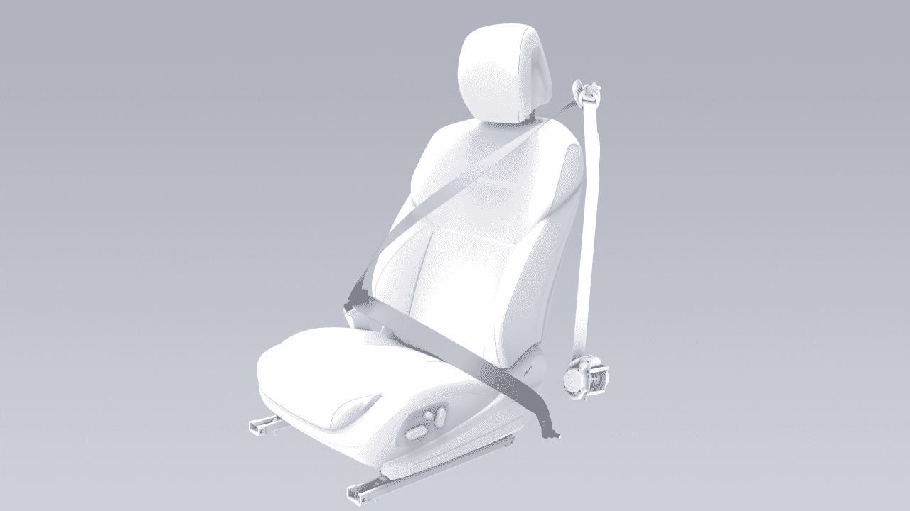

Viaje tranquilo

mediante el mecanismo de bloqueo interno para
evitar el desenrollado excesivo de los cinturones de
seguridad.

3. Tire del cinturón de seguridad con fuerza para
verificar si la guía está bloqueada de forma
segura.

Si algún cinturón de seguridad no pasa alguna de las
pruebas anteriores, comuníquese de inmediato con el
Centro de Servicio XPENG.

advertencia

No ajuste la altura del cinturón de seguridad
mientras el vehículo esté en movimiento.

Ajuste la altura del cinturón de seguridad delantero

Abrochar el cinturón de seguridad

1.
Pellizque la guía en la dirección de la flecha y
muévala hacia arriba y hacia abajo para ajustar
el cinturón del hombro a una altura adecuada.

1.
Extraiga los cinturones de seguridad lentamente,
haga que los cinturones rodeen de manera
uniforme toda la pelvis, el pecho y la clavícula
para mantenerlos entre el cuello y el hombro.

2. Suelte la guía del cinturón del hombro.

155

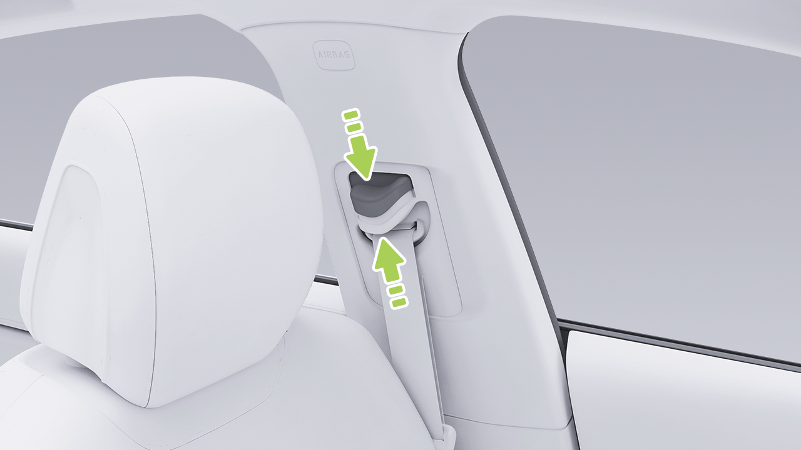

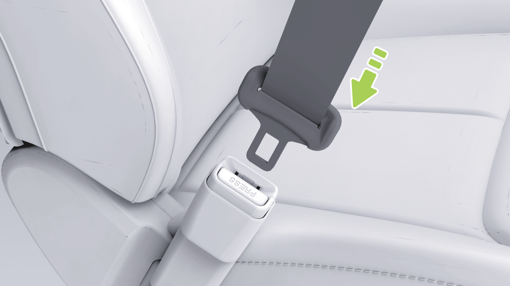

Viaje tranquilo

2. Inserte la lengüeta de bloqueo del cinturón de
seguridad en las hebillas del cinturón hasta que
haga “clic” para asegurar que la lengüeta de
bloqueo quede fijada en su lugar.

3. Continúe sujetando la lengüeta de bloqueo del
cinturón de seguridad y asegúrese de que el
cinturón se retraiga lentamente.

3. Tire de los cinturones de seguridad con fuerza
para comprobar si están abrochados.

4. Tense los cinturones de seguridad hacia el
carrete para eliminar cualquier holgura
inesperada.

Las lesiones a la futura madre y a su feto en caso
de una colisión o frenado repentino pueden
reducirse eficazmente con el uso adecuado de los
cinturones de seguridad.

Uso del cinturón de seguridad por la futura madre

Desabrochar el cinturón de seguridad

1.
Sujete la lengüeta de bloqueo del cinturón de
seguridad.

2. Presione el botón de desbloqueo en la hebilla
del cinturón de seguridad.

The hip/shoulder type seat belt should be worn correctly... let me translate.

El cinturón de seguridad de tipo cadera/hombro debe
ser usado correctamente por la mujer embarazada. El
cinturón del hombro debe pasar por el pecho desde una

156

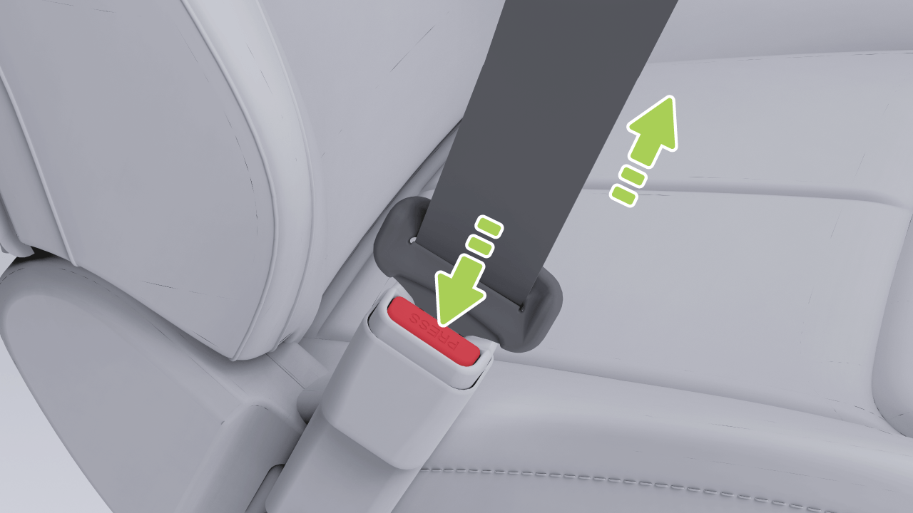

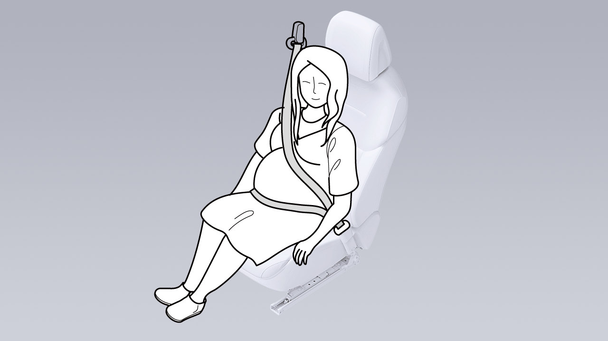

Viaje Tranquilo

posición adecuada, y el cinturón de la cadera debe pasar
por la entrepierna lo más bajo posible y ajustarse
debajo del abdomen elevado. El cinturón de seguridad
debe quedar plano para no comprimir la parte inferior del
cuerpo de la mujer embarazada.

Si el pasajero delantero no se abrocha el cinturón de
seguridad, el indicador del cinturón de seguridad en el
tablero parpadeará durante varios segundos antes de
quedar encendido de forma fija cuando el vehículo está
detenido. Si el vehículo está en movimiento y alcanza
cierta velocidad, el indicador del cinturón de seguridad se
encenderá, aparecerá un mensaje de advertencia y sonará
una alarma.

Consulte a un médico para obtener mejores recomendaciones.

Uso del cinturón de seguridad por personas con discapacidad

Si un pasajero del asiento trasero no se abrocha el cinturón
de seguridad, el indicador correspondiente del cinturón de
seguridad en el tablero parpadeará durante varios segundos
y luego permanecerá encendido.

El cinturón de seguridad también debe ser usado
correctamente por las personas con discapacidad.

Consulte a un médico para obtener mejores recomendaciones.

Indicador del cinturón de seguridad

Si todos los ocupantes se han abrochado los cinturones
de seguridad y el indicador sigue encendido, vuelva a
abrochar todos los cinturones de seguridad para asegurarse
de que estén correctamente bloqueados.

1.
 Indicador de cinturón de seguridad del conductor sin abrochar

2.
 Indicador de cinturón de seguridad del pasajero delantero
sin abrochar

3.
 Indicador de cinturón de seguridad trasero izquierdo sin abrochar

Limpieza del Cinturón de Seguridad

4.
 Indicador de cinturón de seguridad trasero central sin
abrochar

Saque el cinturón de seguridad y límpielo. Después de
limpiarlo, déjelo secar al aire antes de retraerlo.

5.
 Indicador de cinturón de seguridad trasero derecho sin abrochar

157

Viaje Tranquilo

precaución

la parte del cinturón de seguridad debe pasar
alrededor de la mitad del hombro del pasajero, y debe
quedar pegada a la parte superior del cuerpo del
pasajero y estar ajustada. El cinturón de seguridad a la
altura de la cintura debe quedar lo más bajo posible y
cruzar las caderas. Si es necesario, tire ligeramente del
cinturón de seguridad hacia abajo. El cinturón de
seguridad se puede ajustar tirando de él en la dirección
de retracción.

No use ningún tipo de limpiador ni limpiador químico
para limpiar la superficie del cinturón de seguridad.

Reemplazo del Cinturón de Seguridad

Si hay algún signo de desgaste, grietas u otros daños en
el cinturón de seguridad, comuníquese con el Centro de
Servicio de XPENG para reemplazarlo. No reemplace el
cinturón de seguridad sin autorización.

• Cada cinturón de seguridad es solo para uso de un
pasajero o conductor en el vehículo. No sostenga a un
niño en su regazo ni comparta el cinturón de seguridad
con él.

Advertencias, Precauciones y Limitaciones

• Todos los pasajeros, incluido el conductor, deben usar
correctamente los cinturones de seguridad cuando el
vehículo está en marcha. No hacerlo puede aumentar
fácilmente el riesgo de lesiones o muerte en caso de un
accidente.

• El cinturón de seguridad no debe verse afectado
por productos químicos, líquidos u otras
sustancias. Si el cinturón de seguridad no se
puede retraer o no se puede destrabar en la
hebilla, comuníquese de inmediato con el Centro
de Servicio XPENG para su mantenimiento.

• Nunca presione el cinturón de seguridad contra
objetos frágiles o filosos (como bolígrafos, llaves
y anteojos). La presión que ejerce el cinturón de
seguridad sobre dichos objetos puede causar
lesiones.

• Nunca agregue elementos adicionales no
oficiales en el cinturón de seguridad sin
autorización, incluidos, entre otros, los
siguientes: placa de cierre adicional, tope de
correa y junta de extensión de la hebilla. Estos
elementos pueden reducir o incluso desactivar la
función de protección normal de los cinturones
de seguridad.

• El cinturón de seguridad debe ajustarse
estrechamente al cuerpo y no debe estar
torcido cuando se utiliza. El hombro

158

Viaje tranquilo

• El cinturón de seguridad debe retraerse
por completo sin quedar colgando cuando no
se utiliza. Si el cinturón de seguridad no se
puede retraer por completo, comuníquese de
inmediato con el Centro de Servicio XPENG para
su mantenimiento.

1.
Airbags de cortina delanteros y traseros

2. Airbag lateral del asiento del pasajero
delantero

3. Airbag del pasajero delantero

• Los cinturones de seguridad, el retractor del
cinturón de seguridad y el dispositivo de fijación
del cinturón de seguridad no deben retirarse,
instalarse, modificarse ni desmontarse sin
autorización.

4. Airbag del conductor

5. Airbag del lado lejano del asiento del
conductor

6. Airbag lateral del asiento del conductor

Airbag

Los airbags no reemplazan a los cinturones de
seguridad. El cinturón de seguridad reduce el
riesgo de lesiones graves o muerte en caso de
accidente, ya sea que el airbag se active o no,
por lo que el cinturón de seguridad debe usarse
correctamente. Los airbags solo protegen cuando
se activan, y no todos los tipos de accidentes
activan los airbags.

advertencia

Posición del airbag

Luz indicadora de falla del airbag

Una vez que el vehículo se enciende, el indicador
“ 
 ” del tablero se iluminará durante varios
segundos y luego se apagará después de que el
sistema complete su autodiagnóstico. Si el indicador
no se apaga después del autodiagnóstico del sistema

159

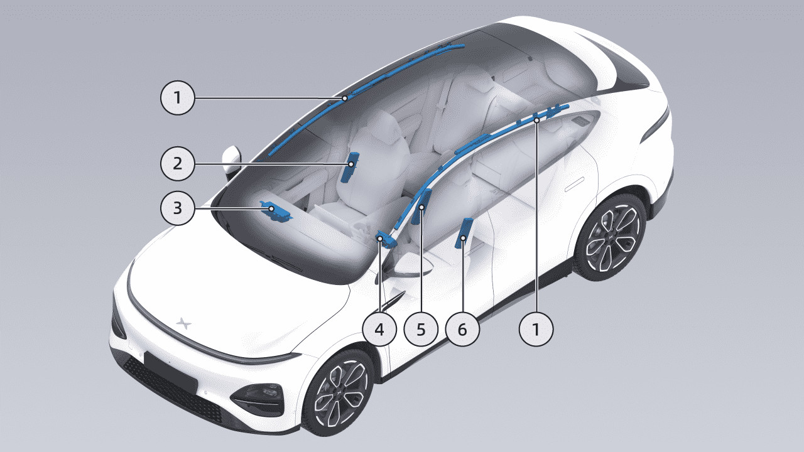

Viaje tranquilo

o se vuelve a encender después de apagarse o
permanece encendido, indica una falla en el SRS.
Comuníquese de inmediato con el Centro de
Servicio XPENG para su mantenimiento.

• El vehículo golpea un bordillo u otros objetos
salientes.

• El extremo delantero del vehículo golpea el
suelo cuando el vehículo desciende una pendiente; o

Condiciones y situaciones para el
despliegue

El SRS puede no desplegarse en las siguientes
situaciones:

Que el SRS se despliegue no depende de la
velocidad del vehículo cuando ocurre un accidente,
sino que depende de la fuerza del impacto
captada por el sensor de colisión cuando ocurre
un accidente. Cuando la fuerza de impacto de
una colisión es absorbida o dispersada por la
carrocería, es posible que el SRS no se despliegue.
Sin embargo, según las diferentes condiciones de
impacto durante un accidente, el SRS también
puede desplegarse en ocasiones. Por lo tanto, que
el SRS se despliegue no depende del grado de
daño del vehículo.

• El vehículo golpea una columna de hormigón,
un árbol o cualquier otro objeto largo y delgado.

• El vehículo golpea la parte inferior trasera de un
vehículo grande, como un camión.

• El vehículo sufre una colisión trasera con
otro vehículo.

• El vehículo vuelca o se inclina hacia un costado.

• El vehículo golpea una pared u otro vehículo en
posiciones distintas a la parte delantera.

El airbag desplegado y el cinturón de seguridad pueden
brindar protección a los ocupantes, incluidos los
conductores, para reducir el riesgo de lesiones.

El SRS puede desplegarse en las siguientes situaciones:

• La parte delantera del vehículo golpea el suelo al
pasar sobre un surco profundo.

160

Viaje con tranquilidad

Impacto después del despliegue

• Después de un accidente, incluso si el SRS no
se activa, el SRS y sus sistemas relacionados
también pueden presentar una falla. Comuníquese
con el Centro de Servicio XPENG para su mantenimiento.

En el momento del despliegue del SRS, se escuchará un
sonido fuerte junto con la liberación de gas y polvo.
Dicho polvo puede irritar la piel y los ojos. En ese
momento, siempre que sea seguro, salga del vehículo
lo antes posible. Si no es posible hacerlo, abra la
ventana o la puerta e inhale aire fresco.

• El Centro de Servicio XPENG cuenta con
herramientas especializadas, dispositivo OBD,
información de reparación y técnicos profesionales
calificados. La reparación y modificación del vehículo
deben ser realizadas por el Centro de Servicio XPENG.

Si el polvo generado por el despliegue del SRS entra
en los ojos o se adhiere a la piel, enjuague abundantemente con
agua limpia lo antes posible. En caso de molestia
grave, busque atención médica a tiempo.

• No utilice los componentes del SRS retirados
de vehículos desguazados ni componentes del SRS
reciclados.

Después de que el SRS se despliega, su volumen se reducirá
para brindar un efecto de absorción de impactos progresivo
al conductor y a los pasajeros, a fin de asegurar que la
visión frontal del conductor no quede bloqueada.

• No coloque ningún objeto dentro del rango de
inflado del SRS del asiento del conductor/pasajero
delantero, para evitar obstaculizar el inflado del SRS
en caso de colisión frontal.

• El pasajero delantero no debe sostener niños,
mascotas u objetos en sus brazos ocupando el
espacio de inflado del SRS. Esto es obligatorio tanto
para adultos como para niños.

• El SRS solo puede activarse una vez. Comuníquese
con el Centro de Servicio XPENG para el reemplazo
del SRS activado y de cualquier componente del sistema
afectado lo antes posible.

Advertencias, precauciones y limitaciones

• No fije ningún objeto (como un dispositivo de
navegación portátil) al parabrisas delantero
por encima del SRS del asiento del pasajero delantero.

161

Viaje con tranquilidad

• No cubra ni pegue ningún objeto (como
un soporte para teléfono o adornos) sobre la
superficie de identificación del volante o los
componentes del SRS del lado del pasajero delantero, ni
realice ninguna modificación en las piezas mencionadas.

• No cargue ni coloque ningún objeto por encima o cerca
del SRS del asiento del conductor/pasajero delantero, en el
costado del asiento delantero, por encima del techo en el
costado del vehículo, ni en cualquier otra cubierta de airbag
que pueda interferir con el despliegue del SRS. Estos
artículos pueden causar lesiones graves cuando el SRS se
despliega debido a una colisión violenta.

• No apile objetos sobre el asiento del
acompañante. En caso de frenado de emergencia, una vez que el
airbag se despliega, los objetos pueden salir despedidos y
lesionar al conductor y a los pasajeros.

• No use fundas para los asientos. De lo contrario, el
despliegue del SRS lateral de la primera fila se verá
restringido en caso de accidente y también se reducirá la
precisión de detección del sistema.

• No intente modificar los componentes, los
circuitos ni el software del SRS. De lo contrario, el SRS podría
no funcionar normalmente y no brindar la protección necesaria
para el conductor y los pasajeros,
o podría no desplegarse o desplegarse
accidentalmente en caso de accidente, aumentando
el riesgo de lesiones.

• No modifique la cubierta del airbag ni agregue piezas
cerca de ella. Los pasajeros no deben apoyar la cabeza
en las puertas. De lo contrario, cuando el
airbag de cortina se despliega, podría causar lesiones.

• No se permite que los pasajeros coloquen los pies,
las rodillas ni ninguna otra parte del cuerpo encima o
cerca del SRS, para evitar obstruir el funcionamiento
normal del SRS o causar fracturas u
otras lesiones durante el despliegue del SRS.

Niños como pasajeros

Introducción

Para garantizar la seguridad de los niños, utilice
asientos de seguridad para niños adecuados según su edad,
peso y altura. Siga estrictamente las

162

Viaje tranquilo

instrucciones proporcionadas por el fabricante del
asiento de seguridad para niños.

Etiqueta de uso del asiento de seguridad para niños

Niño mayor en el vehículo

Si los niños son demasiado grandes para usar asientos de seguridad para niños,
pero demasiado pequeños para usar de forma segura los cinturones de seguridad estándar,
se puede comprar y usar correctamente un
cojín elevador para niños que cumpla con las regulaciones o normas
pertinentes. El cojín elevador para niños puede
usarse para elevar al niño, de modo que el cinturón de hombro
del cinturón de seguridad cruce justo por el medio del
hombro y el cinturón de seguridad baje hasta la entrepierna.

advertencia

No coloque un asiento para niños orientado hacia atrás en
un asiento protegido por airbag, ya que esto podría causar
la muerte o lesiones graves a un niño sentado en él.

163

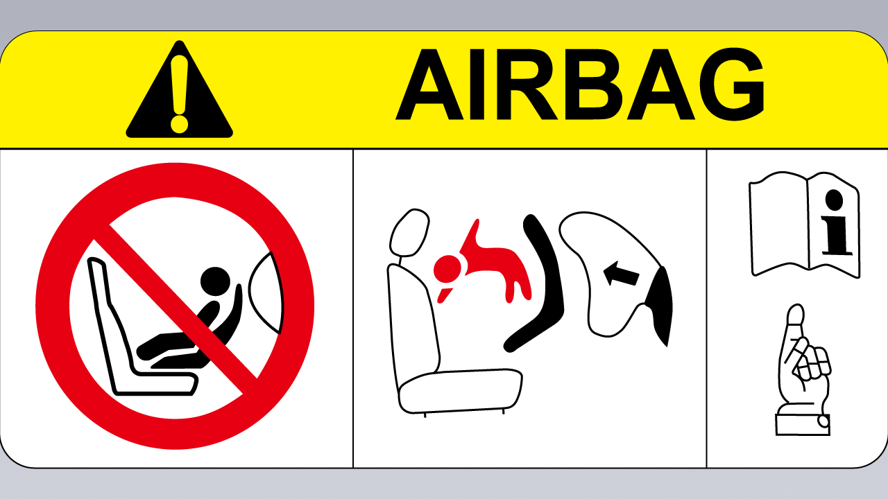

Viaje tranquilo

Desactivación del airbag del acompañante

2. En la pantalla de control central, vaya a la interfaz “

→Conducción”, donde podrá deslizar hacia abajo y
tocar el interruptor del airbag del acompañante.

• No coloque un asiento para niños orientado hacia atrás en
el asiento con un airbag frontal activo. Puede ocurrir
la muerte o lesiones graves al niño sentado en él.

advertencia

• Asegúrese de seleccionar un asiento de seguridad para niños
adecuado para el niño según su edad,
altura y peso.

1.
Indicador de estado del airbag del acompañante

2. Airbag del acompañante activado

• Un asiento para niños es solo para un niño. Nunca
sujete a varios niños en un mismo asiento para niños
con el cinturón de seguridad.

3. Airbag del acompañante desactivado

4. Interruptor del airbag del acompañante

El airbag del acompañante está activado de forma predeterminada y
puede desactivarse/activarse de las dos maneras siguientes:

• Bajo ninguna circunstancia se debe llevar a un niño o
bebé en brazos del ocupante
durante la conducción.

• Nunca deje a un niño sin supervisión en el asiento
para niños.

1.
Toque el indicador de estado del airbag del acompañante
en la barra de estado y luego vaya a la
interfaz de configuración del interruptor.

• Nunca deje a los niños sin protección en un
vehículo. Mantenga siempre a los niños en la

164

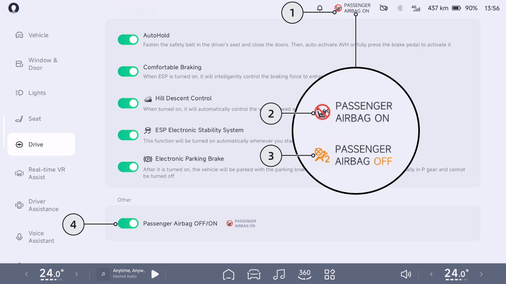

Viaje Tranquilizador

posición de asiento correcta durante la conducción. Nunca se
pare en el vehículo ni se arrodille sobre el asiento. Si
ocurre un accidente en estas circunstancias,
podría ser fatal para los niños y para los demás.

• Todo asiento infantil que haya recibido fuerzas
en un accidente debe ser reemplazado.

Tipos Recomendados de Asientos Infantiles*
Tanto la norma ECE-R44 como la ECE-R129 se aplican a los asientos infantiles en el país donde se encuentra el usuario.

La clasificación ECE-R129 se basa en la estatura del niño.

Estatura del niño
Fabricante
Tipo
Accesorio

40 cm-105 cm
Dorel Europe
Maxi-Cosi Pearl 360 &
Base FamilyFix 360
ISOFIX+Pata de Apoyo

100 cm-150 cm
Britax Romer
Kidfix i-Size*
ISOFIX+Cinturón

61 cm-105 cm
HTS BeSafe
iZi Kid X3 i-Size
ISOFIX+Pata de Apoyo

*. Para la mejor protección, se recomienda usar este sistema de retención infantil con el
respaldo incluido y asegurarse de pasar el cinturón de seguridad a través de Secure Guard y XP-pad.

La clasificación ECE-R44 se basa en el peso del niño.

Peso del niño
Fabricante
Tipo
Accesorio

22 kg-36 kg
Graco
Booster Basic
Cinturón

165

Viaje Tranquilizador

Solo se puede utilizar en el vehículo un asiento infantil que cumpla con la normativa.

Posición de asiento

posición
de asiento
delantero izquierdo
delantero
central

2ª fila
derecha②
con airbag
del pasajero
delantero
activado

delantero derecho ①

2ª
fila
izquierda
②

2ª
fila
central②

con airbag
del pasajero
delantero
desactivado

Posición
de asiento
apta para
cinturón
universal(sí
/no)

Sí
Solo
orientado
hacia
adelante

No
No

Sí
Sí
Sí
Sí

Posición
de asiento
I-Size(sí
/no)

No
No
No
No
Sí
No
Sí

166

Viaje Tranquilizador

Posición
de asiento
apta para
fijación
lateral(L1/
L2)

No
No
No
No
No
No
No

Fijación
orientada
hacia atrás
más grande
apta(R1/
R2X/R2/R
3)

R1/
R2X
/R2
/R3

No
No
No
No

No
R1/R2X/R2/R
3

Fijación
orientada
hacia
adelante
más grande
apta(F1/
F2X/F2/F
3)

F1/
F2X
/F2
/F3

No
No
No
No

No
F1/F2X/F2/F3

167

Viaje Tranquilizador

Fijación
de elevador
más grande
apta(B2/
B3)

No
No
(B2/B3)*
(B2/B3)*
B2/
B3

(B2/
B3)*
B2/B3

• *Solo aplicable para instalación con cinturón de seguridad.

• Durante la instalación del SRI, el ángulo del respaldo de los asientos debe ajustarse adecuadamente para
asegurar que el SRI permanezca estable.

• Durante la instalación del SRI, la altura del reposacabezas debe ajustarse adecuadamente o el
reposacabezas debe retirarse para evitar interferencias con el SRI. No retire el reposacabezas
cuando utilice un cojín elevador sin respaldo.

• ①: Al instalar un SRI en el asiento del pasajero delantero, ajuste el asiento del pasajero delantero lo más alto
posible para instalar de forma segura el SRI.

• ②: Al instalar un SRI en el asiento de la 2ª fila, los asientos delanteros pueden ajustarse hacia adelante/atrás y en
altura, y el ángulo del respaldo también puede ajustarse para asegurar que no haya interacción con el
SRI/niño.

168

Viaje Tranquilizador

Instalación del Asiento de Seguridad Infantil

3. Si el asiento de seguridad infantil tiene un anillo de fijación
superior, sujételo al respaldo.

Asegure el asiento de seguridad para niños con el cinturón de seguridad

Instalación del asiento de seguridad para niños mediante anclaje ISOFIX

1.
Coloque el asiento de seguridad para niños en
el asiento exterior trasero del acompañante, luego
tire del cinturón de seguridad hasta sacarlo por
completo. Asegure y abroche el cinturón de seguridad
según las instrucciones del fabricante del asiento de
seguridad para niños.

Los puntos de anclaje ISOFIX están ubicados
entre el respaldo y el cojín del asiento a ambos
lados del asiento trasero, cada uno marcado con el
logotipo ISOFIX en la parte superior.

2. Deje que el cinturón de seguridad se retraiga,
empuje firmemente el asiento de seguridad para niños
contra el asiento del vehículo y, al mismo tiempo,
tense el cinturón de seguridad que quedó flojo.

169

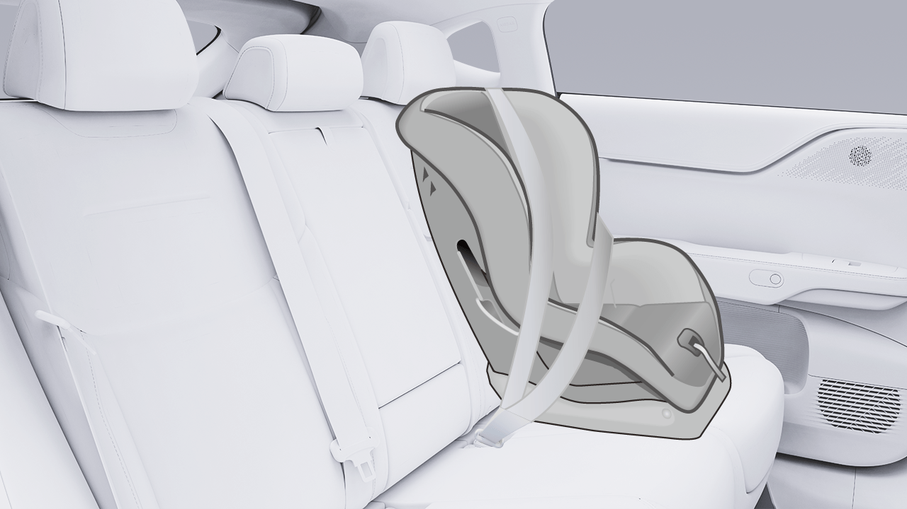

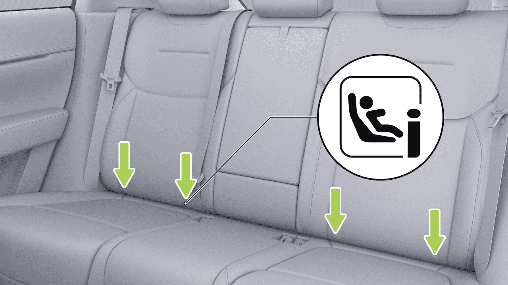

Viaje Tranquilo

Los puntos de anclaje superiores están ubicados
detrás de los respaldos de los asientos traseros.

1.
Coloque el asiento de seguridad para niños en el
asiento exterior trasero del acompañante.

170

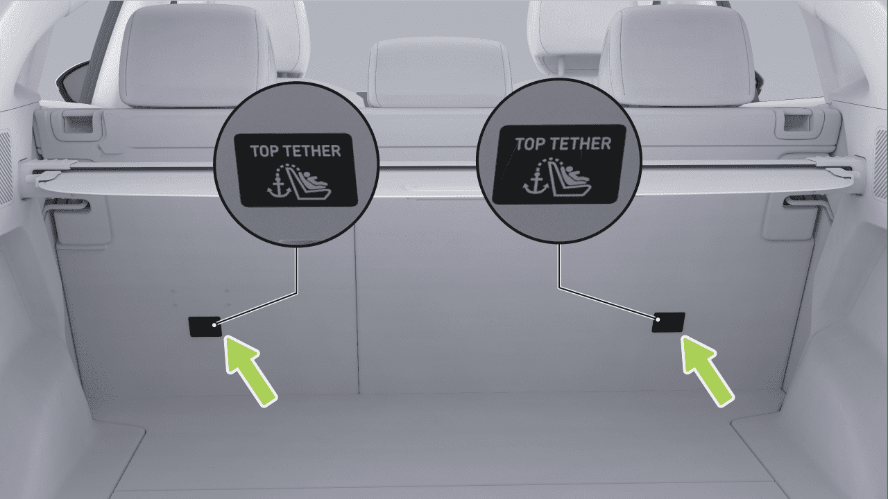

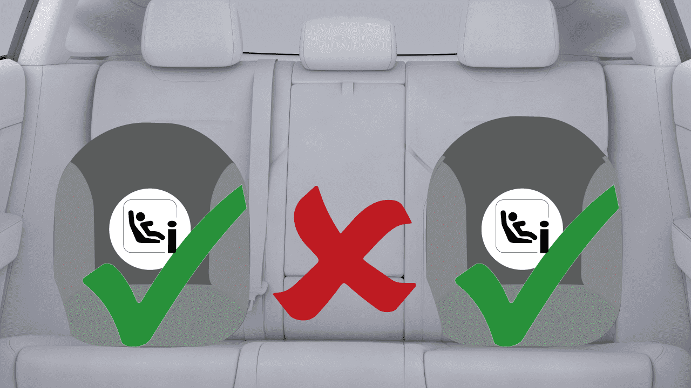

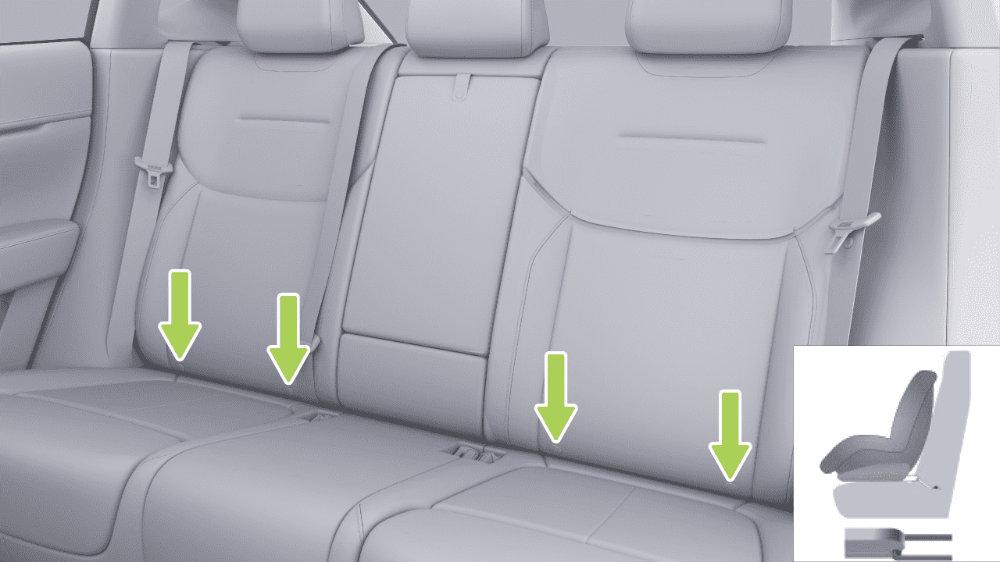

Viaje Tranquilo

2. Inserte el soporte de fijación inferior del asiento
de seguridad para niños en el anclaje ISOFIX según
las instrucciones del fabricante.

1.
Fije el asiento de seguridad para niños a lo largo
del recorrido del cinturón de seguridad. Intente
deslizar el asiento de seguridad para niños de un
lado a otro y de adelante hacia atrás.

2. Si el asiento de seguridad para niños puede
moverse más de 2,5 cm, el asiento de seguridad para
niños está demasiado flojo. En ese caso, abroche el
cinturón de seguridad o vuelva a conectar el asiento
de seguridad para niños ISOFIX.

3. Si no se puede asegurar, pruebe otras posiciones
del asiento o utilice otro asiento de seguridad para
niños.

advertencia

• No coloque un asiento para niños orientado
hacia atrás en un asiento protegido por airbag,
ya que esto podría causar la muerte o lesiones
graves al niño que se encuentre en el asiento.

3. Pase el cinturón de fijación superior del asiento
de seguridad para niños a través del reposacabezas y
tírelo hacia la parte posterior del respaldo. Conecte
el gancho y la presilla del cinturón de fijación al
punto de anclaje, y tense el cinturón de fijación.

• Utilice siempre un asiento para niños adecuado
para la edad, la altura y el peso del niño.

Verificación del asiento de seguridad para niños

• Un niño que pese más de 9 kg solo puede usar un
asiento de seguridad para niños orientado hacia
adelante si es capaz de viajar de forma autónoma.
Los niños menores de dos años aún no han

Asegúrese de que el asiento de seguridad para niños
no quede flojo después de la instalación:

171

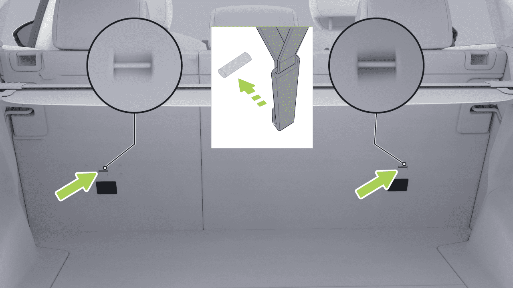

Viaje Tranquilo

desarrollado suficientemente la columna vertebral
y el cuello, y evite daños por impacto frontal.

• Solo se puede acomodar a un niño en un asiento
para niños. No utilice el cinturón de seguridad para
sujetar a más de un niño en un asiento para niños.

• Bajo ninguna circunstancia se debe sostener a un
niño o bebé en brazos dentro del vehículo, y todos
los niños deben estar sujetos en un asiento de
seguridad para niños adecuado en todo momento.

• No sujete los dos asientos de seguridad para niños
a un mismo punto de anclaje. En caso de colisión, un
solo punto de anclaje podría no ser suficiente para
asegurar ambos asientos.

• No deje a un niño solo en el vehículo, incluso si el
niño está sujeto al asiento para niños.

• Los puntos de anclaje del sistema de
retención infantil solo se sujetan desde el
sistema de retención infantil correctamente
instalado. Bajo ninguna circunstancia debe
utilizarse el sistema de retención infantil con
cinturones de seguridad para adultos, arneses
u otros elementos o equipos.

• No viaje sin protección de seguridad,
mantenga al niño correctamente sentado
durante la conducción y no permita que se
ponga de pie en el vehículo ni se arrodille en
el asiento. De lo contrario, podría producirse
una lesión mortal para los niños y para otras
personas en caso de accidente.

• Revise siempre el cinturón de seguridad y la
correa de anclaje en busca de daños y desgaste.

• No utilice la correa de extensión del cinturón
de seguridad en el cinturón empleado para
montar un asiento infantil o un asiento elevador.

• Nunca utilice un asiento infantil modificado,
dañado o que haya estado involucrado en un
accidente de vehículo. Revise o reemplace el
asiento infantil según lo especificado en las
instrucciones del fabricante del asiento infantil.

• Asegúrese de que la cabeza del niño esté
apoyada y de que el cinturón de seguridad del
asiento infantil esté ajustado y asegurado
adecuadamente cuando viaje un niño grande. El
cinturón del hombro debe quedar alejado de la
cara y el cuello, y la sección abdominal debe
quedar alejada del abdomen.

• Para garantizar que los niños viajen de forma
segura, siga siempre todas las instrucciones
detalladas en este manual

172

Viaje Tranquilo

y las instrucciones proporcionadas por el
fabricante del asiento de seguridad infantil.

Modo Bebé a Bordo

Los seguros de protección infantil están
instalados en ambas puertas traseras del
vehículo. Después de activar el seguro de
protección infantil en el Modo Bebé a Bordo,
la puerta correspondiente no puede abrirse
mediante el interruptor de apertura eléctrico,
lo que puede evitar que los niños abran la
puerta trasera por error. También se puede
habilitar el bloqueo de ventanas para bloquear
el elevalunas de las ventanas del pasajero y
reducir el riesgo de accidentes durante el viaje.

• En la pantalla de control central, vaya a la
interfaz “ 
 →Ventana y Puerta→Modo Bebé
en el Auto”, donde podrá activar o desactivar el
bloqueo de ventanas y el seguro de protección
infantil.

• Los seguros de protección infantil pueden
activarse/desactivarse a través del panel de
accesos directos en la pantalla de control central.

Consejos

• Se recomienda activar el seguro de protección
infantil cuando el niño esté sentado en la fila
trasera.

173

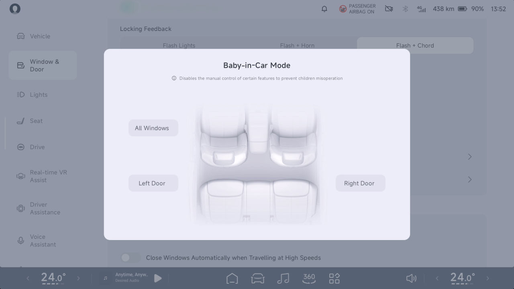

Viaje Tranquilo

• Para garantizar la seguridad cuando hay niños
en el vehículo, bloquee la subida y bajada de las
ventanas del pasajero para evitar que los niños
operen las ventanas y se eviten atrapamientos.

Sonido Simulado a Baja Velocidad AVAS

Introducción

advertencia

Cuando el vehículo se desplaza a una velocidad
inferior a 30 km/h, se emitirá un sonido análogo
para alertar a los peatones y vehículos cercanos.

La puerta correspondiente no puede abrirse
desde el interior cuando la función de seguro de
protección infantil está activada; no deje a un
niño solo en el vehículo.

Operación

Bloqueo por alcohol*

Introducción

Este vehículo cuenta con un puerto de bloqueo
por alcohol para acomodar un dispositivo de
bloqueo por alcohol con interfaz LIN (que
cumple con la norma versión 50436-4 2022).

En el CID, vaya a la interfaz “ 
 →Sonidos”,
donde podrá seleccionar “Efecto de Sonido de
Simulación de Sonido a Baja Velocidad”.

174

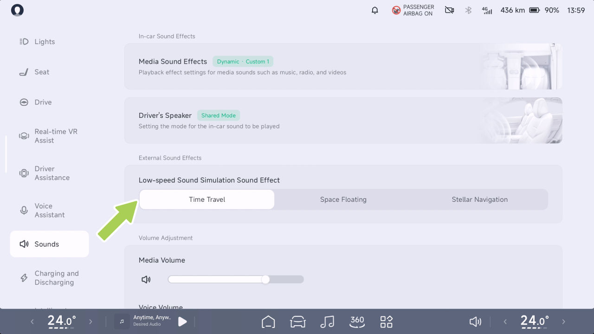

Viaje con tranquilidad

Sistema de Monitoreo de Presión de
Neumáticos (TPMS)

Funcionamiento

Introducción

La presión de los neumáticos se calibrará
automáticamente después de cada cambio de
neumático. Antes de la calibración, mantenga el
vehículo detenido durante más de 17 minutos.
Durante la calibración, conduzca a una velocidad
de más de 40 km/h durante 10 minutos y evite
dar marcha atrás.

El TPMS puede monitorear la presión y la
temperatura de los neumáticos en tiempo real
cuando el vehículo está en marcha, y emite una
alarma en caso de presión anormal de los
neumáticos, temperatura anormal de los
neumáticos o falla del sistema TPMS, para
garantizar la seguridad de conducción.

Asistente de Frenado

advertencia

Introducción

• La luz de advertencia del sistema de
monitoreo de presión de neumáticos del
tablero de instrumentos se enciende cuando
hay una presión anormal de los neumáticos
o una falla del TPMS, y aparece un texto
correspondiente para alertarlo: “Presión de
neumáticos baja, Vuelva a inflar a tiempo”,
“la presión de los neumáticos es demasiado
baja, Rellene de inmediato”, “falla del
sistema de monitoreo de presión de
neumáticos, Contacte al Servicio”. Siga los
recordatorios de texto.

El Programa Electrónico de Estabilidad utiliza
sensores para identificar los estados de
conducción del vehículo (por ejemplo,
subviraje, sobreviraje o deslizamiento de las
ruedas motrices), y puede aplicar una
intervención de frenado dirigida o limitar el par
motor para reducir eficazmente el riesgo de
derrape o trompo y garantizar la estabilidad de
conducción del vehículo.

Programa Electrónico de Estabilidad (ESP)

• Está prohibida la modificación privada del
sistema de monitoreo de presión de
neumáticos.

Apertura y cierre

175

Viaje con tranquilidad

Sistema Antibloqueo de Frenos (ABS)

El ABS evita que las ruedas se bloqueen
cuando se aplica la fuerza máxima de frenado.
En la mayoría de las condiciones de la carretera,
el rendimiento del control de la dirección del
vehículo puede mejorarse durante una parada de
emergencia.

En caso de una parada de emergencia, el ABS
monitorea continuamente la velocidad de cada
rueda y ajusta la presión de frenado según la
condición de bloqueo.

En la CID, vaya a la interfaz “ 
 →Conducción”, y
puede habilitar o deshabilitar el “Sistema
Electrónico de Estabilidad ESP”.

Cuando el ABS se activa, puede sentir
vibraciones en el pedal de freno. No necesita
asustarse, simplemente conduzca de acuerdo con
las condiciones de la carretera.

advertencia

En caso de una falla del ABS, la función básica
de frenado permanece normal y no se ve
afectada por la falla, pero la distancia de frenado
aumentará.

• El ESP no previene accidentes causados por
una conducción peligrosa o por giros de
emergencia a alta velocidad.

• Si el ESP falla, contacte de inmediato al
Centro de Servicio de Automóviles XPENG
para su reparación.

El conductor siempre debe mantener una
distancia segura respecto al vehículo de adelante
y estar atento a condiciones de conducción
peligrosas. Aunque el ABS puede mejorar la
distancia de frenado, no

advertencia

176

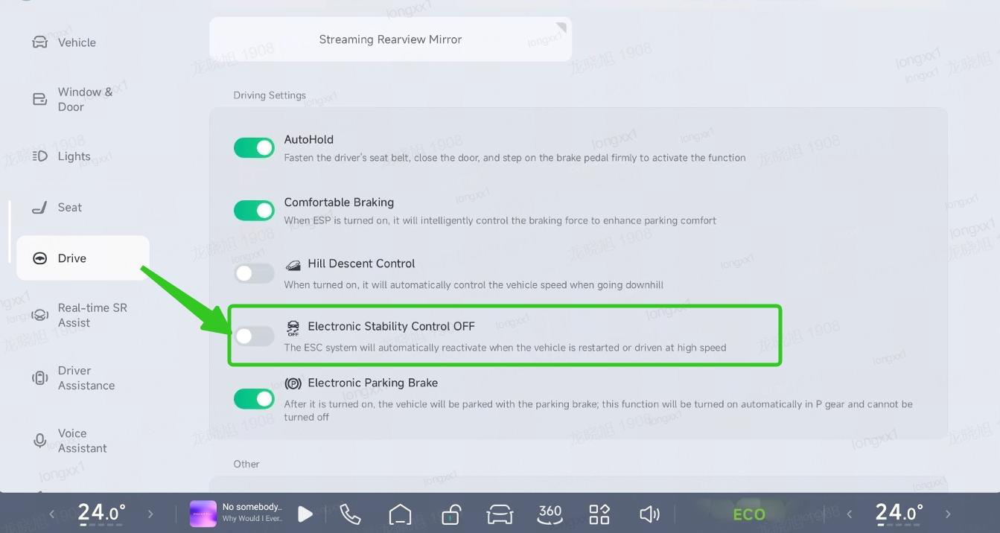

Viaje con tranquilidad

va más allá de las leyes de la física, ni previene
el peligro de deslizamiento de los neumáticos
(por ejemplo, cuando hay una capa de agua entre
la carretera y el neumático que impide que el
neumático entre en contacto directo con la
carretera).

Sistema de Distribución Electrónica de Frenado
(EBD)

deslizamiento, garantizando al mismo tiempo un
par motriz suficiente para ayudar al vehículo a
salir; controle la profundidad del pedal del
acelerador para evitar que esté completamente
pisado en todo momento.

Sistema de Distribución Electrónica de Frenado
(EBD)

En caso de emergencia, pise a fondo el pedal del
freno y mantenga una presión constante. El ABS
ajusta la presión de frenado en cada rueda según
la fuerza de frenado disponible para evitar el
bloqueo de las ruedas y garantizar una parada
segura.

Parada de emergencia

El EBD forma parte del ABS. Cuando el
vehículo frena con normalidad, el EBD puede
equilibrar la distribución de la fuerza de frenado
entre las ruedas delanteras y traseras según la
carga del vehículo.

El EBD puede distribuir correctamente la fuerza
de frenado generada por el sistema de frenos a
las cuatro ruedas según la tracción entre las
ruedas y la superficie de la carretera. Esto
garantiza la máxima eficiencia de frenado, acorta
significativamente la distancia de frenado,
mantiene el vehículo estable durante el frenado y
mejora la seguridad de conducción.

Sistema de Control de Tracción (TCS)

Cuando el vehículo arranca o acelera
rápidamente sobre una superficie resbaladiza
como hielo y nieve, las ruedas motrices
patinarán. El dTCS controla la presión de frenado
y la salida de par del vehículo para minimizar el
patinaje de las ruedas.

Consejos

Sistema de Asistencia al Frenado (EBA)

Cuando el vehículo se encuentra en una situación
en la que puede quedar atrapado (p. ej., en
barro o nieve profunda), la función dTCS puede
controlar el deslizamiento de las ruedas

En caso de emergencia, pise rápidamente y
mantenga pisado el pedal del freno. El EBA
generará una presión de frenado mayor que la
del frenado normal,

177

Viaje tranquilo

de modo que el sistema de frenos pueda producir
la presión requerida para la máxima
desaceleración en el menor tiempo posible,
obteniendo así la distancia de frenado más corta.

• El HHC dura aproximadamente 2 s y el
tiempo de retención del freno se libera antes
según el conductor y la pendiente.

Control de Retención en Pendiente (HHC)

El HHC es capaz de proporcionar asistencia de
frenado, pero sin exceder las reglas de la
cinemática y, por razones de seguridad, el
conductor debe, según el vehículo, accionar los
frenos de manera oportuna para evitar un
accidente cuando el vehículo está descendiendo
por una pendiente.

advertencia

Cuando el vehículo se detiene y arranca en una
pendiente con una inclinación superior al 5%,
durante el período en que el conductor suelta el
pedal del freno para pisar el pedal del acelerador,
la salida de potencia no es suficiente para
arrancar el vehículo. Antes de avanzar (el
vehículo tiende a deslizarse), el HHC mantendrá la
fuerza de frenado requerida por el conductor para
detener el vehículo y mantenerlo en estado
estático, para evitar que el vehículo se deslice.

Frenado Multicolisión (MCB)

En caso de colisión del vehículo, el MCB puede
frenar activamente para reducir la probabilidad de
una colisión secundaria.

Consejos

• El HHC solo se aplica cuando: el vehículo
está en D o R, se pisa el pedal del freno y la
cantidad de fuerza de frenado producida antes
de soltar el pedal del freno es suficiente para
mantener el vehículo en una pendiente.

Control de Descenso en Pendiente (HDC)

Introducción

El HDC es una función de control de crucero que
puede ayudar al conductor a circular cuesta abajo a
velocidad constante y aliviar la fatiga del pie causada por

178

Viaje Tranquilo

pisar el pedal de freno todo el tiempo al
circular cuesta abajo.

se desactiva, y el conductor debe tomar el control del
vehículo. Cuando la velocidad del vehículo supera los 60
km/h, la función se desactivará por completo y no
se volverá a activar.

Funcionamiento

Activar o desactivar en el CID

Consejos

• El HDC puede operarse en pendientes del 5% o
más.

• El HDC se activa: velocidad del vehículo inferior a
35 km/h; la temperatura del disco de freno es normal.
El sistema ESP está en buen estado.

El HDC puede mantener activamente la velocidad del
vehículo baja, pero no más allá de la dinámica, y por
razones de seguridad, el conductor debe seguir las
condiciones reales del vehículo. Accione los
frenos a tiempo para evitar un accidente
cuando el vehículo baje la pendiente demasiado rápido.

advertencia

En el CID, vaya a la interfaz “ 
 →Conducción”, y
puede activar o desactivar el “Control de Descenso en Pendientes”.

La función HDC puede usarse cuando la velocidad del
vehículo está entre 8 km/h y 35 km/h. Si
pisa el pedal de freno o el pedal del acelerador
durante el funcionamiento del HDC, la función HDC se

179

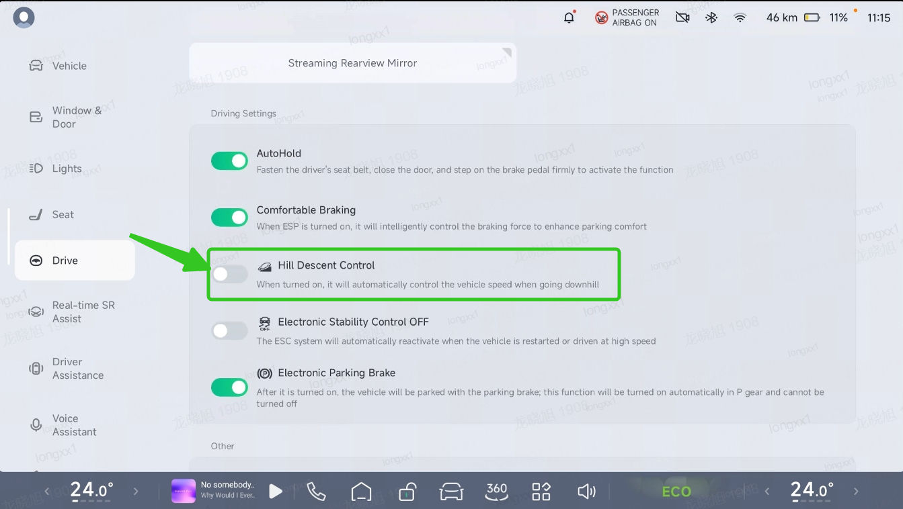