# Entrada y salida

Entrada y Salida

Localización Rápida del Vehículo

Cuando esté cerca del vehículo (por ejemplo, en un
estacionamiento residencial), en la APP móvil, seleccione
la interfaz “XPENG” o la interfaz “Ubicación del Vehículo/
Mapa”, y elija el aviso mediante bocina
o destello para que pueda encontrar rápidamente el vehículo.

Introducción

Cuando no se puede encontrar el vehículo, esta función
puede utilizarse para localizarlo.

Operación

• Solo el número de cuenta del propietario puede ver
la ubicación en tiempo real del vehículo.

Consejos

Cuando esté lejos del vehículo o no
sepa dónde está estacionado el vehículo, puede
ir a la interfaz “XPENG” en su aplicación móvil
para consultar la información de ubicación geográfica
del vehículo.

Localización del vehículo a larga distancia

• Una conexión de red deficiente del vehículo puede provocar
que la función de búsqueda del vehículo no funcione
correctamente.

• Cuando el vehículo está bloqueado, el sistema
captura automáticamente fotografías del
perímetro del vehículo, y las anonimiza y
encripta para proteger la privacidad del usuario.

Toque la información de ubicación para ver fotos de
la zona que rodea al vehículo estacionado; toque
la cámara para ver el video alrededor del vehículo;
toque la navegación para generar una ruta que le permita localizar el
vehículo.

Retroalimentación de Desbloqueo/Bloqueo

Introducción

Localización del vehículo a corta distancia

Utilice la interfaz de la App móvil para operar la localización
del vehículo a corta distancia.

Cuando el vehículo se desbloquea, las puertas se desbloquean
de forma sincronizada; las luces intermitentes a ambos lados
del vehículo parpadearán dos veces; la bocina sonará

180

Entrada y Salida

o se reproducirá música de acordes (si está configurado); la manija de la puerta
delantera se extenderá (si está configurado); los espejos laterales se
abrirán (si está configurado); y el sistema de alarma
antirrobo se desactivará.

• En la CID, vaya a la interfaz “ 
 →Ventana y Puerta”,
y podrá activar o desactivar la función “Manijas
Emergentes al Desbloquear”.

Cuando el vehículo se bloquea, las puertas se bloquean
de forma sincronizada; las luces intermitentes a ambos lados del
vehículo parpadearán una vez; la bocina sonará o
se reproducirá música de acordes (si está configurado); la manija de la puerta
delantera se retraerá; los espejos laterales se plegarán (si
está configurado); las ventanas se cerrarán (si está configurado); y el sistema de alarma
antirrobo se activará.

Puede configurar el modo de apertura y cierre de los
espejos laterales cuando el vehículo está bloqueado a través de
la CID:

• En la CID, vaya a la interfaz “ 
 →Conducción→Espejos Laterales
Exteriores”, y podrá activar o desactivar
“Plegar Espejos Laterales automáticamente después del bloqueo
del vehículo”.

• En el panel de accesos directos, toque “Ajuste del Espejo
Lateral”. En la interfaz “Espejo Lateral”,
puede activar o desactivar “Plegar Espejos Laterales
automáticamente después del bloqueo del vehículo”.

Puede configurar el método de retroalimentación para
desbloquear o bloquear el vehículo a través de la
pantalla de control central:

Operación

Puede configurar el modo de apertura y cierre de las
ventanas cuando están bloqueadas a través de la CID:

• En la CID, vaya a la interfaz “ 
 →Ventana y Puerta”,
y podrá seleccionar los métodos para
la retroalimentación de desbloqueo y bloqueo respectivamente: “Destello
de Luces,” “Destello + Bocina”, y “Destello + Acorde”.

• En el CID, dirigite a la interfaz “
 →Ventana y Puerta” y podés activar o desactivar
“Cerrar Ventanas Automáticamente después de Bloquear
el Vehículo”.

Podés configurar la forma de habilitar o deshabilitar
las Manijas Emergentes al Desbloquear a través del CID:

181

Entrada y Salida

Sistema de Alarma Antirrobo*（si corresponde）

Llave de Tarjeta NFC

Cuando el sistema antirrobo está activado y se abre
cualquier puerta (incluido el baúl) o el capó delantero,
el sistema antirrobo emitirá una alarma a través
de la bocina y las luces de giro. La alarma del sistema
antirrobo puede desactivarse después de desbloquear
el vehículo.

Introducción

La llave de tarjeta NFC permite desbloquear, bloquear
y arrancar el vehículo.

Funcionamiento

La alarma del sistema antirrobo dura
aproximadamente 28 segundos y se reinicia si
las puertas (incluido el baúl) o la tapa del
compartimento delantero se abren nuevamente.

Consejos

Está prohibido realizar modificaciones al sistema
antirrobo del vehículo, ya que esto puede provocar que el sistema
no funcione correctamente.

advertencia

1.
Desbloqueo de puertas

• Cuando el vehículo esté bloqueado, acercá la
Llave de Tarjeta de Comunicación de Campo Cercano
al área del sensor NFC en el pilar B del lado
del conductor durante aproximadamente un segundo. En

182

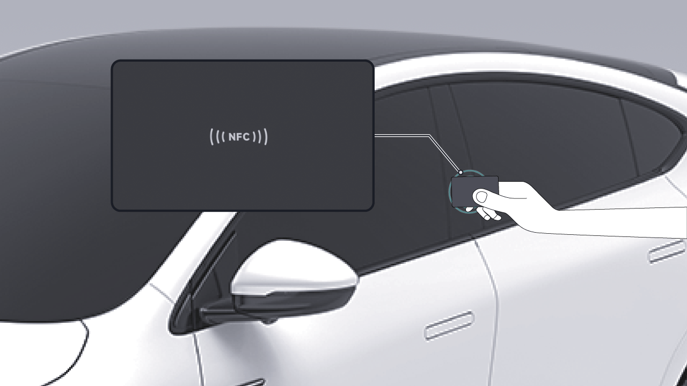

Entrada y Salida

ese momento, el vehículo proporcionará un
aviso de retroalimentación de desbloqueo, indicando que
el desbloqueo fue exitoso.

la Llave de Tarjeta de Comunicación en el área de carga
inalámbrica del lado del conductor (marcada
por la línea punteada) para volver a autenticar.
Una vez que se detecta el llavero de la tarjeta, el temporizador
de autenticación de 30 segundos se reiniciará. Una vez
que la autenticación sea exitosa, podés arrancar el
vehículo presionando el pedal de freno y
cambiando de marcha.

3. Bloqueo al alejarse

• Cuando el vehículo esté desbloqueado y todas las puertas
(incluidos el capó delantero y el baúl) estén
cerradas, acercá la Llave de Tarjeta de Comunicación
de Campo Cercano al área de detección NFC en el
pilar B del lado del conductor durante aproximadamente
un segundo. En ese momento, el vehículo
proporcionará un aviso de retroalimentación de bloqueo,
indicando que el bloqueo fue exitoso.

2. Arrancar el vehículo

• Dentro de los 30 segundos de usar la Llave de Tarjeta
de Comunicación de Campo Cercano, podés presionar
el pedal de freno y cambiar de marcha para arrancar el
vehículo.

• No dobles, tuerzas ni cortes la llave de tarjeta NFC;

Consejos

• Si el vehículo no puede arrancarse dentro de los
30 s, la pantalla de control central mostrará un
aviso emergente que indica “"Llave no
detectada"”. Por favor, colocá la Llave de Comunicación
de Campo Cercano

• No coloques la llave de tarjeta NFC en un lugar
caliente (por ejemplo, la consola de instrumentos);

183

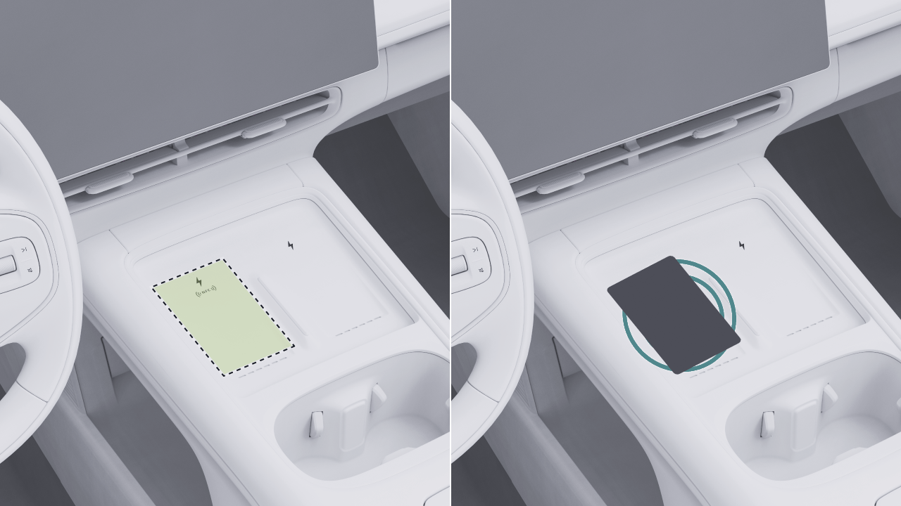

Entrada y Salida

• No coloques teléfonos móviles u otros objetos
metálicos en el área de carga inalámbrica de tu
teléfono cuando arranques el vehículo usando la
llave de tarjeta NFC;

Funcionamiento

• No coloques la llave de tarjeta NFC en el área
de detección de carga inalámbrica cuando uses
la función de carga inalámbrica del teléfono móvil.

Llave Remota Inteligente

Introducción

El vehículo está equipado con una llave remota
inteligente, que admite tanto la operación con botones como el
Desbloqueo o Bloqueo Automático

1.
Botón de bloqueo

Presione brevemente este botón y el vehículo
mostrará un aviso de confirmación de bloqueo,
indicando que el bloqueo se realizó correctamente.

Consejos

• El vehículo no se bloqueará a menos que
esté en posición P y todas las puertas
(incluida la tapa del compartimento
delantero y el maletero)

184

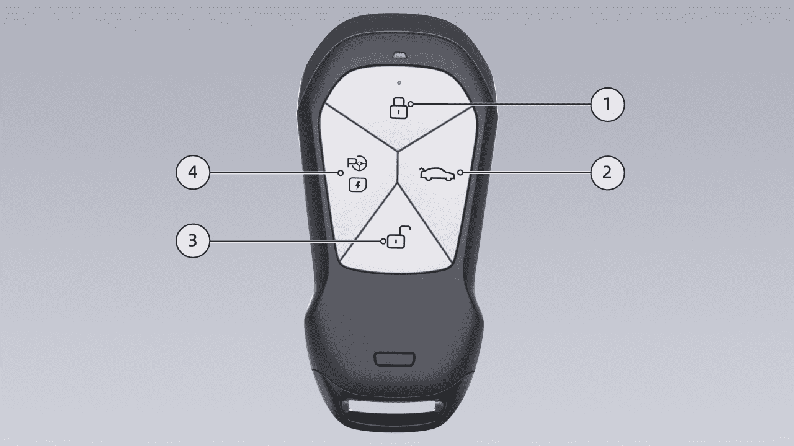

Entrada y salida

estén cerradas, salvo que el vehículo se
deje sin supervisión.

Reemplazo de la batería de la llave de control
remoto inteligente

2. Botón de apertura/cierre del maletero

Haga doble clic en este botón para abrir o cerrar
el maletero. Pause la apertura o el cierre del
maletero.

3. Botón de desbloqueo

Presione este botón y el vehículo mostrará
un aviso de confirmación de desbloqueo,
indicando que el desbloqueo se realizó
correctamente.

4. Botón de estacionamiento y apertura/cierre de la tapa del puerto de carga

• Toque dos veces este botón para abrir o
cerrar la tapa del puerto de carga.

1.
Presione el botón de desbloqueo de la cubierta
embellecedora y retire la cubierta embellecedora
en la dirección de la flecha.

• Asiste con el uso de las funciones
relacionadas con el estacionamiento.

185

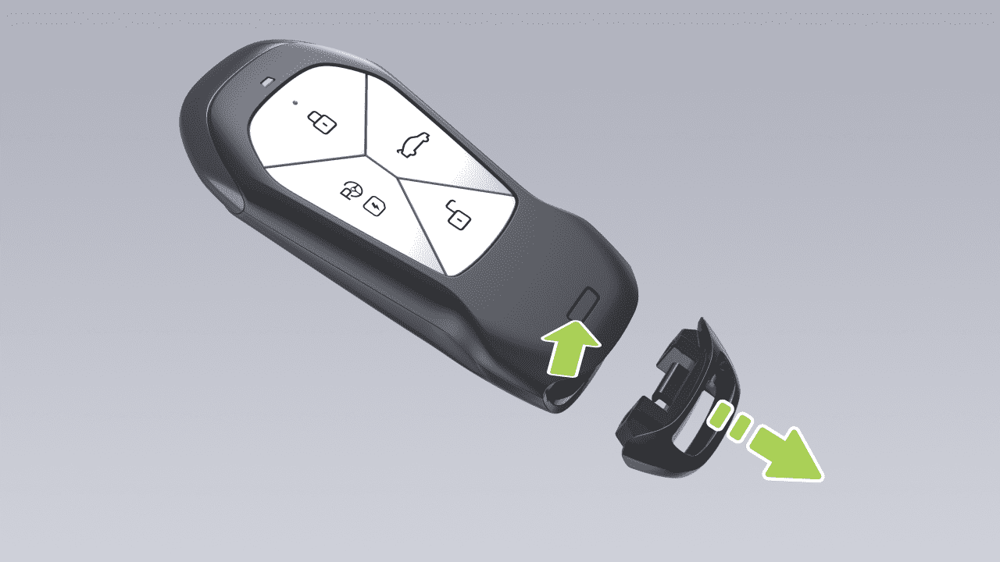

Entrada y salida

2. Haga palanca en los bordes de ambos lados de
la cubierta trasera con una herramienta adecuada,
luego levante y retire la parte central de la
cubierta trasera.

3. Gire la placa de la cubierta de la batería de la
llave en sentido antihorario siguiendo la dirección
de la flecha y retire la placa de la cubierta de la
batería de la llave.

186

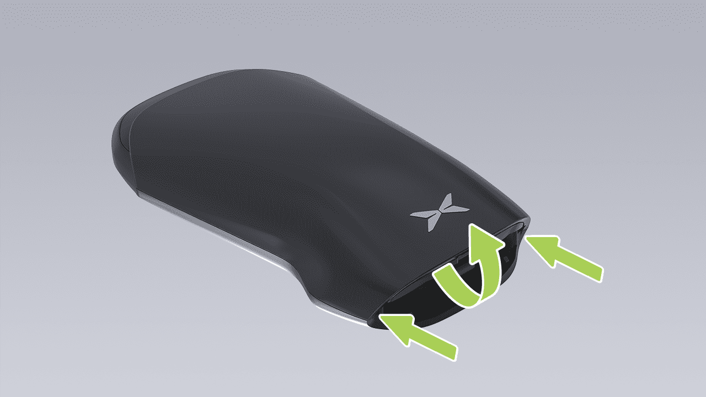

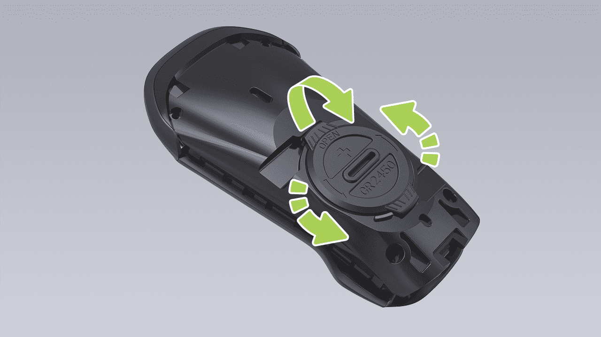

Entrada y salida

Advertencias, precauciones y limitaciones

advertencia

LA LLAVE DEL VEHÍCULO
CONTIENE UNA PILA DE
BOTÓN

Las pilas de botón de las
llaves del automóvil son
extremadamente peligrosas.
Independientemente de si son
nuevas o usadas, siempre
deben mantenerse fuera del
alcance de los niños. Si se
ingieren o se introducen en el
cuerpo, las pilas de botón de
litio pueden causar lesiones
graves o incluso mortales en
dos horas o menos. Si sospecha
que se ha ingerido o introducido
en el cuerpo una pila, busque
atención médica de inmediato.

4. Extraiga la batería de la llave. Modelo de
batería: CR2450.

5. Instálela en el orden inverso. Durante la
instalación, mantenga el “+” (polo positivo) de la
batería de la llave hacia arriba.

187

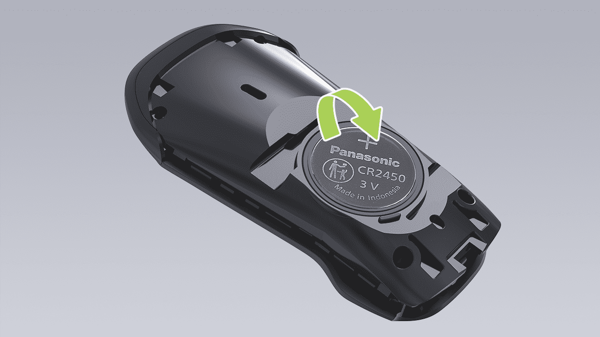

Entrada y salida

Llave de la aplicación móvil

Dispositivos compatibles: teléfonos con Android
que admiten NFC.

Introducción

Consejos

Después de instalar la aplicación XPENG, puede
registrar teléfonos móviles como llaves del
vehículo y utilizar las tecnologías Bluetooth y NFC
para la comunicación. Esto permite bloquear/
desbloquear, arrancar el vehículo y controles
adicionales de forma cómoda y segura.

Una vez activada la llave, la aplicación
predeterminada de NFC debe configurarse como
“XPENG Automobile app” antes de poder usarla.

En la aplicación XPENG, vaya a “Llave digital”,
toque “Activar” bajo Llave Bluetooth y opere
según las indicaciones de la aplicación XPENG
para crear una llave Bluetooth móvil.

Llave Bluetooth móvil

La aplicación XPENG admite los siguientes tres
tipos de llaves:

• Llave Bluetooth móvil

Dispositivos aplicables: teléfonos iOS, Harmony y
Android.

Llave Bluetooth: admite dos modos para las
operaciones de bloqueo y desbloqueo.

Bloqueo o desbloqueo con llave Bluetooth

After turning on the key, change the different... — traduzco conservando el formato:

Tras encender la llave, cambiar el sistema, iniciar sesión con un teléfono diferente o desinstalar la aplicación: todo puede sincronizar automáticamente la llave, sin necesidad de volver a encenderla.

Consejos

• Desbloqueo y bloqueo manual: Una vez que el teléfono móvil se haya emparejado correctamente con el vehículo mediante Bluetooth, podés usar la App XPENG para desbloquear, abrir o cerrar las ventanillas, abrir el baúl, etc.

• Llave NFC móvil

188

Entrada y salida

• Desbloqueo y bloqueo automático: En la APP XPENG, activá el interruptor de “Desbloqueo y bloqueo automático”. Una vez que el teléfono móvil se haya emparejado correctamente con el Bluetooth del vehículo, podés desbloquear automáticamente el vehículo al acercar tu teléfono móvil al vehículo. El vehículo se bloqueará automáticamente cuando te alejes del vehículo llevando la llave.

Teléfono con sistema iOS

1.
La información de ubicación debe configurarse en permitir siempre

2. Actualización de apps en segundo plano

3. Servicios de ubicación (Configuración > Privacidad > Servicios de ubicación)

Llave NFC del teléfono móvil

precaución

En la App XPENG, andá a “Llave digital”, tocá “Activar” debajo de la llave NFC y operá según las indicaciones de la App XPENG para crear una llave NFC móvil.

Después de desbloquear, no cierres la App Xpeng. Mantené la App de Xiaopeng Motors ejecutándose en segundo plano. Determiná la posición del dispositivo respecto al vehículo y desbloquealo desde el dispositivo. Para garantizar el funcionamiento normal, asegurate de habilitar los siguientes permisos para la App de Xiaopeng Motors:

Esta función solo es aplicable a teléfonos móviles con sistema operativo Android 9.0 o superior y hardware NFC.

Consejos

Teléfonos Android

1.
Permiso de Bluetooth

2. Permiso de inicio automático

3. Permisos de funcionamiento en segundo plano

189

Entrada y salida

Desbloqueo o arranque del vehículo con la llave NFC

Consejos

• Al desbloquear con una llave XPENG Auto, la app de pago predeterminada de XPENG Auto debe configurarse como la app de XPENG Auto; de lo contrario, el NFC no funcionará correctamente.

• Al desbloquear/arrancar el vehículo con la llave NFC, será necesario que la pantalla del teléfono esté desbloqueada. El teléfono puede estar apagado o la pantalla puede no funcionar correctamente, lo que puede impedir el uso de la llave NFC.

• Mantené la parte trasera de tu teléfono lo más cerca posible del área de detección NFC, según la parte trasera de tu teléfono.

El procedimiento para desbloquear, bloquear y arrancar con la llave NFC del teléfono móvil es idéntico al de una tarjeta NFC. Una vez que hayas abierto la App XPENG, simplemente colocá tu teléfono móvil cerca del área de reconocimiento NFC en el pilar B para desbloquear o bloquear tu vehículo. Tras la verificación, cuando coloques tu teléfono cerca del área NFC del interior del vehículo, podés presionar el pedal del freno y cambiar de marcha para arrancar el vehículo.

Desactivación de la llave digital

En el CID, andá a la interfaz “ 
 →General→Seguridad y privacidad”, tocá “Desactivar llaves digitales del vehículo”. En la ventana emergente, tocá “Confirmar para enviar” para enviar un código de verificación al número de teléfono del propietario del vehículo. Después de que el conductor ingrese y verifique el código, se desactivarán las llaves digitales del vehículo de todos los usuarios.

190

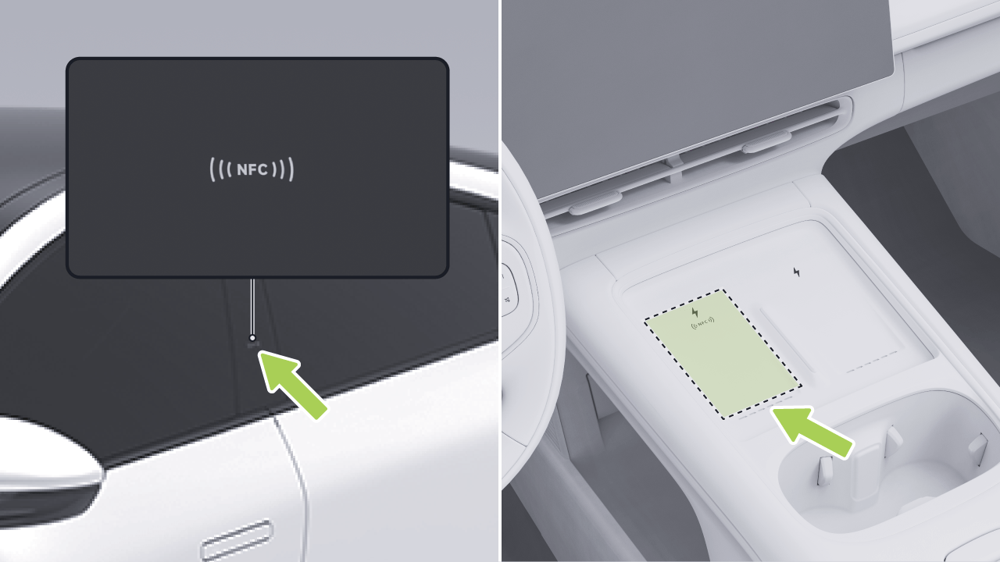

Entrada y salida

Consejos

• Después de reiniciar el teléfono o actualizar
el sistema, si la App XPENG no se ha vuelto
a abrir.

Cuando la llave digital se da de baja, todos
los usuarios autorizados deben reactivar la
llave digital y se debe usar con precaución.

• Cuando la puerta del vehículo, el capó
delantero o el maletero no están completamente
cerrados y se pierde la conexión Bluetooth al
alejarse del vehículo.

Advertencias, precauciones y limitaciones

2. ¿En qué combinaciones (incluidas, entre
otras) la llave NFC del teléfono móvil no logra
bloquear o desbloquear?

1.
¿En qué combinaciones (incluidas, entre
otras) podría fallar la función de bloqueo/
desbloqueo automático de la llave Bluetooth?

• Cuando el teléfono tiene poca batería o está
en modo de ahorro de energía.

• Cuando el teléfono tiene poca batería o está
en modo de ahorro de energía.

• La función Bluetooth del teléfono móvil está
desactivada.

• La función NFC del teléfono móvil está
desactivada.

• Cuando el sistema del teléfono ha cerrado
la App XPENG.

• La aplicación de pago predeterminada del
teléfono no está configurada como la App
XPENG.

Consejos

• Cuando la señal Bluetooth es inestable o se
desconecta de forma anómala.

Cuando la llave Bluetooth del teléfono móvil
no logre desbloquear, reinicie primero la App
XPENG Auto. Si el problema aún no se resuelve,
utilice la pantalla “XPENG→Llave digital→
comprobación

191

Entrada y salida

de llave”, siga las indicaciones para resolver el
problema de conexión.

Funcionamiento

Entrada sin llave

Interruptor capacitivo de la manija de la puerta

Introducción

La entrada sin llave admite los siguientes
métodos para bloquear y desbloquear:

• Interruptor capacitivo de la manija de la
puerta.

• Bloqueo y desbloqueo automáticos.

Con la llave inteligente a distancia o la llave
Bluetooth del móvil, puede tocar el interruptor
capacitivo de la manija de la puerta delantera
para desbloquear o bloquear el vehículo.

• Desbloquear la puerta: Cuando el vehículo
está bloqueado, toque el interruptor capacitivo
de la manija de la puerta delantera. En ese
momento, el vehículo mostrará un aviso de
confirmación de desbloqueo, indicando que el
desbloqueo se ha realizado correctamente.

192

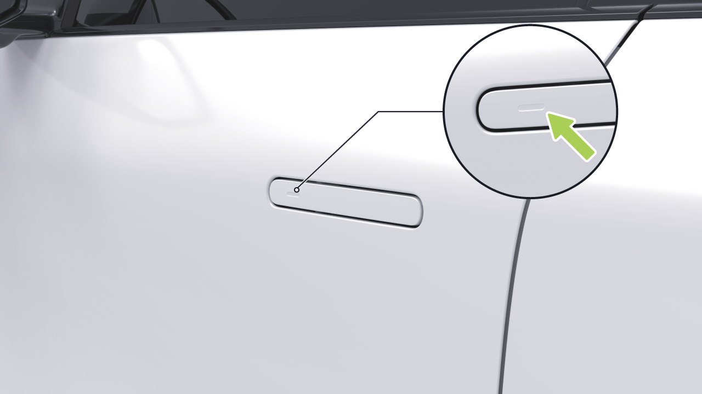

Entrada y salida

• Bloqueo al alejarse: Cuando el vehículo está
desbloqueado y todas las puertas (incluidos el
capó delantero y el maletero) están cerradas,
al tocar el interruptor capacitivo de la manija
de la puerta delantera se activará un aviso de
confirmación de bloqueo, indicando que el
bloqueo se ha realizado correctamente.

desbloquea automáticamente las puertas, y al
alejarse las bloquea automáticamente.

• “Desbloqueo automático:” Después de activar
"Bloqueo/Desbloqueo automático", acerque
la llave a distancia* a una posición de aproxi-
madamente 3,5 metros del vehículo, y el
vehículo se desbloqueará automáticamente.

Desbloqueo automático*

Después de que el vehículo se bloquee
automáticamente, si todavía está dentro del
rango de detección, es posible que no pueda
desbloquear el vehículo cuando se acerque
nuevamente. En ese caso, puede tirar de la
manija de la puerta o usar la llave para
desbloquearlo manualmente.

Consejos

• "Bloqueo automático:" Bloqueo automático: Después
de activar "Bloqueo/Desbloqueo automático", tome
la llave remota* y aléjese hasta una posición de
aproximadamente 8 metros del vehículo, y el
vehículo se bloqueará automáticamente.

En la CID, vaya a la interfaz " 
 →Ventana y Puerta",
seleccione "Bloqueo/Desbloqueo automático";
cuando todas las puertas estén cerradas y el asiento
del conductor esté desocupado, al acercarse con la
llave remota se

193

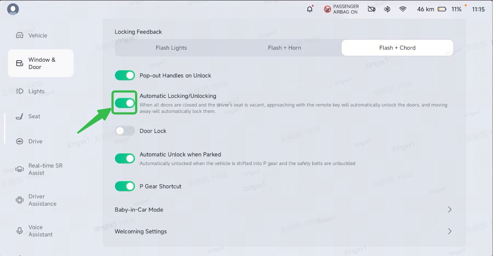

Entrada y Salida

Consejos

2. Detrás de la luz de lectura delantera

3. Ambos lados del paragolpes trasero

Con el vehículo detenido, las puertas (incluido
el baúl) y el capó cerrados, el vehículo en
posición de Estacionamiento (P) y sin nadie en el
asiento del conductor, las puertas se bloquearán
automáticamente solo cuando se retire la llave
del vehículo. Asegúrese de que el vehículo esté
bloqueado antes de salir.

Los pasajeros con marcapasos cardíacos implantados
deben mantener una distancia de al menos 22 centímetros
de la antena Bluetooth del vehículo para evitar que la
antena Bluetooth interfiera con el funcionamiento del
marcapasos cardíaco.

Advertencias, Precauciones y Limitaciones

Desbloqueo y Bloqueo Interior

Posición de la antena Bluetooth

Introducción

Puede bloquear o desbloquear el vehículo desde el
interior del vehículo utilizando los siguientes métodos:

• Cerradura de la puerta del vehículo

• Cerradura de la puerta del vehículo desde la pantalla de control central

• Desbloqueo automático al estacionar

1.
Ambos lados del paragolpes delantero

194

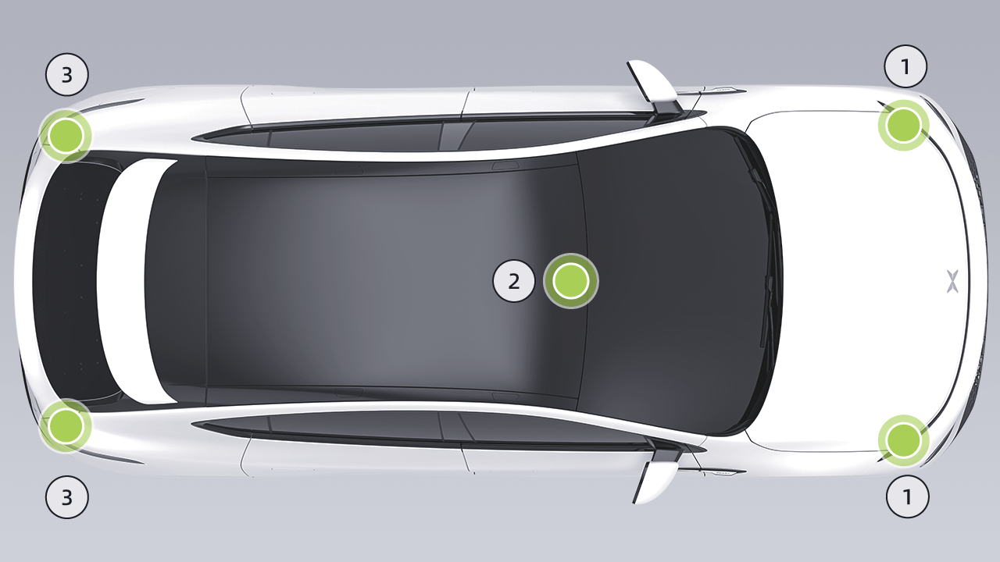

Entrada y Salida

Operación

Cerradura de la puerta del vehículo desde la CID

Cerradura de la puerta del vehículo

• En la CID, vaya a la interfaz " 
 →Ventana y Puerta",
y podrá activar o desactivar "Cerradura de
Puerta".

El interruptor de la cerradura de la puerta se
encuentra en el apoyabrazos de la puerta del
conductor:

•
Bloquear: Cuando todas las puertas (y el capó
delantero y la tapa del baúl) estén cerrados, presione
este interruptor para bloquear el vehículo.

• En la barra de tareas inferior de la CID, toque "Cerradura
de Puerta" (si está configurado), y podrá bloquear o desbloquear el
vehículo.

•
Desbloquear: Presione este interruptor para desbloquear el
vehículo.

195

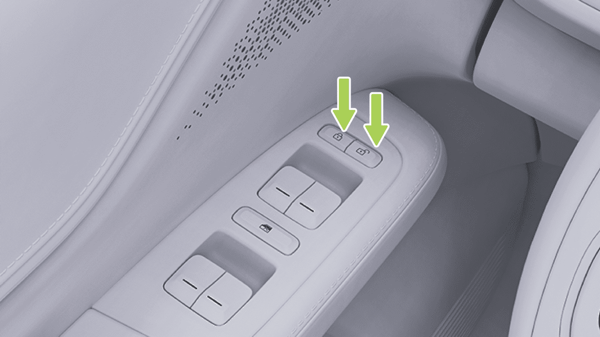

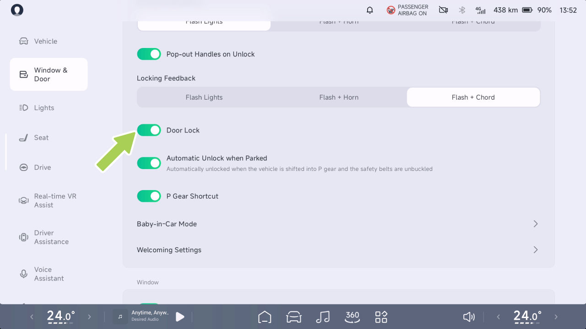

Entrada y Salida

Desbloqueo automático al estacionar

• En la CID, toque " 
 ", y luego toque "Asistencia
RV en Tiempo Real" en el Centro de Aplicaciones o "Asistencia
de Realidad Virtual en Tiempo Real" (si está configurado) en la barra de tareas
de la parte inferior de la CID para acceder a la interfaz de Asistencia
de Realidad Virtual en Tiempo Real. En la
interfaz, toque el ícono debajo del modelo 3D del
vehículo para desbloquear o bloquear el vehículo.

En la CID, vaya a la interfaz " 
 →Ventana y Puerta",
y podrá activar o desactivar "Desbloqueo
automático al Estacionar el Vehículo".

Cuando "Desbloqueo automático al Estacionar el
Vehículo" está habilitado, las puertas se desbloquean automáticamente
después de que el vehículo cambie a posición P y se
desabroche el cinturón de seguridad del conductor.

196

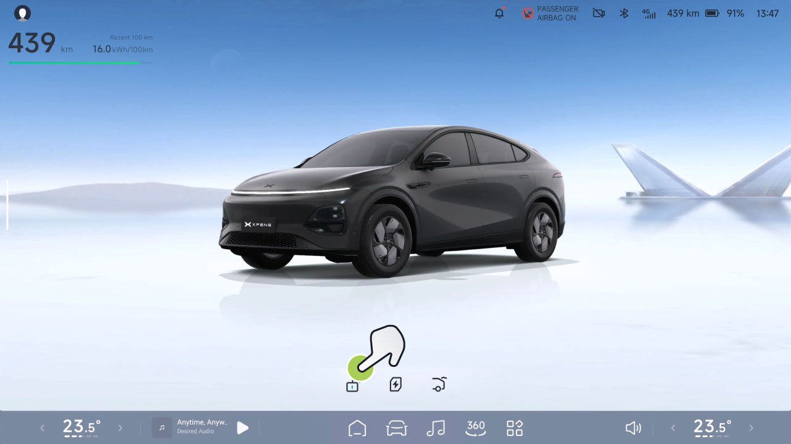

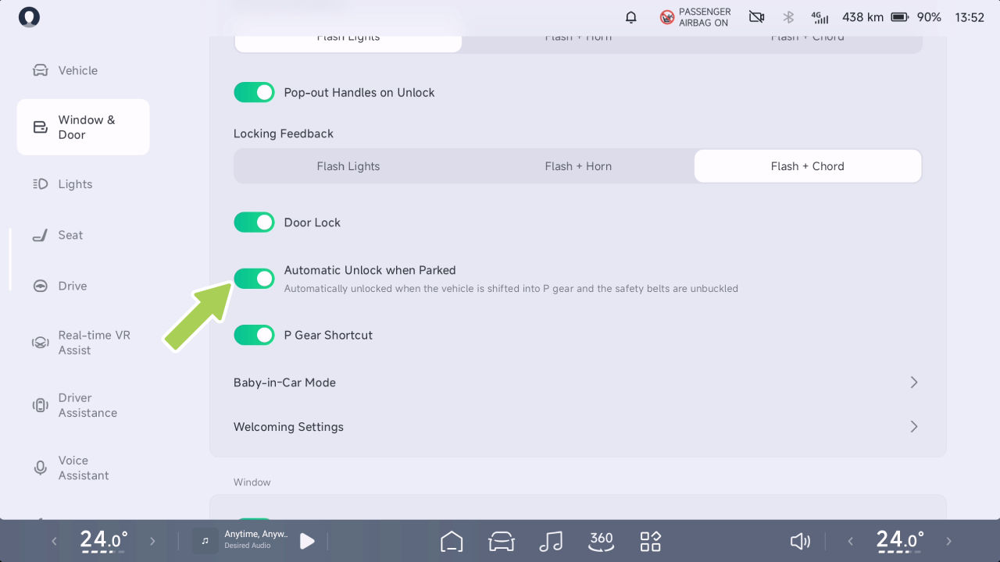

Entrada y Salida

Consejos

• Desbloquee el vehículo mediante el interruptor capacitivo de la manija de la puerta delantera.

Las cerraduras de las puertas también se abren/cierran automáticamente si se cumplen ciertas condiciones:

• Configurar Manijas emergentes al desbloquear.

• Bloqueo automático en marcha: Cuando las puertas (incluido el maletero) y la cubierta del compartimento delantero están cerradas, las cerraduras de las puertas se bloquean automáticamente si la velocidad del vehículo es superior a 10 km/h.

• Despliegue la manija de la puerta manualmente.

Funcionamiento

Configurar Manijas emergentes al desbloquear

• Desbloqueo automático al estacionar: La puerta se abre desde el interior del vehículo (botón eléctrico de apertura de puerta delantera/apertura de emergencia) y la cerradura de la puerta se desbloquea automáticamente.

• Desbloqueo automático de emergencia: La puerta se desbloquea automáticamente cuando el vehículo sufre una colisión o se produce una emergencia, como una fuga térmica.

Manijas eléctricas de puerta ocultas

En la CID, vaya a la interfaz « 
 →Ventana y puerta» y active «Manijas emergentes al desbloquear». Cuando el vehículo se desbloquea, la manija de la puerta

Introducción

El vehículo cuenta con manijas eléctricas de puerta ocultas, que se pueden operar de la siguiente manera:

197

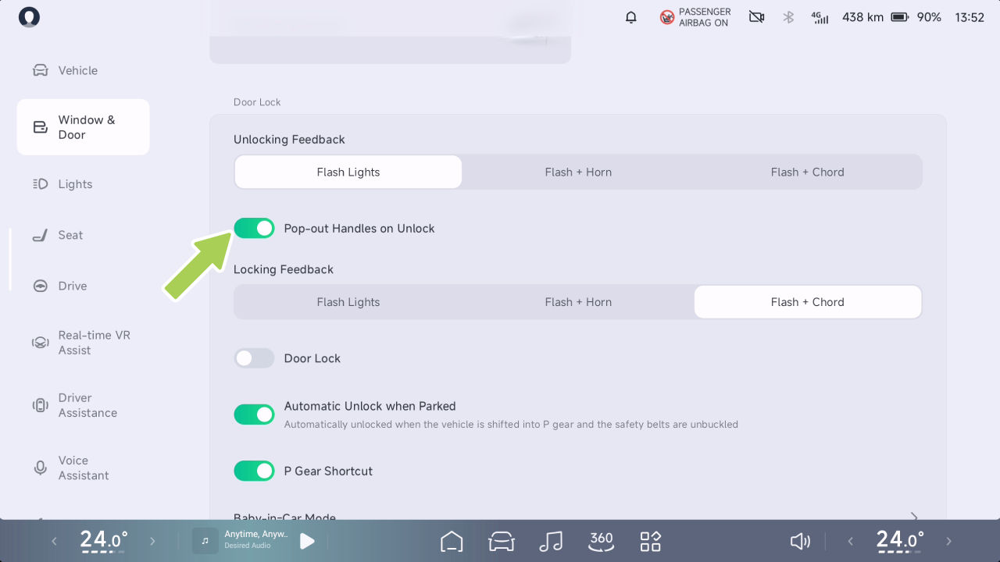

Entrada y salida

se desplegará automáticamente, de modo que pueda tirar de la manija para abrir la puerta fácilmente.

Retracción automática de la manija de la puerta

• Retracción por bloqueo: Cuando la puerta está bloqueada, la manija de la puerta se retraerá automáticamente.

Desplegar la manija de la puerta manualmente

• Retracción al cambiar de marcha: Cuando la palanca de cambios pasa de P a N/R/D, la manija de la puerta se retraerá automáticamente.

• Retracción por exceso de velocidad: Cuando la velocidad del vehículo supera los 3 km/h, la manija de la puerta se retraerá automáticamente.

• Retracción por tiempo de espera: Si las puertas (incluido el maletero) y el capó delantero están cerrados y no se realiza la operación de retracción en un plazo de 120 segundos, la manija de la puerta se retraerá automáticamente.

En la CID, vaya a la interfaz « 
 →Ventana y puerta» y desactive «Manijas emergentes al desbloquear». Cuando el vehículo se desbloquea, la manija de la puerta no se desplegará automáticamente. En este caso, debe presionar el extremo delantero de la manija de la puerta y tirar de ella para abrir la puerta.

advertencia

Al usar las manijas de las puertas, tenga cuidado de que los dedos, joyas, uñas acrílicas, etc., no queden atrapados por la puerta o el mecanismo de la manija. De lo contrario, podría provocar daños a objetos o lesiones personales.

198

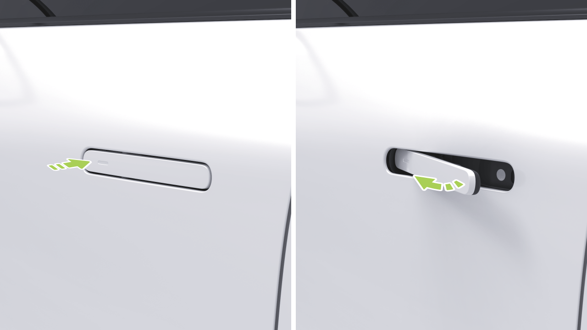

Entrada y salida

Consejos

Funcionamiento

• Al usar la función de estacionamiento automático, la manija de la puerta enrasada permanece desplegada; tirar de la manija de la puerta suspende la función de estacionamiento automático.

A través de las manijas eléctricas de puerta ocultas

• Controlar el plegado/despliegue de la manija de la puerta más de 8 veces en 1 minuto activará el modo antijuego, la manija de la puerta dejará de moverse y, después de 20 segundos, la función se reanudará.

Apertura/cierre de las puertas eléctricas

Introducción

La puerta eléctrica se puede abrir o cerrar de las siguientes maneras:

Cuando el vehículo está desbloqueado, la puerta se puede abrir usando la manija eléctrica de puerta oculta.

• Manijas de puerta eléctricas ocultas

• Botón eléctrico de apertura de puerta

• Llave mecánica

• Manija de apertura de emergencia o anilla de tracción

199

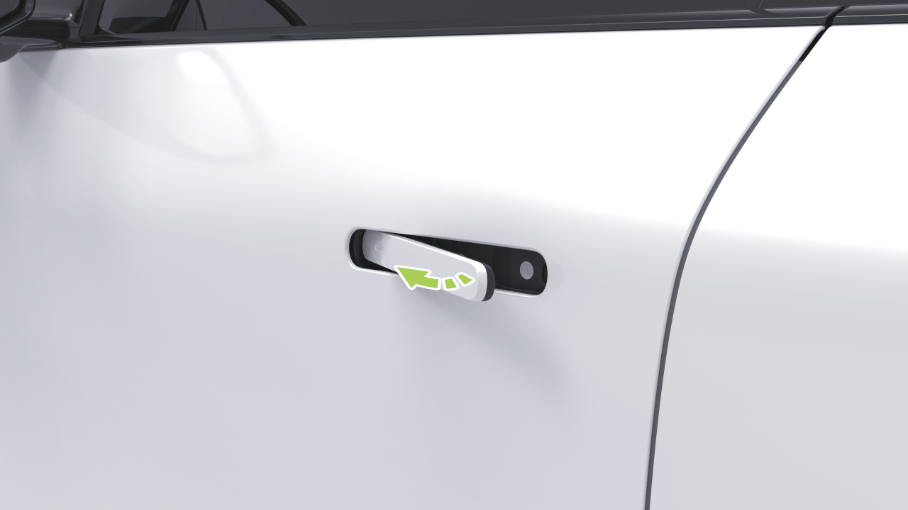

Entrada y salida

Botón eléctrico de apertura de puerta

Manija delantera de apertura de emergencia de la puerta

Con el vehículo detenido, presione el botón
eléctrico de apertura de puerta para abrir la puerta.

Tire de la manija de apertura de emergencia situada
debajo del apoyabrazos de la puerta delantera para
abrir la puerta.

Consejos

advertencia

Cuando la velocidad del vehículo es superior a 3
km/h, la puerta no puede abrirse mediante el
botón eléctrico de apertura de puerta.

Con el vehículo detenido o en marcha, al tirar
de la manija de apertura de emergencia una
vez se abre la puerta; no es para uso no urgente,
no tire de la manija de apertura de emergencia
mientras conduce.

200

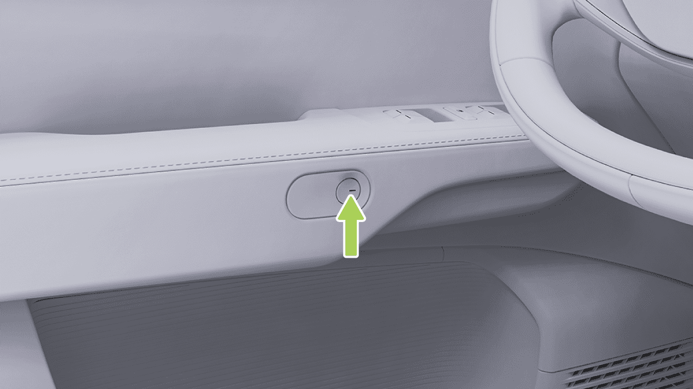

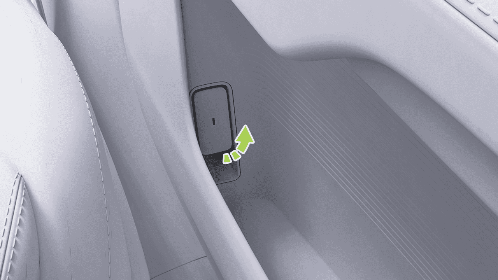

Entrada y salida

Anilla trasera de apertura de emergencia de la puerta

Llave mecánica

1.
Presione para abrir la placa de la cubierta de
mantenimiento situada debajo del apoyabrazos de
la puerta trasera.

Cuando el vehículo no tiene energía, presione el
extremo delantero de la manija de puerta oculta y
tírela hacia afuera. Inserte la llave mecánica en el
orificio de la cerradura, gírela en sentido horario
para desbloquear la puerta y luego tire de la manija
de la puerta para abrirla.

2. Tire de la anilla de apertura de emergencia de
la puerta para abrirla.

advertencia

Con el vehículo detenido o en marcha, al tirar de
la lengüeta de apertura de emergencia una vez se
abre la puerta; no es para uso no urgente, no tire
de la lengüeta de apertura de emergencia mientras
conduce.

• Solo la puerta principal puede abrirse mediante
la llave mecánica; al ingresar al vehículo, las
demás puertas pueden abrirse mediante la
manija/anilla de apertura de emergencia.

Consejos

201

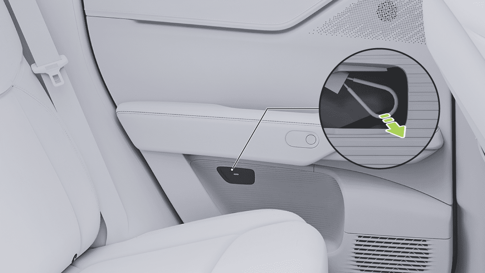

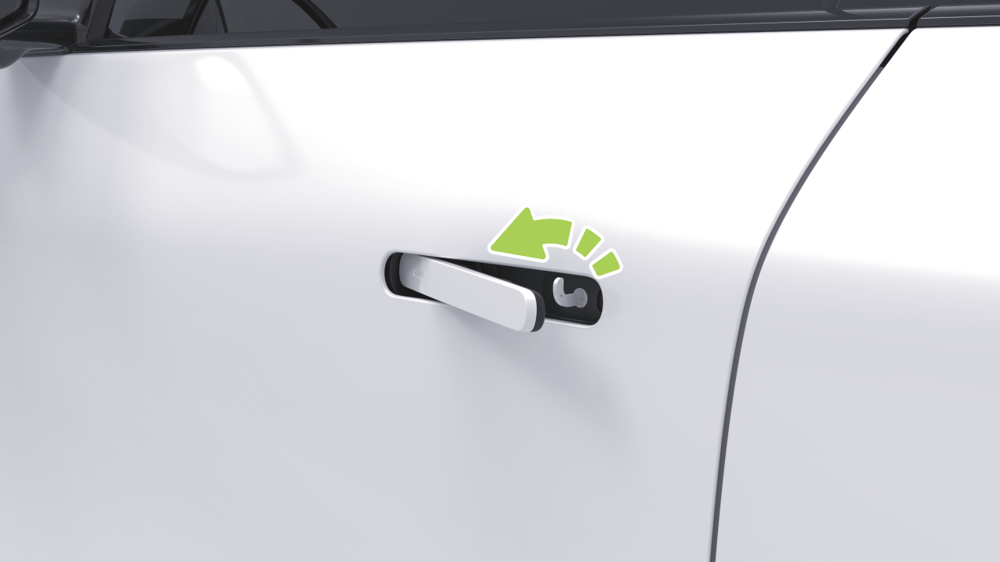

Entrada y salida

• Asegúrese de que la llave mecánica esté
completamente insertada antes de girarla. Al
desbloquear, la llave mecánica debe girarse de
nuevo a la posición inicial para poder retirarla.
Si la llave no gira durante la operación, insértela
completamente para continuar girándola.

• Voz Xpeng

• Llave de la aplicación móvil

• Tecla de acceso rápido del volante (si está configurada)

• Pantalla de control central

– Panel de accesos rápidos

• En climas de frío extremo, no fuerce la
salida de la llave si esta no regresa al usar la
puerta con la llave mecánica. Comuníquese
con el Centro de Servicio Automotriz Xpeng.

– Barra de tareas inferior (si está configurada)

• Interruptor de apertura de emergencia

– Interfaz de configuración

• La llave mecánica se suministra por separado
con el vehículo, así que guárdela en un lugar
seguro para evitar perderla.

Consejos

Al abrir/cerrar el compartimento de carga, este se
retraerá una cierta distancia si encuentra una
obstrucción.

Apertura o cierre del baúl

Introducción

Al abrir/cerrar el baúl, asegúrese de que no haya
personas ni otras obstrucciones dentro del área de
apertura/cierre del baúl para evitar lesiones
personales o daños al vehículo.

advertencia

El baúl puede abrirse o cerrarse de las
siguientes maneras:

• Interruptor exterior del baúl

• Interruptor interior del baúl

• Llave inteligente a distancia

202

Entrada y salida

Operación

Interruptor interior del baúl

Interruptor exterior del baúl

Presione el interruptor interior para cerrar el baúl, o
pausar la apertura o el cierre del baúl.

Con las puertas desbloqueadas, puede presionar el
interruptor exterior del baúl para abrir o cerrar el baúl, o
pausar el baúl que se está abriendo/cerrando.

Si el vehículo está bloqueado, mientras lleve la
llave cerca del baúl, podrá abrir el baúl.

203

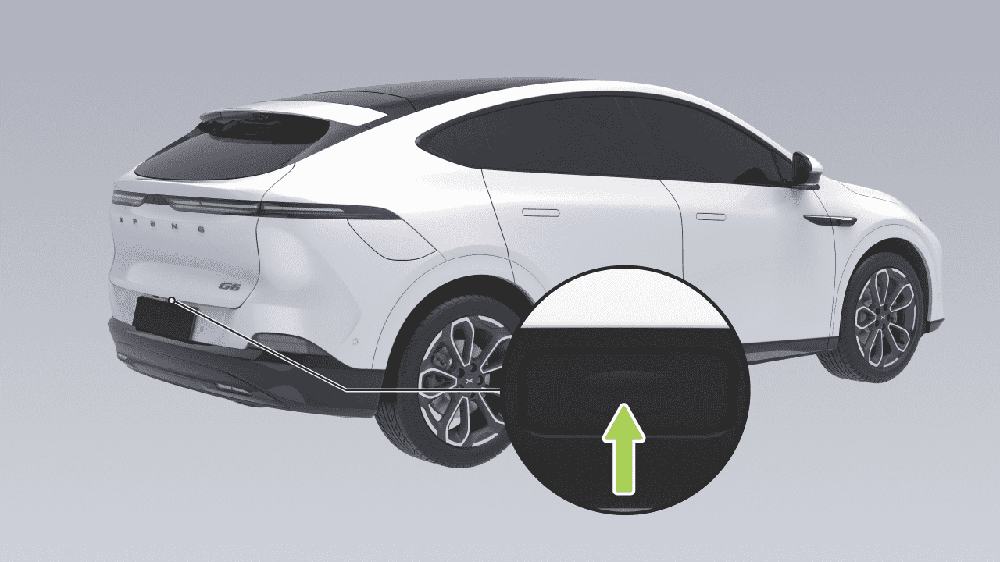

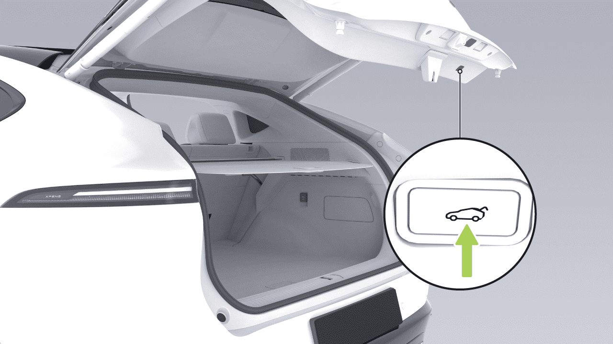

Entrada y salida

la pantalla de control central puede abrir o cerrar el
baúl.

En la CID, toque " 
 " y luego toque "Asistencia
VR en tiempo real" en el Centro de Aplicaciones o toque "Asistencia
VR en tiempo real" en la barra de tareas inferior de la CID (si
está configurada) para acceder a la interfaz de Asistencia de Realidad
Virtual en Tiempo Real. En la interfaz, toque el icono debajo
del modelo 3D para abrir o cerrar el baúl, o
gire el modelo 3D para mostrar un icono de punto de acceso en
el área del baúl, y toque el icono del punto de acceso para abrir
o cerrar el baúl.

En la CID, vaya a la interfaz " 
 →Ventanilla y puerta"
para abrir/cerrar "el Baúl". Tocar de nuevo durante
el movimiento pausará la apertura/cierre.

En la barra de tareas en la parte inferior de la CID, toque
"Baúl" (si está configurado), y podrá abrir o cerrar el
baúl.

Interruptor de apertura de emergencia

Si el baúl no se puede abrir, se puede abrir
mediante las siguientes operaciones:

204

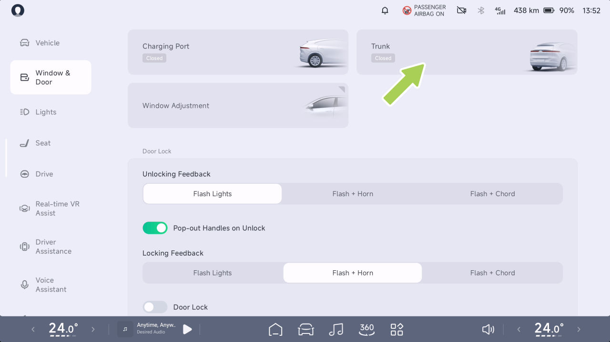

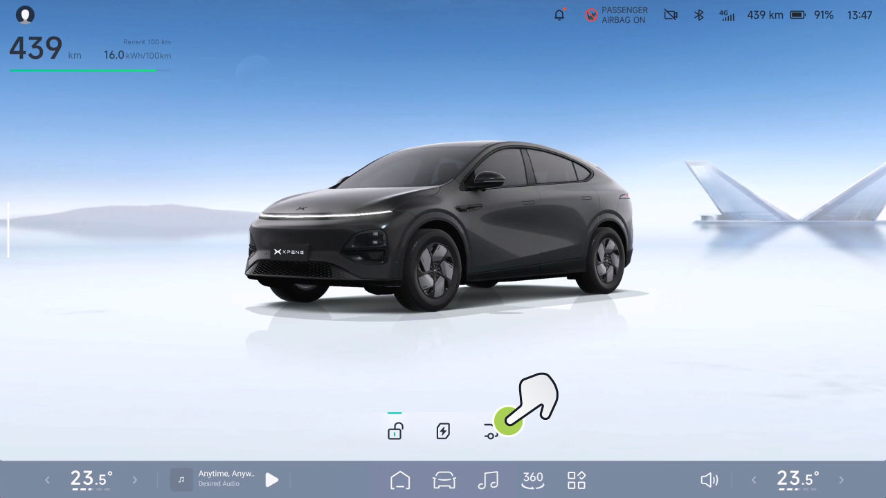

Entrada y salida

1.
Baje el respaldo del asiento trasero e ingrese
al baúl.

3. Tire de la palanca ① hacia la izquierda y manténgala, luego
presione la palanca ② para desbloquear el baúl, y
luego empuje el baúl hacia afuera para abrirlo en
caso de emergencia.

2. Presione el pestillo superior de la cubierta embellecedora del
dispositivo de desbloqueo de emergencia para retirar la
cubierta embellecedora.

Consejos

Después de la apertura de emergencia, presione hacia abajo el
baúl para cerrarlo.

Ajuste del ángulo de despliegue del baúl

El vehículo admite dos métodos (pantalla de control
central e interruptor interior del baúl) para
ajustar el ángulo de apertura del baúl:

205

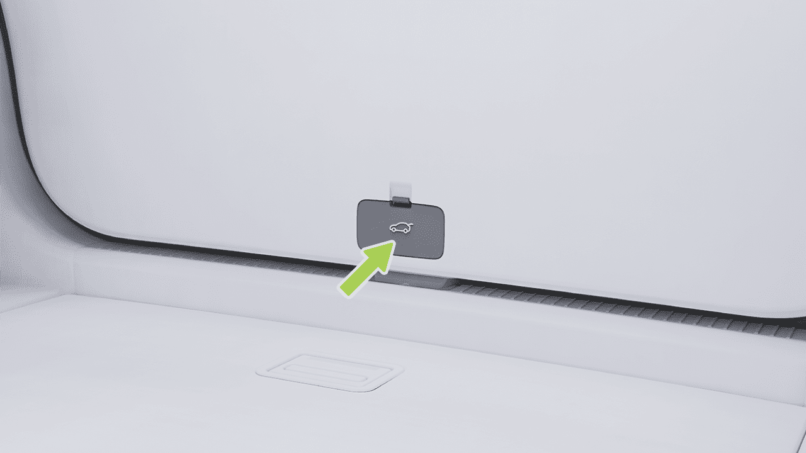

Entrada y salida

• En la CID, vaya a la interfaz " 
 →Ventanilla y puerta",
y podrá ajustar la "Memoria del ángulo de despliegue
del baúl".

puede activar o desactivar las siguientes diferentes funciones
de bienvenida.

• Cuando el baúl esté desplegado en el ángulo
deseado, mantenga presionado el interruptor inferior del baúl
hasta que vea un aviso intermitente. En este momento,
se completa la configuración del ángulo de despliegue
del baúl.

• Bienvenida del asiento del conductor

• Bienvenida del pasajero delantero

• Bienvenida de luces

Operación

• Efecto de sonido de bienvenida

Consejos

Bienvenida del asiento del conductor

Cuando se mantiene presionado el interruptor,
el ángulo de despliegue del compartimiento de carga se
ajustará al valor más bajo si el ángulo de despliegue
del compartimiento de carga está por debajo de la configuración
mínima permitida.

Cuando la función de bienvenida del asiento del conductor está
habilitada, el asiento se desliza automáticamente hacia atrás
a medida que se abre la puerta del conductor, facilitando su entrada
y salida del vehículo. Al ingresar y
cerrar la puerta de nuevo, el asiento regresa a la
posición memorizada.

Modo de bienvenida

En la pantalla de control central, ve a la interfaz
“ 
 →Ventana y Puerta→Configuración de Bienvenida”,
y podrás activar o desactivar la función de
bienvenida del conductor.

Introducción

En la CID, ve a la interfaz “ 
 →Ventana y
Puerta→Configuración de Bienvenida”, y podrás

206

Entrada y Salida

Bienvenida del pasajero delantero

precaución

Con la función de bienvenida del asiento del
pasajero delantero activada, al abrir la puerta del
pasajero delantero el asiento se deslizará
ligeramente hacia atrás, facilitando la entrada y
salida. Al entrar al vehículo y cerrar nuevamente
la puerta, el asiento vuelve a su posición
guardada.

Asegúrate siempre de que no haya
obstrucciones dentro del área de movimiento del
asiento antes de que se active la función de
aproximación del asiento, ya que podrían
producirse lesiones personales o daños al
vehículo.

Bienvenida de Luz

En la CID, ve a la interfaz “ 
 →Ventana y
Puerta→Configuración de Bienvenida”, y podrás
activar o desactivar la función de bienvenida del
pasajero.

Cuando la llave física remota se aproxima al
vehículo dentro de un radio de 8 metros, los
efectos de iluminación de bienvenida exterior se
activarán automáticamente.

Consejos

En la pantalla de control central, ve a la interfaz “ 
→Ventana y Puerta→, y podrás
activar o desactivar la Bienvenida de Luz.”Configuración
de Bienvenida

• Si el ángulo del respaldo del asiento es mayor,
el respaldo puede afectar a los pasajeros
traseros y la función de aproximación no se
activará.

• Si la posición del asiento está en una posición
retrasada y la persona ha podido salir del
vehículo fácilmente, la función de aproximación
no se activará.

Consejos

Cuando se activa la función de aproximación,
el sistema sale automáticamente de la función de
aproximación si operas las luces de forma activa
(por ejemplo, luces bajas, luces altas) o
desbloqueas el vehículo.

207

Entrada y Salida

Efecto de sonido de bienvenida

• Presiona el pedal de freno para encender.

• No se apaga durante una parada temporal.

Después de habilitar el efecto de sonido de
bienvenida, una vez que el conductor entra y
cierra la puerta del conductor, el vehículo
reproducirá música según el efecto de sonido de
bienvenida interior seleccionado.

Operación

Abre la puerta para encender.

En la pantalla de control central, ve a la interfaz
“ 
 →Ventana y Puerta→Configuración de Bienvenida”,
y podrás activar o desactivar los efectos de
sonido de bienvenida. Después de activar la
función, podrás seleccionar los efectos de sonido
de bienvenida deseados.

Se enciende si cualquier puerta (excluyendo el
maletero) se abre cuando el vehículo está
desbloqueado.

Bloquea el vehículo para apagar

Cuando el asiento del conductor está
desocupado, puedes apagar el vehículo después
de bloquearlo desde el exterior.

Encendido y Apagado del Vehículo

Introducción

El vehículo puede encenderse o apagarse de las
siguientes maneras:

• Abre la puerta para encender.

• El Interruptor de Apagado de Emergencia se
usa para Apagar.

• Bloquea el vehículo para apagar.

208

Entrada y Salida

Apagado mediante el interruptor de apagado de
emergencia*(si corresponde)

Consejos

Pulsar el interruptor de apagado de emergencia
durante un tiempo prolongado a cierta velocidad
del vehículo requiere confirmación en el
instrumento, y pulsarlo tres veces en menos de 2
segundos, haya o no velocidad del vehículo, hará
que se apague directamente.

Apagado de emergencia-CID

Se pueden utilizar las siguientes formas para el
apagado de emergencia:

• Cuando el vehículo esté detenido, mantenga
pulsado el interruptor de apagado de emergencia
durante 5 segundos para apagar directamente el
vehículo.

• Cuando el vehículo esté detenido o a cierta
velocidad, pulse el interruptor de apagado de
emergencia 3 veces seguidas en menos de 2 s
para apagar directamente el vehículo.

Cuando el vehículo esté detenido y deba
apagarse de emergencia, vaya a la interfaz “ 
→Vehículo” de la pantalla de control central y
toque “Apagar la alimentación eléctrica del
vehículo” para

209

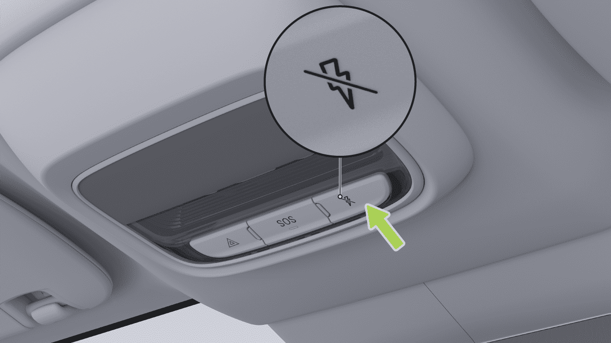

Entrada y salida

apagar la fuente de alimentación de alto voltaje y
apagar el vehículo.

Apagado automático

Pise el pedal del freno para encender

En el CID, vaya a la interfaz “ 
 →General→Seguridad
y Privacidad”, y podrá activar
o desactivar la función “Apagado automático”.
Aparecerá una ventana emergente en la pantalla
de control central que mostrará un mensaje
con una cuenta regresiva de 10 minutos hasta
el apagado automático. En ese momento, puede
tocar “Cancelar” para reiniciar la cuenta regresiva
de 1 hora.

Cuando el vehículo esté apagado, si la tarjeta
llave de comunicación de campo cercano, la llave
de control remoto o la llave del teléfono está
dentro del vehículo, pise el pedal del freno para
encender el vehículo.

Sin apagado durante paradas temporales

Cuando la función “Apagado automático” del
CID está desactivada y el vehículo está en
estado encendido, la palanca de cambios está
en la posición P. Abra la APP móvil, vaya a la
interfaz “XPENG” y toque “Parada temporal”. En la
ventana emergente de aviso, toque “Confirmar”. El
vehículo se bloqueará y la pantalla táctil y el A/C
permanecerán disponibles.

Después de activar la función “Apagado
automático”, el vehículo se apagará
automáticamente cuando se cumplan al mismo
tiempo las siguientes condiciones.

• No hay nadie sentado en el vehículo.

• Todas las puertas (incluido el maletero) y el
capó delantero están cerrados.

• El vehículo está en estado estacionado.

Si la función “apagado automático” está activada
en el CID y se cumplen las condiciones para la
ejecución del apagado automático, el vehículo
se apaga automáticamente después de una hora.

Consejos

• No se realiza ninguna operación en el plazo de
1 hora.

Consejos

Además, el vehículo se encenderá/apagará
automáticamente cuando se cumplan ciertas
condiciones.

210

Entrada y salida

• Encendido para actualización del sistema.

• Encendido solicitado por la función de
conducción.

Funcionamiento

Introducción

Recordatorio de ocupación del asiento trasero

La función de recordatorio de ocupación del
asiento trasero ofrece un servicio que detecta el
estado de los asientos traseros, los cinturones de
seguridad y otros indicadores para proporcionar
un recordatorio sobre objetos olvidados en la fila
trasera.

precaución

En la CID, andá a “
 →General→Seguridad y
Privacidad”, y podés activar o desactivar la
función “Recordatorio de Pasajeros en los
Asientos Traseros”. Una vez activada la función, si
se detecta alguna señal de actividad en los asientos
traseros, se le recordará al conductor que revise el
asiento trasero al bajar del vehículo.

No se puede garantizar que esta función sea
completamente precisa; observá con atención la
parte trasera del vehículo al bajar y nunca dejes
solos en el vehículo a niños, personas que necesiten
asistencia o mascotas.

211

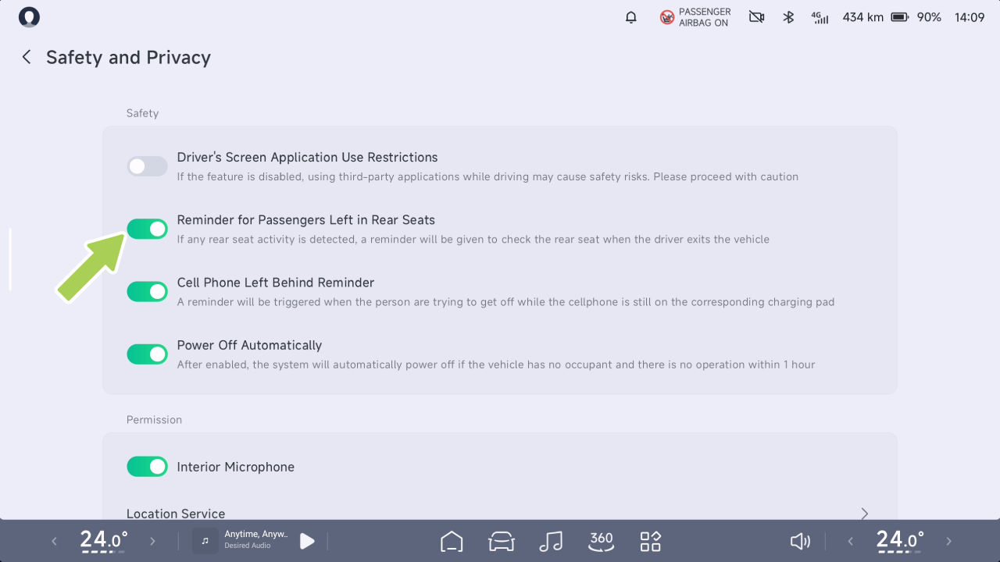