# Operación de Conducción

Driving Operation

Ajuste del Asiento

Operación

Introducción

Ajuste del asiento del conductor con el interruptor del asiento

• Interruptor del asiento

Puede ajustar los asientos por los siguientes medios:

• Interfaz de configuración de la pantalla de control central

• Voz de Xpeng

Consejos

• Si funciones como la memoria del asiento, la
aproximación del asiento, la posición del asiento o el
ajuste desde la pantalla central no se utilizan
correctamente, se puede intentar una operación de
inicialización.

• La Small P por voz no puede ajustar el respaldo
del asiento trasero.

1.
Interruptor de ajuste del asiento o del cojín

• Ajuste horizontal del asiento: Mueva el
interruptor hacia adelante o hacia atrás.

• Ajuste vertical del asiento: Empuje la parte
trasera del interruptor hacia arriba o hacia abajo.

• Ajuste de la altura del cojín: Mueva la parte
delantera del interruptor hacia arriba o hacia abajo.

2. Interruptor de ajuste del soporte lumbar

212

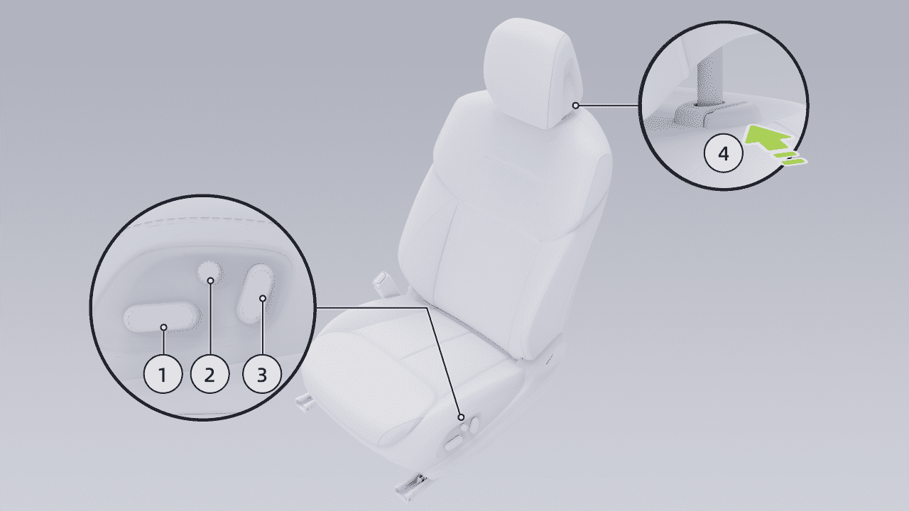

Driving Operation

• Ajuste la altura de elevación del soporte
lumbar: Accione el interruptor hacia arriba o hacia abajo.

• Extracción del reposacabezas: Presione el interruptor y
tire de él hacia arriba para retirar el reposacabezas.

• Ajuste la posición hacia adelante y hacia atrás
del soporte lumbar: Accione el interruptor
hacia adelante o hacia atrás.

Consejos

• En la interfaz de ajuste del asiento del conductor
de la pantalla de control central, después de
activar la función "Ajuste del Soporte Lumbar
del Volante", puede usar la rueda de desplazamiento
izquierda para ajustar la altura del soporte
lumbar, y la rueda de desplazamiento derecha para
mover el soporte lumbar hacia adelante y hacia atrás.

• El reposacabezas emite un sonido de "clic",
lo que indica que el reposacabezas está bloqueado
en su lugar.

• La posición más baja del reposacabezas
no es su posición de uso; eleve siempre el
reposacabezas hasta la posición de bloqueo
al utilizarlo.

3. Interruptor de ajuste del ángulo del respaldo

• Ajuste el ángulo del respaldo: Empuje la parte superior del
interruptor hacia adelante/hacia atrás.

4. Interruptor de liberación del reposacabezas

• Ajuste de la altura del reposacabezas: Empuje el
reposacabezas hacia arriba para elevarlo;
mantenga presionado el interruptor para bajar el
reposacabezas.

213

Driving Operation

Ajuste del asiento del pasajero delantero con el interruptor
del asiento

3. Interruptor de ajuste del asiento

• Ajuste horizontal del asiento: Mueva el
interruptor hacia adelante o hacia atrás.

• Ajuste vertical del asiento: Empuje la parte
trasera del interruptor hacia arriba o hacia abajo.

4. Interruptor de liberación del reposacabezas

• Ajuste de la altura del reposacabezas: Empuje el
reposacabezas hacia arriba para elevarlo;
mantenga presionado el interruptor para bajar el
reposacabezas.

• Extracción del reposacabezas: Presione el interruptor y
tire de él hacia arriba para retirar el reposacabezas.

1.
Interruptor de ajuste del ángulo del respaldo

• Ajuste el ángulo del respaldo: Empuje la parte superior del
interruptor hacia adelante/hacia atrás.

• El reposacabezas emite un sonido de "clic",
lo que indica que el reposacabezas está bloqueado
en su lugar.

Consejos

2. Interruptor de ajuste del soporte lumbar

• Ajuste la posición hacia arriba del soporte
lumbar accionando el interruptor hacia arriba o hacia abajo.

• La posición más baja del reposacabezas
no es su posición de uso; eleve siempre el
reposacabezas hasta la posición de bloqueo
al utilizarlo.

• Ajuste la altura de elevación del soporte
lumbar accionando el interruptor hacia adelante o
hacia atrás.

214

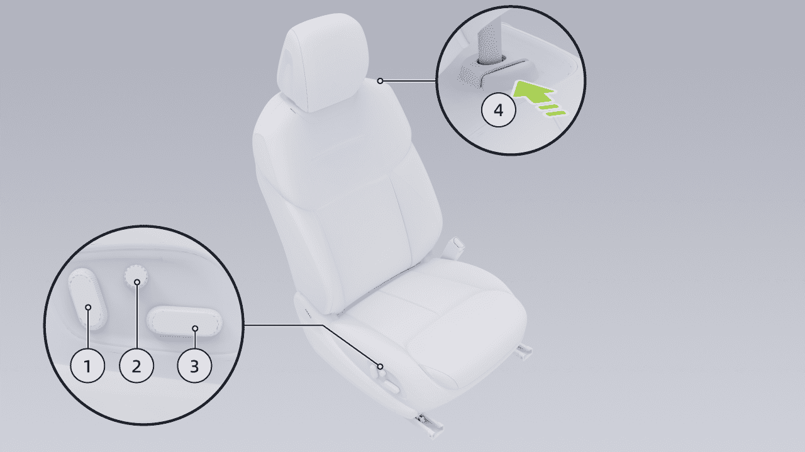

Operación de conducción

Ajuste de la altura del reposacabezas del asiento trasero

Plegado del respaldo del asiento trasero

Ajuste de la altura del reposacabezas: empuje el
reposacabezas hacia arriba para elevarlo; mantenga
presionado el interruptor del reposacabezas para bajarlo.

1.
Tire hacia adelante de la manija de desbloqueo del respaldo.

2. Pliegue el respaldo del asiento hacia adelante.

El reposacabezas emite un sonido de "clic",
lo que indica que el reposacabezas está bloqueado
en su posición.

Consejos

215

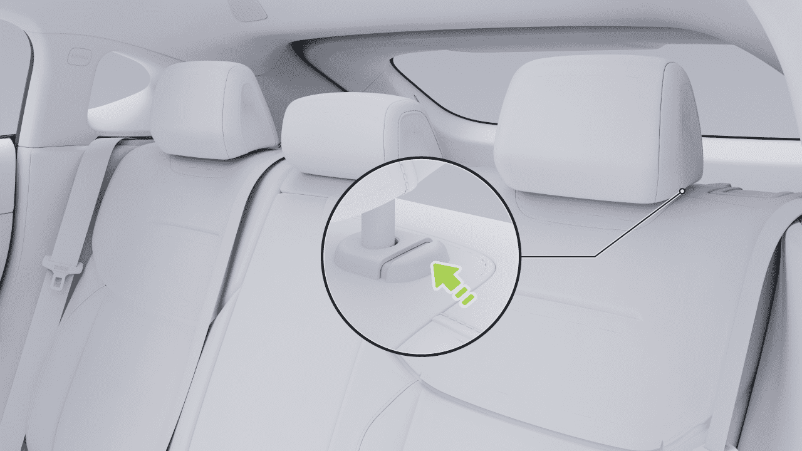

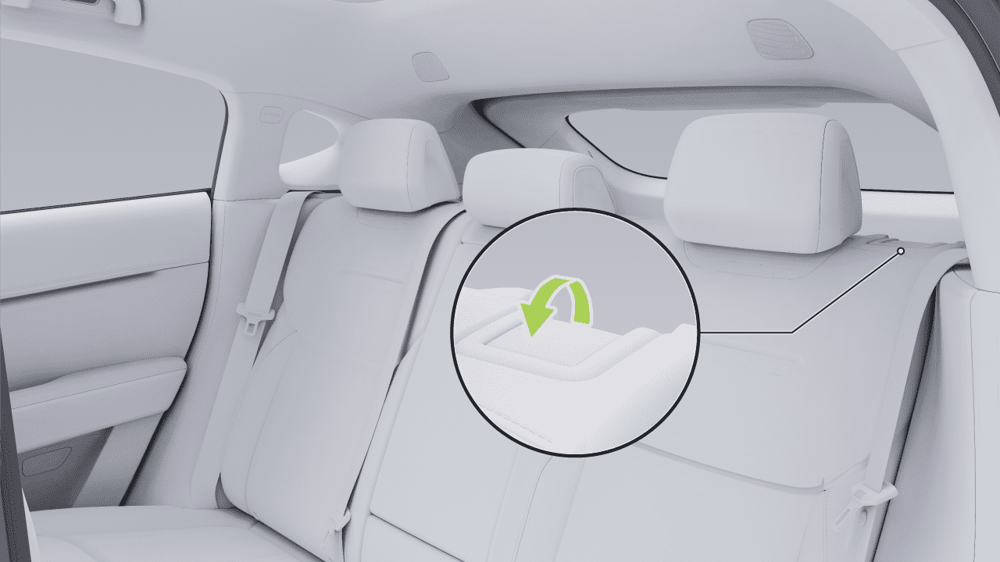

Operación de conducción

Ajuste del ángulo del asiento trasero

3. Para volver a colocar el respaldo del asiento, tire del
cinturón de seguridad, levante el respaldo hacia arriba y luego empújelo
hacia atrás para bloquearlo en su posición.

Ambos lados del cojín del asiento trasero están equipados
con manijas para ajustar el respaldo del asiento; tire de
ellas hacia arriba para modificar el ángulo del respaldo.

precaución

Cuando el respaldo esté bajado, retire los
objetos de los asientos traseros para evitar interferir
con el efecto de reclinación.

216

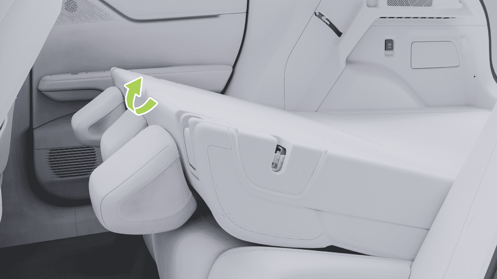

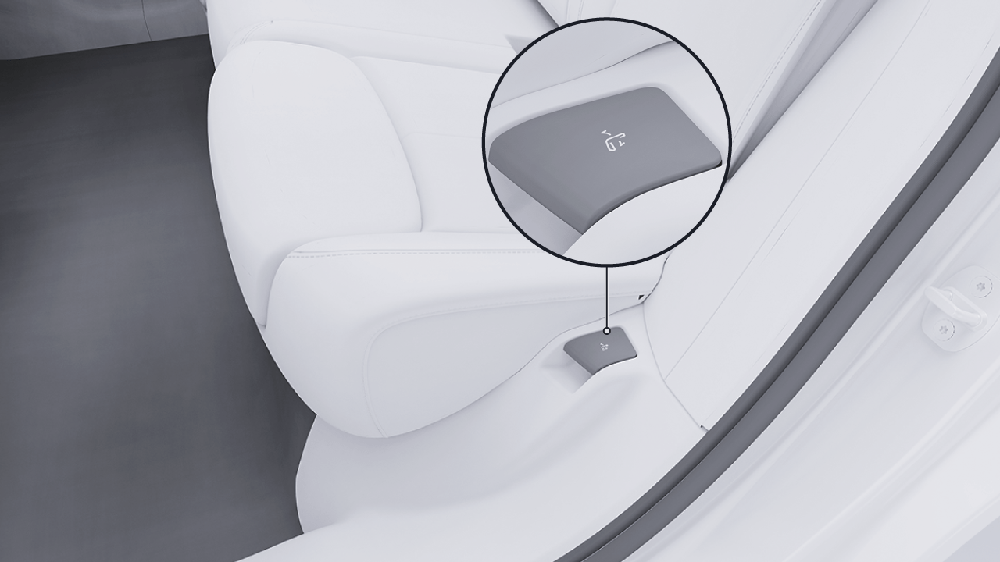

Operación de conducción

Ajuste del asiento delantero mediante la pantalla
de control central

4. Toque para recuperar la posición de memoria del
asiento seleccionado.

Consejos

• Aquí se utiliza el asiento del conductor principal y,
al hacer clic, se recupera la posición de memoria
del asiento del conductor principal y del
espejo retrovisor.

• Cuando se selecciona un asiento que no es el principal,
una pulsación prolongada cambia el nombre de la posición de memoria.

Memoria de posición del asiento

1.
Seleccione el asiento del conductor o del acompañante delantero
en la interfaz de Ajuste del Asiento de la
pantalla de control central.

En la pantalla de control central, vaya a la interfaz "
→Asiento→Ajuste", y podrá ajustar
la posición del asiento.

2. Ajuste el asiento a una posición adecuada.

1.
Toque " 
 " para seleccionar el asiento que se va a ajustar.

3. Guarde según las indicaciones de la pantalla de control
central.

2. Toque para acceder a la interfaz de ajuste del
asiento seleccionado.

Inicialización del asiento

3. Después de iniciar sesión, acceda a la interfaz de
gestión de Hábitos de Conducción para agregar Hábitos de Conducción
o cambiar el nombre de los hábitos.

Inicialización del asiento delantero

Si la funcionalidad del asiento es anormal (p. ej., el asiento
no se puede ajustar mediante los botones, el control central

217

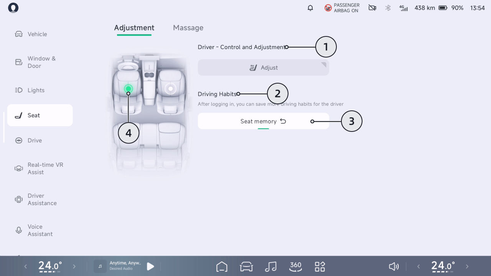

Operación de conducción

de la pantalla, o el comando de voz), puede intentar inicializar
manualmente el asiento antes de usarlo.

• No coloque los dedos ni otras partes del cuerpo
debajo del asiento, ya que esto podría causar
daños al asiento.

1.
Empuje hacia adelante el interruptor de ajuste del ángulo del respaldo
para mover el respaldo del asiento a su
posición más adelantada. Mantenga presionado el interruptor durante 1
segundo antes de soltarlo.

• No ajuste el asiento principal mientras el vehículo
esté en movimiento, ya que ajustar el asiento desviará
de la posición de conducción correcta y puede
provocar lesiones o la muerte.

2. Empuje hacia adelante nuevamente el interruptor de ajuste del ángulo del respaldo
en un plazo de 5 segundos, manténgalo
presionado durante 7 segundos y luego suéltelo. El asiento
iniciará automáticamente el proceso de inicialización.

• No ajuste el asiento con el cinturón de
seguridad abrochado, para evitar que el cinturón de
seguridad quede fuera de su uso normal, lesiones a los ocupantes y
pérdida de protección.

3. Espere hasta que el asiento se detenga por completo antes de
utilizarlo.

Advertencias, precauciones y limitaciones

No coloque alfombrillas de piso demasiado gruesas u otros
objetos extraños (como botellas de bebidas,
bolsas de carbón, etc.) en la parte inferior del
asiento del conductor/acompañante, ya que pueden quedar
atrapados entre el asiento y los rieles
guía, impidiendo el ajuste del asiento. Bloqueo, lo que
daña el asiento. Se recomienda utilizar
alfombrillas aprobadas oficialmente por XPENG
Motors.

precaución

advertencia

• Se debe tener cuidado al ajustar el
asiento para garantizar que el asiento se mueva sin
lesionar a otros ocupantes.

• El reposacabezas no está en uso cuando se encuentra
en la posición más baja y no debe
ajustarse a esta posición cuando hay un ocupante
en el vehículo.

218

Operación de conducción

Espejos laterales

• En el CID, haga clic en " 
 →Conducción→Espejos
laterales exteriores"。

Introducción

Ajuste del ángulo del espejo exterior

El espejo lateral ofrece las siguientes funciones
de ajuste:

• Ajustar el ángulo del espejo lateral mediante los
botones del volante

• Memoria para la posición del espejo lateral

• Desplegar o plegar los espejos laterales

• Inclinación automática hacia abajo al dar marcha atrás

Operación

• Plegado automático del espejo cuando está bloqueado

Acceder a la interfaz de ajuste del espejo
lateral exterior

Después de acceder a la interfaz de ajuste del espejo
retrovisor exterior, el ángulo del espejo retrovisor
exterior se puede ajustar mediante los rodillos y los
botones izquierdo y derecho a ambos lados del volante.

Puede acceder a la interfaz de ajuste del espejo
retrovisor exterior de cualquiera de las siguientes maneras:

• Asistente de voz

• Interfaz del CID

• La barra de tareas en la parte inferior del CID (si está configurada)

219

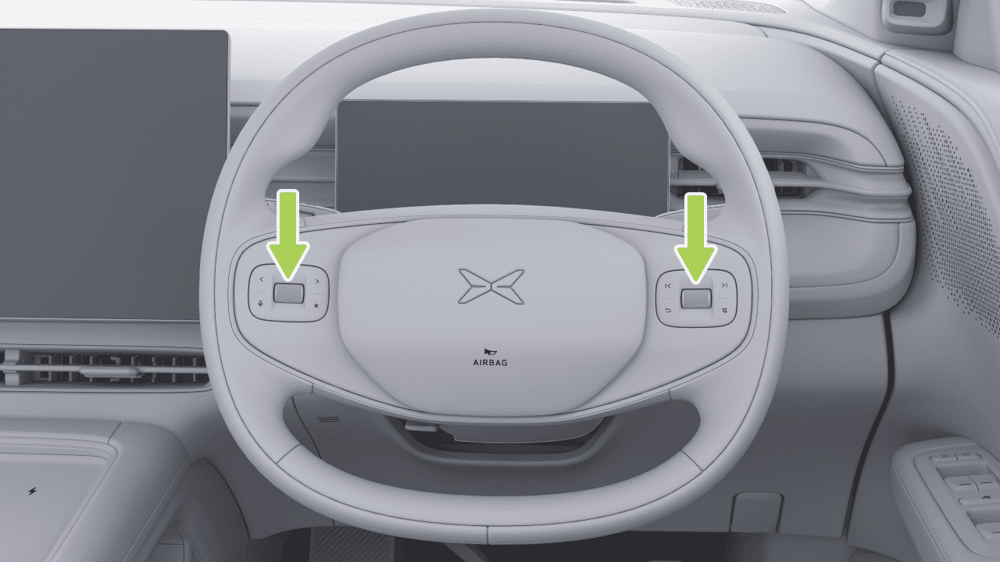

Operación de conducción

advertencia

En la interfaz de ajuste del espejo retrovisor
exterior, puede activar/desactivar las funciones "Inclinar hacia abajo el
espejo lateral izquierdo al dar marcha atrás"、 "Inclinar hacia abajo el
espejo lateral derecho al dar marcha atrás".

• Está prohibido ajustar los espejos retrovisores
exteriores mientras el vehículo está en movimiento para
evitar accidentes.

• Nunca presione manualmente los espejos exteriores
para ajustar el ángulo de inclinación.

Después de activar la función, cuando el vehículo
está en marcha R, el espejo retrovisor exterior del
lado correspondiente (con la función de plegado automático
preconfigurada) se inclinará automáticamente hacia abajo hasta un
cierto ángulo para ayudar a dar marcha atrás.

• Está prohibido modificar los espejos
retrovisores exteriores sin autorización.

Inclinar automáticamente hacia abajo el espejo retrovisor exterior
al dar marcha atrás

Consejos

Después de que el espejo retrovisor se incline hacia abajo
al dar marcha atrás, el ángulo del espejo retrovisor aún se
puede ajustar mediante los rodillos a ambos
lados del volante y los botones izquierdo y
derecho en la interfaz de ajuste del espejo retrovisor
exterior.

220

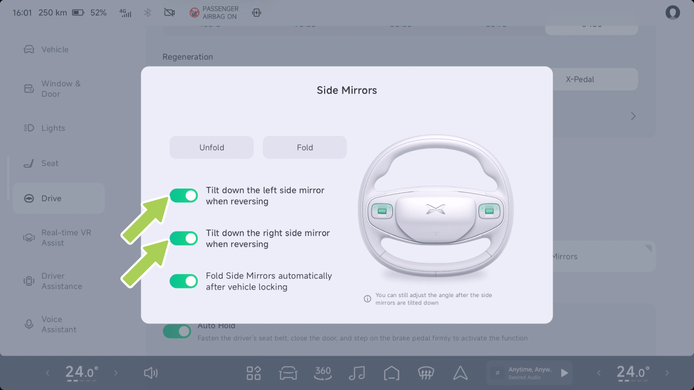

Operación de conducción

Desplegar/plegar el espejo exterior

desbloqueado y plegar cuando el vehículo está
bloqueado.

advertencia

Al desplegar o plegar los espejos exteriores,
tenga cuidado de no atraparse los dedos
entre los espejos exteriores y la base del
espejo.

Espejos exteriores calefaccionados

La función de calefacción de los espejos
retrovisores exteriores se utiliza para calentar
las lentes de los espejos retrovisores exteriores
izquierdo y derecho, lo que permite secar
rápidamente las manchas de agua o nieve en
condiciones de lluvia y nieve, mejorando la
seguridad de conducción. ，haga clic en “ 
 ”para calentar los
espejos exteriores.

1.
Desplegar/plegar los espejos exteriores

• En la interfaz de ajuste de los espejos
retrovisores exteriores, haga clic en “Plegar espejos
exteriores”. Los espejos exteriores se pueden
desplegar o plegar.

precaución

2. Plegado automático al bloquear el vehículo

• En la interfaz de ajuste de los espejos
exteriores, puede habilitar/deshabilitar la función
de plegado automático de los espejos exteriores. Cuando esta
función está habilitada, los espejos exteriores se
despliegan automáticamente cuando el vehículo está

Cuando la función de calefacción de los espejos
retrovisores exteriores está activada, no la toque con las manos
para evitar quemaduras.

221

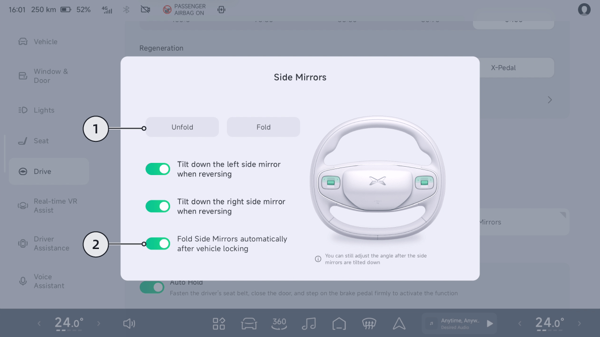

Operación de conducción

Advertencias, precauciones y limitaciones

1.
Puede configurar la función de despliegue de los espejos
laterales en la pantalla de control central mediante el siguiente
método:

restablecimiento del espejo lateral

• En la interfaz de Ajuste del espejo lateral de
la pantalla de control central, toque “Desplegar”.

• En el panel de accesos directos de la pantalla de control
central, toque “Desplegar para desplegar los espejos
retrovisores”.

• En la barra de tareas inferior de la pantalla de control
central, toque “Despliegue del espejo retrovisor” (si
está configurado).

Cuando los espejos exteriores están en estado
plegado, pueden plegarse hacia adelante o de
otra manera debido a un impacto accidental o un
empuje manual, lo que se puede configurar en el CID.

Consejos

1.
Plegado hacia adelante

2. Estado estándar

3. Plegado hacia atrás

Cuando el espejo lateral está en estado desplegado, el
espejo lateral puede plegarse hacia adelante o hacia atrás
debido a un impacto accidental o a un empuje manual. Se
puede restaurar a la posición normal con las siguientes
operaciones.

2. Empuje manualmente el espejo retrovisor a la posición
normal.

Consejos

Antes del restablecimiento manual, debe revisar la
superficie de plegado en busca de objetos extraños como nieve y

222

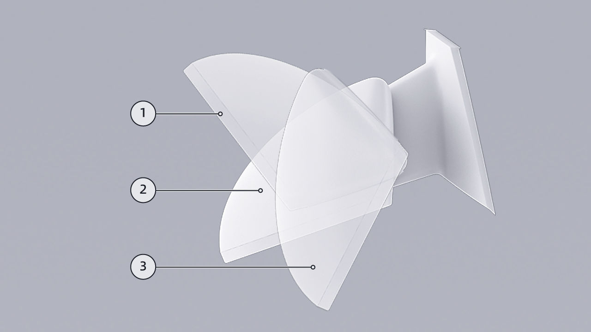

Operación de conducción

hielo, retire los objetos extraños antes de restablecer,
de lo contrario puede dañar fácilmente la estructura de
plegado del espejo exterior.

Operación

Palanca izquierda

Ajuste de luces

Introducción

• Palanca izquierda

Puede controlar las luces mediante los siguientes medios:

• Pantalla de control central

– Panel de accesos directos (solo admite el encendido o
apagado automático de los faros)

• Voz de Xpeng

– Interfaz de configuración

• Señal de giro: Tire de la palanca hacia arriba o hacia abajo
suavemente, y volverá a la posición original
automáticamente después de soltarla. En este caso,
la señal de giro del lado correspondiente
parpadeará 3 veces.

Consejos

El Asistente de Voz de Xpeng no enciende las
luces altas ni las señales de giro.

• Luz de giro: Empuje la palanca hacia arriba/abajo
hasta el tope superior/inferior, luego suéltela, y
volverá automáticamente a su posición original. La
luz de giro del lado correspondiente parpadeará.

223

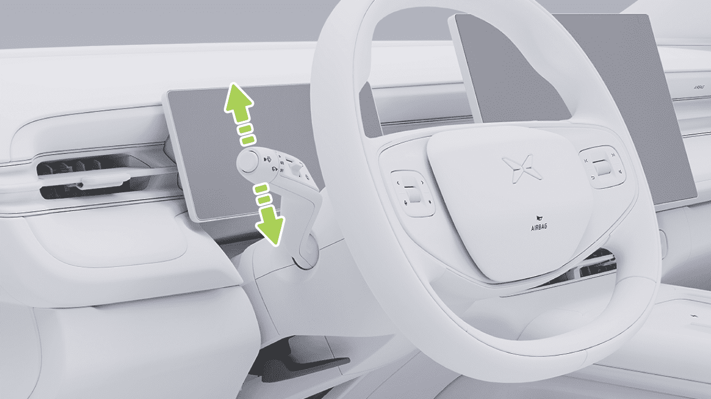

Operación de conducción

Empújela hasta la posición de luz de cambio de carril o deje que el
volante regrese a su posición original para
apagar la luz de giro.

• Luces de adelantamiento: Tire de la palanca hacia atrás
de forma continua y suéltela, y las luces
altas parpadearán.

Cuando se encienden las luces de giro, el
indicador de giro correspondiente se muestra
en el tablero de instrumentos, acompañado de
un sonido de «clic».

Consejos

Por su seguridad y la de los demás, utilice las luces
altas de forma adecuada.

precaución

Interfaz de configuración de la pantalla de control central

1.
Altura del faro:

• Luces altas: Cuando las luces bajas están encendidas, tire de la
palanca hacia adelante para encender las luces altas;
empújela de nuevo para apagar las luces altas.

• La altura del faro se puede ajustar para
adaptarse a la conducción y la carga del vehículo
según la situación.

224

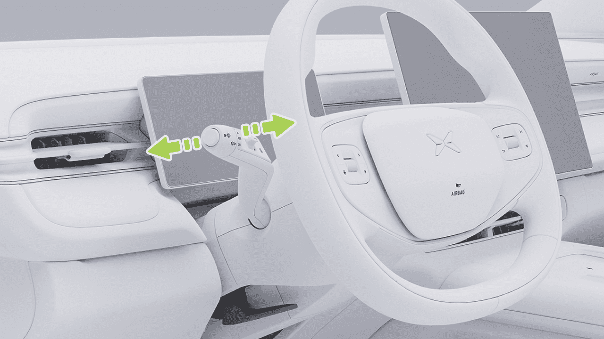

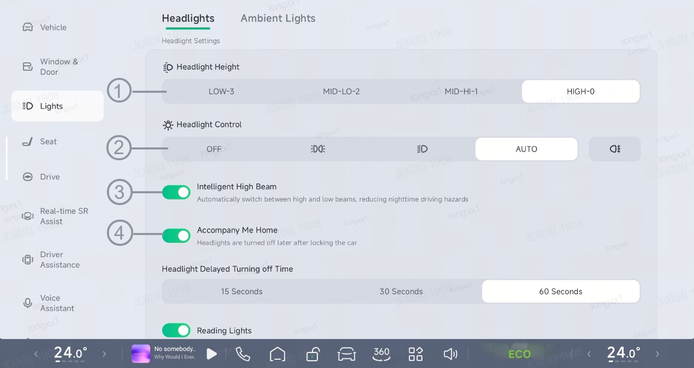

Operación de conducción

2. Control de los faros:

no se iluminan, se encenderán
simultáneamente.

• OFF: Toque para desactivar todas las luces exteriores.

•
: Toque para encender o apagar la luz
de posición y la luz de la matrícula.

3. Luces altas inteligentes: Toque para encender o apagar las
luces altas inteligentes.

•
: Toque para encender o apagar la luz baja.

4. Acompáñame a casa:

precaución

• Después de la activación, la función «Acompáñame
a casa» se activará una vez que el vehículo
esté bloqueado. Puede configurar que el faro se
apague tras un retardo de «15 s», «30 s» y «60 s».

Cuando el vehículo se desplaza en un entorno
oscuro, es necesario confirmar
dos veces en la pantalla de control central para
apagar la luz baja.

Advertencias, precauciones y limitaciones

• AUTO: Activa/desactiva automáticamente
las luces altas y bajas según
el brillo ambiental alrededor del vehículo.

La altura del faro adecuada para la conducción
y el ajuste de la carga del vehículo se puede configurar según la
situación, con la siguiente referencia.

Ajuste de la altura del faro

El panel de accesos directos del control central
también puede encender/apagar los faros automáticos.

Consejos

Posición
de altura
del faro

Condición

•
: Toque este botón para encender o apagar
las luces antiniebla traseras. Si las luces bajas

225

Operación de conducción

Solo el conductor

puede producirse empañamiento dentro de la lámpara. Si hay una
gran cantidad de gotas de agua o agua en
la lámpara, comuníquese con el Centro de Servicio de
Vehículos XPENG.

Máxima
Solo el conductor y un
pasajero delantero

Hay cinco personas en los
asientos delanteros y traseros
Más alta

Control del limpiaparabrisas

Cinco personas en los asientos
delanteros y traseros, con equipaje en
el maletero (dentro de los límites de carga
máxima permitida por eje y
peso máximo permitido del
vehículo)

Introducción

El Conmutador Multifunción del Limpiaparabrisas
puede controlar los limpiaparabrisas/luneta
delanteros y traseros y los lavaparabrisas. El uso
adecuado del limpiaparabrisas y el lavaparabrisas en
distintas condiciones meteorológicas puede mejorar
la visibilidad del conductor.

Relativamente bajo

Solo conductor, con equipaje en
el maletero (dentro de los límites
de la carga máxima admisible por
eje y del peso máximo admisible
del vehículo)

Más bajo

Es normal que, bajo ciertas condiciones de
uso, como una elevada humedad del aire o el
lavado del vehículo,

precaución

226

Operación de Conducción

Operación

En la pantalla de control central, vaya a la interfaz
“ →Ventana y Puerta”, y podrá ajustar la
sensibilidad del limpiaparabrisas automático.

• LO: Limpia a baja velocidad.

• HI: Limpia a alta velocidad.

3. Conmutador del Limpialuneta Trasero

• Empujar hacia arriba: El limpialuneta trasero
funciona/deja de limpiar.

• Tirar brevemente hacia abajo: Activa un ciclo del
limpialuneta trasero.

1.
Conmutador del lavaparabrisas

• Tirar prolongadamente hacia abajo: El lavaluneta
trasero rocía mientras el limpialuneta trasero limpia.

• Pulsar: Limpia una vez.

• Mantener pulsado: El lavaparabrisas delantero rocía
agua y el limpiaparabrisas delantero funciona.

Consejos

2. Conmutador del limpiaparabrisas delantero

Accione el conmutador del limpialuneta trasero y,
al soltarlo, el conmutador regresará
automáticamente.

Puede activar o desactivar el limpiaparabrisas
delantero girando el conmutador correspondiente.

• OFF: Detiene la limpieza.

• AUTO: Limpia en función de la lluvia.

227

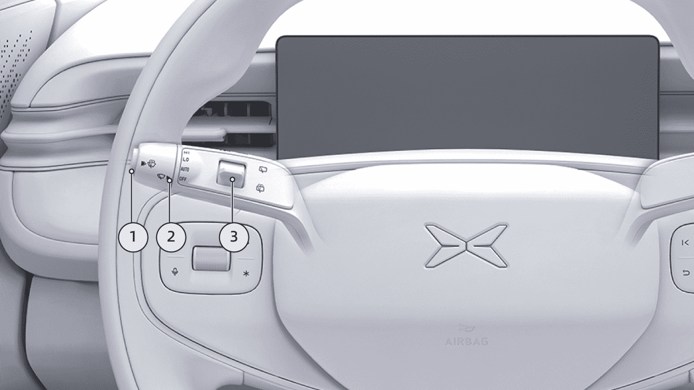

Operación de Conducción

precaución

advertencia

Al lavar con el limpialuneta trasero, cuando se
suelta el conmutador, el limpialuneta trasero
continuará barriendo 3 veces y una vez después de 10 s.

• Los limpiaparabrisas automáticos son una función
auxiliar y el conductor aún debe ajustar
manualmente los limpiaparabrisas si es necesario
para conducir de forma segura.

Advertencias, Precauciones y Limitaciones

precaución

• No limpie en seco los limpiaparabrisas sin agua; si
la lluvia es escasa, rocíe líquido lavaparabrisas
antes de usar los limpiaparabrisas para evitar dañar
el parabrisas y las escobillas.

• Antes de accionar la palanca del limpiaparabrisas,
asegúrese de que la tapa del compartimento
delantero, el maletero y la puerta principal estén
completamente cerrados.

Control del Cambio de Marchas

• Al lavar el vehículo, apague los limpiaparabrisas
automáticos para evitar daños en los
limpiaparabrisas o lesiones personales.

Introducción

• Al usar los limpiaparabrisas en condiciones
meteorológicas adversas, asegúrese de que las
escobillas no estén congeladas/pegadas al
parabrisas.

Cambie de marcha utilizando la palanca situada a la
derecha del volante.

Operación

• Si hay nieve, residuos, etc. en los limpiaparabrisas
o el parabrisas, retírelos antes de usarlos;
estacione el vehículo en una zona segura y
retírelos.

precaución

Cambie de marcha con el vehículo detenido.

228

Operación de Conducción

• Con el vehículo en la posición R, pise el pedal del
freno y empuje la palanca de cambios hacia abajo
una marcha y manténgala durante 1 s.

• Con el vehículo en la posición P, pise el pedal del
freno y empuje la palanca de cambios hacia arriba o
hacia abajo una marcha y manténgala durante 1 s.

D: Marcha (Drive)

Pise el pedal del freno y empuje la palanca de
cambios hacia abajo dos marchas para cambiar a la
posición D.

R: Marcha atrás (Reverse)

Presione el pedal del freno y empuje la palanca
de cambios hacia arriba dos marchas al mismo
tiempo para cambiar a la posición R, en cuyo caso
se enciende la luz de marcha atrás.

N: Punto muerto

El vehículo puede cambiarse a la posición N
mediante las siguientes operaciones:

• Con el vehículo en posición D, presione el pedal
del freno y empuje la palanca de cambios hacia
arriba una marcha y manténgala durante 1 s.

229

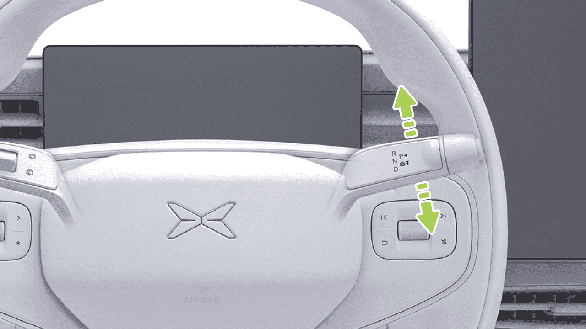

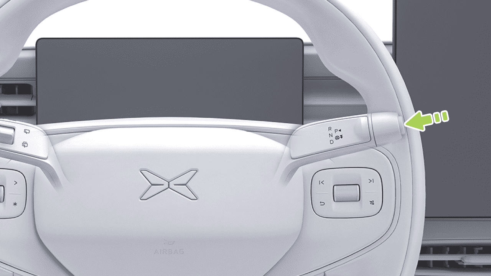

Operación de conducción

"P" - Estacionamiento:

Opere de acuerdo con la indicación y
cambie de marcha después de que se cumplan
las condiciones.

Presione el pedal del freno y presione el
interruptor de posición P en la palanca de
cambios para cambiar a la posición P.

Advertencias, precauciones y limitaciones

• En la pantalla de control central, vaya a la
interfaz " 
→Ventana y puerta", donde puede
activar o desactivar el "Acceso directo a la
marcha P". Después de cambiar a la marcha
P, puede ver las opciones de control comunes
en la esquina inferior izquierda de la pantalla
de control central. De esta manera, la operación
con un solo toque es más cómoda.

Consejos

Con el vehículo en D o R y a una velocidad
inferior a 3 km/h, sin el cinturón de seguridad
puesto y sin presionar los pedales del freno y
del acelerador, abra la puerta del conductor
principal y el vehículo cambiará automáticamente
a P.

precaución

• Después del cambio de marcha, el indicador de
marcha correspondiente en el instrumento se
pondrá negro.

• Antes de salir del vehículo o en una rampa,
asegúrese de que el vehículo esté en P para
evitar que el vehículo se mueva sin motivo.

• El vehículo cambiará a la posición P
automáticamente cuando se abra la puerta del
conductor con la palanca de cambios en posición
D o R a una velocidad inferior a 3 km/h, sin los
cinturones de seguridad abrochados y sin el pedal
del freno ni el pedal del acelerador presionados.

• Si no puede cambiar de marcha correctamente,
debe comunicarse con el Centro de Servicio
de Automóviles XPENG para obtener asistencia.

• Cuando no se cumplen las condiciones para el
cambio de marcha, el instrumento mostrará una
indicación de texto.

230

Operación de conducción

Control de frenado

Operación

Introducción

Sensación del pedal del freno

Las siguientes funciones se pueden configurar
para la operación de frenado:

• Sensación del pedal del freno

• AUTO HOLD

• Frenado confortable

• EPB

En la pantalla de control central, vaya a la
interfaz " 
 →Conducción", donde puede ajustar
la "Sensación del pedal del freno".

Seleccione una sensación adecuada del pedal del
freno según su preferencia personal.

• Confort: La respuesta de la fuerza de frenado es
suave y la experiencia de conducción es más
confortable.

231

Operación de conducción

• Estándar: La respuesta de la fuerza de frenado
es moderada, y también se garantizan el placer
de conducción y la comodidad de marcha.

En la pantalla de control central, vaya a la
interfaz " 
→Conducción", donde puede activar o
desactivar "AutoHold".

La fuerza y el recorrido estándar del pedal son
adecuados para la mayoría de los conductores.

Consejos

• Si necesita detener el vehículo durante un
breve período, puede activar AUTO HOLD y
soltar el pedal del freno. El sistema aplicará el
freno automáticamente y mantendrá el vehículo
inmóvil.

• Sport: La respuesta de la fuerza de frenado es
rápida y el control de conducción es más flexible.

• Activación de la función: Después de que el vehículo se detenga,
pise el pedal de freno con fuerza y el
indicador del tablero se iluminará para
activar el AUTO HOLD. En ese momento, suelte el
pedal de freno.

AUTO HOLD

Consejos

El estacionamiento automático solo está activo cuando la puerta
principal está cerrada, el cinturón de seguridad está abrochado y la
marcha está en D/R/N.

• Desactivación de la función: Después de que el AUTO HOLD esté
activado, pise el pedal del acelerador para
desactivar el AUTO HOLD.

232

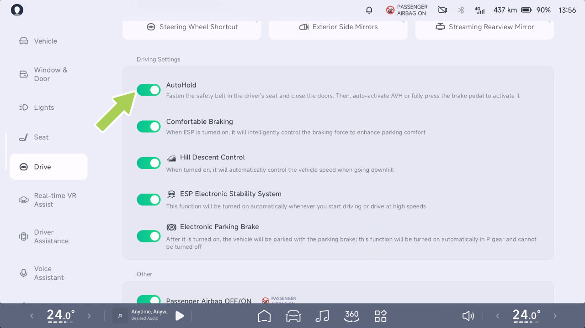

Operación de Conducción

Consejos

Frenado Confortable

• Cuando el estacionamiento automático está activo, al abrir
la puerta principal o desabrochar el cinturón
de seguridad cambia automáticamente al EPB.

• Después de un período de retención del estacionamiento automático, el
sistema cambia al EPB.

El estacionamiento automático no puede anular la
dinámica; active el estacionamiento automático
según las condiciones de la vía.

precaución

En la pantalla de control central, vaya a la interfaz “ 
 →Conducción”
y podrá seleccionar habilitar o deshabilitar
el “Frenado Confortable”.

• Una vez habilitado, el sistema controla de forma inteligente
la fuerza de frenado en el extremo del freno, liberando
automática y suavemente la presión de frenado
para mejorar el confort de frenado del vehículo y
reducir eficazmente el cabeceo por frenado.

233

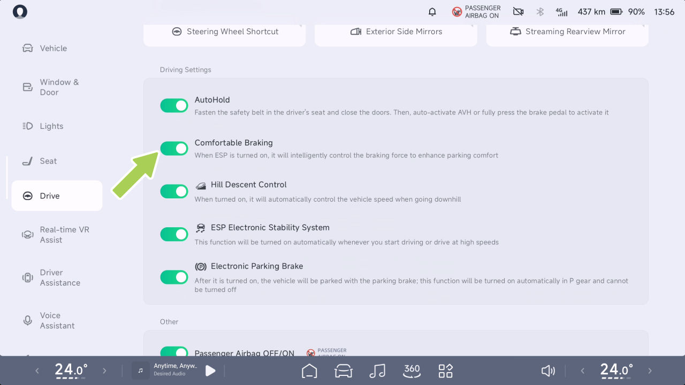

Operación de Conducción

EPB

marcha, y desactive el “Freno de Estacionamiento Electrónico”.
En ese momento, el 
 del tablero se
apaga, indicando que el EPB se ha desactivado
correctamente.

Consejos

• “”El EPB no se puede desactivar
desactivando el freno de estacionamiento electrónico cuando
el vehículo está en P.

• Es normal que el sistema haga un
ruido de funcionamiento cuando el EPB se activa/desactiva.

• En casos excepcionales, una pulsación prolongada del
interruptor P activa la función de frenado de emergencia
del EPB.

En la pantalla de control central, vaya a la interfaz “ 
 →Conducción”
y podrá habilitar o deshabilitar el
“Freno de Estacionamiento Electrónico” (EPB).

precaución

• Cuando el vehículo está detenido, active
el “Freno de Estacionamiento Electrónico” o pulse el
interruptor de posición P. El 
 del tablero se
iluminará, indicando que el EPB se ha activado
correctamente.

• Si el vehículo no acciona/cierra el
EPB correctamente, contacte de inmediato con su
Centro de Servicio de Vehículos XPENG para su reparación.

• Cuando el vehículo está detenido, pise el pedal de
freno, pise el pedal de freno, cambie a una marcha distinta de P

• Si el vehículo no puede encenderse debido a
una batería descargada, el EPB no se puede
desactivar; esto se puede solucionar cerrándolo después de un

234

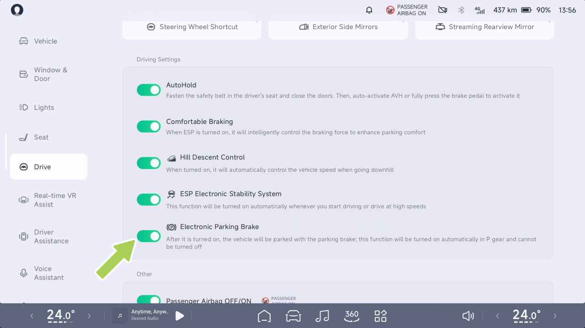

Operación de Conducción

arranque con puente o contactando con el Centro de Servicio
de Automóviles XPENG.

frenado, y el pedal de freno se siente como si pateara
el pie. En tales casos, es necesario
reducir la velocidad del vehículo y minimizar el frenado.
Permita que el disco de freno y la placa de fricción se enfríen,
y luego realice una operación de recuperación.

• No conduzca el vehículo sin haber
desactivado el EPB, ya que es altamente
susceptible a sufrir daños.

Los pasos de la operación de recuperación son los siguientes:

Precauciones y limitaciones

1.
Bloquee el vehículo y apáguelo. Espere al
menos 5 minutos. Durante este tiempo, evite sentarse
en el asiento del conductor, pisar el freno,
abrir las puertas u operar el vehículo para
asegurarse de que entre en modo de reposo completo.

Conducción a través del agua

Después de conducir a través del agua, aplique suavemente el
freno para drenar el agua y restaurar el rendimiento
del frenado. Evite el frenado de emergencia salvo que
sea necesario.

Conducción dinámica

2. Desbloquee y encienda el vehículo. Espere
al menos 15 segundos antes de abrir la puerta
e ingresar al vehículo.

En condiciones de frenado a alta velocidad, continuo y relativamente
urgente, la temperatura del disco de freno
sube rápidamente, lo que provoca una disminución de la
eficiencia del frenado. Para garantizar la seguridad, cuando
las pastillas de freno están gravemente desgastadas y la
temperatura es excesivamente alta, el sistema Integrated
Power Boost (IPB) se degrada. Se iluminan varios
testigos (MIL) en el tablero, y un sonido de "clic"
proviene del compartimento delantero cuando

3. Presione a fondo el pedal de freno con fuerza
(aplicando la máxima presión contra el respaldo del
asiento) y manténgalo así durante al menos 20 segundos.

precaución

El sistema de frenos del G6 no está diseñado para circuito;
si un usuario individual conduce de forma exigente o busca mejorar el
tiempo de vuelta en el circuito, se le solicita al usuario que

235

Operación de conducción

reemplace las pastillas de alta temperatura y enfríe
los discos cuando corresponda.

• Confort: La respuesta de potencia es moderada,
equilibrando la autonomía y el rendimiento.

Modos de conducción

• Sport: La respuesta de potencia es ágil, brindando
un placer de conducción excepcional.

Operación

• Individual: El usuario puede ajustar múltiples
parámetros para un placer de conducción personalizado.

• Modo Slip-Start: La respuesta de potencia es
suave, proporcionando el máximo par para mejorar
el rendimiento en todo tipo de terreno.

Solo en el modo "Sport" se mostrará el interruptor de
"Launch".

El modo Launch está activo únicamente durante el ciclo
de apagado actual. Si se desactiva Launch o el
vehículo se vuelve a encender, el modo Launch se
desactivará.

En la pantalla de control central, vaya a la interfaz
" →Conducción", y podrá seleccionar el modo de conducción
según sus preferencias.

Regeneración

Introducción

• ECO: La respuesta de potencia es gradual,
facilitando una mayor autonomía de conducción.

Cuando el vehículo se desplaza por inercia o frena, la
función de regeneración puede convertir parte de la

236

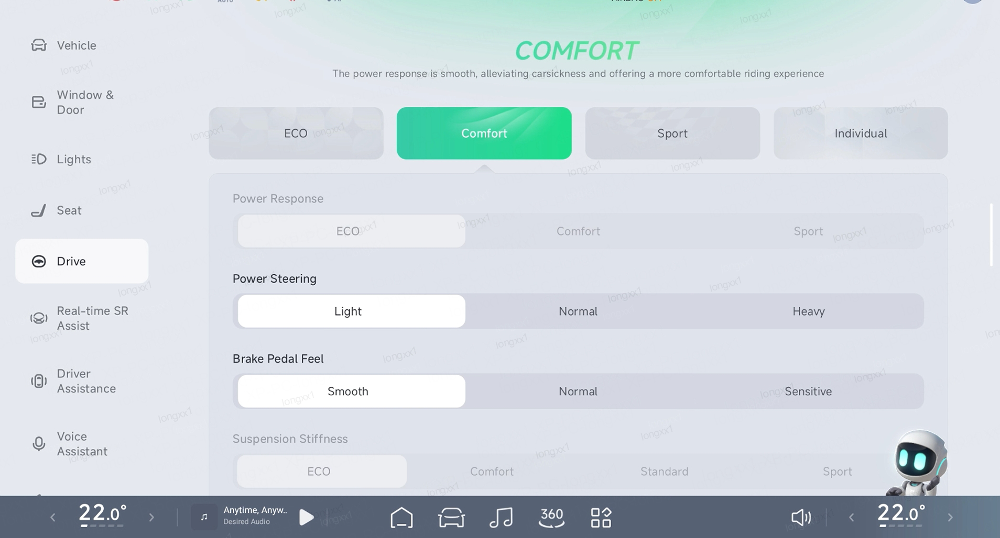

Operación de conducción

energía cinética en energía eléctrica para cargar la
batería de tracción y aumentar la autonomía de conducción.

• SOC de la batería de tracción.

• Temperatura de la batería de tracción.

Operación

2. El nivel de regeneración seleccionado.

Precauciones y limitaciones

• Los diferentes niveles de recuperación de energía
corresponden a diferentes experiencias de conducción.

Consejos

• Si la Frenada por Recuperación de Energía
reduce significativamente la velocidad del
vehículo (por ejemplo, al conducir en una
pendiente pronunciada), la luz de freno se
enciende para advertir al conductor del vehículo
que va detrás que usted está reduciendo la velocidad.

En la pantalla de control central, vaya a la
interfaz “ →Conducción”, donde puede
configurar la “Regeneración”.

• La recuperación de energía no es posible
cuando la carga de la batería es del 100%; la
recuperación de energía se reduce cuando la
batería está en un estado de carga elevado.

La cantidad de energía suministrada a la batería
de tracción mediante la regeneración depende de
los siguientes factores:

Factores que afectan la regeneración

Consejos

En tramos de bajada largos, intente utilizar el
frenado intermitente y el modo de detención o
una regeneración alta

1.
Estado actual de la batería de tracción.

237

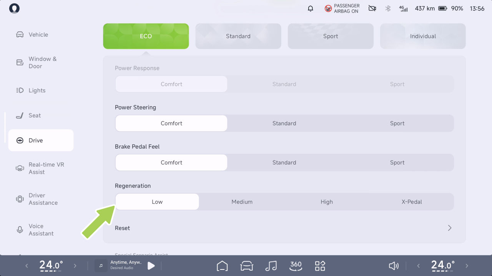

Operación de Conducción

para evitar la atenuación de la eficiencia de
frenado provocada por el frenado continuo.

En la pantalla de control central, vaya a la
interfaz “ →Conducción”. En “Dirección
Asistida”, puede seleccionar “Confort, Estándar o
Deportivo”.

advertencia

El efecto de frenado producido por la
recuperación de energía no es suficiente para
una conducción segura y el conductor debe
aplicar los frenos del vehículo de manera
oportuna, según corresponda.

• Confort: La fuerza de dirección es la mínima y
se recomienda para una conducción confortable.

• Estándar: La fuerza de dirección es moderada y
se recomienda para la conducción general.

Dirección asistida

• Deportivo: La fuerza de dirección es
relativamente pesada y se recomienda para una
conducción deportiva.

Operación

advertencia

• No ajuste la posición del volante mientras
conduce el vehículo.

• Un ajuste incorrecto de la posición del volante
puede causar lesiones personales; mantenga al
menos 25 cm de distancia entre el volante y el
pecho del conductor.

Uso de cadenas antideslizantes

Introducción

Al conducir en entornos severos como caminos
nevados o helados en invierno, se pueden utilizar
cadenas para neumáticos para

238

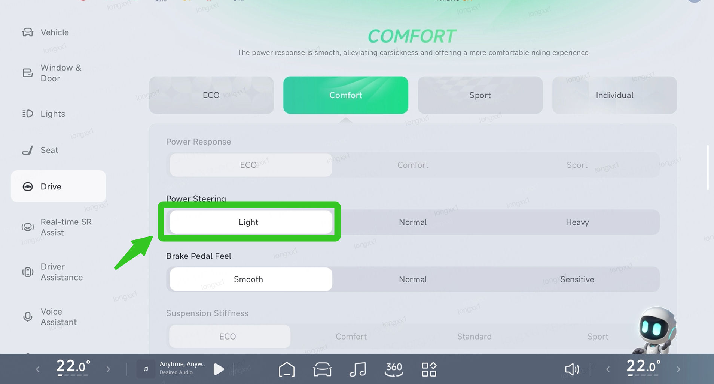

Operación de Conducción

aumentar la fricción de los neumáticos y reducir
el deslizamiento lateral. Para usar cadenas para
neumáticos, se deben seguir las siguientes
sugerencias:

condición. Durante la conducción, no supere el
límite de velocidad especificado para las
cadenas para neumáticos o los 50 km/h, lo que
sea menor.

• Las cadenas para neumáticos solo se pueden
instalar en las ruedas traseras. Las cadenas
para neumáticos deben instalarse en pares. No
se permiten cadenas para neumáticos
autotensoras.

• Es necesario instalar cadenas para
neumáticos al conducir sobre nieve profunda. El
vehículo no viene equipado con cadenas para
neumáticos, las cuales se pueden adquirir según
sea necesario. El tamaño y el tipo de cadenas
para neumáticos seleccionadas deben
ajustarse a las especificaciones de los
neumáticos del vehículo.

• No utilice cadenas para neumáticos sobre
suelo seco. Retire las cadenas para neumáticos
una vez que las superficies de la carretera estén
libres de hielo o nieve.

Las dimensiones y especificaciones de las llantas
y neumáticos adecuados para instalar cadenas
para neumáticos son las siguientes:

• Instale las cadenas para neumáticos lo más
cerca posible del neumático y vuelva a apretarlas
después de conducir entre 0,5 y 1,0 km.

Tamaño de llanta
Especificaciones de neumáticos

• Si el vehículo está equipado con tapacubos de
rueda, retírelo antes de instalar las cadenas para neumáticos.

Llanta de 18 pulgadas
235/60 R18

• Si escucha un sonido de fricción o de roce entre
las cadenas para neumáticos y el vehículo durante la conducción,
detenga el vehículo y vuelva a apretar las cadenas.
Si esto no funciona, retire las cadenas para
evitar daños al vehículo.

Llanta de 20 pulgadas
255/45 R20

• Instale las cadenas en el neumático para garantizar
una conducción equilibrada en todo tipo de clima.
Tenga en cuenta que la potencia del vehículo puede
ser insuficiente después de instalar las cadenas.
Conduzca con cuidado incluso si la carretera está en buen

239

Operación de Conducción

Luz Alta Inteligente (IHB)

Operación

Introducción

Activación y desactivación

La IHB puede cambiar automáticamente entre luz alta
y luz baja según las condiciones de los
vehículos que circulan adelante y la iluminación ambiental, para evitar
afectar a los participantes del tráfico circundante.

Indicadores en el Tablero

La IHB está habilitada y la luz
alta no está encendida.

La IHB está habilitada y la luz
alta está encendida.

En la pantalla de control central, vaya a la interfaz “ 
→Luces→Faros” y podrá activar
/desactivar la “Luz Alta Inteligente”.

La IHB tiene una falla.

Uso de la IHB

Cuando se cumplen las siguientes condiciones al
mismo tiempo, la IHB se activa y el vehículo
cambia automáticamente entre luz alta y
luz baja según el entorno de la carretera:

240

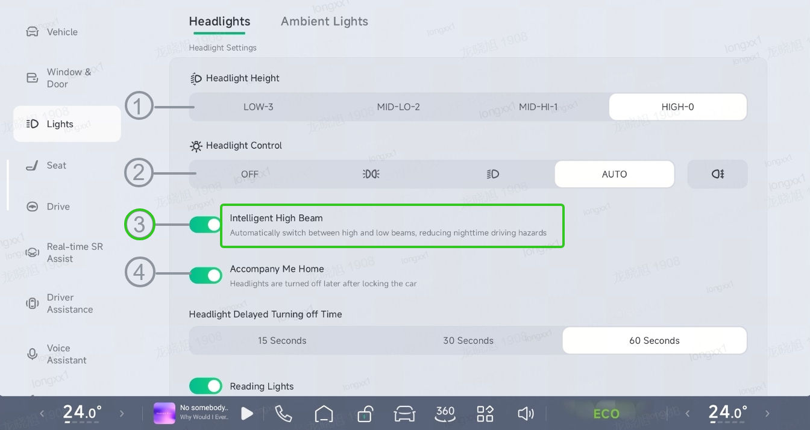

Operación de Conducción

1.
El interruptor de luces de la pantalla de control central
está en posición automática o de luz baja.

Ajuste de la Posición del Volante

2. La velocidad del vehículo es mayor a 30 km/h.

Introducción

Cuando la IHB está activa, la IHB se desactivará si la
velocidad del vehículo es menor a 15 km/h.

Consejos

Antes de conducir, ajuste la altura del volante
y su distancia respecto a su cuerpo para garantizar un
agarre cómodo y una postura de conducción óptima.

Operación

Advertencias, Precauciones y Limitaciones

Ajuste de la Posición del Volante

La IHB puede no funcionar correctamente en los
siguientes casos:

advertencia

Las advertencias, precauciones y limitaciones anteriores
no cubren todas las condiciones que pueden afectar el
funcionamiento normal de la IHB.

• Cámara restringida

1.
Ajuste a una posición de conducción adecuada.

241

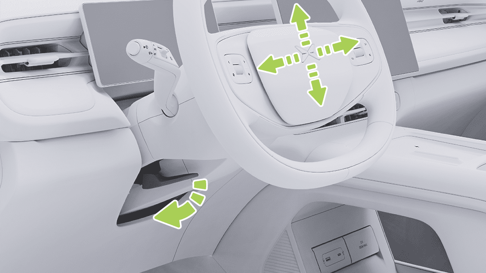

Operación de Conducción

2. Cuando el vehículo esté detenido, tire hacia abajo de la
palanca del volante para desbloquear el
volante.

pueden producirse lesiones o la muerte y daños
materiales.

3. Mueva el volante vertical y
horizontalmente hasta una posición adecuada.

• No ajuste el volante mientras
conduce.

Espejo Retrovisor Interior Antideslumbrante
Manual

Asegúrese de que la pantalla del grupo de instrumentos
y las luces indicadoras del tablero sean visibles.

precaución

Introducción

4. Tire de la palanca del volante hacia arriba para bloquear
el volante.

El ajuste manual del espejo retrovisor interior
antideslumbrante puede minimizar el reflejo de las luces
de atrás, optimizando la vista trasera.

Consejos

Después de ajustar la posición del volante,
intente mover el volante hacia arriba y abajo,
hacia adelante y hacia atrás para asegurarse de que el
volante esté bloqueado firmemente en su lugar.

Advertencias, precauciones y limitaciones

• Después de ajustar la posición del volante,
verifique que el volante esté bloqueado,

advertencia

242

Operación de conducción

Operación

Ajustar el ángulo del espejo retrovisor

• Cuando la pestaña está en el ángulo normal de
visión trasera, tirar de ella hacia adelante desviará los reflejos
de las luces traseras, logrando un efecto antideslumbrante.

• Luego tire de la pestaña hacia atrás para volver al ángulo
normal de visión trasera.

1.
Ajuste el asiento del conductor a una posición adecuada.

2. Sujete el espejo retrovisor interior y ajuste
su ángulo hacia arriba y abajo, izquierda y derecha, hasta
que pueda ver correctamente la parte trasera del vehículo
a través de él.

Consejos

Se recomienda utilizar ambas manos al
ajustar el ángulo de la lente del espejo interior.

243

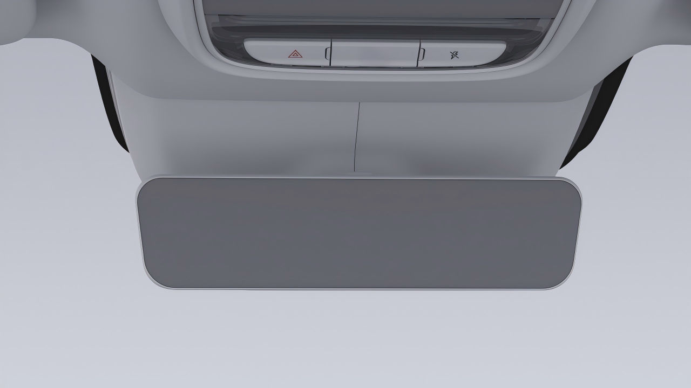

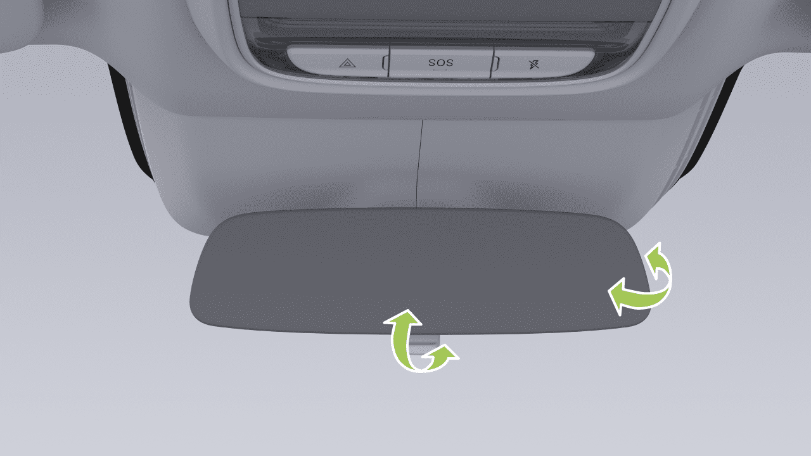

Operación de conducción

Espejo retrovisor de streaming*

2. Interruptor del espejo retrovisor de streaming

Introducción

Para garantizar un ajuste adecuado del brillo:

precaución

El espejo retrovisor de streaming puede funcionar como
un espejo común y como una pantalla de visualización. Cuando
se cambia al modo de streaming, la cámara
en la parte trasera del vehículo captura imágenes del
área detrás del vehículo para mostrarlas, manteniendo
una buena visión incluso durante el día, la noche y
en condiciones climáticas adversas como lluvia, nieve y
escarcha.

• No obstruya ni cubra la unidad
fotoconductora trasera.

• Mantenga limpia la unidad fotoconductora trasera.

Consejos

Mantenga limpia la cámara de visión trasera y elimine
cualquier suciedad.

1.
Elemento fotosensible trasero

244

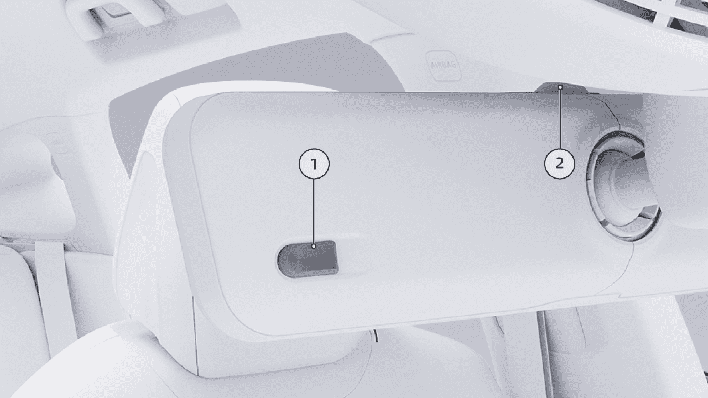

Operación de conducción

Operación

Encender o apagar el espejo retrovisor de streaming

Ajustar el ángulo del espejo retrovisor

Presione este botón para cambiar del modo de
streaming al modo de espejo común. Presione el
botón nuevamente para cambiar al modo de streaming.

1.
Ajuste el asiento del conductor a una posición adecuada.

2. Sujete el espejo retrovisor interior y ajuste
su ángulo hacia arriba y abajo, izquierda y derecha, hasta
que pueda ver correctamente la parte trasera del vehículo
a través de él.

• Después de cada encendido, el espejo retrovisor
de streaming volverá al estado de la última
memoria.

• En la pantalla de control central, también puede
ir a la interfaz “ 
 →Conducción→Espejo retrovisor de streaming”
para habilitar o deshabilitar la función del espejo
retrovisor de streaming.

Se recomienda utilizar ambas manos al
ajustar el ángulo de la lente del espejo interior.

Consejos

245

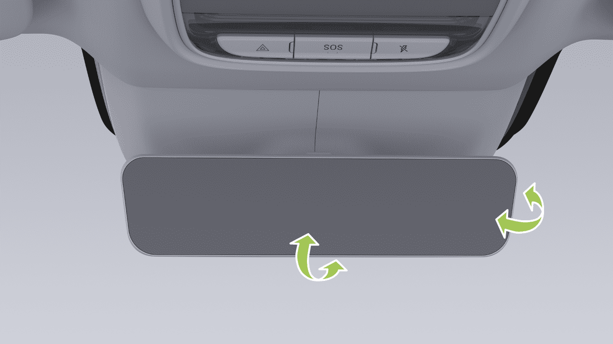

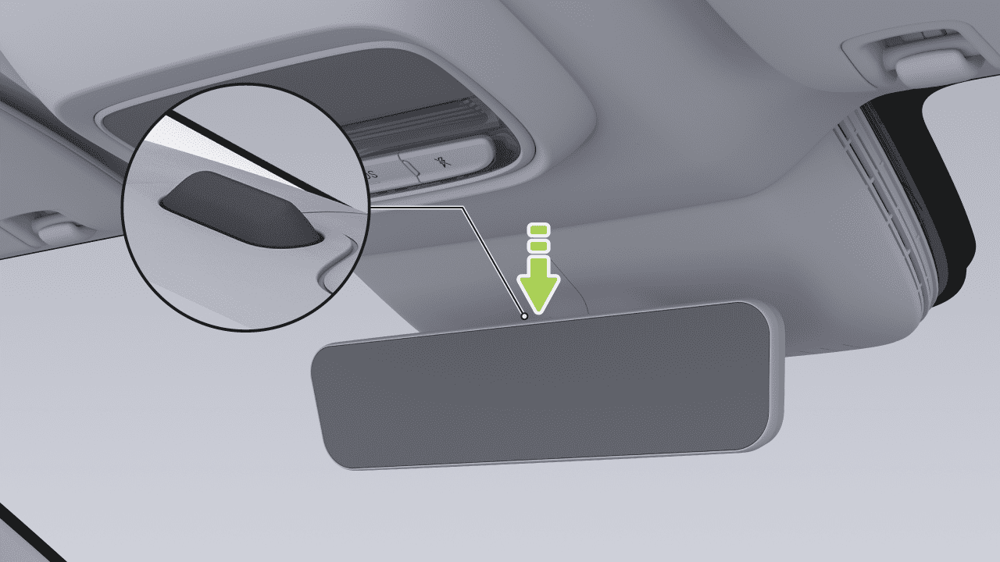

Operación de conducción

• Después de cambiar al modo de espejo normal,
ajuste manualmente el ángulo del espejo lateral interior
para lograr una observación retrovisora óptima.

• En la pantalla de control central, toque “ 
→Conducción→Espejo retrovisor de streaming”.

Encender o apagar el espejo retrovisor de streaming

Interfaz de configuración de la pantalla de control central

En la pantalla de control central, ve a la interfaz “ 
→Conducción→Espejo Retrovisor de Transmisión”.
Después de activar la función de Espejo Retrovisor de Transmisión, cámbialo al modo de transmisión multimedia.
Cuando esta función está desactivada, cambia al modo de espejo normal.

Ajuste del campo de visión

El campo de visión se ajusta modificando el ángulo de captura de la cámara para establecer el ángulo de visualización del espejo retrovisor de transmisión según los hábitos del conductor, ayudando así al conductor a observar las condiciones de la vía por detrás.

Abre la interfaz de ajuste del Espejo Retrovisor de Transmisión por cualquiera de los siguientes medios:

Ajuste manual del campo de visión

• Voz de Xpeng.

• Barra de tareas inferior (si está configurada) de la pantalla de control central.

En la pantalla de control central, ve a la interfaz “ 
→Conducción→Espejo Retrovisor de Transmisión”.
Usa la rueda de desplazamiento izquierda para acercar o alejar la imagen, y

246

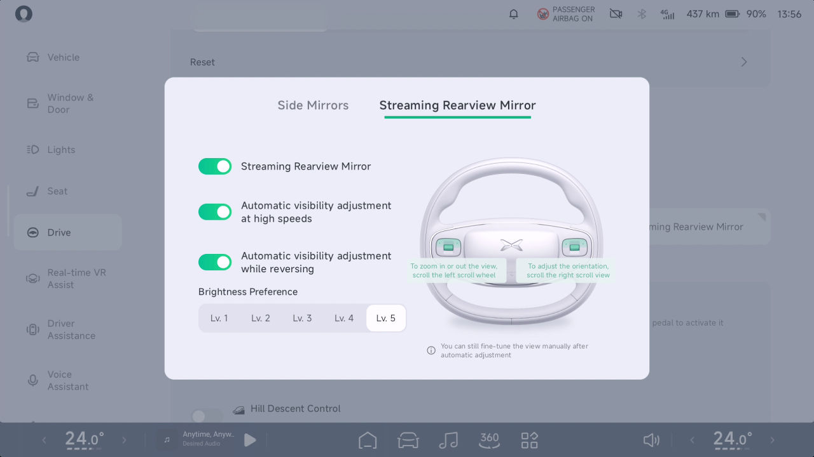

Operación de Conducción

la rueda de desplazamiento derecha para mover el campo de visión hacia arriba y hacia abajo.

o por debajo de 60 km/h durante más de 10 segundos, el Espejo Retrovisor de Transmisión restaurará su campo de visión previo al ajuste bajo el ajuste automático de visión.

Ajuste automático de la visión durante el retroceso

En la pantalla de control central, ve a la interfaz “ 
→Conducción→Espejo Retrovisor de Transmisión”. Si está activado el ajuste automático del campo de visión durante el retroceso, el Espejo Retrovisor de Transmisión ajustará automáticamente el campo de visión cuando el vehículo esté en la marcha R. Después de cambiar de la marcha R, la visión del Espejo Retrovisor de Transmisión restaurará la configuración previa al ajuste automático.

Consejos

Cuando el ajuste automático del campo de visión está activado, la posición del campo de visión aún puede ajustarse manualmente.

En la pantalla de control central, ve a la interfaz “ 
→Conducción→Espejo Retrovisor de Transmisión”.
En “Preferencia de Brillo”, puedes seleccionar “Nivel 1, Nivel 2, Nivel 3, Nivel 4 o Nivel 5”. En cada nivel de brillo, se realizará un cierto rango de ajuste automático en función de la luz ambiental.

Regulación del brillo de la pantalla

Ajuste automático de la visión a alta velocidad

En la pantalla de control central, ve a la interfaz “ 
→Conducción→Espejo Retrovisor de Transmisión”.
Después de activar la función de ajuste automático del campo de visión para altas velocidades, si el vehículo está en la marcha D y circula a velocidades superiores a 80 km/h durante más de 10 segundos, el Espejo Retrovisor de Transmisión ajustará automáticamente el campo de visión. Si la palanca de cambios se cambia a una posición distinta de D o la velocidad del vehículo se mantiene en

Advertencias, Precauciones y Limitaciones

advertencia

• El espejo retrovisor interior de transmisión es solo una ayuda y no sustituye el criterio del conductor sobre el mundo exterior.

247

Operación de Conducción

No confíes únicamente en los espejos interiores al conducir o estacionar; en todas las circunstancias, el conductor es responsable de la seguridad del vehículo y debe estar siempre atento a su entorno.

obstrucción del campo de visión, por lo que el
conductor debe observar y conducir con precaución.

• Cuando falten píxeles en la visualización en
streaming, o la imagen sea anormal de forma
parcial o total, cambie al uso del espejo
reflectante normal y comuníquese a tiempo
con el Centro de Servicio de XPENG
Automobile para su reparación.

• No instale ningún objeto alrededor del espejo
retrovisor interior para evitar que se obstruya
la observación de la carretera por parte del conductor.

• No rocíe la cámara al lavar el
vehículo con una pistola de agua a alta presión,
ya que esto puede provocar un mal funcionamiento
del sistema debido a la entrada de agua en la cámara.

• No ajuste el espejo retrovisor interior en
streaming mientras el vehículo está en
movimiento, ya que pueden producirse lesiones,
muerte y daños materiales.

• Cuando la parte trasera esté dañada, es posible que
la cámara no pueda obtener una imagen precisa;
se recomienda cambiar al espejo reflectante.

No utilice el espejo retrovisor interior en streaming
en los siguientes casos:

• Cámara restringida

• Condiciones meteorológicas adversas (por ejemplo,
lluvia intensa, nevadas intensas, niebla densa, etc.).

• Verifique la posición del espejo interior antes
de conducir y ajústela si es necesario.

• En entornos oscuros, como durante la noche
o en túneles, la luz trasera mostrada en
la pantalla presentará cierta cantidad
de dispersión y halo, lo que genera una leve

precaución

248