# Configuración de Confort

Configuración de Confort

A/C

• El A/C puede funcionar en un modo de ahorro de energía
para reducir el consumo de energía y extender
la autonomía.

Modo A/C

En la esquina inferior derecha de la interfaz de
Configuración de A/C, toca " 
 " para seleccionar diferentes modos
inteligentes de A/C según la situación.

El efecto de enfriamiento o calentamiento del aire
acondicionado se verá afectado cuando se encienda.

Consejos

3. Limpieza inteligente

• Después de que el vehículo se desbloquea, puede
detectar inteligentemente la acumulación de agua en
el sistema de A/C y activar la función de
limpieza inteligente para reducir la proliferación de bacterias
y reducir la probabilidad de olor en el vehículo.

Consejos

1. Renovación

• Elimina rápidamente los olores del vehículo con
ventilación eficiente.

Requiere una cierta cantidad de energía
para ser consumida cuando se enciende, con un pequeño
impacto en la vida útil de la batería.

2. Modo de ahorro de energía

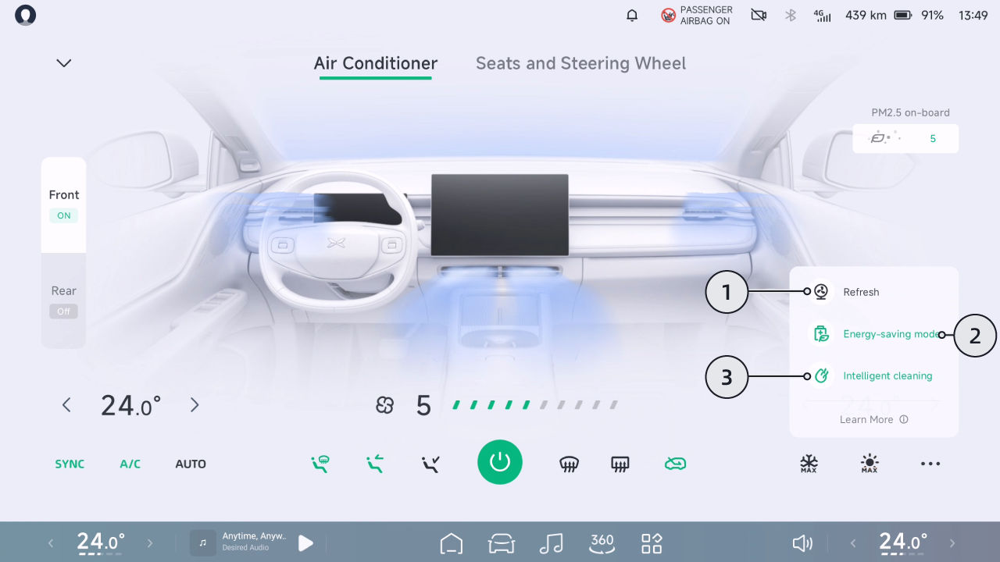

Configuración de Confort

Purificación de Aire

Puedes salir de la purificación de aire de cualquiera de las siguientes
maneras:

La función de purificación de aire determina la calidad del aire exterior
mediante sensores y red, mostrando
los datos en la interfaz de A/C.

• Durante la purificación, toca el icono de purificación de aire
en la esquina superior izquierda de la interfaz de
control de A/C nuevamente para detener la purificación.

La purificación de aire se puede activar de las
siguientes maneras:

• Durante la purificación de aire, apaga el A/C y
enciende el descongelador frontal para salir de la purificación.

• Di a Xpeng: purificación de aire.

• Durante la purificación de aire, enciende el calentamiento rápido,
enfriamiento rápido y renovación para salir de la purificación.

Ajuste de Rejillas de Aire

Las rejillas de aire en el frente y la parte trasera se pueden
ajustar manualmente.

• Toca el área debajo de PM2.5 en la pantalla de control
central para iniciar la purificación.

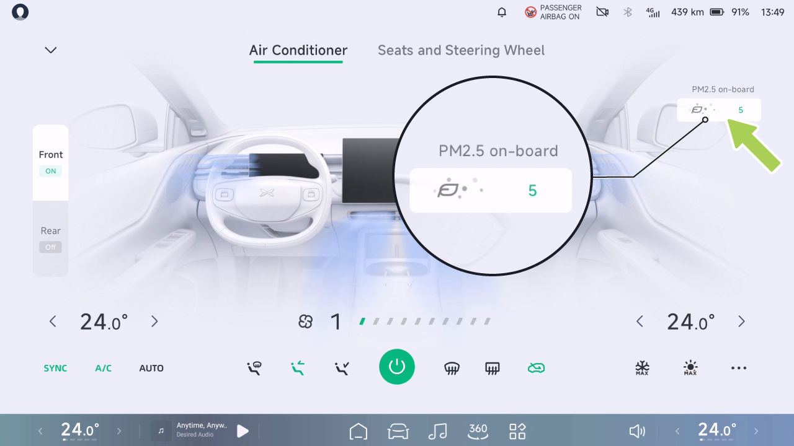

Configuración de Confort

Ajustar rejilla de aire lateral de la primera fila

Ajuste de la rejilla de aire frontal de la consola

Ajusta el flujo y dirección de aire de la rejilla deslizando
a la izquierda o derecha, ajusta la dirección deslizando
hacia arriba o hacia abajo, y cierra la rejilla de aire
deslizando completamente a la izquierda o derecha.

Ajusta el flujo y dirección de aire de la rejilla deslizando
a la izquierda o derecha, ajusta la dirección deslizando
hacia arriba o hacia abajo, y cierra la rejilla de aire
deslizando completamente a la izquierda o derecha.

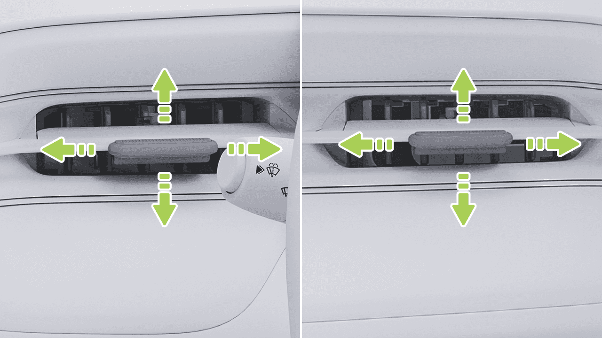

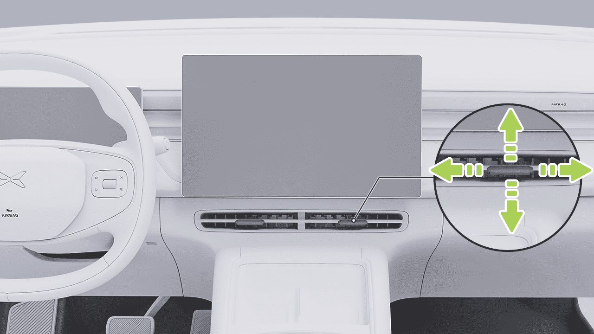

Configuración de Confort

Ajuste de la rejilla de aire trasera

Pantalla de Visualización

Ajusta el flujo y dirección de aire de la rejilla deslizando
a la izquierda o derecha, ajusta la dirección deslizando
hacia arriba o hacia abajo, y cierra la rejilla de aire
deslizando completamente a la izquierda o derecha.

1. Interruptor de aire acondicionado frontal/trasero

• Haz clic en "Primera Fila/Última Fila" para
cambiar a la interfaz de configuración de aire acondicionado frontal/trasero.

• Muestra el estado del aire acondicionado frontal/trasero encendido.

2. PM2.5

• Haz clic en la tarjeta para activar/desactivar la purificación de aire.

• Muestra la calidad del aire fuera del vehículo.

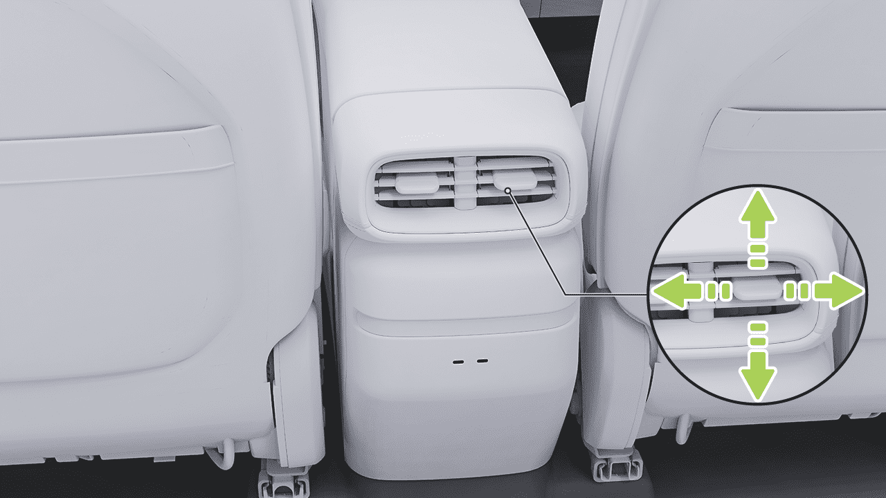

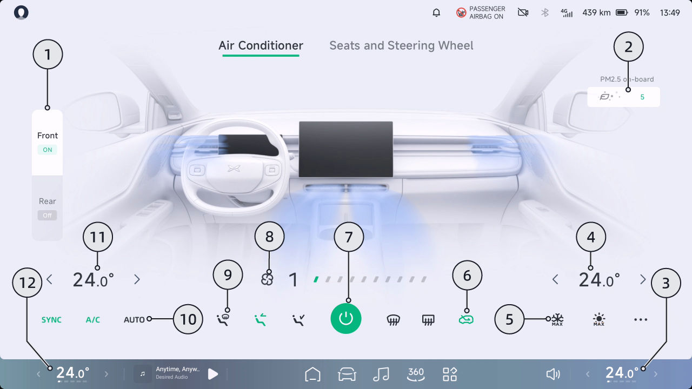

Configuración de Confort

3. Componentes del aire acondicionado del pasajero

Para mejorar la experiencia de comodidad, se
recomienda encender el aire acondicionado
de forma remota a través de la aplicación
móvil para un enfriamiento/calentamiento
rápido en verano (temperatura alta) o
invierno (temperatura baja).

• Muestra la temperatura actual y el estado
del volumen de aire del aire acondicionado
del lado del pasajero.

• Ajusta el aire acondicionado del pasajero.

•
Modo Inteligente

4. Ajustar la temperatura del pasajero

5. Control de temperatura ultrarrápido/aire
acondicionado inteligente

6. Descongelación por calor/circulación
interna y externa

•
: Encender/apagar el descongelante del
parabrisas.

•
Enfriamiento extremo: Cuando se enciende,
la temperatura del aire acondicionado se
ajustará al mínimo, el volumen de aire se
ajustará a un nivel alto y la función de
ventilación del asiento se encenderá
automáticamente.

•
: Encender/apagar la calefacción y
descongelación del parabrisas trasero y la
calefacción y descongelación del espejo
retrovisor exterior.

Durante el proceso de calefacción, si el
voltaje de la batería de 12V es inferior a 9V,
el sistema apagará automáticamente la
función de calefacción.

•
Calefacción extremadamente rápida: Después
de encenderlo, la temperatura del aire
acondicionado se ajustará al nivel máximo,
el volumen de aire se ajustará a un nivel
alto y las funciones de calefacción del
asiento y calefacción del volante se
encenderán automáticamente.

• Cuando el vehículo no está encendido,
está prohibido usar la función de
calefacción y descongelación durante
mucho tiempo para evitar que la batería
de 12V se agote

Configuración de Comodidad

y no poder encender el vehículo.

Cuando se selecciona el modo horizontal de
ahorro de energía, la sincronización de
temperatura se enciende automáticamente.

• Cuando la función de calefacción y
descongelación está activada, no la toque
con las manos.

• A/C: Encienda el aire acondicionado para
enfriar o calentar.

• AUTO: Después de encenderlo, el aire
acondicionado se controlará automáticamente
según la temperatura establecida.

•
: Cambiar entre circulación interna y
externa.

7. Encender/apagar el aire acondicionado
frontal

Se recomienda no encender el sistema de
aire acondicionado durante la carga.

11. Ajustar la temperatura de conducción
principal

8. Ajustar el volumen de aire

12. Componentes del aire acondicionado del
conductor

• Muestra la temperatura actual y el estado
del volumen de aire del aire acondicionado
del conductor principal.

• Ajusta el aire acondicionado del conductor
principal.

•
9. Modo de soplado

•
: Soplado de ventanas.

• 
: Soplado facial.

•
: Soplado de pies.

10. Modo de aire acondicionado

• Haga clic en "SYNC" Abrir/cerrar la
temperatura del asiento del conductor y la
temperatura del asiento del pasajero para
ajustar sincronizadamente.

Configuración de Comodidad

Volante

• Gire hacia arriba y hacia abajo para ajustar
la temperatura del A/C.

Tecla del Volante

• Mantén presionada para entrar en el modo de cambio de tarjeta
en la pantalla izquierda del panel de instrumentos,
desplázate hacia arriba o hacia abajo para seleccionar tarjetas y toca
para confirmar tu selección.

• Cuando ACC/LCC está activado, desplázate hacia arriba
o hacia abajo para ajustar la velocidad del vehículo
de forma incremental.

• Después de activar el ajuste del espejo lateral,
desplázate hacia arriba y hacia abajo para girar el espejo lateral izquierdo.

• En la interfaz de ajuste del Espejo Retrovisor de Transmisión*,
desplázate hacia arriba y hacia abajo para
ampliar o reducir el campo de visión del Espejo Retrovisor de Transmisión.

1.
Botones izquierdo y derecho:

• Por defecto: Ajusta la velocidad del soplador del aire acondicionado.

• Con ACC/LCC activado, ajusta la distancia de crucero.

3. Tecla de acceso directo del volante:

• Después de activar el ajuste del espejo lateral,
controla el espejo lateral izquierdo para girar
hacia la izquierda o hacia la derecha.

Toca y mantén esta tecla presionada para establecer su función,
y tócala para ejecutar la función establecida.

4. Botón de activación por voz:

2. Botones de desplazamiento superior e inferior:

Activa o cancela la voz de Xpeng.

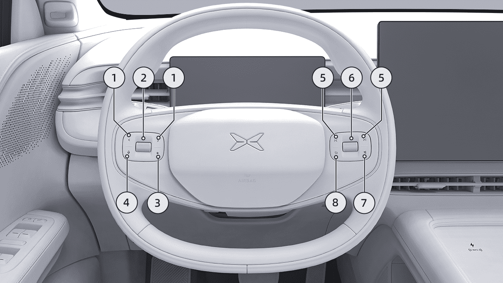

Configuración de Confort

5. Botón de canción anterior o siguiente:

• En la interfaz de ajuste del Espejo Retrovisor de Transmisión*,
desplázate hacia arriba y hacia abajo
para ajustar las posiciones superior e inferior del
campo de visión del Espejo Retrovisor de Transmisión.

• Toca para reproducir la estación de radio, capítulo o canción anterior o siguiente.

• Después de activar el ajuste del espejo lateral,
controla el espejo lateral derecho para girar
hacia la izquierda o hacia la derecha.

7. Botón de silencio: toca para silenciar o activar el sonido.

6. Botones de desplazamiento superior e inferior:

8. Tecla de retorno.

• Desplázate hacia arriba y hacia abajo para ajustar el volumen multimedia.

Claxon

• Toca reproducción multimedia, pausa o ventana emergente
para confirmar.

• Toca y mantén presionada para entrar en el estado de selección de tarjeta
en el lado derecho del panel de instrumentos.

• Cuando hay una llamada telefónica, desplázate hacia arriba/abajo
para seleccionar Responder/Rechazar y toca la rueda de desplazamiento
para confirmar. Durante la llamada, tócalo para colgar.

• Después de activar el ajuste del espejo lateral,
desplázate hacia arriba y hacia abajo para girar el espejo lateral derecho.

Toca el área del símbolo del claxon para sonar el claxon.

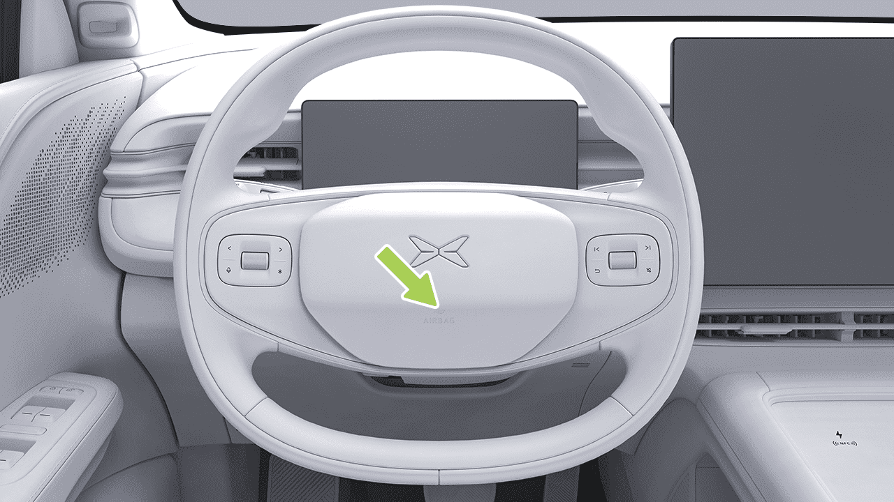

Configuración de Confort

precaución

Tecla de acceso directo del volante

No presiones el área de identificación del claxon durante períodos prolongados,
ya que esto puede dañar el claxon.

Función de emergencia de la tecla

Toca y mantén presionado el botón de activación por voz y el botón de silencio
al mismo tiempo para reiniciar el panel de instrumentos y la pantalla de
control central.

Esta función se puede usar temporalmente en casos como
visualización anormal del panel de instrumentos o pantalla de control central
y congelación repentina de pantalla. Si el fallo persiste después del reinicio,
ponte en contacto con el Centro de Servicio de XPENG para
mantenimiento en el momento oportuno.

Toca y mantén presionada la tecla de acceso directo del volante
o ve a "
→Conducción→Acceso Directo del Volante"
en la interfaz de la pantalla de control central. Puedes
establecer la función de la tecla de acceso directo del volante.

Calefacción del Volante

El volante climatizado se puede controlar de las siguientes formas:

• Tecla de Aplicación Móvil

• Asistencia de Voz de Xpeng

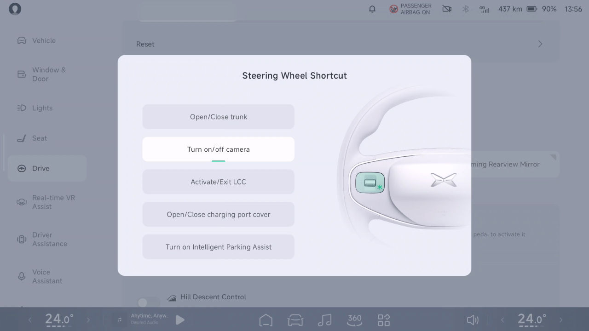

Configuración de Comodidad

• CID

• Voz Xpeng

• Clave de aplicación móvil

– Barra de tareas inferior (según se configure)

– Interfaz de configuración

• Interfaz de configuración de la pantalla de control central

Interfaz de configuración de CID

Consejos

En la interfaz de configuración del aire acondicionado véase página 252, haga clic en "Asientos y Volante" para acceder a la interfaz de configuración.

• No cambie de ventana repetidamente en un corto período de tiempo, ya que esto activará la protección térmica de la ventana. La función de elevación de la ventana fallará después de la protección térmica. Espere aproximadamente 2 minutos antes de operar.

Haga clic en " 
 " para activar la función de calefacción del volante, configure la marcha a la 3ª marcha y haga clic repetidamente para alternar entre la 2ª marcha, 1ª marcha, apagado y 3ª marcha.

• Cuando la ventana está cerrada, si se encuentra un obstáculo en el área anti-atrapamiento, la ventana dejará de cerrarse e invertirá su movimiento una distancia.

Ventana

• Si la ventana se cierra con un toque y la función anti-atrapamiento está deshabilitada, se puede realizar la inicialización de la ventana.

Introducción

Las ventanas pueden abrirse o cerrarse de las siguientes formas:

advertencia

• Interruptor de ventana

– Interruptor de ventana del lado del asiento del conductor

• Para garantizar la seguridad cuando hay niños en el vehículo, bloquee el vidrio del pasajero hacia arriba y hacia abajo para evitar que los niños operen las ventanas y evitar pellizcos.

– Interruptor de ventana del lado del pasajero

Configuración de Comodidad

• Aunque las ventanas están equipadas con anti-atrapamiento, aún existe riesgo de pellizco al cerrar las ventanas. No use ninguna parte de su cuerpo para bloquear el cierre de las ventanas para activar el anti-atrapamiento.

Operación

Interruptor de ventana del lado del asiento del conductor

• Antes de cerrar las ventanas, el conductor debe asegurarse de que todos los pasajeros, especialmente los niños, no sobresalgan ninguna parte de su cuerpo fuera de la ventana. ¡De lo contrario, existe riesgo de pellizco!

• Cuando se activa la función de bloqueo automático de ventanas, las ventanas se cerrarán automáticamente cuando el vehículo se bloquee. Asegúrese de que las ventanas no atrapen a ocupantes u obstrucciones y de que no haya ocupantes en el vehículo, especialmente niños. Luego bloquee.

1. Interruptor de regulador de ventana de la puerta delantera izquierda

2. Interruptor de regulador de ventana de la puerta delantera derecha

3. Interruptor de bloqueo del regulador de vidrio de la puerta del pasajero

4. Interruptor de regulador de ventana de la puerta trasera derecha

5. Interruptor de regulador de ventana de la puerta trasera izquierda

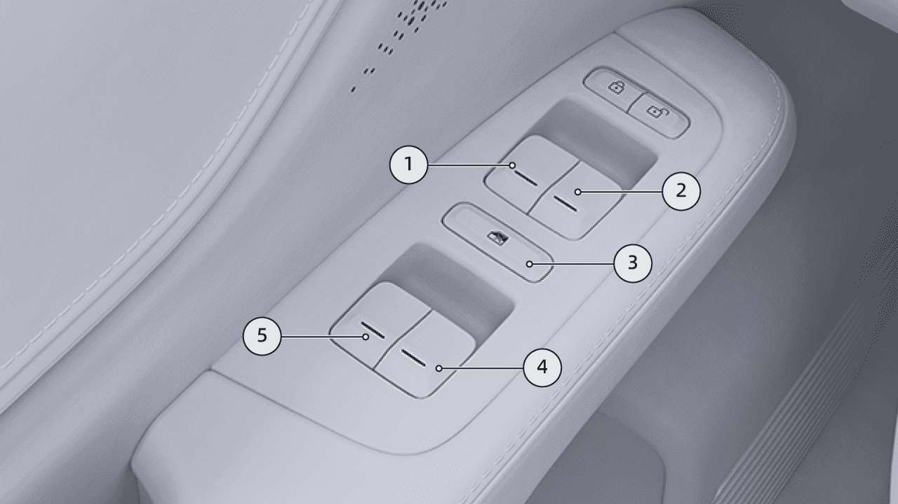

Configuración de Comodidad

Interruptor de ventana del lado del pasajero

Las otras puertas están deshabilitadas y todas las ventanas solo pueden ajustarse mediante el interruptor de ventana de la puerta del conductor.

Interfaz de configuración de la pantalla de control central

Tire del interruptor del regulador de ventana hacia arriba/abajo hasta la segunda marcha, y la ventana se moverá automáticamente a la posición completamente cerrada/abierta.

Tire del interruptor del regulador de ventana hacia arriba/abajo hasta la primera marcha y manténgalo en esta posición. Luego, la ventana comienza a subir/bajar. Suelte el interruptor y la ventana dejará de moverse.

En la pantalla de control central, vaya a
" 
 →Ventana y Puerta→Ajuste de Ventana"
interfaz, y puede configurar "Abrir Todo, Ventilar
o Cerrar Todo". También puede deslizar hacia
arriba y hacia abajo en el área de ventana para
el ajuste.

Cuando la función de deshabilitación del
interruptor de ventana del pasajero está
activada, el indicador en el interruptor se
ilumina. En este momento, los interruptores de
ventana en

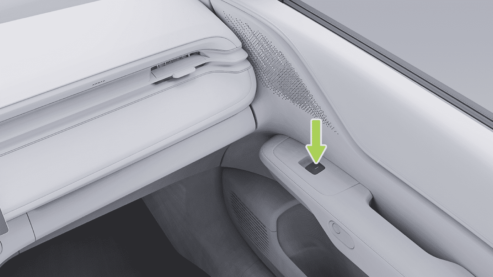

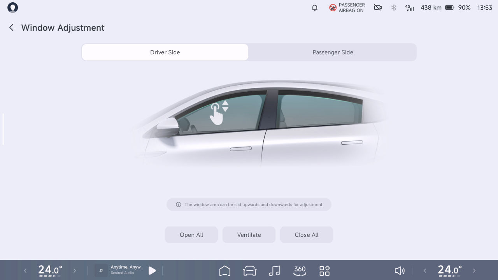

Configuración de Confort

Consejos

cerrada en conducción a alta velocidad y cuando
se conduce a alta velocidad.

Cuando los bloqueos de ventana están
abiertos, los interruptores de ventana en las
otras puertas están deshabilitados y todas
las ventanas solo se pueden ajustar desde los
interruptores de ventana del lado del conductor.

Inicialización de la ventana

La inicialización de la ventana se puede realizar
si la función de la ventana es anormal (como
falla de subida o bajada de una tecla, ajuste de
pantalla de control central y voz):

Bloqueo de ventana

En la pantalla de control central, vaya a " 
→Ventana y Puerta→Modo Bebé en Auto" interfaz,
y puede activar o desactivar el bloqueo de
ventana.

1.
Encienda el vehículo y cierre la puerta.
Tire suavemente del interruptor de ventana a
la posición de primer engranaje (modo manual
hacia arriba), cierre completamente todas las
ventanas y mantenga durante 3 segundos,
luego suelte.

Cierre automático de ventanas

En la pantalla de control central, vaya a " 
→Ventana y Puerta" interfaz, y puede activar o
desactivar las funciones "Cerrar Ventanas
Automáticamente después de Bloquear el
Vehículo" y "Cerrar Ventanas Automáticamente
al Viajar a Alta Velocidad".

2. Presione firmemente el interruptor de
ventana a la posición de segundo engranaje y
suéltelo (modo automático hacia abajo). La
ventana se bajará automáticamente a la posición
de abierto todo y se detendrá.

Consejos

3. Tire firmemente del interruptor de ventana
hacia arriba a la posición de segundo engranaje
(modo automático hacia arriba), y se detendrá
después de alcanzar la posición completamente
cerrada.

Se recomienda activar el modo de ciclo externo
cuando la ventana se cierra automáticamente

Configuración de Confort

Los siguientes pasos pueden determinar si el
aprendizaje de inicialización se ha completado.
Si todos los pasos funcionan normalmente, la
inicialización es exitosa:

Parasol y Espejo de Vanidad

Introducción

1.
Siguiendo el procedimiento en el paso dos
anterior, verifique si la ventana puede bajar
automáticamente a la posición completamente
abierta.

Parasol

2. Siguiendo el procedimiento en el paso tres
anterior, verifique si la ventana puede subir
automáticamente a la posición completamente
cerrada.

PRECAUCIÓN

• El proceso de configuración de apertura y
cierre global toma menos de 15 segundos.

• La configuración de apertura y cierre global
debe completarse en sucesión; solo uno de
estos pasos puede causar que la función
anti-trampa falle y requiera dos pasos
consecutivos para evitar este riesgo.

El parasol se puede girar hacia abajo en la
dirección de la flecha para bloquear la luz solar
que entra a través del parabrisas delantero.

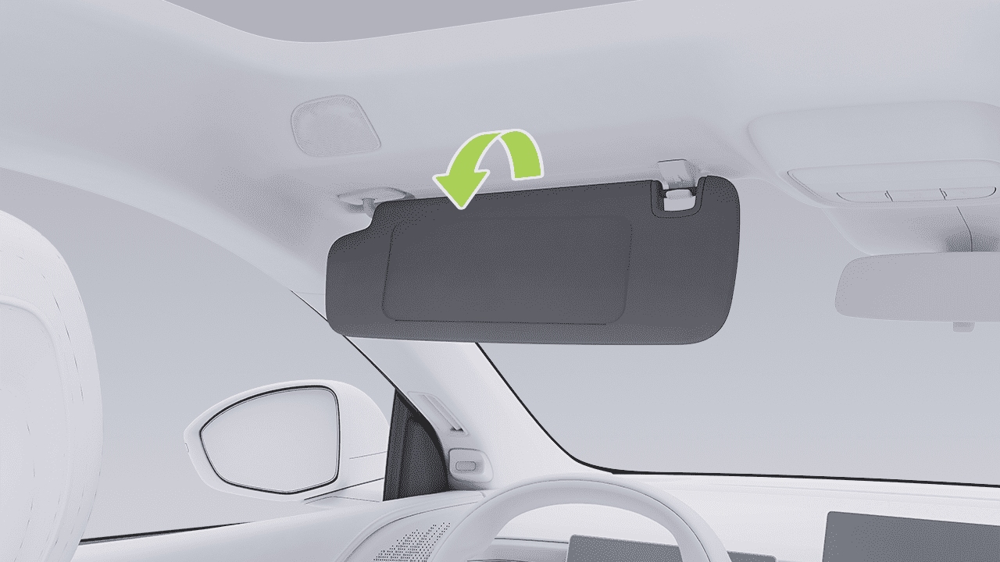

Configuración de Confort

Espejo de vanidad

Después de bajar la visera del sol, saca uno de 
los extremos de la visera del sol, que se encuentra 
cerca del espejo retrovisor interior, del soporte y 
gira la visera del sol hacia la ventana para 
bloquear la luz del sol que entra por la ventana.

Las viseras del sol en ambos lados del conductor 
y del pasajero delantero están equipadas con 
espejos de cortesía, permitiéndote refrescar tu 
apariencia.

advertencia

• Puedes desplegar la visera del sol a una 
posición adecuada, bajar la tapa del espejo 
de cortesía (que también puede estar 
magnéticamente unida al dorso de la visera 
del sol) y encender la luz del espejo de 
cortesía.

Una visera del sol inclinada puede afectar la 
vista hacia adelante, si ya no es necesario usar 
la visera del sol, debe ser retraída hacia el 
soporte.

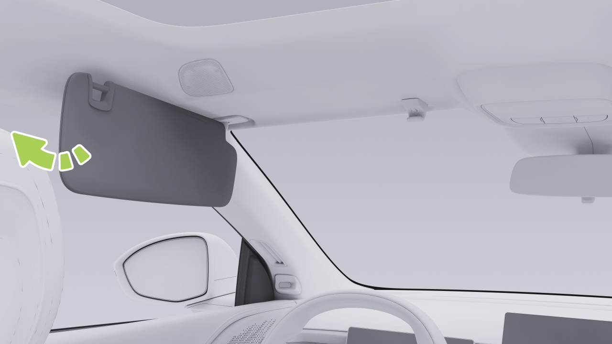

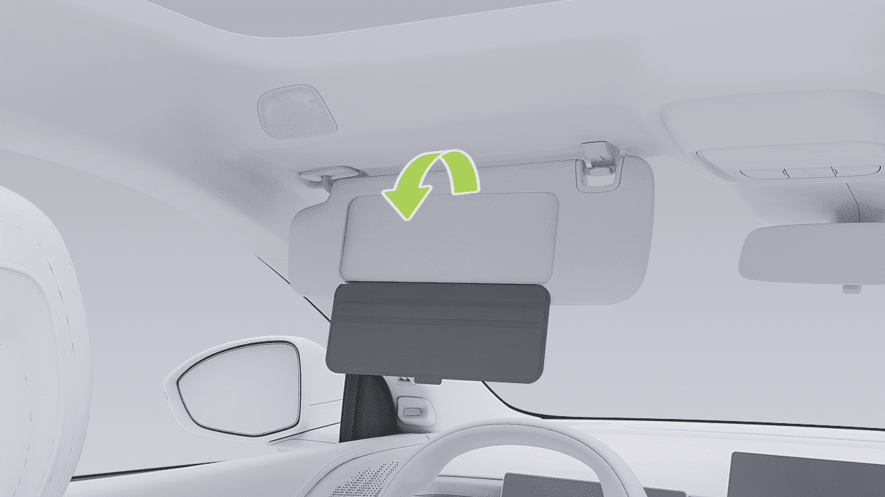

Configuración de Comodidad

• Después de que la tapa del espejo de cortesía 
esté cerrada, la luz del espejo de cortesía se 
apagará y luego podrás plegar la visera del sol.

Techo Panorámico

Introducción

• Cierra la tapa del espejo de cortesía cuando 
no esté en uso.

Consejos

• Si la tapa del espejo de cortesía ha sido 
magnetizada al dorso de la visera, cuando 
el espejo de cortesía no esté en uso, ajusta 
la visera a la posición de no uso para 
apagar la lámpara del espejo de cortesía.

advertencia

No utilices el espejo de cortesía mientras 
conduces el vehículo.

El vehículo está equipado con un techo 
panorámico, ofreciendo una vista más amplia 
y un recubrimiento aislante del calor para 
mejorar tu experiencia de conducción.

precaución

La temperatura del techo panorámico aumenta 
después de que el vehículo ha estado expuesto 
al sol, no lo toques, ya que existe riesgo de 
quemaduras.

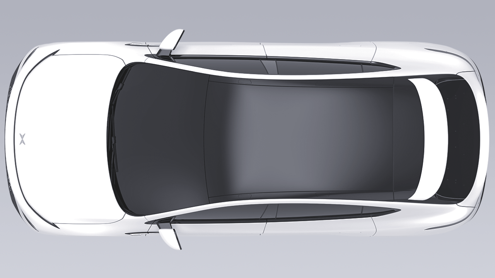

Configuración de Comodidad

Luz de Lectura

Operación

Introducción

Interruptor de Luz de Lectura

Luz de Lectura Frontal

Puedes encender o apagar la luz de lectura de 
las siguientes maneras:

• Interruptor de luz de lectura
• Pantalla de control central
– Interfaz de configuración
• Voz Xpeng

Consejos

La luz de lectura se enciende automáticamente 
cuando se abre la puerta, y la luz de lectura se 
apaga automáticamente cuando se cierra la 
puerta.

La luz de lectura está instalada en el conjunto 
de luz de domo frontal. Se encenderá tocando 
la pantalla de luz, y se apagará tocando la 
pantalla de luz de nuevo.

No enciendas las lámparas de lectura frontales 
mientras conduces con poca luz ambiental, la 
pantalla frontal puede reflejarse, resultando en 
un incidente de seguridad donde la carretera 
adelante no es visible.

advertencia

Luz de Lectura Trasera

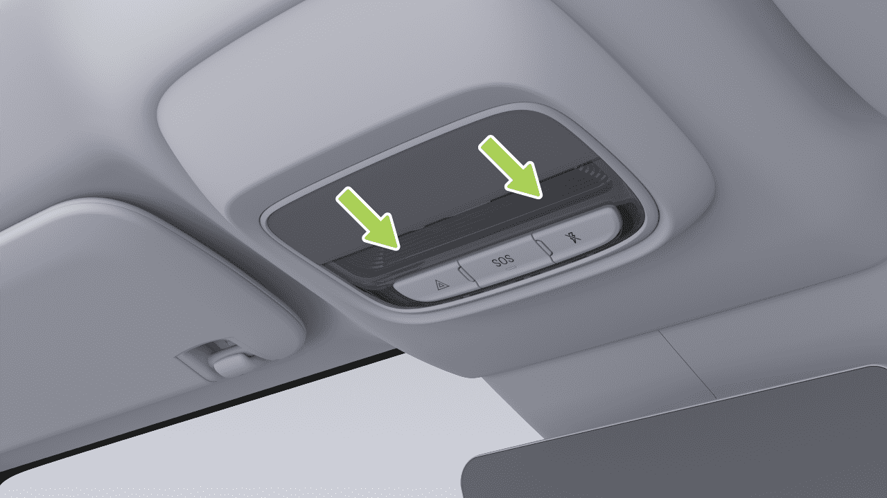

Configuración de Comodidad

Interfaz de Configuración de Pantalla de Control Central

Presiona el botón de luz de lectura 
correspondiente en cualquiera de los lados para 
encender la luz de lectura, y presiona de nuevo 
para apagarla.

En la pantalla de control central, ve a " 
→Lights→Headlights" interfaz, y puedes 
encender o apagar "Reading Lights".

Luces Ambientes

Introducción

El vehículo está equipado con luces ambientes 
que pueden cambiar de color en sincronía con 
el ritmo de la música,

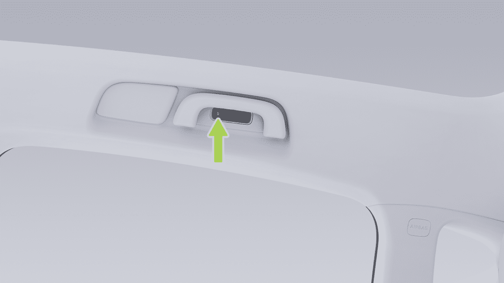

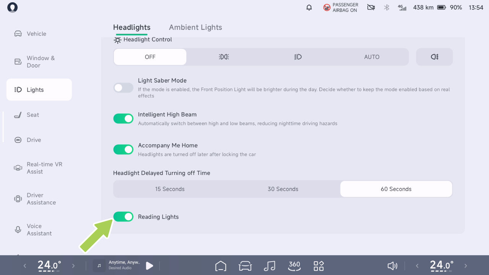

Configuración de Comodidad

agregando un toque cálido a tu regreso a casa mientras cae la noche.

opciones de color único fijo o ciclos de dos colores según el modo.

Abriendo y cerrando

En la opción de color único fijo, el color del área principal y el color del área auxiliar se pueden seleccionar por separado, o se puede sincronizar un solo color en todo el vehículo.

Modo de luz ambiental

Las luces ambientales ofrecen cuatro configuraciones de modo: Brillo Fijo, Respiración Suave, Sigue la Velocidad y Ritmo Musical. Puedes elegir lo que te guste en la interfaz de control de Luces Ambientales.

Calefacción de Asientos*

En la pantalla de control central, ve a "
→Luces→Luces Ambientales" interfaz, y puedes configurar las luces ambientales.

Introducción

Puedes controlar la calefacción del asiento de las siguientes maneras:

Ajuste de brillo y selección de color

• Tecla de aplicación móvil

Una vez que las luces ambientales están encendidas, puedes ajustar su brillo manualmente. El color de las Luces Ambientales se puede seleccionar como color de tema,

• Voz Xpeng

• CID

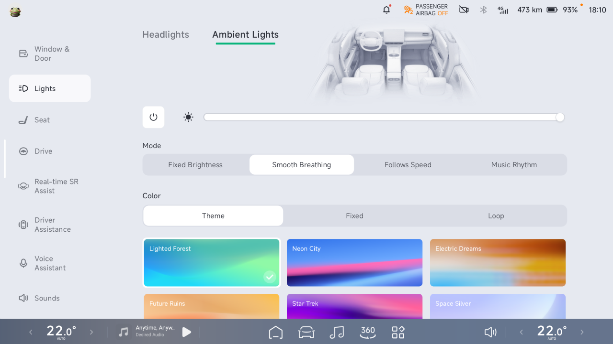

Configuración de Comodidad

– Barra de tareas inferior (si está configurada)

La barra de tareas inferior solo admite el control de la calefacción del asiento del conductor/pasajero.

Consejos

– Interfaz de configuración

Operación

En la interfaz de configuración del aire acondicionado Consultar página 252, haz clic en "Asientos y Volante" ingresa a la interfaz de configuración.

Interfaz de configuración de CID

haz clic en "
 " Activa la función de calefacción del asiento correspondiente, el nivel está en nivel 3, y haz clic repetidamente para ciclar entre niveles 2, 1, apagado y 3.

• Si el conductor o pasajero no puede sentir dolor en el área de su cuerpo que está en contacto con el asiento, no utilices la función de calefacción del asiento, ya que esto puede resultar en lesiones personales.

• El uso prolongado de asientos calentados a alta velocidad puede causar fácilmente daño por baja temperatura.

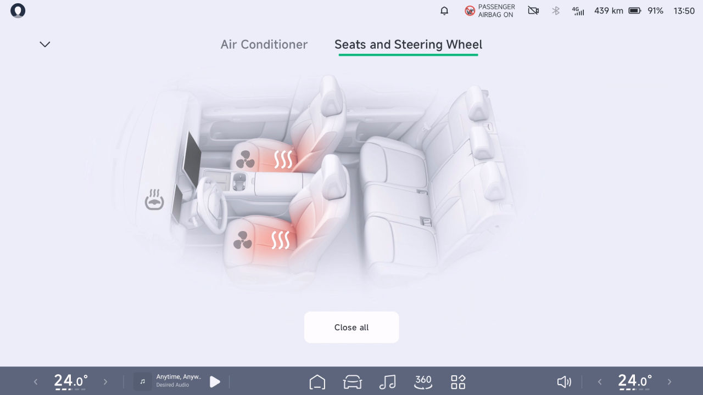

Configuración de Comodidad

• Usar el calefactor del asiento del conductor durante mucho tiempo puede inducir somnolencia y afectar la seguridad de conducción.

Ventilación de Asientos*

Introducción

Puedes controlar la ventilación del asiento de las siguientes maneras:

• Tecla de aplicación móvil

• Voz Xpeng

Toca "
 " para activar la función de ventilación del asiento correspondiente. Cuando se establece en Nivel 3, puedes tocarlo repetidamente en un ciclo de Nivel 2, Nivel 1, Apagado y Nivel 3.

• Pantalla de control central

– Barra de tareas inferior (si está configurada)

– Interfaz de configuración

Masaje de Asientos*

Operación

Introducción

Interfaz de configuración de CID

En la interfaz de Configuración de A/C, toca "Asientos y Volante" para ingresar a la interfaz de configuración

Puedes controlar el masaje del asiento de las siguientes maneras:

• Voz Xpeng

• Pantalla de control central

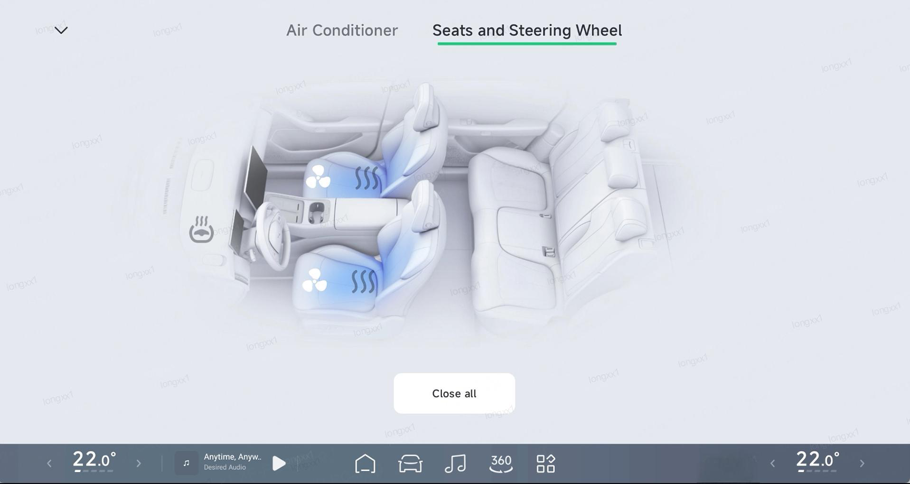

Configuración de Comodidad

Operación

3. Puedes elegir el modo de masaje según tu preferencia, y toca para activar la función de masaje del asiento.

En la pantalla de control central, ve a la "
→Asiento→Masaje" interfaz, y puedes configurar la función de masaje del asiento.

Interfaz de configuración de la pantalla de control central

Los diferentes modos de masaje corresponden a la duración del masaje y cuando se alcanza el tiempo, el masaje del asiento se apaga automáticamente.

Sugerencias

4. Toca para seleccionar la intensidad del masaje.

5. Toca para habilitar o deshabilitar la función de alivio de presión lumbar del conductor.

6. Toca para seleccionar el modo de alivio de presión lumbar.

Sugerencias

• El Masaje del Conductor Principal y el Alivio Lumbar solo se pueden activar por separado; activar el Alivio Lumbar desactiva automáticamente el masaje cuando el masaje está activo, y activar el masaje desactiva automáticamente el Alivio Lumbar cuando el masaje está activo.

2. Toca para habilitar o deshabilitar la función de masaje del conductor.

1. Toca " " para seleccionar el asiento a ajustar.

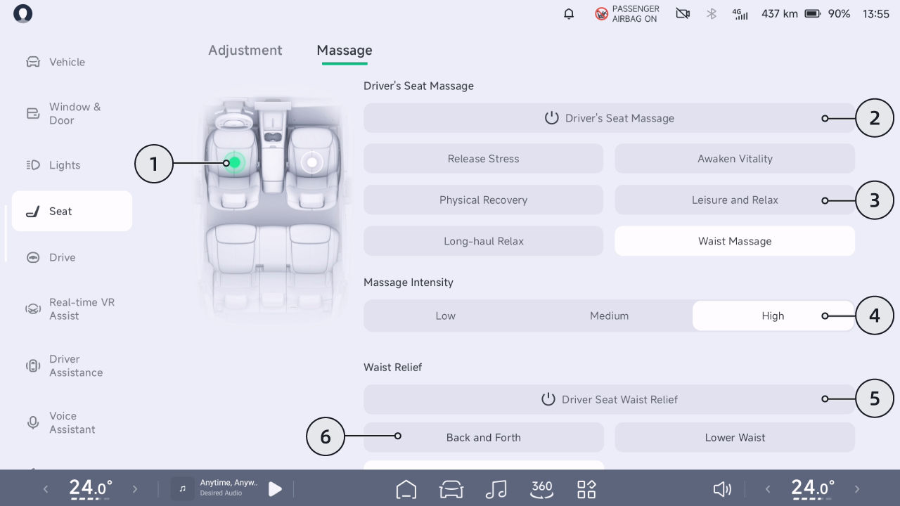

Configuración de Comodidad

• El ajuste lumbar manual interrumpe el modo de alivio lumbar cuando el modo de alivio lumbar está activo.

El sistema de audio del asiento del conductor tiene tres modos:

• Modo Compartido: Los sonidos de navegación, llamadas y medios se reproducen a través del sistema de audio de todo el vehículo.

Audio del Conductor

• Modo de Conducción: Los sonidos de navegación y llamadas se reproducen a través del audio del reposacabezas del conductor, mientras que los sonidos de medios se reproducen a través del sistema de audio de todo el vehículo.

Operación

• Modo Privado: Los sonidos de navegación, llamadas y medios se reproducen a través del sistema de audio del reposacabezas del conductor.

Toca "Cambio Inteligente". El vehículo cambiará automáticamente al "Modo de Conducción" cuando el asiento del pasajero delantero esté ocupado.

En la pantalla de control central, ve a la interfaz " →Sonidos→Altavoz del Conductor" y puedes configurar el modo de sonido del conductor.

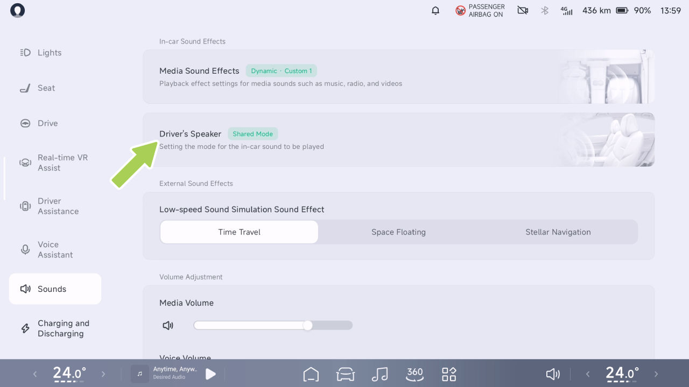

Configuración de Comodidad

Carga Inalámbrica

pantalla parpadee, rebote, etc., si es necesario, se recomienda que el interruptor de carga inalámbrica se apague en la pantalla de control central.

Introducción

En la pantalla de control central, ve a la interfaz " →Carga y Descarga→Fuente de Energía" y puedes habilitar o deshabilitar la carga inalámbrica para el conductor y el pasajero delantero.

El área de carga inalámbrica se encuentra en la parte delantera de la consola. Durante la carga, coloca la pantalla del teléfono móvil hacia arriba y desliza el teléfono móvil hacia la parte inferior del área de carga siguiendo la barra de límite, lo que es conducente a la carga inductiva y la disipación de calor del teléfono móvil. Durante la carga, el icono " " se mostrará en la pantalla de control central.

Precaución

Algunos teléfonos móviles no tienen función de carga inalámbrica; el teléfono móvil colocado en el panel de carga inalámbrica puede causar que la

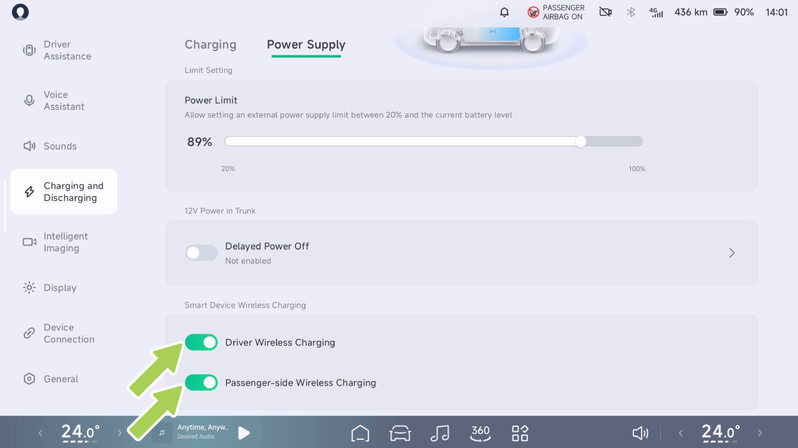

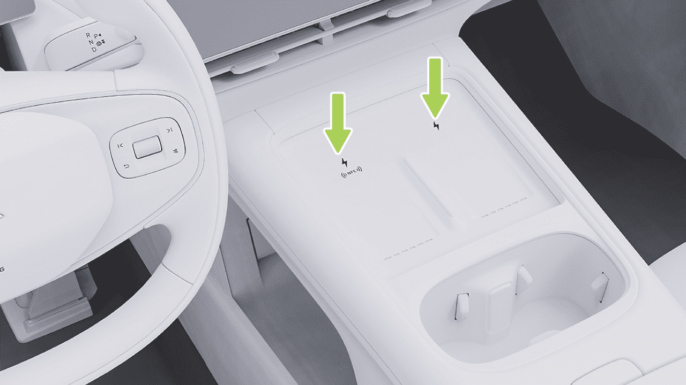

Configuración de Comodidad

• Los teléfonos móviles admiten una potencia máxima de carga inalámbrica de 50W y tienen capacidad de enfriamiento por aire. Puede enfriar el teléfono mediante enfriamiento por aire para mejorar la eficiencia de carga.

advertencia

• Para evitar interferencias entre dispositivos médicos o electrónicos implantables y el sistema de carga inalámbrica para teléfonos móviles, el personal que utiliza dispositivos médicos o electrónicos implantables debe mantener una distancia apropiada del área de carga inalámbrica del teléfono móvil.

• En la pantalla de control central, vaya a "→General→Seguridad y privacidad", y puede habilitar o deshabilitar "Recordatorio de teléfono olvidado". Una vez que se habilita esta función, si el teléfono móvil está cargándose de forma inalámbrica, se activará un recordatorio cuando esté saliendo del vehículo.

• La función de carga inalámbrica de teléfonos móviles puede calentar metal. Asegúrese de que no haya objetos extraños de metal en la parte posterior del teléfono y en el área de carga antes de comenzar la carga. De lo contrario, los objetos extraños de metal pueden calentarse o dañarse, e incluso causar accidentes de seguridad. El material extraño de metal aquí se refiere a otros objetos con componentes metálicos, incluidos pero no limitados a chips, tarjetas magnéticas, etc.

La carga inalámbrica se detendrá en los siguientes casos:

• Cuando el teléfono móvil se coloca en la parte superior del área de carga, puede haber falla de carga o de inducción.

• La carga se detendrá cuando el vehículo comienza a buscar la llave.

• Para teléfonos que no tienen carga inalámbrica, se recomienda tocar manualmente la configuración en la pantalla central para apagar la carga inalámbrica en el área correspondiente y evitar que afecte el uso normal del teléfono.

• El maletero se cerrará con la puerta delantera izquierda desbloqueada y las cuatro puertas cerradas.

Configuración de confort

• Para teléfonos móviles con carga rápida inalámbrica de 50W, el teléfono debe colocarse a lo largo de la barra limitadora en la parte inferior del área de carga, y la parte inferior del teléfono debe estar completamente cubierta para evitar problemas de sobrecalentamiento.

• Si la función de carga inalámbrica no funciona o no funciona correctamente, deje de usarla y comuníquese con el Centro de Servicio de Automóviles XPENG para obtener servicio.

• Es normal que el teléfono se caliente después de una carga prolongada. No deje el dispositivo de carga en el área de carga después de que esté completamente cargado, ya que esto puede causar problemas de sobrecalentamiento.

• La salida del ventilador de enfriamiento de la carga inalámbrica se encuentra en el extremo inferior de la carga inalámbrica. Tenga cuidado de que objetos extraños y líquidos no entren en la salida y afecten el funcionamiento del ventilador.

• No use una carcasa de teléfono de metal, como una que admita carga magnética (MagSafe).

• No derrame agua en el área de carga inalámbrica para evitar que el agua entre en el módulo de carga inalámbrica y dañe los componentes electrónicos.

• Las bobinas de carga inalámbrica externa pueden causar accidentes y deben usarse con precaución.

• Cuando el conductor no esté en el auto, por favor no coloque el teléfono móvil en el auto para cargarlo, para evitar peligros de seguridad.

• Por favor, no coloque objetos pesados en el área de carga para evitar dañar el módulo de carga inalámbrica.

Configuración de Confort

Puertos de Carga y Datos

3. Puerto de alimentación de 12V: Tiene una potencia máxima de 180 W.

Introducción

precaución

Puerto frontal de la caja de apoyabrazos central

Está prohibido cargar mediante la conexión de fuente de medios USB; la carga puede causar que la pantalla de control central se reinicie o que la pantalla se quede en blanco.

Puerto trasero de la caja de apoyabrazos central

1.
Puerto de fuente de medios USB: se usa para transmitir datos de video de conducción de unidad USB, micrófono, controlador de juegos, etc.

2. Puerto de alimentación Type-C: se usa para transmitir datos de video de conducción de unidad USB y cargar dispositivos electrónicos, compatible con protocolo de carga estándar, con una salida de potencia máxima de 60W.

1.
El puerto de alimentación Type-C admite una potencia máxima de 15W.

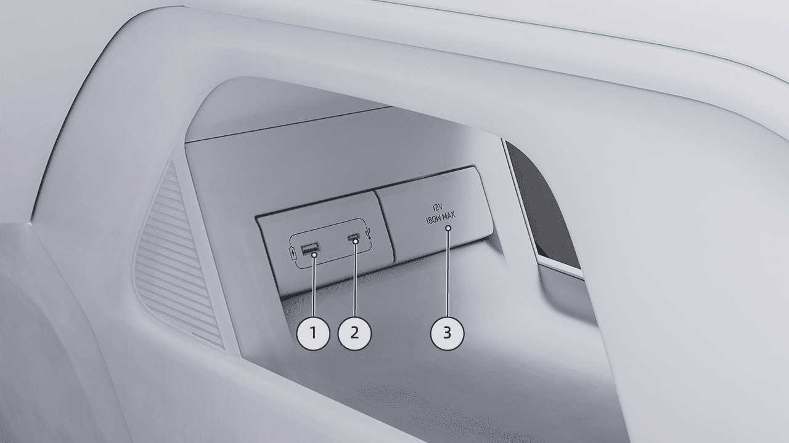

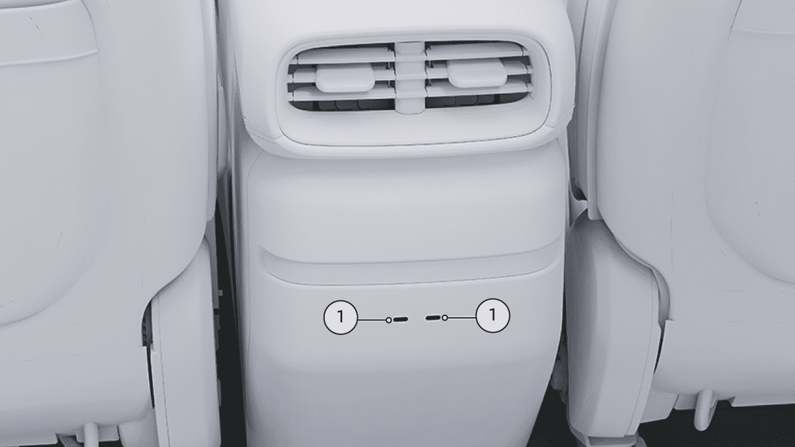

Configuración de Confort

advertencia

Se prohíbe la modificación privada de la interfaz Type-C.

Puerto interno del maletero

En la pantalla de control central, vaya a "
→Carga y Descarga→Suministro de Energía" interfaz, y active "Apagado Retrasado". Puede establecer el tiempo de apagado retrasado del suministro de energía de 12V del maletero después de que el vehículo se apague.

Puerto de alimentación de 12V: Tiene una potencia máxima de 180 W.

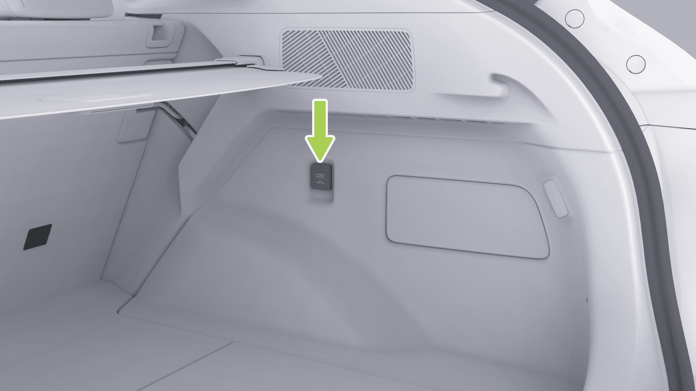

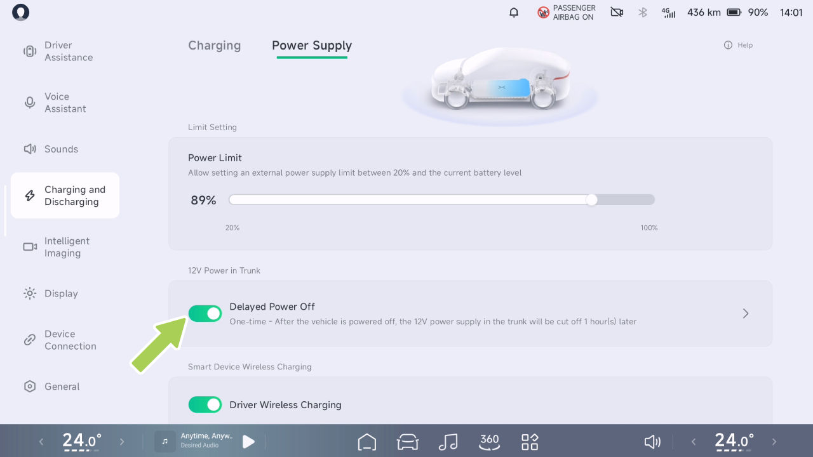

Configuración de Confort

Parasol de carga del maletero

Extracción e Instalación del Parasol de Carga

Uso del Parasol de Carga

– Doble el respaldo del asiento trasero.

– Retire cualquier extremo del parasol de carga y extráigalo.

– Para instalar, primero asegure un extremo del parasol de carga en la ranura de fijación, retire el otro extremo y luego bloquéelo en su lugar.

1.
Extraiga el parasol de carga.

2. Inserte ambos extremos del parasol de carga en las ranuras de fijación en cada lado del maletero.

No coloque objetos en la persiana cuando esté desplegada, ya que esto dañará la persiana o causará lesiones a los ocupantes del vehículo en caso de colisión.

advertencia

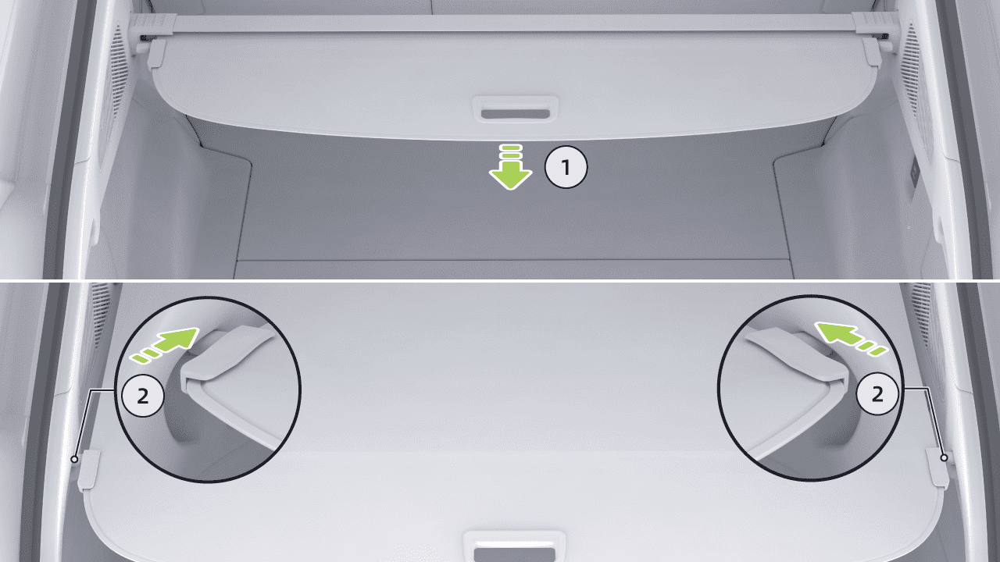

Configuración de Confort

Espacio de Almacenamiento

Caja de almacenamiento de la puerta

Introducción

Caja de apoyabrazos central

La puerta tiene un compartimiento de almacenamiento adecuado para sostener bebidas u organizar artículos.

La consola está equipada con una caja de apoyabrazos central, que se puede abrir presionando el interruptor.

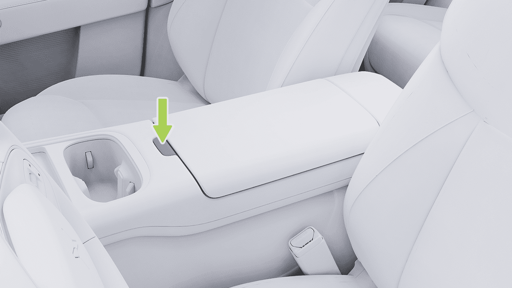

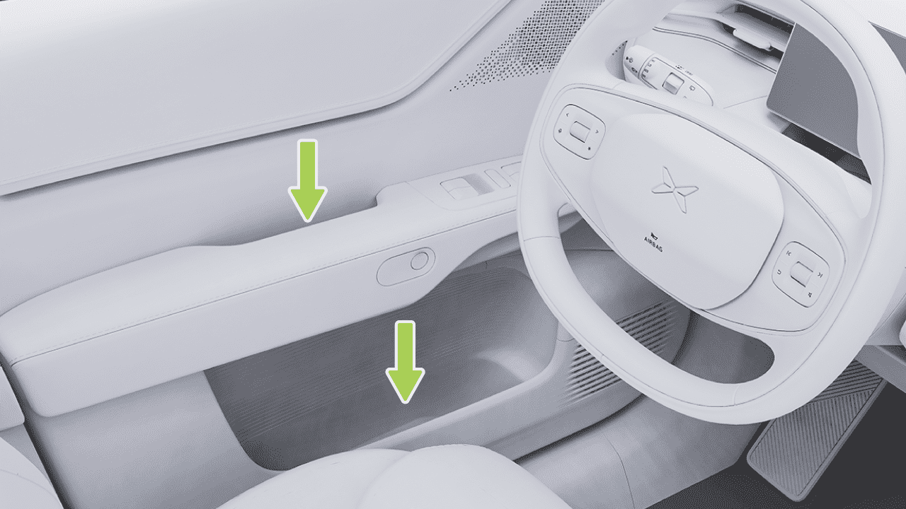

Configuración de Confort

Portavasos de la primera fila

Portavasos Trasero

La consola está equipada con un portavasos para sostener botellas de bebida o tazas.

Después de inclinar el apoyabrazos central del asiento trasero, presione suavemente su sección frontal para revelar el portavasos.

Evite colocar piezas pequeñas y otros desechos al usar el portavasos para evitar que se atasque.

precaución

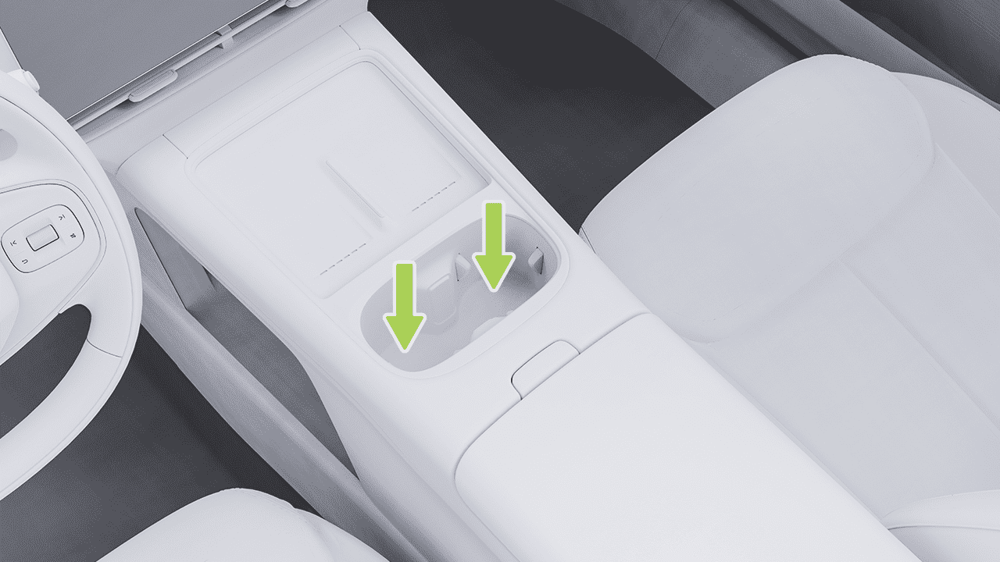

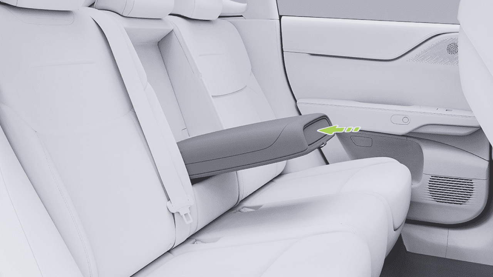

Configuración de Confort

advertencia

Maletero

No coloque bebidas abiertas o tazas en el
portavasos mientras el vehículo está en movimiento. Para
evitar quemar al conductor y ocupantes del
vehículo, o dañar el vehículo y los equipos
eléctricos interiores debido a una bebida caliente en
la taza.

Bolsillo de mapas

El maletero se puede utilizar para colocar equipaje y
mercancías.

precaución

• No almacene artículos frágiles, inflamables, explosivos,
etc. en el espacio de carga para evitar incendios, explosiones
o daños.

Los bolsillos de mapas se encuentran en la parte posterior
de los asientos delanteros para guardar artículos como
facturas y revistas.

• Almacene artículos líquidos con un sello hermético para evitar
daños al vehículo debido a fugas de fluidos.
Limpie si ocurre una fuga.

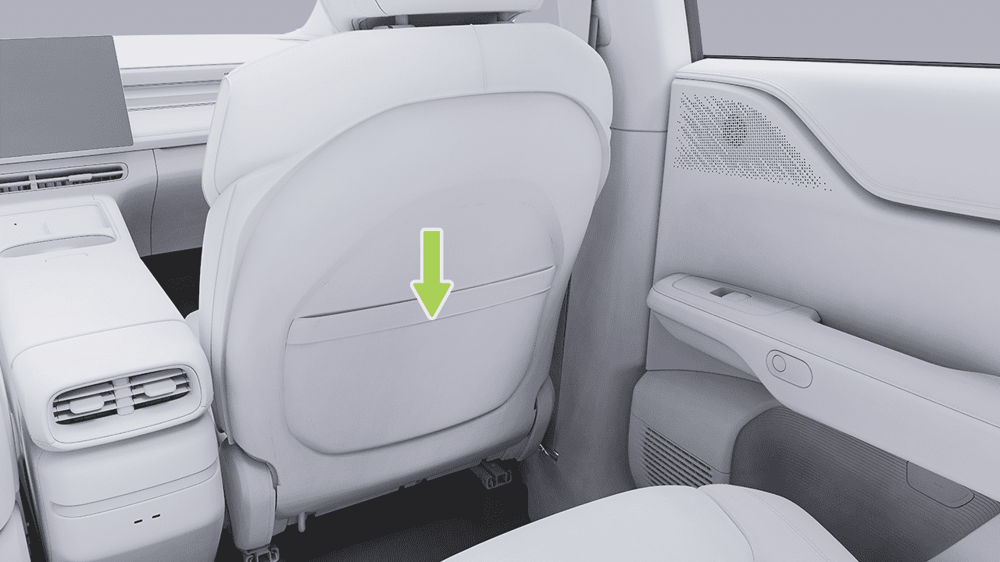

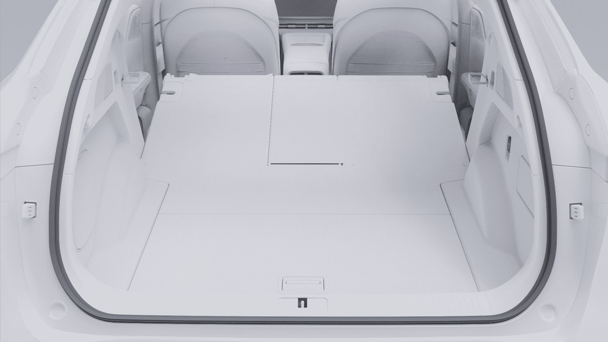

Configuración de Comodidad

• No conduzca el vehículo con carga excesiva para evitar
distancias de frenado excesivas debido a la inercia excesiva,
lo que podría resultar en un accidente.

instrucciones proporcionadas para la baca, y
cumpla con todas las advertencias de seguridad relacionadas.

precaución

Interfaz de Baca de Equipaje

• Los rieles del techo deben verificarse regularmente
para asegurar que estén bien ajustados y libres
de daños.

• Cuando la baca de equipaje no está instalada, asegúrese
de que la tapa esté cerrada en la interfaz.

Modo Remolque*

Introducción

Su vehículo está equipado con la función de
remolcar una autocaravana, que solo se puede utilizar
después de activar el Modo Remolque en la Pantalla
de Control Central. Al remolcar una autocaravana,
el conductor debe poseer las calificaciones de conducción necesarias.

La interfaz de baca de equipaje en este vehículo
soporta la instalación de una baca con capacidad de carga,
con una capacidad de carga máxima de 75kg.

Antes de instalar o usar la baca,
revise minuciosamente este capítulo y las

Antes de decidir remolcar una autocaravana, primero debe
revisar las regulaciones de vehículos motorizados en su
región. Como las regulaciones varían entre regiones, es

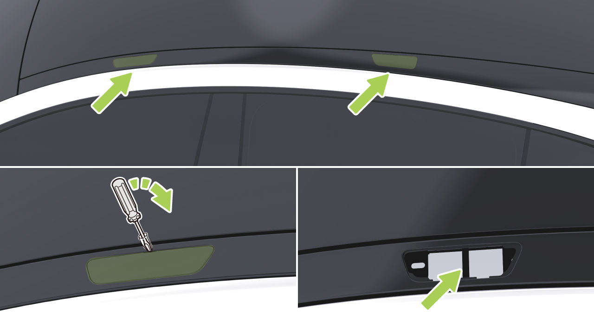

Configuración de Comodidad

esencial seleccionar una autocaravana apropiadamente especificada
y consultar con un proveedor de servicio local antes de
remolcar.

• Acelere gradualmente y evite aceleración repentina o frenado
de emergencia. En superficies de carreteras resbaladizas,
tales acciones podrían causar que el vehículo pierda el control
por patinaje. Los vientos cruzados y las carreteras irregulares
pueden causar balanceo del vehículo, afectando significativamente
el control vehicular. En cualquier caso, tan pronto como note
un ligero signo de balanceo del vehículo, sostenga el volante
firmemente con ambas manos e inmediatamente reduzca la
velocidad lentamente. No intente eliminar el balanceo aumentando
la velocidad.

• Al remolcar una autocaravana, cumpla con las leyes y
regulaciones locales. La modificación no autorizada está
estrictamente prohibida.

precaución

• Durante el período de rodaje de un vehículo nuevo,
no remolque una autocaravana.

• Cuando no esté remolcando una autocaravana, retracte
el dispositivo de tracción.

• No se permite remolcar una autocaravana
equipada con un sistema de freno de servicio eléctrico.

• Intenta evitar Combos donde el vehículo remolcador está descargado mientras el remolque está cargado.
Si es inevitable debido a una distribución desigual de la carga, reduce tu velocidad de conducción.

Instrucciones de conducción

• Al remolcar un remolque, la distancia de frenado del vehículo aumenta. Por lo tanto, aumenta la distancia de conducción respecto al vehículo que va adelante.

Remolcar un remolque puede afectar la manejabilidad y el rendimiento de frenado de tu vehículo. Para garantizar un remolque seguro y proteger la seguridad tuya y la de tus pasajeros, sigue estas recomendaciones de conducción:

Configuración de comodidad

Indicadores en el panel de instrumentos

Apertura y cierre

El arnés de cableado del remolque funciona normalmente, al igual que los sistemas de suspensión, programa de estabilidad electrónica y gancho de remolque.

El arnés de cableado del remolque funciona normalmente; sin embargo, fallas en la suspensión, programa de estabilidad electrónica o gancho de remolque pueden impedir que el modo de remolque funcione correctamente.

El modo de remolque no está disponible debido a fallas en el arnés de cableado del remolque, lámpara de señal del remolque, suspensión, programa de estabilidad electrónica y gancho de remolque.

Cuando el vehículo está en marcha P, en la pantalla de control central, ve a la interfaz " 
 →Vehículo" y puedes activar o desactivar "Modo remolque".

• Se requiere una segunda confirmación cuando tanto el modo barra de remolque como el modo remolque se activan y debe realizarse en marcha P.

precaución

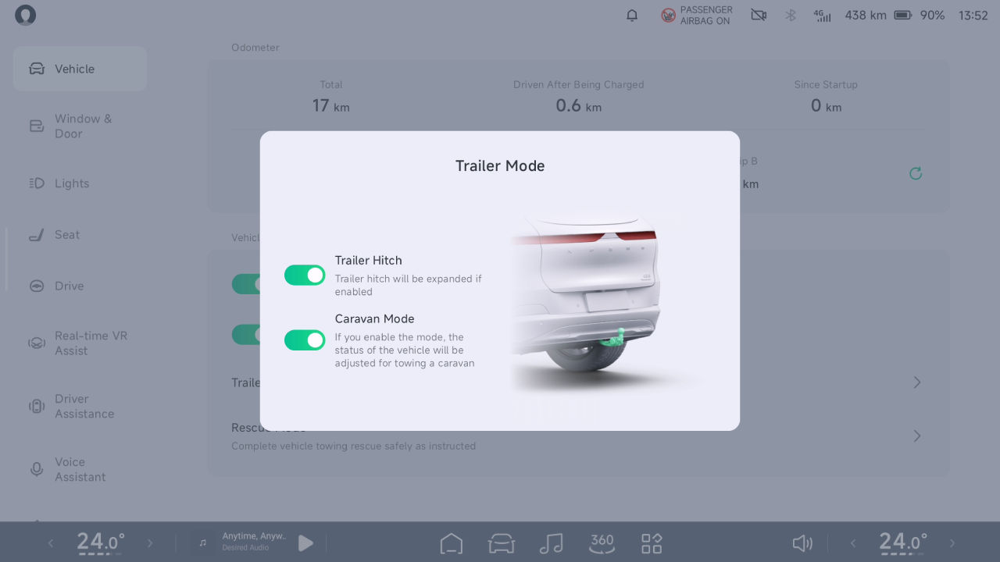

Configuración de comodidad

• El interruptor de pantalla central no está disponible durante el movimiento de la barra de remolque y se devuelve al servicio cuando está completamente extendido o retraído.

precaución

• Cuando la barra de remolque está activada, ninguno de los sistemas de asistencia de conducción, excepto las funciones AEB y FCW, puede activarse. Cuando la barra de remolque está completamente cerrada, las funciones relacionadas con la asistencia de conducción vuelven al estado anterior a la apertura de la barra de remolque.

Al remolcar un vehículo, el modo de remolque debe estar activado; de lo contrario, el vehículo se dañará.

APAGADO

Después de desconectar la autocaravana del gancho de remolque y desconectar el conector eléctrico, presiona el interruptor del gancho de remolque en la pantalla de control central para salir simultáneamente del modo de remolque y retraer el gancho de remolque.

El modo de remolque no se activará cuando:

• La barra de remolque no se abre.

• El vehículo está en marcha que no es P.

• Falla de suspensión, falla de función ESP.

• Cuando la suspensión está en modo de servicio y el modo de nivelación de suspensión está activado.

• Cuando se calibra el sensor después de la venta, modo de bloqueo.

• Cuando el modo de elevación o modo de transporte marítimo está activado.

Configuración de comodidad

Conector de conexión eléctrica

conector eléctrico, que puede causar daño debido a la entrada de agua en el conector.

El conector eléctrico está montado en el gancho de remolque. Después de activar el interruptor del gancho de remolque en la pantalla de control central, el conector se extiende junto con el gancho de remolque. Después de abrir la cubierta protectora, está listo para usar.

El conector de conexión eléctrica equipado
en este vehículo es un conector de 13 núcleos. La toma
de corriente cumple con la norma ISO 11446:2004. Las
funciones específicas de cada pin son las siguientes:

precaución

Número
de pin
Color
Función

Cuando el conector eléctrico no está
conectado a la interfaz del remolque, no utilice
una pistola de agua a alta presión para limpiar

Alambre
amarillo
Luces de giro izquierdo

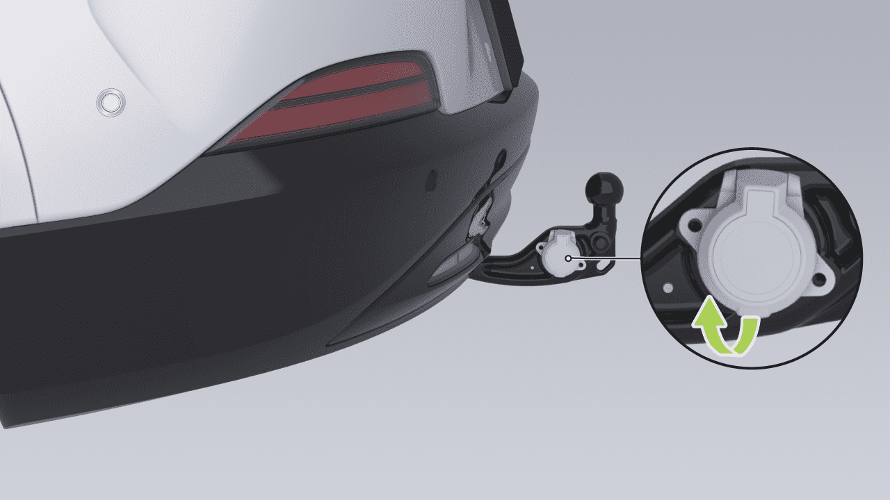

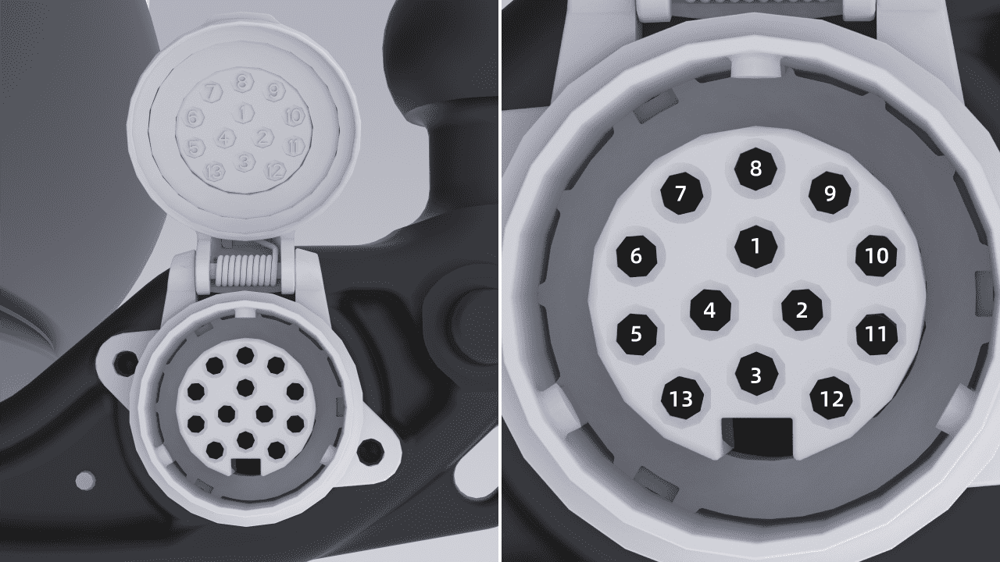

Configuración de Confort

Alambre
azul y
blanco
Luz antiniebla trasera o
luces de marcha atrás

Alambre
de espera

Alambre
blanco
Cable de tierra principal 1-8 pin

Alambre
verde
Luces de giro derecho

Línea
roja y
blanca

Cable de tierra de 9 pines

Alambre
marrón
Luces de circulación derechas

Alambre
rojo
Luces de freno

Espejo Retrovisor y Soporte

Alambre
negro
Luz de circulación izquierda (puede
combinarse con Pin 5)

Los espejos laterales del tractor deben cumplir
con los estándares normativos. Si no son
adecuados, instale espejos laterales de remolque
apropiados.

Alambre
rosa
Luces de marcha atrás

Alambre
naranja
Hacia la batería

Alambre
gris
Batería o refrigerador

Alambres
negro y
blanco

Cable de tierra de 10 pines

Configuración de Confort

Artículo
Datos

Masa de remolque máxima
permitida (con freno)
[kg]

1500

Masa de remolque máxima
permitida (sin freno)
[kg]

Carga de lengüeta máxima
[kg]

Tipo I

Adhiera a la superficie de los espejos laterales.

Dimensiones generales máximas
(largo × ancho × alto) de
combinación automóvil-
remolque [mm]

Tipo II

Fije el clip del soporte al marco de forma segura.

14500*2550*4000

Parámetros Técnicos

Límites de tamaño (largo
× ancho × alto) de
remolques de eje central
permitidos para remolque
[mm]

La capacidad de remolque del vehículo depende de sus
especificaciones, carga, condiciones del camino y
características del remolque. Para garantizar una
conducción segura, evite el exceso de velocidad o
sobrecarga. Consulte la tabla a continuación para
parámetros detallados.

12000*2550*4000

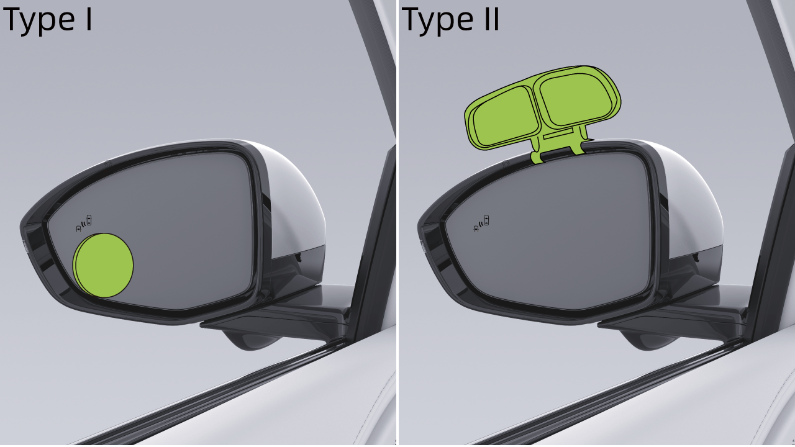

Configuración de Confort

Límite de tamaño máximo del
voladizo trasero del
remolque [mm]

3500

Masa de remolque máxima permitida

Conector de conexión
eléctrica de interfaz
"estándar" de 13 núcleos
conforme a la norma
ISO11446:2004

Enganche de bola de remolque

Cumple con los requisitos
de tamaño de bola de
remolque clase A de la
regulación ECE R55

La masa de remolque denota el peso combinado
del remolque y su carga.

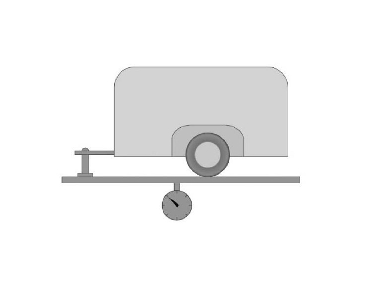

Configuración de Confort

Carga de lengüeta máxima

• Lámparas de posición izquierda/derecha: 24W.

• Lámparas de señal de giro izquierda/derecha: 24W.

• Luz antiniebla trasera: 42W.

• Luz de marcha atrás: 42W.

• Luz de freno: 42W.

Precauciones de Conducción

Comenzar a Conducir

Antes de conducir, asegúrese de que la presión
de los neumáticos, las luces y los dispositivos de
conexión del tractor y del remolque sean normales. Después de conectar el
remolque, active el "Modo Remolque" en la pantalla de control central.

Cargue el remolque de forma segura, asegurando que esté
bien asegurado en su lugar. Además, verifique
que el remolque esté nivelado; de lo contrario, absténgase de
conducir el vehículo.

La carga de lengüeta máxima representa la
carga vertical máxima permitida en el punto de
conexión del enganche del remolque.

Limitación de potencia de las luces traseras del remolque

Acelera gradualmente y evita aceleraciones súbitas o frenadas de emergencia. En superficies de carretera resbaladizas, tales acciones podrían causar que el vehículo pierda el control debido al deslizamiento.

La potencia de las luces traseras del remolque no debe exceder los valores especificados a continuación:

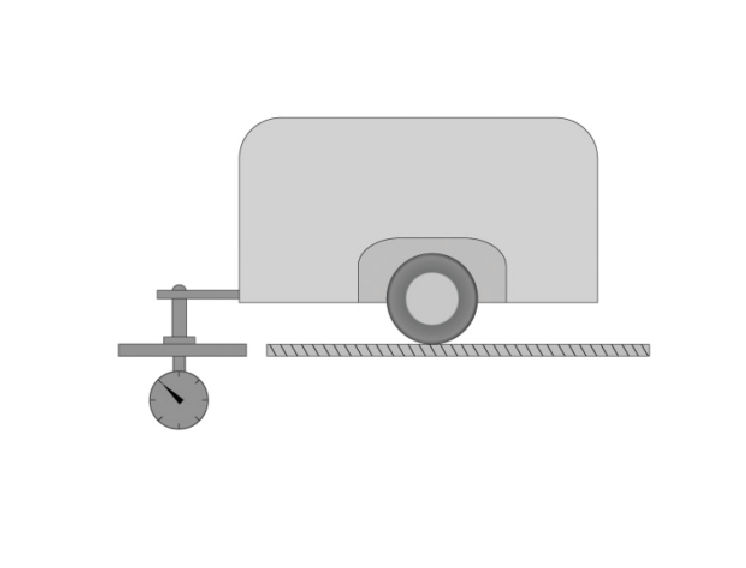

Configuración de Confort

Los vientos cruzados y los caminos irregulares pueden causar balanceo del vehículo, afectando significativamente el control vehicular. En cualquier situación, al notar los más leves signos de balanceo del vehículo, agarra firmemente el volante con ambas manos y reduce gradualmente tu velocidad. Evita intentar contrarrestar el balanceo aumentando tu velocidad.

Marcha atrás

La marcha atrás al remolcar un remolque difiere de la marcha atrás general y es más desafiante. Ejerce particular precaución y practica diligentemente.

Minimiza las instancias donde el tractor está descargado mientras el remolque está cargado. Si es inevitable debido a una distribución de carga desbalanceada, reduce tu velocidad de conducción.

Durante la marcha atrás, sostén la parte inferior del volante con una mano. Gira tu mano hacia la izquierda para dirigir el remolque hacia la izquierda, y gírala hacia la derecha para dirigir el remolque hacia la derecha. Asegúrate de marcha atrás a baja velocidad, y busca asistencia de otros si es posible.

Cuando se remolca un remolque, la distancia de frenado del vehículo aumenta. Por lo tanto, aumenta la distancia desde el vehículo que precede.

Freno

Giros

Al remolcar un remolque, ejecuta giros suavemente, evita golpes o maniobras abruptas, y activa las señales de giro con anticipación. Durante el giro, el radio de giro debe exceder el requerido cuando no se remolca un remolque. Esto asegura que el remolque evite contacto con bordillos, señales de carretera, árboles u otros objetos.

Adelantamiento

Al remolcar un remolque, la longitud combinada del vehículo y el remolque se extiende. Por lo tanto, durante el adelantamiento, cuenta con una distancia de paso más larga para regresar de forma segura a tu carril original.

Configuración de Confort

Conducir en una pendiente

Reduce la velocidad en anticipación al remolcar un remolque en pendientes pronunciadas o extendidas. Determina la velocidad de conducción en función del peso del remolque y la pendiente.

Intenta evitar estacionar en pendientes; si es inevitable, coloca calzos bajo los neumáticos del tractor y del remolque y activa el freno de estacionamiento.

Modo Mascotas

Introducción

Cuando el conductor sale del auto, puede asegurar la seguridad de las mascotas dejadas solas en el auto y te recordará la situación de seguridad dentro del auto. Si hay niños en el auto, por favor asegúrate de que estén acompañados por un adulto.

En la interfaz CID "→Vehículo" para habilitar el modo mascotas.

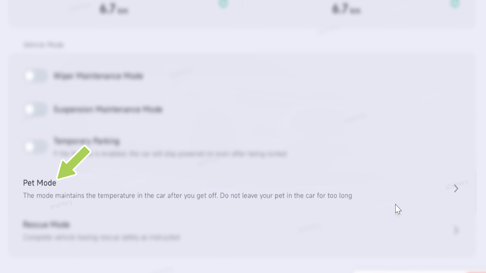

Configuración de Confort

Operación

Cuando el conductor sale del auto, la pantalla de control central mostrará la temperatura de configuración actual del aire acondicionado en el auto para informar a los peatones alrededor que no se requiere rescate.

El modo mascotas solo se puede habilitar cuando el vehículo está en cambio P y la potencia de batería restante es mayor al 20%.

Cuando se activa el modo mascotas, el aire acondicionado se enciende automáticamente en modo AUTO para garantizar una temperatura cómoda dentro del automóvil. Las cuatro ventanas se cierran automáticamente y los bloqueos de las ventanas se bloquean automáticamente.

En la interfaz del modo mascotas del CID, presione prolongadamente el botón "Presionar para salir" para salir del modo mascotas.

Consejos

Cuando el nivel de batería del vehículo es inferior al 5% o la función del vehículo es anormal (como una anomalía del aire acondicionado), el modo mascotas

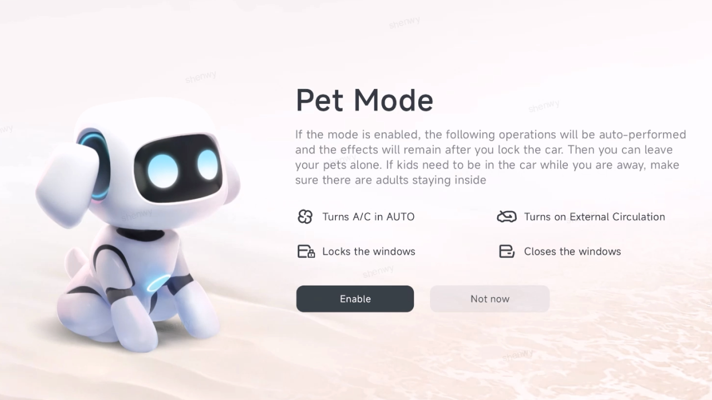

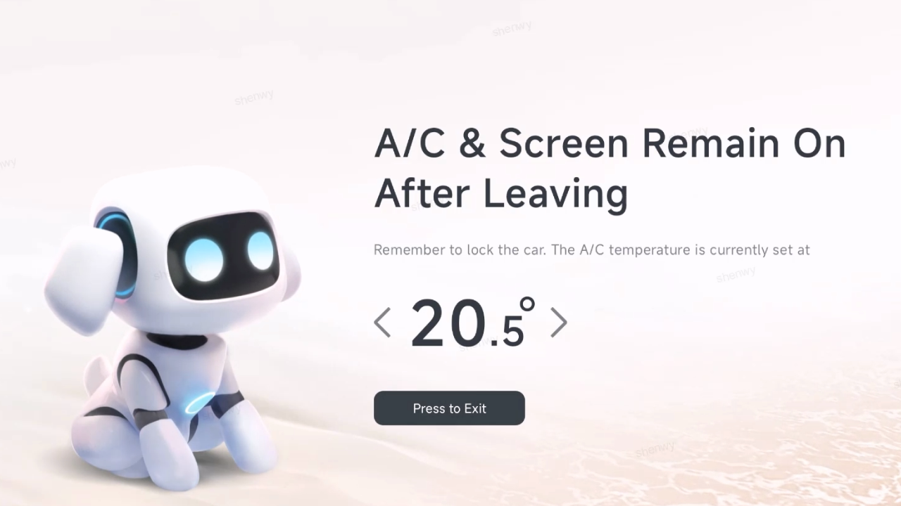

Configuración de Confort

saldrá automáticamente, y luego las ventanas se abrirán un 10% para garantizar la circulación de aire en el automóvil. Al mismo tiempo, la aplicación del teléfono móvil recibirá un mensaje de recordatorio.

