# Instrucciones de Carga

Instrucciones de Carga

Apertura y Cierre de la Tapa del
Puerto de Carga

Operación

Introducción

Interruptor de la tapa del puerto de carga

Puede abrir/cerrar la tapa del puerto de carga
mediante los siguientes medios:

• Voz Xpeng

• Interruptor de la tapa del puerto de carga

• Aplicación Móvil

• Llave remota inteligente*

• Pantalla de control central

– Panel de atajos

– Estado inferior (si está configurado)

Cuando el vehículo está desbloqueado o cuando
lleva una llave de aplicación móvil (activada para
desbloqueo automático al acercarse), presione la
esquina superior izquierda de la tapa del puerto
de carga para abrirla.

• Cierre automático

– " 
 →Ventanas y Puertas"Interfaz

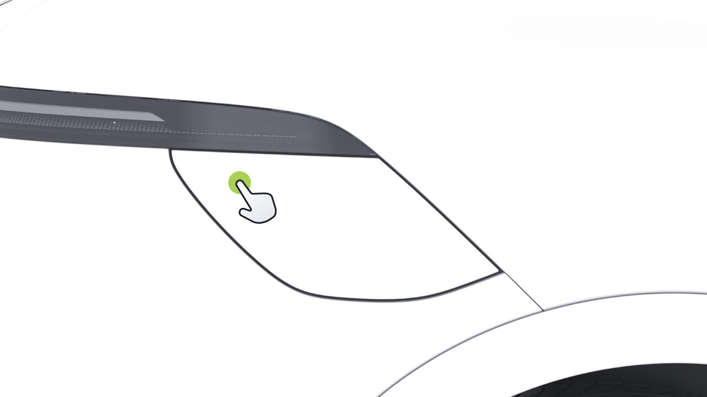

Instrucciones de Carga

A través de la pantalla de control central

Puede presionar el interruptor para cerrar la
tapa del puerto de carga.

Usando la llave inteligente*

• En la pantalla de control central, vaya a " 
→Ventanas y Puertas" interfaz, y podrá abrir
o cerrar "Puerto de Carga".

Presione dos veces la tecla " 
 " en la llave inteligente para
abrir o cerrar "Puerto de Carga".

• Deslice hacia abajo desde la parte superior de la pantalla de
control central para acceder al panel de atajos.
En el panel de atajos, puede abrir o cerrar
"Puerto de Carga".

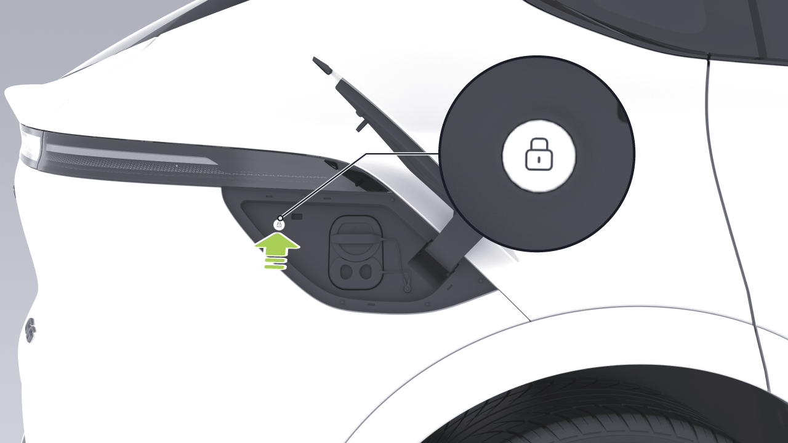

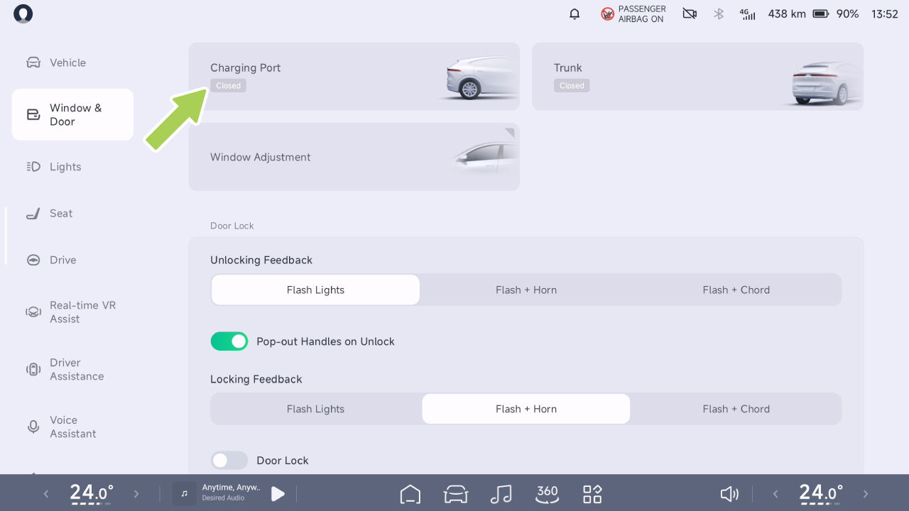

Instrucciones de Carga

La tapa del puerto de carga se cerrará automáticamente

La tapa del puerto de carga se cerrará
automáticamente cuando se cumpla cualquiera de
las siguientes condiciones:

• Después de desconectar la pistola de carga, bloquee el
vehículo.

• Sin operación después de un período de tiempo, con la
pistola de carga no conectada.

• Cuando la palanca de cambios no está en la posición P.

En la pantalla de control central, presione " 
 ", y luego
presione "Asistencia VR en Tiempo Real" en el Centro de
Aplicaciones o presione "Asistencia VR en Tiempo Real" (si
está configurado) en la barra de tareas inferior de la pantalla
de control central. Ingrese a la interfaz de Asistencia de
Realidad Virtual en Tiempo Real, y presione el icono debajo
del modelo 3D para abrir o cerrar la tapa del puerto de carga,
o gire el modelo 3D para tocar un icono de punto de acceso
en el área del puerto de carga, y presione el icono de punto de
acceso para abrir o cerrar la tapa del puerto de carga.

Cuando la tapa del puerto de carga está abierta, el modelo de
vehículo 3D en la pantalla de control central mostrará que la
tapa del puerto de carga está en estado abierto. Si la tapa del
puerto de carga no se cierra mientras el vehículo está en
movimiento, aparecerá una alerta emergente en el panel de
instrumentos.

Aviso para tapa del puerto de carga no cerrada

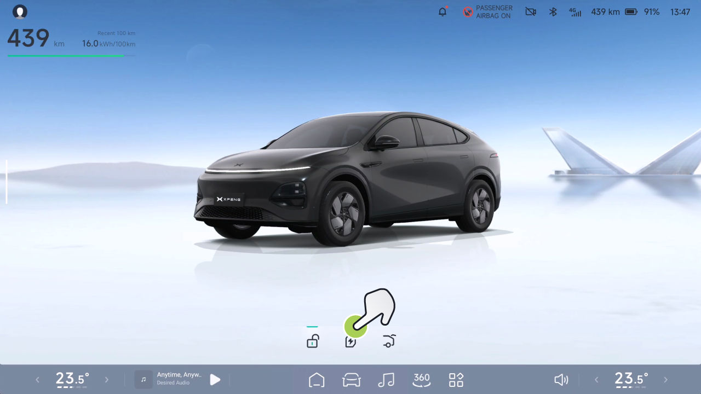

Instrucciones de Carga

precaución

Operación

Cuando lave un vehículo, evite usar una pistola de agua a alta
presión para impactar el área del interruptor de la tapa de
carga, ya que esto puede causar que la tapa se abra.

Abrir o cerrar a través de la pantalla de control central

Consejos

Después de cargar, coloque la tapa de sellado nuevamente
en el puerto de carga para evitar que objetos extraños caigan
en él.

Límite de Carga

Introducción

Establezca el control deslizante de límite de carga en el valor
deseado. El vehículo dejará de cargar automáticamente cuando
se alcance el límite de carga.

En la pantalla de control central, vaya a
"
 →Carga y Descarga→Carga"
interfaz, y puede establecer "Límite de Carga".

El límite de carga se puede establecer utilizando los siguientes
métodos:

• Para garantizar la velocidad de carga y extender
la vida útil de la batería, se recomienda que al
cargar, Seleccione el "mejor botón para el
límite de carga".

Consejos

• Pantalla de control central

• Aplicación móvil

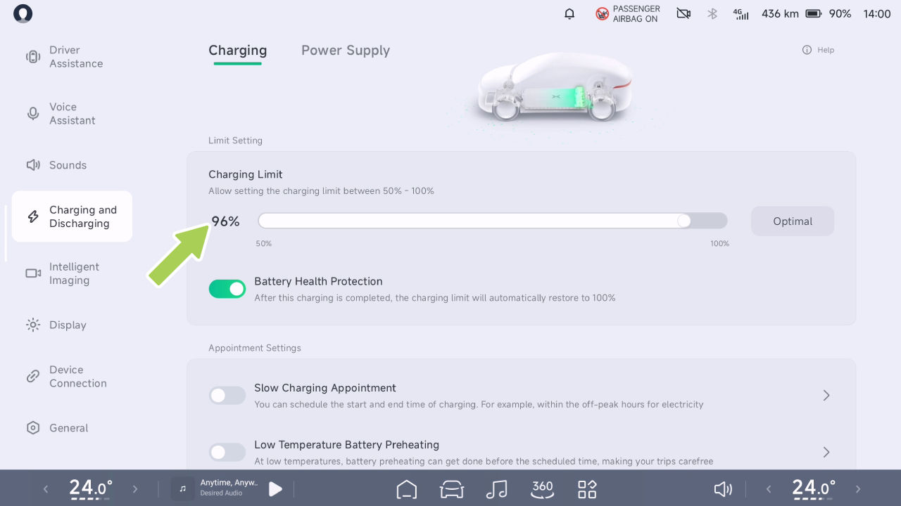

Instrucciones de Carga

• Si la Protección de Salud de la Batería está marcada, los
límites de carga volverán al valor predeterminado
cuando el vehículo se reactiva.

Operación

Pasos de operación de carga

1.
Lleve el vehículo a una parada completa y cambie a la
marcha de estacionamiento (P).

Control de Carga

2. Abra la tapa del puerto de carga.

Introducción

3. Retire la cubierta de sellado del puerto de carga.

El vehículo admite dos métodos de carga:
carga rápida y carga lenta.

4. Presione el botón en el conector de carga y
retire su cubierta protectora.

1.
Puerto de carga

2. Puerto de carga rápida

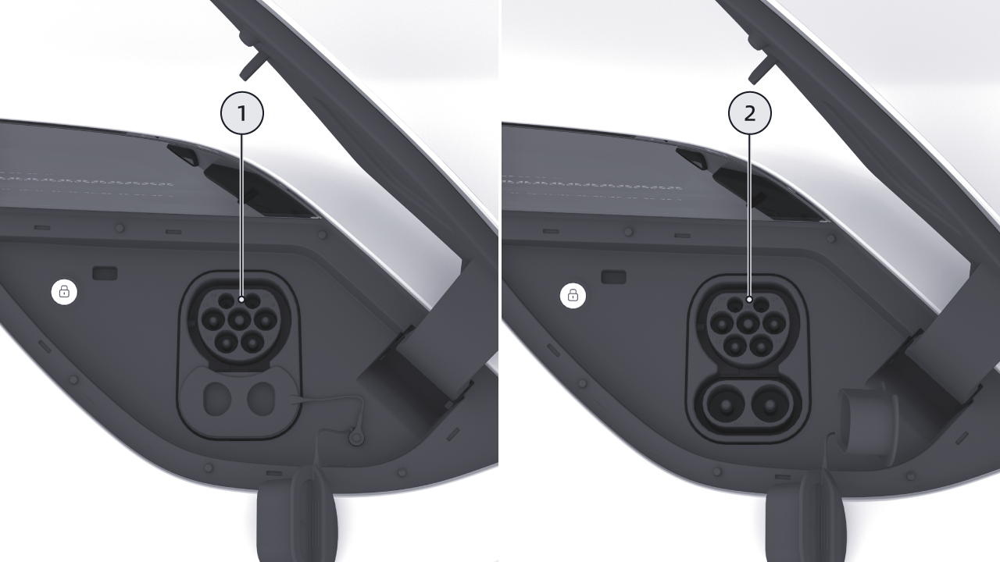

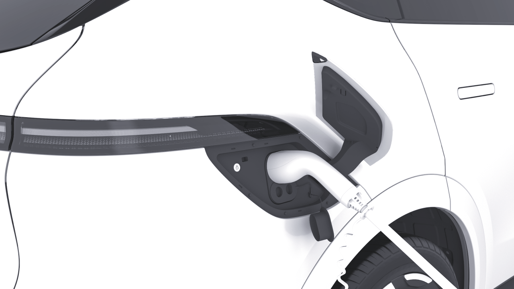

Instrucciones de Carga

indica que el conector de carga se ha insertado
correctamente.

indicación, no intente cargar nuevamente, comuníquese
con el Centro de Servicio de Automóviles XPENG
inmediatamente.

6. Comience la carga siguiendo las instrucciones
indicadas en la estación de carga.

7. Si necesita detener la carga a mitad del proceso, toque
"Detener Carga" en la pantalla de control central
para terminar la carga.

• Si el conector de carga lenta no se extrae, use
el anillo de desbloqueo de emergencia de carga lenta
para desbloquear el conector. Comuníquese con su
proveedor de carga rápida cuando el conector de carga rápida no se extrae.

precaución

8. Una vez que se complete la carga, presione el botón de desbloqueo
en el conector de carga y extráigalo.

9. Asegure la cubierta de sellado y cierre la tapa del puerto de carga.

• La carga o la parada debe realizarse en estricta
conformidad con los procedimientos de operación
de la estación de carga. No enchufe ni desenchufe
el conector de carga durante la carga.

10. Devuelva el conector de carga a su posición original
en la estación de carga.

advertencia

Consejos

• El vehículo puede afectar dispositivos electrónicos médicos o
implantables durante la carga y descarga, consulte al
fabricante del dispositivo electrónico antes de
la carga y descarga.

• El sistema calienta la batería de tracción y
entra automáticamente en carga cuando se alcanza
el estado especificado.

• Si ocurre una falla durante la carga, la
pantalla de carga mostrará una falla

• Al cargar con un conector en ambiente frío, puede
haber situaciones donde la eficiencia de carga se reduce o la carga
no es posible. Cuando la batería de tracción

Instrucciones de Carga

se descarga y se carga en un ambiente frío,
el sistema calienta la batería de tracción a la
temperatura apropiada cuando el conector de carga se conecta antes
de cargar la batería de tracción.

• Antes de cargar, verifique que el puerto de carga, la pistola de carga y el conector de carga estén secos. No opere el equipo de carga si este o sus manos están mojados.

• Se recomienda utilizar la función Mantener Calor de la Navegación antes de que se requiera carga rápida en ambientes de baja temperatura.

• El cable de carga debe estar extendido suavemente durante la carga y no debe estar retorcido.

• Si el equipo de carga muestra signos de corrosión o daño, como terminales de metal de la pistola de carga deformados o sesgados, o componentes de enchufe de plástico agrietados o deformados, se prohíbe la carga.

• El tiempo de carga puede variar dependiendo de factores como la temperatura exterior, la vida útil de la batería o la corriente de carga.

• Para garantizar la seguridad de la carga y extender la vida útil de la batería de tracción, algunos postes de carga DC finalizarán automáticamente la carga cuando la batería de tracción esté cargada aproximadamente al 95%.

• En caso de emergencia durante la carga, presione el botón de parada de emergencia en el equipo de carga para detener la carga.

• Durante tormentas eléctricas, se recomienda detener la carga del vehículo, ya que los rayos pueden dañar el equipo de carga.

Advertencias, Precauciones y Limitaciones

• Al extraer el conector de carga del poste de carga, sosténgalo firmemente con ambas manos para evitar que el cable de carga retorcido rebote e impacte al personal, causando lesiones personales.

• Se aconseja elegir estaciones de carga con sombra y refugios para lluvia para evitar que la lluvia o nieve salpique el puerto de carga al conectar o desconectar la pistola de carga.

Instrucciones de Carga

• Al insertar o remover el conector de carga, asegúrese de que el vehículo esté desbloqueado. Inserte o remueva el conector de carga verticalmente; no lo inserte en ángulo ni lo balancee.

• Después de cargar, asegúrese de que la tapa del puerto de carga esté bien cerrada para evitar que entre lluvia, nieve u otro debris.

• Debido a variaciones en la comprensión de los estándares nacionales de carga entre fabricantes de postes de carga y diferencias en la calidad de mantenimiento de productos de postes de carga, algunos postes de carga pueden no cargar el vehículo exitosamente. Si ocurre tal problema, intente reinsertar el conector de carga o cambiar a otro poste de carga.

• Si el puerto de carga emite un olor fuerte y penetrante durante la carga, detenga inmediatamente la carga.

• Los niños no deben tocar ni usar el equipo de carga.

• Si se encuentran polvo, partículas grandes u objetos extraños duros en el socket de carga, la pistola de carga o el conector de carga, límpielos después de que el vehículo esté apagado antes de proceder con la carga.

Desbloqueo de Emergencia del Puerto de Carga

• Si tiene un marcapasos implantado, desfibrilador cardioversor, bomba de dolor, bomba de insulina, audífono u otros dispositivos médicos electrónicos, no permanezca dentro del vehículo ni ingrese al vehículo para recuperar artículos mientras se carga, ya que esto puede interferir con dispositivos médicos electrónicos y causar lesiones personales o muerte.

Operación

Desbloqueo de emergencia manual

Si varios intentos de desbloqueo usando el botón de emergencia en la pantalla de control central fallan, reinserte el conector de carga firmemente y use el siguiente método para extraerlo:

• No desmantele ni modifique el puerto de carga o el cable de carga.

Instrucciones de Carga

2. Encuentre el anillo de tracción de desbloqueo de emergencia del puerto de carga, tire de él y extraiga el conector de carga una vez desbloqueado.

• Después de que el vehículo haya terminado de cargar y el CID salga de la pantalla de estado 'carga/calentamiento'. Solo use el anillo de tracción de desbloqueo de emergencia para desbloquear la pistola de carga.

precaución

• El desbloqueo de emergencia del anillo por el puerto de carga es adecuado para usar en situaciones de emergencia y el uso frecuente puede dañar el anillo de desbloqueo de emergencia o el dispositivo de carga.

1.
Abra el maletero y retire la placa de cubierta de reparación del maletero con herramientas apropiadas.

• Si no puede desbloquear la pistola de carga usando el anillo de desbloqueo de emergencia del puerto de carga, comuníquese con el Centro de Servicio XPENG de manera oportuna.

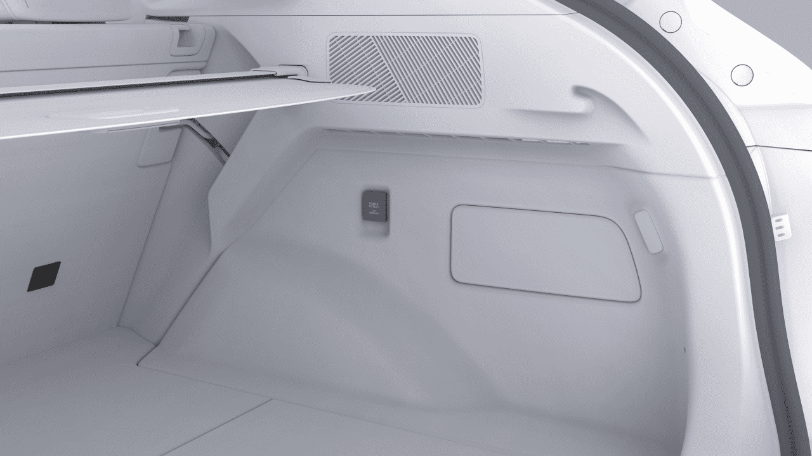

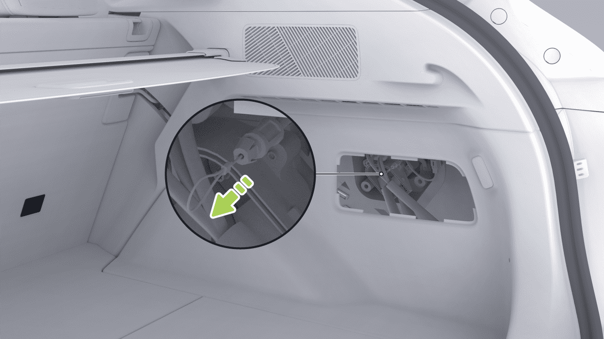

Instrucciones de Carga

Carga Programada

Operación

Introducción

Abrir o cerrar a través de la pantalla de control central

La función de programación de carga le permite establecer los tiempos de inicio y finalización de carga del vehículo, utilizando tarifas de electricidad fuera de horas pico nocturnas para reducir costos de carga.

Puede habilitar o deshabilitar la función de programación de carga por cualquiera de los siguientes medios:

• Pantalla de control central

• Aplicación móvil

En la pantalla de control central, vaya a la interfaz " 
 →Carga y Descarga→Carga". Puede habilitar "Cita de Carga Lenta" y establecer la hora de carga.

Consejos

Antes de activar la función de carga de reserva de carga lenta en la pantalla de control central, asegúrese de que la función de carga de reserva de poste de carga esté desactivada en el lado de la aplicación del teléfono, de lo contrario, la carga de reserva no tendrá éxito.

• Pantalla de control central

• Aplicación móvil

Operación

Al precalentar con una batería de baja temperatura, cierre el vehículo después de insertar la pistola de carga para evitar que otros la saquen.

precaución

Abrir o cerrar a través de la pantalla de control central

Precalentamiento de Batería de Baja Temperatura

Introducción

La función de precalentamiento de batería de baja temperatura puede calentar el paquete de batería usando la electricidad de la estación de carga CA en clima frío. Cuando la batería alcanza una temperatura óptima, mejora significativamente el rango del vehículo en condiciones frías.

En la pantalla de control central, vaya a la interfaz " 
 →Carga y Descarga→Carga". Puede activar o desactivar "Precalentamiento de Batería de Baja Temperatura" y establecer la duración del precalentamiento.

Puede habilitar o deshabilitar la función de precalentamiento de batería de baja temperatura por cualquiera de los siguientes medios:

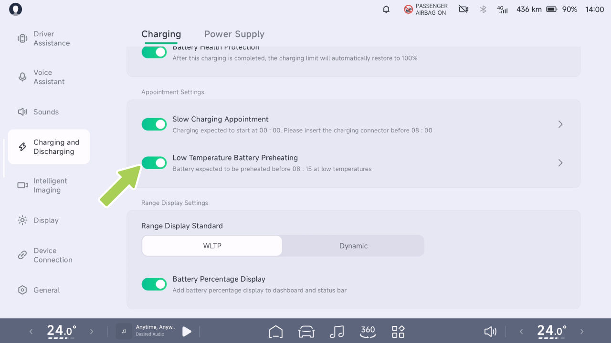

Instrucciones de Carga

Consejos

consumo de energía y debe usarse según sea necesario.

El tiempo de precalentamiento de la batería a baja temperatura se establece para terminar en el tiempo.

• Si la apertura falla, verifique que se cumplan las condiciones de apertura para la función. Por favor, contacte al Centro de Servicio de Automóviles Xpeng en caso de condiciones anormales.

precaución

• Al precalentar con una batería a baja temperatura, enchufe el conector y bloquee el vehículo para evitar que el cargador de CA sea sacado por otros.

Aislamiento Inteligente para Navegación

Introducción

• Se recomienda utilizar el vehículo lo antes posible después de que se complete el precalentamiento de la batería de potencia, el estacionamiento prolongado reducirá el efecto de calentamiento.

Cuando se utiliza la pantalla de control central para navegar a una estación de carga rápida, el vehículo controla la temperatura de la batería de tracción dentro del rango de carga óptimo para acortar el tiempo de carga.

• Si la temperatura de la batería de potencia es alta, la función de precalentamiento de la batería a baja temperatura no se activará.

• Si utiliza carga lenta con carga programada al mismo tiempo, asegúrese de establecer la hora de precalentamiento más tarde que la hora de carga programada.

• El precalentamiento de la batería a baja temperatura aumentará ligeramente la pila de carga de CA

Instrucciones de Carga

Operación

Consejos

Esta función calienta o enfría la batería de potencia y consume parte de la capacidad restante de la batería de potencia.

Descarga Externa V2L*

Introducción

En el vehículo, se puede utilizar equipo de descarga para proporcionar la potencia de la batería de tracción para otros aparatos eléctricos, con un voltaje de descarga de 220 V y una potencia máxima de 6 kW.

En la pantalla de control central, vaya a "→Carga y Descarga→Carga" interfaz, y puede activar o desactivar "Control de Temperatura antes de Carga Rápida".

Cuando se dirige a una estación de carga conocida sin la función de navegación habilitada, puede activar o desactivar manualmente o por voz la función "Precondicionamiento de temperatura de batería ahora".

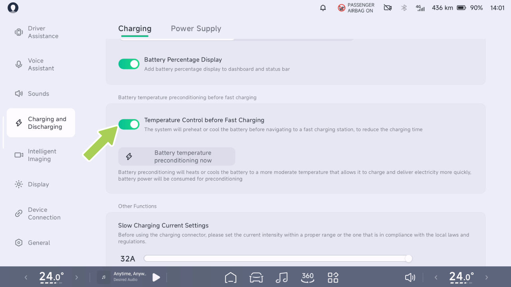

Instrucciones de Carga

Operación

3. Conecte el equipo de descarga al puerto de carga del vehículo para iniciar el suministro de energía.

Establecer el límite de descarga externa

4. Una vez que se complete el suministro de energía, toque "Detener Suministro de Energía" en la pantalla de control central.

5. Luego, desconecte el equipo de descarga.

precaución

Cuando se deba completar el trabajo de descarga, por favor haga clic en el botón "Fin de Energía" en la pantalla de control central primero. Luego desenchufe el dispositivo de descarga, de lo contrario puede ocurrir daño al vehículo.

En la pantalla de control central, vaya a "→Carga y Descarga→Suministro de Energía" interfaz, y puede configurar "Límite de Energía". Cuando la batería de tracción alcanza el límite, el suministro de energía se detendrá automáticamente.

Precauciones y Limitaciones

• La función de descarga externa no está disponible cuando la carga está por debajo del 20%.

Consejos

• El equipo de descarga externa (conector de descarga, etc.) no es estándar y debe ser adquirido.

Pasos de operación de descarga externa

1. Abra la tapa del puerto de carga.

2. Retire la cubierta de sello del puerto de carga.

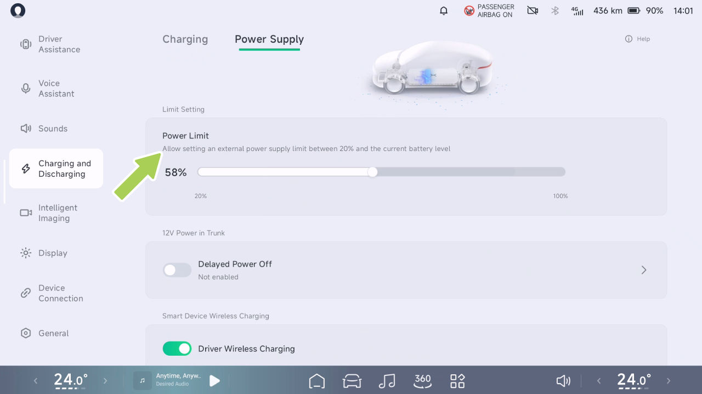

Instrucciones de Carga

advertencia

Protección de la Salud de la Batería

• El vehículo puede afectar dispositivos electrónicos médicos o implantables durante la carga y descarga; consulte con el fabricante del dispositivo electrónico antes de cargar y descargar.

Operación

• No utilice la función de descarga externa si hay daño en el tomacorriente eléctrico externo o en el dispositivo de descarga.

• No permita que menores de edad toquen o utilicen el dispositivo de descarga, y no permita que menores de edad se acerquen cuando se esté utilizando.

• Deje de utilizar la función de descarga externa inmediatamente si el suministro de energía es anormal.

• No toque los pines del enchufe eléctrico ni los conectores del dispositivo de descarga.

Para calibrar la batería, debe estar completamente cargada.
Si la barra de estado de la pantalla de control central indica "El estado de la batería necesita ser calibrado.", cargue inmediatamente la batería al 100% y realice la calibración.

• Los productos falsificados y los dispositivos electrónicos médicos o de atención médica están estrictamente prohibidos.

• Si aparece un mensaje de error durante el suministro de energía, no intente de nuevo y comuníquese con el Centro de Servicio Xpeng Motors inmediatamente.

Se recomienda utilizar pilas de carga de corriente directa u AC oficiales al calibrar baterías.

Consejos

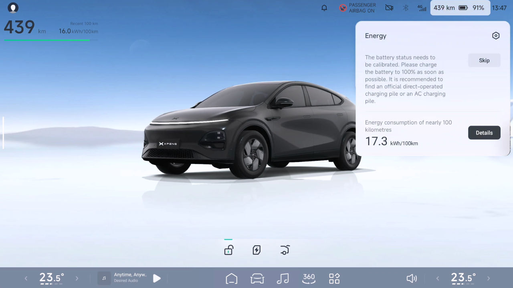
