# Mantenimiento Diario

Mantenimiento Diario

Soporte de asistencia inteligente al conductor

Abrir/Cerrar el Capó Frontal

Radar

Operación

• Mantenga la superficie del radar limpia, libre de hielo, nieve, agua, polvo u otros residuos.

Para asegurar que el radar funcione correctamente:

Abra el capó frontal

• Si se encuentran objetos extraños en la superficie del radar, limpie con un paño suave o límpielo usando agua (baja presión de agua).

Cámara

Para asegurar que la cámara funcione correctamente:

• Mantenga la superficie de la cámara limpia, libre de hielo, nieve, agua, polvo u otros residuos.

• Mantenga el parabrisas frontal limpio.

• Asegúrese de que el parabrisas frente a la cámara permanezca limpio y no haya objetos entre la cámara y el parabrisas.

1.
Tire del tirador del capó frontal ubicado en el lado inferior derecho del panel de instrumentos dos veces consecutivas para desbloquear el capó, que se abrirá ligeramente.

• Si se encuentran objetos extraños en la superficie de la cámara, limpie con un paño suave o límpielo usando agua (baja presión de agua).

309

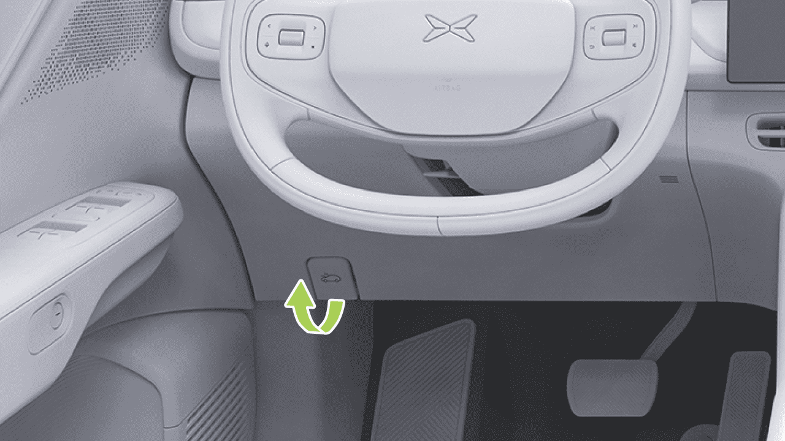

Mantenimiento Diario

Cerrar el Capó Frontal

2. Abra el capó frontal hacia arriba, y la varilla de soporte lo mantendrá automáticamente en posición.

1.
Baje el capó frontal hasta que el cierre del capó se enganche en el pestillo.

2. Coloque ambas manos en el borde frontal del capó (área resaltada en verde en la figura anterior), luego presione hacia abajo para cerrar el capó.

3. Después de cerrar, asegúrese de que el capó frontal esté bien bloqueado. El módulo del panel de instrumentos mostrará el estado de apertura y cierre del capó.

310

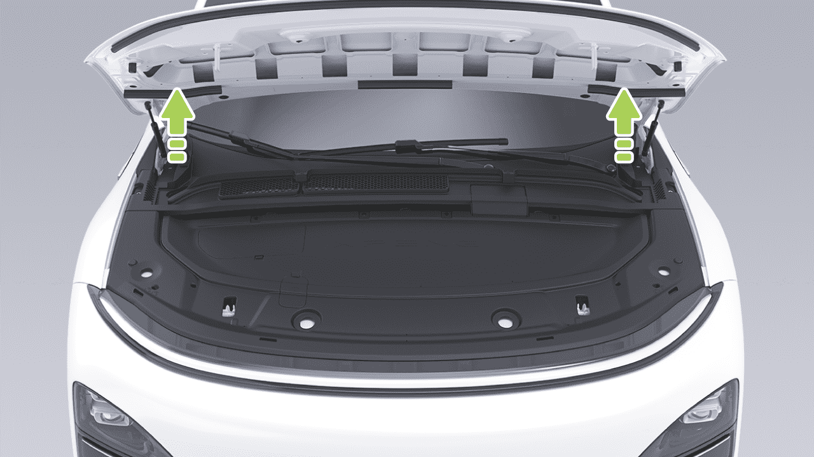

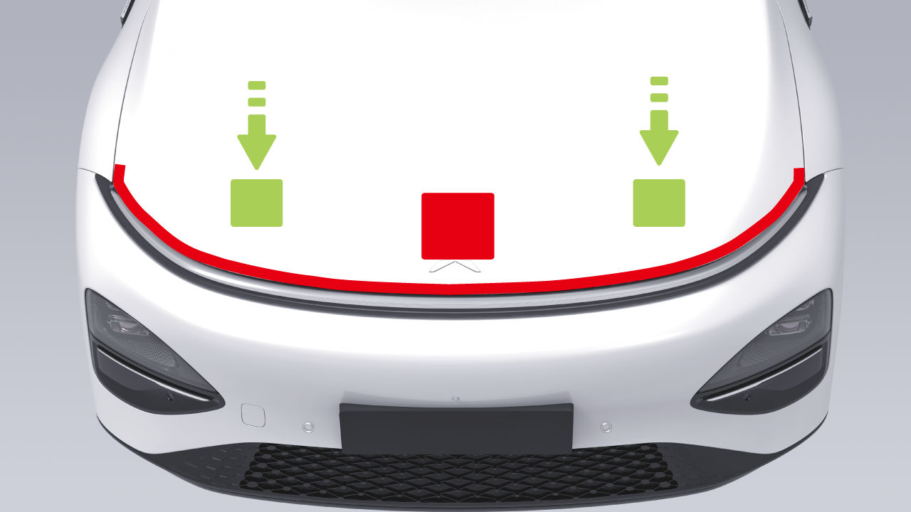

Mantenimiento Diario

advertencia

• No desenrosque la tapa del depósito cuando el sistema de refrigeración y el depósito de refrigerante estén calientes. Bajo la presión del vapor y el líquido hirviendo en el sistema de refrigeración caliente, el líquido hirviendo puede salpicar y quemar tan pronto como se desenrosque la tapa del depósito.

• Aplique presión solo en el área verde mostrada; la presión en el área roja puede causar daños.

• No cierre la tapa del compartimento frontal con una mano, para evitar la concentración de fuerza, que puede causar abolladuras o dobleces.

Verifique el nivel de refrigerante dentro del período de mantenimiento especificado.

• No presione en el borde frontal de la tapa del compartimento frontal para evitar doblar los bordes.

Refrigerante

Introducción

• Para agregar refrigerante, abra la cubierta del compartimento frontal, contacte a su Centro de Servicio de Vehículos XPENG para evitar lesiones personales por contacto accidental con componentes de alto voltaje.

advertencia

Verifique la marca de nivel en el lado del depósito de refrigerante:

• MAX: Marca de límite superior

311

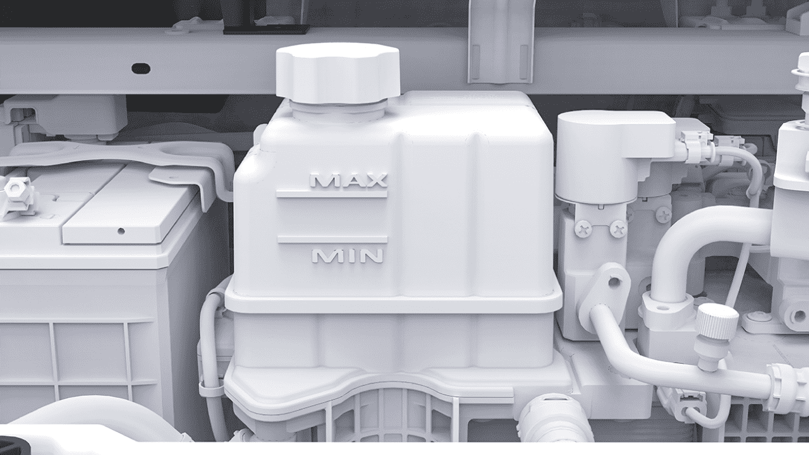

Mantenimiento Diario

• MIN: Marca de límite inferior

El nivel de refrigerante debe estar entre las marcas MIN y MAX. Si es más bajo que la marca MIN, agregue refrigerante aprobado por XPENG a tiempo.

Operación

2. Desenrosque la tapa del depósito y agregue el refrigerante.

Para maximizar el rendimiento y la vida útil de la batería de tracción, el motor y el sistema de A/C, el sistema de refrigeración utiliza un tipo específico de refrigerante (con un punto de congelación seleccionado según la temperatura mínima local).

Utilizando las herramientas apropiadas, retire el panel decorativo del compartimento del motor delantero para exponer el depósito de refrigerante.

312

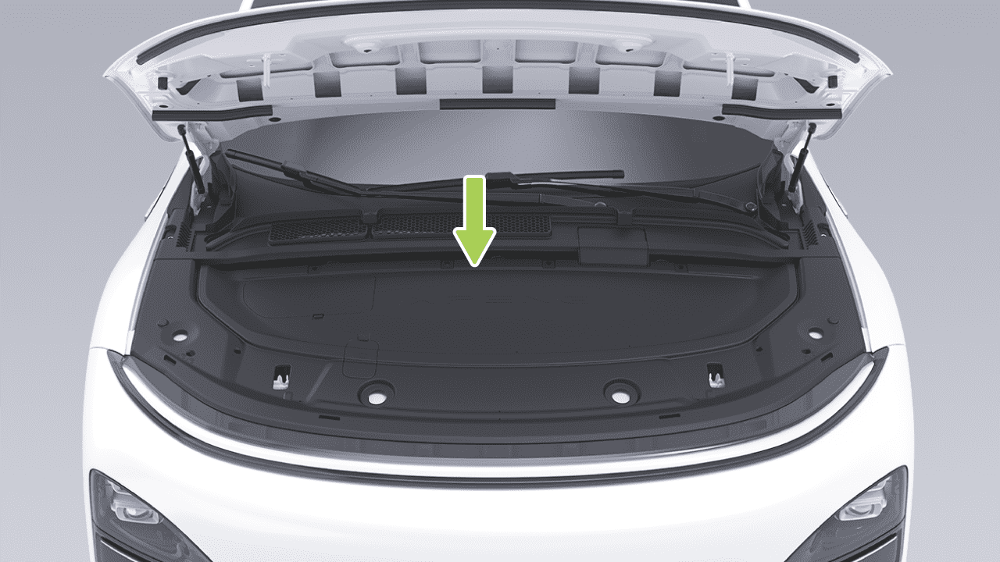

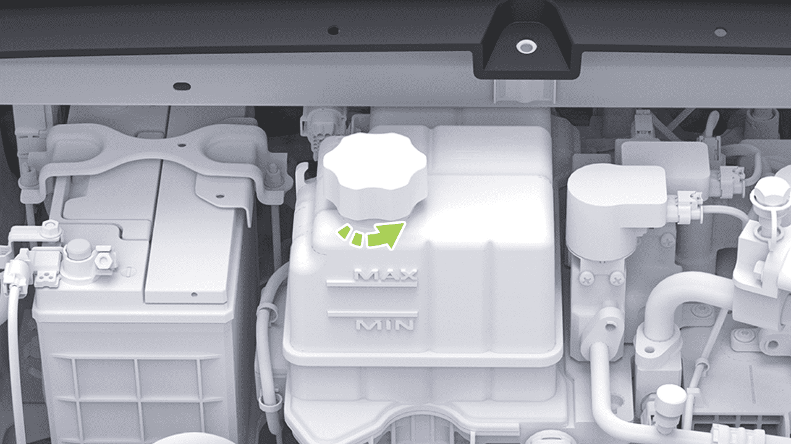

Mantenimiento Diario

Líquido de Frenos

incluso puede causar falla del sistema de frenos. Se recomienda el uso de líquido de frenos original de XPENG Motors.

Introducción

Si el nivel de líquido de frenos en el depósito está por debajo del nivel requerido, la luz de frenos en el panel de instrumentos se activará. Si hay una alarma durante la conducción, deténgase de forma segura en el costado de la carretera. No continúe conduciendo y póngase en contacto con el Centro de Servicio XPENG inmediatamente.

• Si nota un pedal de freno suelto o una pérdida significativa de líquido de frenos, póngase en contacto con el Centro de Servicio de Automóviles XPENG inmediatamente. Conducir en estas condiciones puede resultar en distancias de frenado extendidas o falla completa de frenos.

advertencia

Verifique la marca de nivel en el costado del depósito de líquido de frenos:

• La especificación del líquido de frenos está marcada en el envase de embalaje del líquido de frenos y debe usarse en todos los casos según la especificación del vehículo y debe usarse líquido de frenos nuevo. El líquido de frenos usado o inapropiado puede empeorar el rendimiento de frenado y

• MÁX: Marca de límite superior

• MÍN: Marca de límite inferior

El nivel de líquido de frenos debe estar entre las marcas MÍN y MÁX. Si es inferior a la marca MÍN, agregue líquido de frenos aprobado por XPENG a tiempo.

313

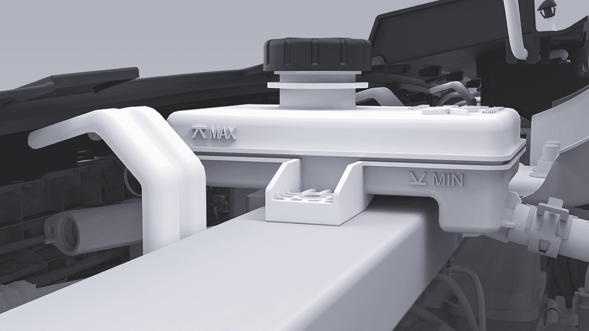

Mantenimiento Diario

advertencia

tanque de almacenamiento en la ubicación indicada por la flecha en la ilustración.

• Agregue líquido de frenos a un nivel cercano a MÁX (pero sin superar la línea MÁX). Instale la tapa después de que se haya agregado el líquido de frenos.

2. Limpie la tapa del depósito para evitar que entre polvo.

• El líquido de frenos es una sustancia tóxica y está sujeto a regulaciones ambientales al drenar o desechar líquido de frenos usado.

Operación

3. Desenrosque y retire la tapa del depósito.

4. Agregue líquido de frenos aprobado por XPENG hasta que el nivel esté cerca de la marca MÁX.

1. Envuelva un destornillador de cabeza plana con un paño, luego retire el acabado superior del depósito de líquido

314

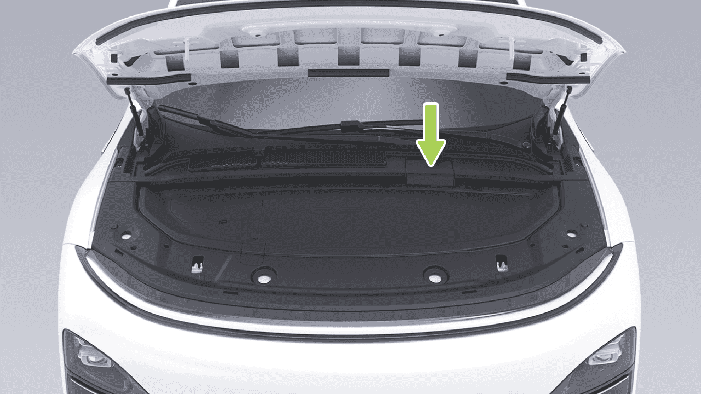

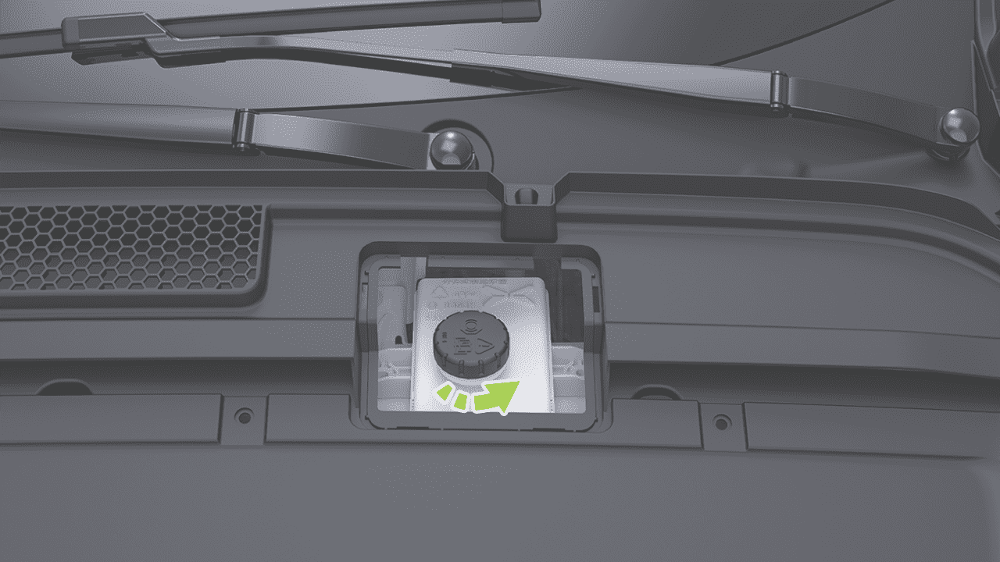

Mantenimiento Diario

Precauciones y Limitaciones

• Es normal que el vehículo se ajuste automáticamente durante el uso debido al desgaste de los discos de fricción de frenos; puede ocurrir una ligera caída en el nivel de líquido de frenos y no hay motivo de preocupación. Sin embargo, si el nivel de fluido cae significativamente en un corto período de tiempo, o por debajo de la marca MÍN, o si el depósito requiere relleno frecuente, indicando un sistema de frenos con fugas, póngase en contacto con el Centro de Servicio de Automóviles XPENG lo antes posible para inspeccionar el sistema de frenos.

• Utilice líquido de frenos nuevo en una botella cerrada y hermética. No utilice líquido de frenos que haya sido usado o que haya sido abierto del recipiente. El líquido de frenos absorbe humedad y reduce el rendimiento de frenado.

advertencia

• El líquido de frenos es altamente tóxico. El recipiente debe mantenerse sellado y protegido del contacto con niños. Busque atención médica inmediatamente si lo ingiere accidentalmente.

• La luz de advertencia se iluminará si el nivel del fluido cae por debajo de la altura especificada.
El panel de instrumentos puede mostrar mensajes de texto relevantes para advertir al conductor que ciertas acciones deben realizarse de inmediato. En este caso, detente inmediatamente, nunca continúes conduciendo y contacta al Centro de Servicio de Automóviles XPENG lo antes posible para revisar el sistema de frenado.

• El fluido de frenos puede dañar la superficie de pintura; el derrame puede ser absorbido inmediatamente por un paño absorbente y lavado con una mezcla de limpiador de autos y agua.

• Algunos modelos tienen componentes en el compartimiento delantero que bloquean el contenedor de fluido de frenos y pueden no ser capaces de verificar con precisión el nivel del fluido de frenos. Si es necesario, contacta al Centro de Servicio de Automóviles XPENG para obtener ayuda con la inspección.

• Si la luz de advertencia del sistema de frenado no se apaga o se enciende mientras conduces, el nivel del fluido de frenos es bajo y deberías detenerte inmediatamente para prevenir accidentes. No continúes conduciendo; contacta al Centro de Servicio de Automóviles XPENG lo antes posible.

315

Mantenimiento Diario

Rellenado del Fluido del Limpiaparabrisas

Introducción

• El fluido de frenos es absorbente de agua y continuamente absorbe humedad del aire circundante durante el uso. Si el fluido de frenos contiene demasiada agua, corroerá el sistema de frenado y también reducirá significativamente el punto de ebullición del fluido de frenos, lo que puede crear resistencia al aire durante el frenado de emergencia. Efecto de frenado reducido.

Verifica regularmente el fluido del limpiaparabrisas. Si se encuentra que el indicador de nivel bajo del fluido del limpiaparabrisas se ilumina en el panel, indica que el nivel del fluido de limpieza es demasiado bajo. En este momento, necesitas agregar fluido del limpiaparabrisas al depósito a tiempo.

Activa periódicamente el limpiaparabrisas para verificar obstrucciones de boquillas y asegurar un rendimiento de pulverización adecuado.

• No almacenes fluido de frenos en un recipiente de alimentos vacío, botella o cualquier contenedor de fluido de frenos no genuino, ya que esto puede llevar a la interpretación errónea del fluido de frenos como alimento. ¡Causa envenenamiento!

316

Mantenimiento Diario

Operación

Precauciones y Limitaciones

• No utilices fluido de limpieza de parabrisas con contenido de etanol superior al 10%. En un ambiente de alta temperatura, dicho fluido de limpieza de vidrio puede causar que el vidrio se agriete.

advertencia

• Evita derramar fluido del limpiaparabrisas en paneles de carrocería. Si ocurre un derrame, límpialo inmediatamente y enjuaga el área con agua limpia.

1. Retira el acabado superior del tanque de almacenamiento de líquido.

2. Limpia la tapa del depósito para evitar que entre polvo.

3. Abre la tapa del depósito.

4. Agrega fluido del limpiaparabrisas hasta que el nivel del fluido esté justo debajo de la boca de llenado.

317

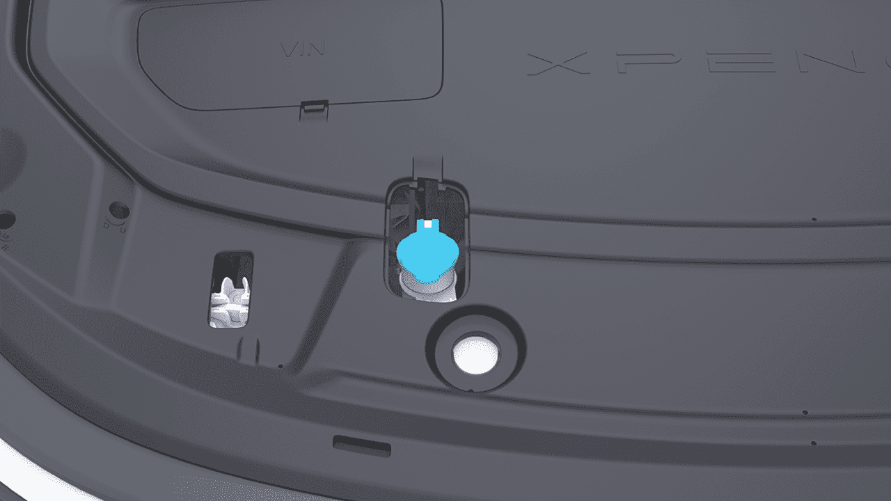

Mantenimiento Diario

Reemplazo de Limpiaparabrisas

precaución

Introducción

Antes de reemplazar los limpiaparabrisas, activa el modo de servicio del limpiaparabrisas con la tapa del compartimiento delantero y la puerta principal del conductor completamente cerradas; puede ocurrir daño al vehículo.

Operación

Reemplaza la cuchilla del limpiaparabrisas delantero

En la pantalla de control central, ve a "→Vehículo" interfaz, y activa "Modo de Mantenimiento del Limpiaparabrisas Frontal". Los brazos del limpiaparabrisas se moverán a la posición de mantenimiento.

Pon el vehículo en posición P y mantén los limpiaparabrisas apagados. En la pantalla de control central, ve a "→Vehículo" interfaz, y puedes activar o desactivar "Modo de Mantenimiento del Limpiaparabrisas Frontal/Trasero". El brazo del limpiaparabrisas se moverá a su posición de mantenimiento, y al desactivar el Modo de Mantenimiento del Limpiaparabrisas, el brazo del limpiaparabrisas trasero volverá automáticamente a su posición original.

318

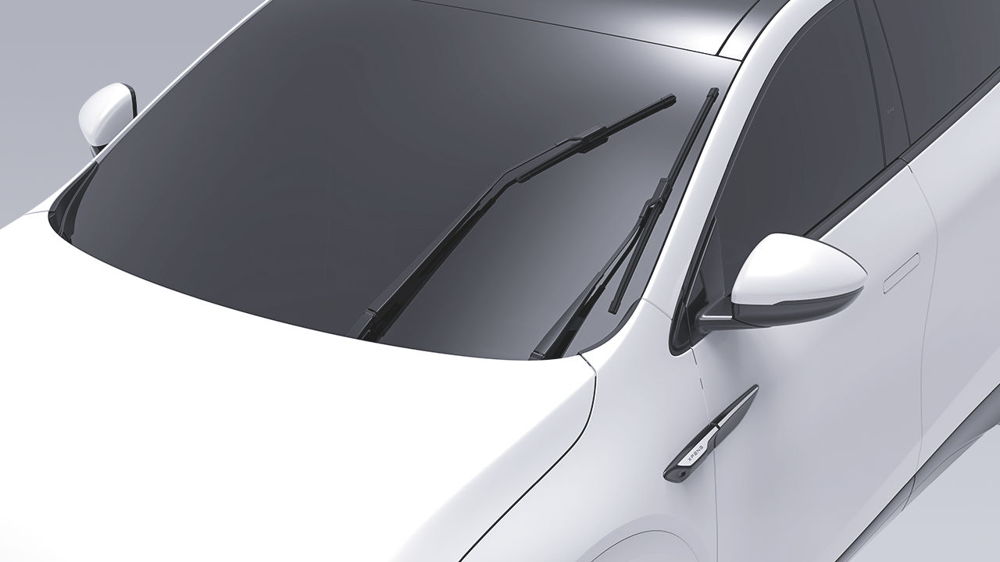

Mantenimiento Diario

Reemplazar la hoja del limpiaparabrisas trasero

1.
En la pantalla de control central, ve a "→Vehículo" interfaz, y activa "Modo de Mantenimiento del Limpiaparabrisas Trasero". El brazo del limpiaparabrisas se moverá a la posición de mantenimiento.

2. Levanta el brazo del limpiaparabrisas, presiona los botones de bloqueo en ambos lados, suéltalo, y luego retira la hoja del limpiaparabrisas en dirección hacia arriba.

3. Instala la nueva hoja del limpiaparabrisas siguiendo el procedimiento inverso hasta que escuches un "clic". Indica una instalación correcta.

4. Baja suavemente el brazo del limpiaparabrisas hacia el parabrisas.

2. Levanta el brazo del limpiaparabrisas, presiona los botones de bloqueo en ambos lados, y tira de la hoja del limpiaparabrisas hacia atrás para quitarla.

5. Desactiva "Modo de Mantenimiento del Limpiaparabrisas Frontal".

3. Al instalar, levanta el brazo del limpiaparabrisas e inserta la protuberancia de la nueva hoja del limpiaparabrisas en la CAM del brazo del limpiaparabrisas. Cuando escuches un "clic". Indica una instalación correcta.

319

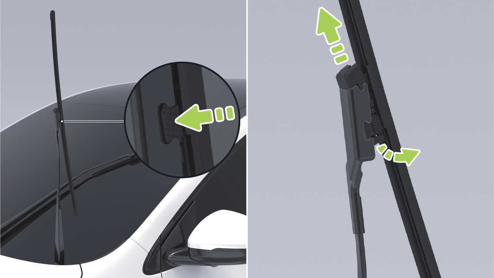

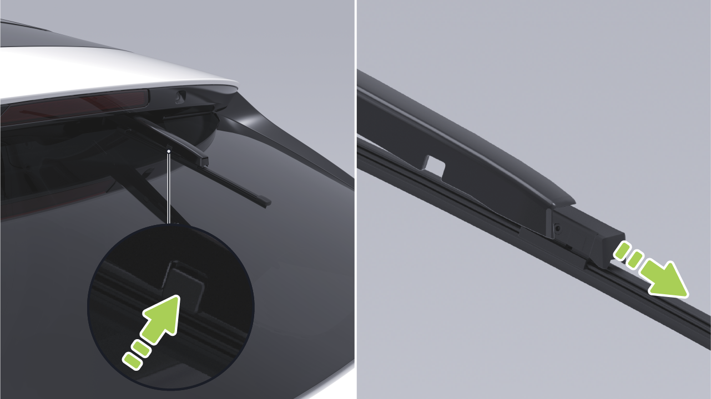

Mantenimiento Diario

4. Baja suavemente el brazo del limpiaparabrisas hacia el parabrisas.

precaución

5. Desactiva "Modo de Mantenimiento del Limpiaparabrisas Trasero".

• El vehículo ha circulado a través de barro, baches, cordones, cinturones de orugas más altos y anchos, Se debe tener cuidado en carreteras especiales, como rampas de acera, para evitar arañazos o daños a las baterías de energía causados por una colisión con el chasis.

• Si las hojas del limpiaparabrisas necesitan ser reemplazadas, se recomienda ir al Centro de Servicio de Automóviles XPENG para el reemplazo.

Consejos

• En caso de limpiar el vidrio, hojas del limpiaparabrisas o reemplazar las hojas, levanta los brazos del limpiaparabrisas al levantar los limpiaparabrisas, no agarres las hojas directamente. Evita la deformación de las hojas del limpiaparabrisas, que puede afectar el ruido anormal y el rendimiento de las hojas del limpiaparabrisas.

• Ten cuidado al conducir sobre agua profunda y estancada para evitar cortocircuitos, fugas o daños a la batería de energía debido al contacto excesivo con agua.

advertencia

Si sientes que el chasis se ha rayado, o la batería de energía despide un olor, etc., debes dejar de usar el vehículo inmediatamente y contactar al Centro de Servicio de Automóviles XPENG.

Batería de Tracción

Introducción

Rango de conducción

La batería de tracción está montada en la parte inferior del vehículo, ¡así que conduce con cuidado!

El rango de conducción se ve influenciado por factores como la carga restante de la batería de tracción, el kilometraje total y el tiempo, la temperatura ambiente, la carretera

Mantenimiento Diario

condiciones, hábitos de conducción (uso del A/C, modo de conducción, nivel de regeneración) y la carga del vehículo.

Por favor, consulte la tabla que correlaciona el nivel de batería y la duración del estacionamiento para asegurar una carga suficiente para el estacionamiento:

Temperatura ambiente

La temperatura ambiente afecta el rendimiento de la batería de tracción. El vehículo debe ser utilizado en temperaturas que van desde -30°C a 60°C para mantener el rendimiento óptimo de la batería y prolongar su vida útil.

Autonomía de conducción o nivel de batería

30%
50%
60%

precaución

Días de estacionamiento
≤90
≤150
≤180

No exponga continuamente el vehículo a condiciones mayores a 60°C o menores a -30°C.

Mantenimiento de la batería de tracción

Se recomienda encender y verificar la batería cada tres meses. Si el nivel de batería es demasiado bajo, recargue prontamente para evitar la degradación del rendimiento debido al bajo voltaje.

La batería de tracción se descargará lentamente, incluso si el vehículo no está en uso. La vida útil y el rendimiento de la batería de tracción se reducirán si el nivel de batería es demasiado bajo, acortando la autonomía de conducción del vehículo. Por lo tanto, antes del estacionamiento prolongado, verifique la carga de batería restante y manténgala entre 30%-60%. Si la carga es insuficiente, recargue para cumplir con el requisito de estacionamiento antes de dejar el vehículo.

La vida útil de la batería de tracción también se ve afectada por la temperatura ambiente. Cuando la temperatura ambiente es baja, la autonomía de conducción del vehículo puede disminuir y el tiempo de carga aumentará.

321

Mantenimiento Diario

Sugerencias

• Después de recibir el vehículo, cargue la batería al 100% lo antes posible (para los primeros tres cargos, se recomienda cargar el vehículo a 100% con supercarga). Durante el uso regular, mantenga siempre el límite de carga en 100%, y cargue completamente la batería al 100% al menos una vez cada dos semanas o 1,000 km (tanto carga como supercarga son aceptables).

• Temperatura ambiente operativa de carga recomendada: 0 a 45°C. El tiempo de carga se prolongará cuando la temperatura ambiente operativa esté por debajo de 0°C.

• El estacionamiento prolongado en condiciones calurosas o frías puede resultar en desgaste acelerado de la batería de potencia y se recomienda estacionar en un área fresca, seca y ventilada, evitando fuentes de calor (por ejemplo, tuberías de calefacción) y áreas bajas. Manténgase alejado de explosivos inflamables, sustancias corrosivas.

• Recargue prontamente si la autonomía de conducción del vehículo cae por debajo de 30 km o si ha estado estacionado por más de una semana.

• En invierno, cuando las temperaturas son más bajas, se recomienda mantener una autonomía restante de no menos de 100 kilómetros.

• Evite distancias largas o períodos prolongados de vadeo.

• No descargue completamente la batería de potencia.

• Durante el estacionamiento del vehículo, evite el uso prolongado del modo centinela o la función de apagado diferido de 12V del maletero para reducir el consumo de batería.

Para vehículos equipados con baterías de fosfato de hierro y litio, siga estas recomendaciones para estimar con precisión la autonomía de conducción y mantener la salud de la batería de tracción:

Mantenimiento de la batería de fosfato de hierro y litio

322

Mantenimiento Diario

Base de Carga

Neumáticos

Introducción

Introducción

Bajo uso normal, limpie la base de carga y
el enchufe de carga semanalmente con una
pistola de aire a presión o un cepillo. Si estas
herramientas no están disponibles, use un paño
sin pelusa o bastoncillos de algodón para limpiar.

Revise la presión de los neumáticos regularmente y, si es necesario inflarlos, siga las
especificaciones de presión de neumáticos en
la etiqueta del pilar B del lado del conductor
para ajustarla.

Inspección y mantenimiento de neumáticos

• Nunca toque el cañón del cargador y el
conector con objetos afilados como
destornilladores o pinzas para evitar dañar
el conector y la toma.

advertencia

Inspeccione regularmente las bandas de
rodadura de los neumáticos para detectar desgaste anormal, pinchazos o clavos. Verifique
regularmente los flancos de los neumáticos
para detectar abolladuras, cortes u otros daños.

• Cuando un objeto extraño se introduce
profundamente en la base de carga, debe
ser limpiado por un profesional.

Desgaste de neumáticos

Una profundidad de banda de rodadura
adecuada es crucial para el rendimiento del
neumático. Cuando se conduce en condiciones
normales o severas, el uso continuo de
neumáticos con patrones de banda de rodadura
desgastada o marcas de desgaste expuestas
es más probable que cause deslizamientos,
distancias de frenado extendidas, fallo de
dirección y ruptura de neumáticos, lo que
podría fácilmente conducir a accidentes y debe
evitarse.

precaución

No use fuerza para tirar de la pistola cuando
no sale correctamente después de que se
termine la carga lenta. Intente usar el puerto
de carga lenta para desbloqueo de emergencia
o póngase en contacto con el Centro de
Servicio de Automóviles XPENG.

323

Mantenimiento Diario

advertencia

• Los neumáticos deben reemplazarse cuando
estén gastados hasta la marca de desgaste.

• Los neumáticos con desgaste severo son
menos seguros y menos potentes incluso
antes de alcanzar la marca de desgaste.
Especialmente en superficies resbaladizas,
aumenta el riesgo de fenómeno de
deslizamiento, afectando seriamente la
seguridad de conducción.

Para reducir el desgaste de neumáticos y
prolongar la vida útil de los neumáticos,
mantenga los neumáticos en función de sus
hábitos de conducción y condiciones de la
carretera:

consejos

La marca de desgaste es un diagrama de
referencia solamente, dependiendo del
vehículo real.

• Evite aceleración rápida.

• Evite giros cerrados y frenado fuerte.

• Conduzca lentamente sobre baches, bordillos
u obstáculos similares.

La marca de desgaste, que es una nervadura
transversal distribuida uniformemente a lo
largo de la circunferencia del neumático en los
surcos de la banda de rodadura, mide 1,6 mm
de altura. Esta marca de desgaste se utiliza
para indicar si el neumático está excesivamente
gastado. Los neumáticos gastados hasta esta
marca de desgaste deben reemplazarse.

• Si se observa desgaste desigual de los
neumáticos, realice una inspección de
alineación de cuatro ruedas.

324

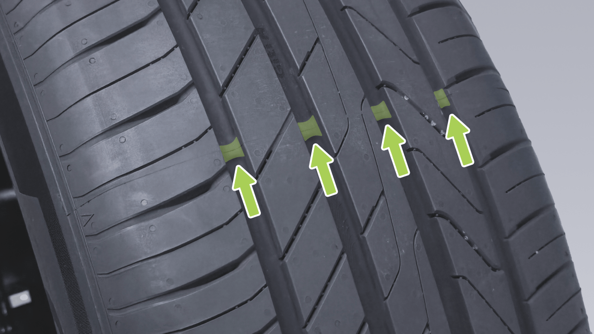

Mantenimiento Diario

aceleración, frenado y giro. El Centro de
Servicio XPENG inspeccionará el desgaste de
los neumáticos durante el mantenimiento y
recomendará el reemplazo de neumáticos si
es necesario. En casos especiales, como
cuando la banda de rodadura se desgasta hasta
el indicador de desgaste, o si la superficie del
neumático está rayada o pinchada, visite
inmediatamente el Centro de Servicio XPENG
para reemplazar el neumático.

precaución

consejos

Use los mismos neumáticos y ruedas que la
configuración original del vehículo. Los
neumáticos que no coincidan con la
especificación original pueden afectar el
funcionamiento del Sistema de Asistencia de
Conducción Inteligente y del Sistema de
Monitoreo de Presión de Neumáticos.

El ID del sensor de presión de neumáticos deberá ser reescrito después de la rotación de neumáticos, para evitar un funcionamiento anormal del TPMS, por favor acuda al Centro de Servicio XPENG para la rotación de neumáticos.

• No conduzca el vehículo si los neumáticos están dañados, excesivamente desgastados o la presión del aire es incorrecta. Revise regularmente los neumáticos para verificar el desgaste y asegúrese de que no haya cortes ni protuberancias.

advertencia

Reemplazo de neumáticos y ruedas

Debido a la exposición a los rayos UV, temperaturas extremas, cargas pesadas y condiciones ambientales, los neumáticos envejecen naturalmente con el tiempo. El desgaste normal de los neumáticos ocurre durante la conducción regular, incluyendo

325

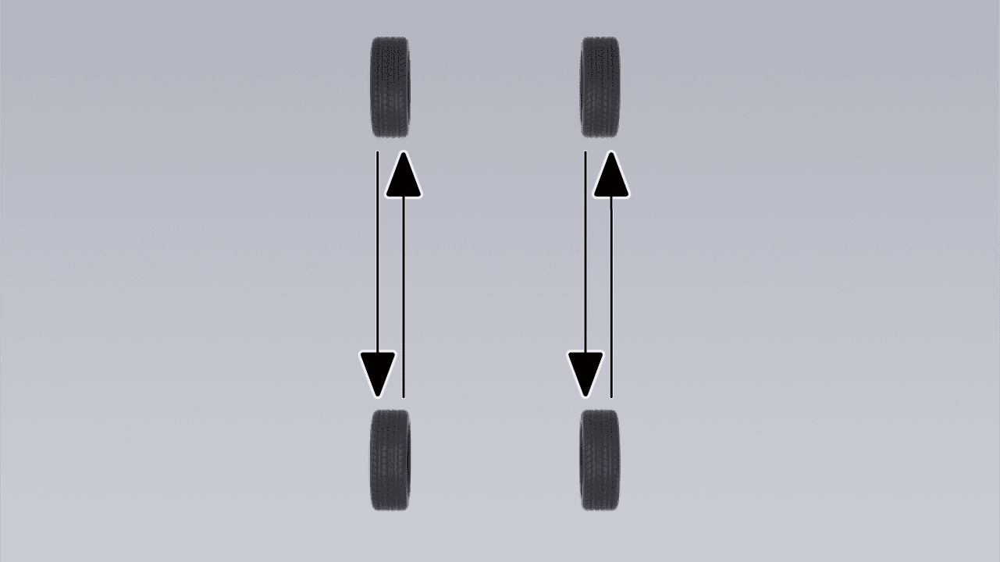

Mantenimiento Diario

• El equilibrio de ruedas debe realizarse nuevamente después de que se ha reemplazado un neumático nuevo o después de que se ha llevado a cabo una reparación de neumáticos.

Los neumáticos de invierno pueden mejorar la tracción en caminos helados y nevados. Al instalar neumáticos de invierno, asegúrese de que se instale un juego completo de cuatro neumáticos. Los cuatro neumáticos deben ser de la misma especificación, marca, construcción y patrón de banda de rodadura. Contacte al Centro de Servicio XPENG para obtener asesoramiento sobre neumáticos de invierno.

Tipos de neumáticos estacionales

Neumáticos de verano

Los neumáticos de verano están diseñados para superficies de carretera extremadamente secas y mojadas, pero no son adecuados para condiciones invernales. Para conducir a temperaturas bajas o en caminos helados y nevados, se recomienda usar neumáticos de invierno.

Al conducir un vehículo equipado con neumáticos de invierno, puede haber aumento del ruido de la carretera, menor vida útil de la banda de rodadura y tracción reducida en carreteras secas.

• Si nota desgaste desigual y excesivo de los neumáticos, debe ir al Centro de Servicio XPENG lo antes posible para verificar el equilibrio de las ruedas y la alineación de las cuatro ruedas.

advertencia

Este tipo de neumáticos está específicamente diseñado para proporcionar tracción adecuada en todas las estaciones del año. Sin embargo, pueden no ofrecer el mismo nivel de tracción que los neumáticos de invierno en caminos helados y nevados. Los neumáticos de todas las estaciones están marcados con el logo "ALL SEASON" y/o "M+S" (barro y nieve) en los flancos.

Neumático de todas las estaciones

• La presión insuficiente de los neumáticos es la causa más común de falla de neumáticos y puede causar sobrecalentamiento de neumáticos, agrietamiento de neumáticos, separación de la banda de rodadura o explosión de neumáticos causando pérdida inesperada del control del vehículo. Aumenta el riesgo de lesiones.

Neumáticos de invierno

• La presión baja de los neumáticos también puede reducir el alcance del vehículo y la vida útil de la banda de rodadura.

326

Mantenimiento Diario

• No use sellante de neumáticos ya que esto puede causar falla del sensor de presión de neumáticos.

Limpieza del Vehículo

Pastilla de Freno

Limpieza Exterior

Introducción

Limpieza Exterior

Los lavados frecuentes del vehículo ayudan a proteger la apariencia del vehículo.

Se recomienda verificar si las pastillas de freno están desgastadas hasta la posición de la placa de alarma durante cada mantenimiento o conducción de larga distancia.

Lave el vehículo en un área sombreada y solo después de que el vehículo se haya enfriado para evitar daños a la pintura causados por la luz solar directa.

Siga la guía del operador del lavador de vehículos al usar un lavador automático de vehículos.

Si ocurren ruidos inusuales durante el frenado, verifique las pastillas de freno y reemplácelas si están desgastadas hasta la posición de la placa de alarma.

Las pastillas de freno deben ser reemplazadas con equipo original. Durante el reemplazo, asegúrate de que la grasa de cobre se aplique uniformemente en los puntos de contacto entre las lengüetas de la pastilla de freno y la pinza.

Durante el lavado a alta presión, dirige el spray hacia el vidrio y no uses agua para lavar el interior del vehículo hacia el borde del vidrio.

En invierno, seca las costuras alrededor de las manijas de las puertas después del lavado para evitar que se congelen.

Retira rápidamente las sustancias corrosivas (excrementos de aves, savia de árboles, insectos, manchas de alquitrán, sal de carretera,

327

Mantenimiento diario

polvo industrial, etc.) para evitar daños en la pintura.

Después del lavado, enjuaga minuciosamente con agua limpia para evitar que los residuos de jabón se sequen en la superficie.

Al limpiar el exterior de la carrocería del vehículo, sigue estos pasos:

5. Seca con paño suave

1.
Preparación antes de la limpieza

precaución

Cierra todas las puertas, el maletero y el capó. Verifica que la tapa del puerto de carga esté completamente cerrada.

• No uses agua caliente ni detergentes.

• Si se utiliza una lavadora de alta presión, mantén la boquilla a al menos 30 cm de la superficie de la carrocería, mantén la boquilla en movimiento y no rocíes agua en ningún punto. No dirijas la boquilla hacia el puerto de carga.

2. Enjuague minucioso

Antes de lavar, usa una manguera para enjuagar la suciedad y la grava del exterior de la carrocería del vehículo. Presta especial atención a las áreas propensas a la acumulación de polvo, barro o sal de carretera (como los pasos de rueda y las costuras de los paneles).

• Las lamas activas de la rejilla pueden no funcionar correctamente debido al hielo cuando se lava en temperaturas frías o cuando se estaciona al aire libre en un día nevado; el panel de instrumentos indica un fallo de rejilla activa. Esto es normal y no afecta el uso normal del vehículo; el fallo desaparece automáticamente después de un período de conducción normal (aproximadamente una hora) o descongelación con un soplete de aire caliente. Si el problema persiste después de descongelar las cuchillas, póngase en contacto con el

3. Lavado a mano

Mezcla un limpiador de vehículos neutro de alta calidad con agua fría o tibia. Usa un paño suave para lavar a mano el exterior de la carrocería del vehículo.

4. Enjuague con agua limpia

328

Mantenimiento diario

Centro de Servicio de Automóviles XPENG para reparación.

Limpieza de ventanas y espejos retrovisores

• No rocíes las mangueras directamente hacia las ventanas, sellos de puertas u orificios de eje hacia los frenos.

Usa un limpiador de vidrios a base de alcohol para limpiar las ventanas y espejos retrovisores, y luego seca la superficie con un paño suave limpio y sin pelusa.

• Evita usar vellón de algodón o un paño áspero, como guantes para lavar autos.

Si quedan restos de cera de los tratamientos superficiales de la carrocería en el vidrio, elimínalos usando un limpiador especializado y paño de limpieza para evitar dañar las escobillas del limpiaparabrisas.

• No uses limpiador químico de llantas ya que esto puede dañar la superficie acabada de la rueda.

Usa un pequeño cepillo para quitar la nieve de las ventanas y espejos retrovisores.

• Cuando laves un auto, evita usar una pistola de agua a alta presión para impactar el área del interruptor de la solapa de carga, ya que esto puede causar que la solapa se abra.

Use un spray descongelante para eliminar el hielo, o use cuidadosamente un raspador de hielo, teniendo cuidado de no dañar los componentes y raspando en la misma dirección.

• Evite usar etanol o fluidos de lavado a base de etanol al lavar el vehículo, ya que esto puede causar daño a superficies como cubiertas de lámparas, pinturas y limpiaparabrisas.

precaución

• No use agua tibia o caliente para eliminar hielo o nieve del parabrisas y espejos, ya que esto puede causar que el vidrio se reviente.

Limpieza y mantenimiento de partes plásticas exteriores

Por lo general se limpia con agua limpia, paño suave y cepillo suave.

• Si hay residuos de goma, grasa y silicona en el vidrio, deben ser removidos

329

Mantenimiento Diario

con limpiador de ventanas especial o limpiador de silicona.

• En la pantalla de control central, vaya a la interfaz "→Vehículo" y active el "Modo de Mantenimiento de Limpiaparabrisas Delantero/Trasero".

Mantenimiento de bandas de sellado

• Levante ligeramente los brazos del limpiaparabrisas del parabrisas, lo suficiente para acceder a las escobillas. Use alcohol isopropílico o fluido limpiador de limpiaparabrisas para limpiar las escobillas a fondo.

Use un paño suave para eliminar el polvo y la suciedad de las superficies de sellado durante el mantenimiento de las bandas de sellado. Aplique regularmente un agente protector especial a la banda de sellado de goma

Limpieza de escobillas del limpiaparabrisas

• Si la escobilla del limpiaparabrisas aún no funciona después de limpiarla, puede ser necesario reemplazarla.

Inspeccione regularmente y limpie los bordes de las escobillas del limpiaparabrisas. Verifique si hay grietas, desgarros y asperezas en la goma. Si está dañada, contacte al Centro de Servicio XPENG para reemplazarla.

• Tenga cuidado al colocar los brazos del limpiaparabrisas para evitar una caída instantánea en el parabrisas.

precaución

El rendimiento del limpiaparabrisas puede disminuir debido a contaminantes en la escobilla del limpiaparabrisas, como hielo, cera de lavado de vehículos, fluidos de limpieza que contienen bacterias o repelentes de agua, excrementos de aves, hojas y otros materiales orgánicos.

• La escobilla del limpiaparabrisas está recubierta con una capa de grafito para suavizar el nivel de limpieza sin ruido de rasguño. Los agentes de limpieza que contienen disolventes, esponjas duras y herramientas afiladas pueden dañar la capa de grafito. Una capa de grafito dañada causará ruido excesivo de rasguño del limpiaparabrisas y debe reemplazarse prontamente.

Limpie las escobillas del limpiaparabrisas de la siguiente manera:

• Use un limpiador de vidrio no abrasivo para limpiar el parabrisas.

• En invierno o condiciones frías, siempre verifique que las escobillas del limpiaparabrisas estén congeladas con el

330

Mantenimiento Diario

parabrisas antes de usar los limpiaparabrisas. Si es así, deshiele la escobilla del limpiaparabrisas y ocurrirá daño al motor del limpiaparabrisas.

limpiadores de ventanas, que pueden acelerar el envejecimiento de las bandas del limpiaparabrisas.

• En caso de limpiar el vidrio, escobillas del limpiaparabrisas o reemplazar las escobillas, levante los brazos del limpiaparabrisas al levantar los limpiaparabrisas, no agarre las escobillas directamente. Evite la deformación de las escobillas del limpiaparabrisas, que puede afectar el ruido anormal y el rendimiento de las escobillas del limpiaparabrisas.

• No utilice materiales resistentes al agua (p. ej., encerado, cristalización, etc.) para limpiar el vidrio de la ventanilla, que aumentará la resistencia al agua de la superficie del vidrio y afectará la limpieza del vidrio.

Limpieza de los revestimientos interiores

Limpieza del parabrisas

Inspeccione y limpie regularmente los revestimientos interiores para mantener una apariencia limpia y nueva, y prevenir el desgaste prematuro.

Utilice un limpiador especializado para limpiar el parabrisas.

precaución

Los contaminantes en el parabrisas pueden afectar sus propiedades hidrófílas; limpiarlos de inmediato. Los contaminantes incluyen polvo, películas de aceite, excrementos de aves, hojas y otros escombros.

• Se recomienda utilizar productos automotrices sin plastificante, si el contenido de plástico de los productos automotrices es demasiado alto, reaccionará con el material interior de PU, lo que resultará en la aparición del abultamiento del interior.

precaución

• No utilice productos de limpieza que contengan amoníaco o cloro, como los domésticos

• Para evitar interferencias con el pedal, asegúrese de que la alfombra del piso del conductor esté asegurada correctamente y nunca superpuesta. Las alfombras del piso

siempre deben colocarse en la superficie de la alfombra del vehículo.

Cristal de revestimientos interiores

• El uso de disolventes (incluyendo alcohol), blanqueador, limpiadores cítricos, nafta, productos a base de silicona o aditivos puede dañar el interior.

Está estrictamente prohibido rayar la superficie del vidrio o espejo o usar cualquier solución de limpieza abrasiva. De lo contrario, la superficie reflectante del espejo y los elementos calefactores de la ventanilla trasera pueden dañarse.

• Las sustancias con electricidad estática pueden causar daño a la CID y al instrumento.

Superficies de IP y plástico

• No utilice toallitas, paños húmedos, agentes de limpieza, etc. para limpiar las cubiertas de las puertas y no los use durante el uso del vehículo (p. ej., en días lluviosos, cuando se lava el automóvil) tenga cuidado de proteger la guarda de la puerta del ingreso de agua tanto como sea posible, lo que podría causar falla de componentes eléctricos internos, etc.

Está estrictamente prohibido pulir la superficie superior del IP, porque la superficie pulida es fácil de reflejar luz y puede interferir con la visión de conducción.

Limpieza del asiento

Si los asientos tienen manchas, use un paño suave sumergido en agua tibia y una solución de jabón neutro para limpiar suavemente con movimientos circulares, y luego seque con un paño suave sin pelusa.

• Si se encuentra algún daño en el airbag o cinturón de seguridad, comuníquese con el Centro de Servicio del Vehículo XPENG de inmediato.

Cinturón de seguridad

• No permita que agua, detergente o tela entren en la unidad del cinturón de seguridad.

Saque el cinturón de seguridad y límpielo sin usar ningún detergente o limpiador químico. Saque el cinturón de seguridad y permita que se seque al aire de forma natural.

Alfombra

pantalla para que los botones no se activen y los valores de configuración permanezcan sin cambios.

Utilice una aspiradora con cabeza de cepillo suave para eliminar el polvo y la suciedad. Para manchas difíciles, intente eliminarlas con agua o agua con soda primero. Antes de limpiar, utilice un método apropiado para eliminar las manchas:

precaución

No utilice ácidos y álcalis, desoxigenación, hipoclorito de sodio (desinfectante 84) ni otros líquidos corrosivos para limpiar el CID.

• Para manchas de líquido: Seque suavemente con papel de seda para absorber la mayor cantidad posible de la mancha.

• Para manchas sólidas y secas: Elimine manualmente la mayor cantidad posible y luego use una aspiradora.

Superficies cromadas y metálicas

Los pulidos, limpiadores abrasivos o paños duros pueden dañar el acabado de las superficies cromadas y metálicas.

Pantalla de control central y panel de instrumentos

Limpie la pantalla de control central y el panel de instrumentos con un paño suave especial sin pelusa. No use limpiadores (por ejemplo, limpiacristales), paños húmedos ni paños secos cargados de electricidad estática (por ejemplo, paños de microfibra recién lavados).

Almohadillas de piso

Para extender la vida útil de la alfombra y facilitar la limpieza, use auténticas almohadillas de piso aprobadas por XPENG. Limpie regularmente las almohadillas de piso y asegúrese de que estén correctamente instaladas. Reemplace las almohadillas de piso de inmediato si se desgastan excesivamente.

En la pantalla de control central, vaya a la interfaz "Pantalla" o mediante el panel de acceso directo de la pantalla de control central, habilite "Limpieza de pantalla" antes de limpiar el control central

333

