# Rescate de Emergencia

## Dispositivo de Emergencia

**Consejos**

### Información del Dispositivo de Emergencia

Las luces de advertencia de peligro se pueden activar si el vehículo está encendido o apagado.

- Luz de advertencia de peligro

- Interruptor de apagado de emergencia* (si aplica)

En caso de emergencia mientras conduce, presione el interruptor de luz de advertencia de peligro para activar la luz de advertencia de peligro. La señal de giro parpadeará. Presione el interruptor nuevamente para desactivar la luz de advertencia de peligro.

Operaciones específicas .

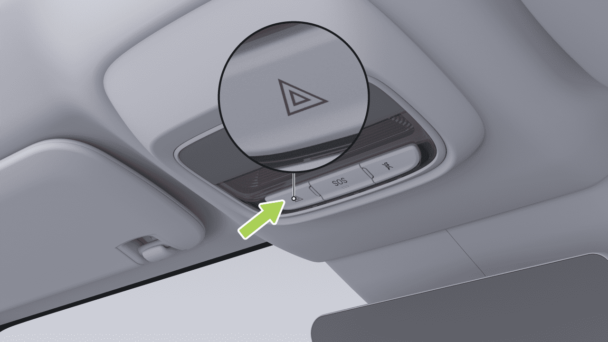

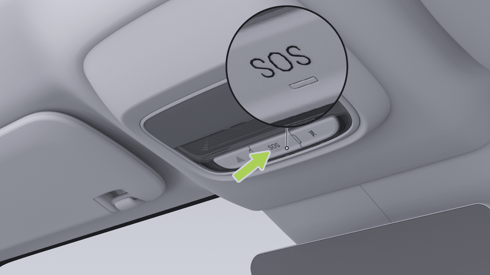

## Rescate de Emergencia

### Apagado de Emergencia-CID

- Manija de liberación de puerta de emergencia frontal

Cuando el vehículo está estacionado y necesita apagarse en caso de emergencia, vaya a la interfaz "→Vehículo" de la pantalla de control central y toque "Apagar la energía eléctrica del vehículo" para apagar el suministro de energía de alto voltaje y apagar el vehículo.

Operaciones específicas .

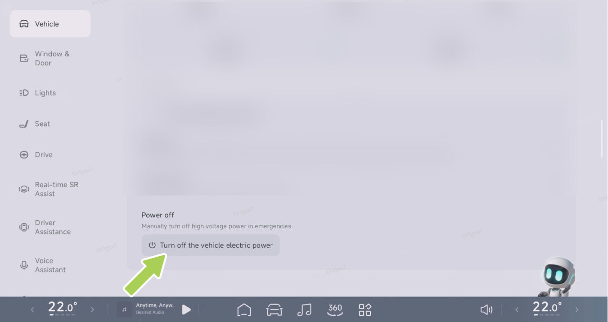

## Rescate de Emergencia

- Anillo de extracción de liberación de puerta de emergencia trasera

- Interruptor de apertura de emergencia del maletero

Operaciones específicas .

Operaciones específicas .

Las herramientas a bordo se encuentran debajo de la tapa del maletero. Abra el maletero y levante la cubierta para acceder a ellas.

### Dispositivo de Emergencia del Maletero

Este vehículo está equipado con las siguientes herramientas a bordo. Después de usarlas, límpielas rápidamente y devuélvalas a sus lugares designados.

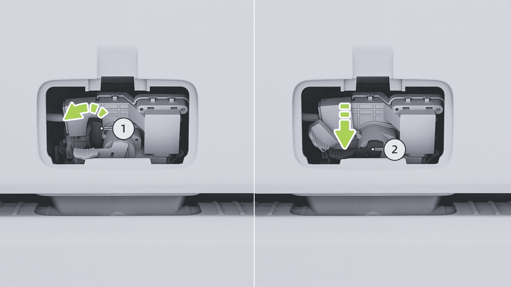

## Rescate de Emergencia

- Si el chaleco reflectante está roto o sucio, reemplácelo por uno nuevo.

**advertencia**

Cuando se trata de accidentes vehiculares, independientemente de las condiciones de iluminación, use siempre ropa reflectante según sea necesario para atraer la atención de transeúntes u otros conductores.

1. Herramientas a bordo: gancho de remolque, llave para tuercas de rueda

### Instrucciones para instalar el triángulo de advertencia

4. Herramientas de inflado de emergencia y reparación de llantas

2. Triángulo de advertencia

3. Chalecos reflectantes

Cuando encuentre un problema que requiera que se detenga mientras conduce, retire el chaleco reflectante de debajo de la tapa del maletero y póngaselo correctamente.

**Consejos**

- Cuando use un chaleco reflectante, use el lado del material reflectante hacia afuera.

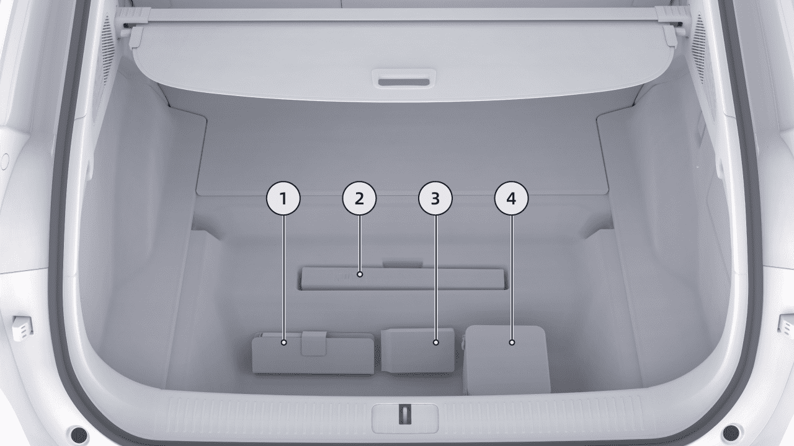

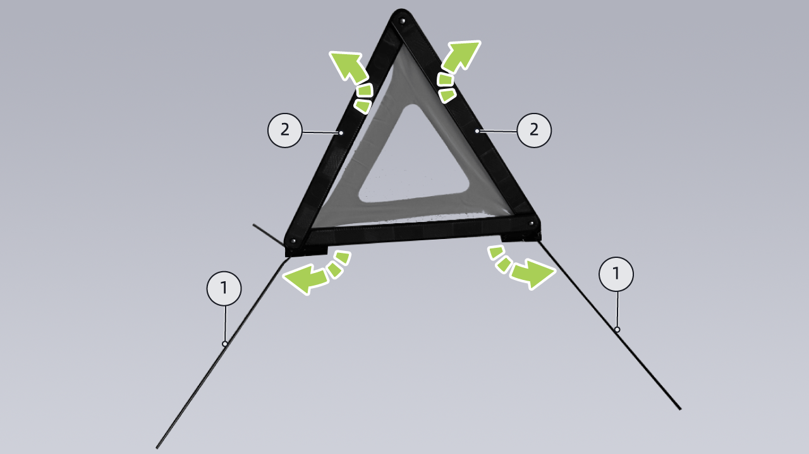

## Rescate de Emergencia

1. Despliegue los 4 soportes ① ubicados en la parte inferior del triángulo de advertencia.

2. Despliegue los bordes plegados ② en ambos lados del triángulo de advertencia y asegure su hebilla superior con firmeza.

3. Coloque el soporte en el suelo con el lado del material reflectante mirando hacia atrás.

La distancia de colocación del triángulo de advertencia detrás del vehículo varía según el tipo de superficie de la carretera y la visibilidad ambiental. Consulte la siguiente tabla:

| Distancia de colocación | | |
|---|---|---|
| Carretera | Día | Noche |
| Autopista | ≥ 150m | ≥ 150m |
| Carretera general | ≥ 50m | ≥ 80m |

## Rescate de Emergencia

### Reparación Temporal de Llantas

**Reparación Temporal de Llantas**

El vehículo no está equipado con una llanta de repuesto. Se proporciona un kit de reparación de emergencia de llantas con el vehículo.

El kit de reparación de emergencia de llantas incluye un inflador
y un cartucho de pegamento para llantas (suficiente para reparar
una llanta). Al inyectar la llanta, el pegamento para llantas
se filtrará en pequeñas perforaciones en la llanta con un
tamaño máximo de 6 mm, sirviendo como una solución temporal.

advertencia

• Para perforaciones mayores a 6 mm, daño severo
de la banda de rodadura, daño de la pared lateral,
desgarros en la llanta, o si la llanta se ha desprendido
de la rueda, por favor contacte al Centro de Servicio XPENG.

• El kit de reparación de emergencia de llantas está
destinado únicamente para reparaciones temporales
de un solo uso. La

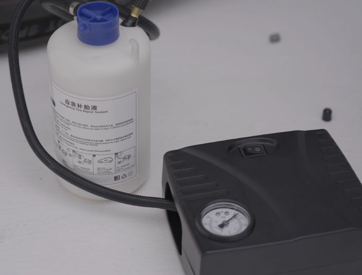

Rescate de Emergencia

llanta dañada debe ser reparada o reemplazada
lo antes posible.

pegamento para llantas puede perder su eficacia prevista. Asegúrese
de comprar pegamento para llantas nuevo.

• Si se utiliza una llanta reparada temporalmente con sellador
de llantas, la velocidad de conducción no debe exceder
80 km/h.

advertencia

• Por favor lea y siga todas las advertencias e
instrucciones proporcionadas con el kit de reparación
de emergencia de llantas.

• No use sellador de llantas comprado de otros canales,
ya que esto puede causar que los sensores de presión
de llantas funcionen mal.

• Asegúrese de leer y seguir las instrucciones de seguridad
y operación del sellador de llantas.

• Si la llanta del vehículo se desinfla, no continúe conduciendo,
ya que esto puede causar lesiones graves.

• Mantenga el sellador de llantas fuera del alcance de
los niños.

Pegamento para Llantas

• Si el sellador de llantas entra en contacto con
los ojos, enjuague inmediatamente con agua y
busque atención médica.

El pegamento para llantas proporcionado en el kit de reparación
de emergencia está especialmente diseñado para vehículos XPENG
y no dañará los sensores de presión de llantas. Por lo tanto,
solo se debe usar el mismo tipo y capacidad de pegamento para
llantas para reemplazo. El pegamento para llantas puede ser
comprado en el Centro de Servicio XPENG.

• Si el sellador de llantas es ingerido accidentalmente,
busque atención médica inmediatamente.

• Si el sellador de llantas es inhalado, muévase a aire fresco
inmediatamente para evitar problemas respiratorios y
busque atención médica.

La fecha de vencimiento está impresa en el cartucho de pegamento
para llantas. Si la fecha de vencimiento ha pasado, el

Rescate de Emergencia

Inflado de Llantas

Siga los pasos a continuación para reparar temporalmente
pequeñas perforaciones de llantas (menos de 6 mm):

1.
Retire el kit de reparación de emergencia del maletero.

3. Saque el cartucho de pegamento para llantas y agítelo
uniformemente.

2. Saque el inflador y el pegamento para llantas del kit.

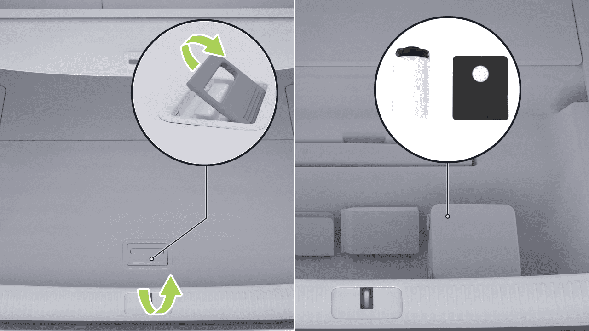

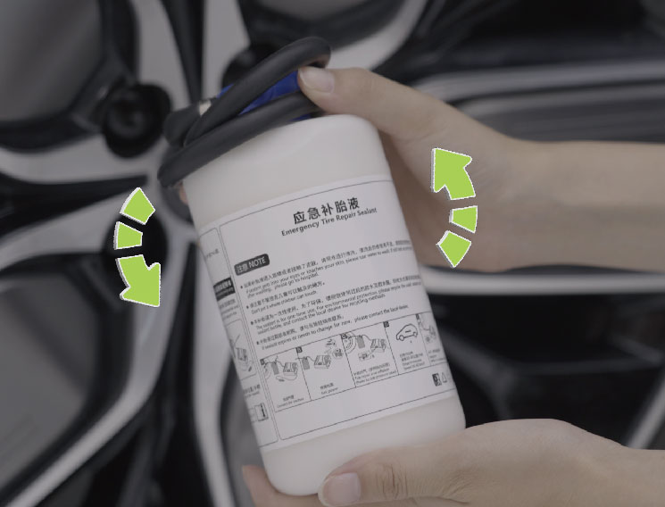

Rescate de Emergencia

4. Enrosque firmemente un extremo de la manguera de
conexión del pegamento para llantas en la válvula de
la llanta. Asegúrese de que el cartucho de pegamento
para llantas no esté invertido.

5. Conecte el otro extremo de la manguera de pegamento
para llantas al inflador y apriételo, y conecte el cable
de alimentación del inflador a la fuente de alimentación
de 12V en la caja de almacenamiento del vehículo.

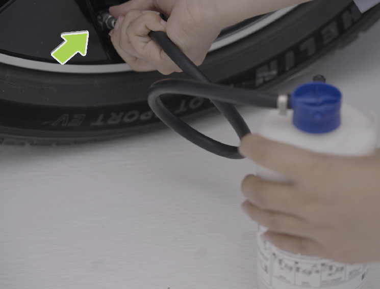

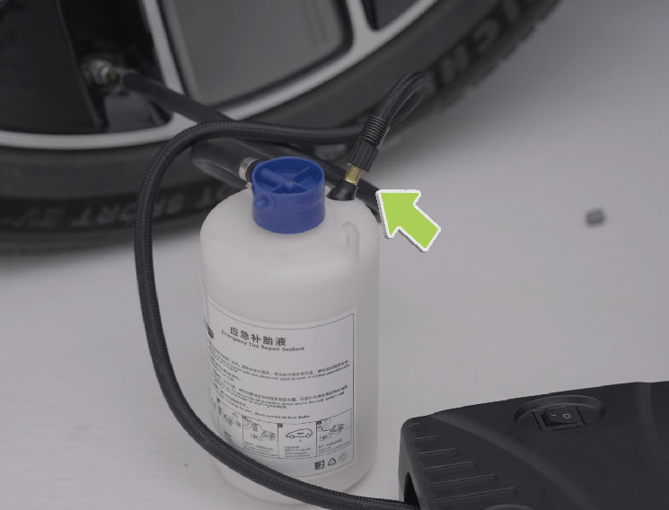

Rescate de Emergencia

d. Consulte la etiqueta de presión de llantas para la
presión de llantas estándar de la especificación de
llanta específica.

e. Verificar la presión de los neumáticos. Si el neumático
no puede alcanzar la presión especificada dentro de
20 minutos, la reparación se considera
fallida.

7. Apague el compresor y desconecte la manguera
de la válvula de neumático. Limpie cualquier exceso
de pegamento de neumático de la válvula de neumático y la rueda.
Desconecte la manguera del compresor y
devuelva el kit de reparación de emergencia de neumáticos al maletero.

8. Conduzca inmediatamente 5 km o 10 minutos para
permitir que el pegamento de neumático se distribuya uniformemente dentro
del neumático. Mantenga una velocidad de 20~60 km/h.

6. a. Encienda el interruptor para iniciar el compresor,
que inflará el neumático.

b. Durante el proceso de inyección del pegamento de neumático, el
indicador de presión muestra un rango de presión de
aproximadamente 300~600 kPa.

9. Detenga y verifique la presión del neumático.

Si la presión del neumático está por debajo de 130 kPa, el
daño del neumático no se puede reparar con el
sellador. Estacione el vehículo de manera segura al lado de la

precaución

c. Observe el indicador de presión y deje de inflar
una vez que la presión del neumático alcance el
valor estándar.

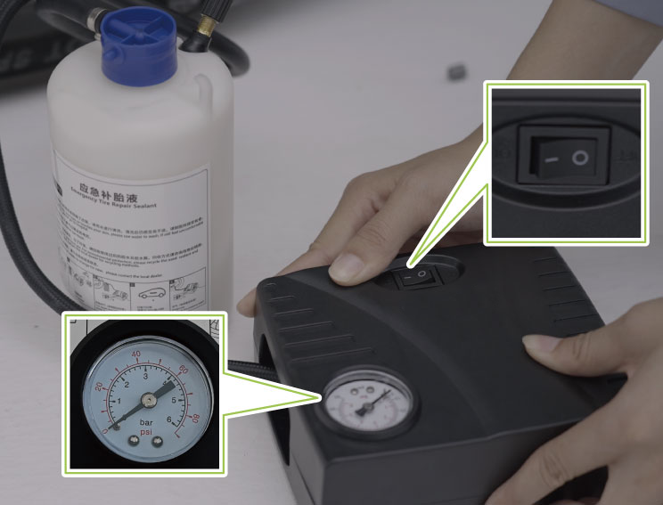

Rescate de Emergencia

carretera y comuníquese con el Centro de Servicio
XPENG.

Solo Inflado

10. Infle el neumático a la presión estándar.

12. Conduzca el vehículo al Centro de Servicio XPENG a
una velocidad de 20~80 km/h para la reparación del neumático.

11. Guarde el compresor de nuevo en el maletero.

• Por favor, repare o reemplace el neumático dañado lo
antes posible.

precaución

• Después de usar el sellador de neumático, compre un nuevo
sellador de neumático con prontitud.

• No exceda una velocidad de conducción de 80 km/h.

1.
Retire el kit de reparación de emergencia de neumáticos del
maletero.

2. Saque el compresor del kit de reparación de emergencia de neumáticos.

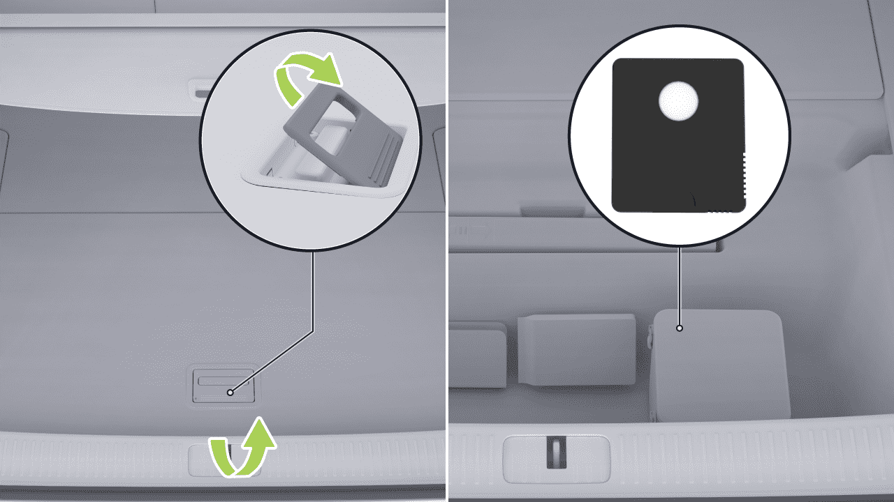

Rescate de Emergencia

3. Saque la manguera de conexión y el cable de alimentación
de ambos lados del compresor.

4. Conecte la manguera de conexión del compresor a la válvula de neumático
y apriete.

5. Conecte el cable de alimentación del compresor a la
fuente de alimentación de 12V del vehículo.

6. Encienda el interruptor para iniciar el compresor, que
inflará el neumático.

• Observe el indicador de presión y deje de inflar
una vez que la presión del neumático alcance el
valor estándar.

• Consulte la etiqueta de presión de neumático para la
presión estándar de neumático de la especificación de neumático específica.

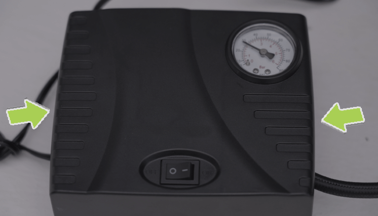

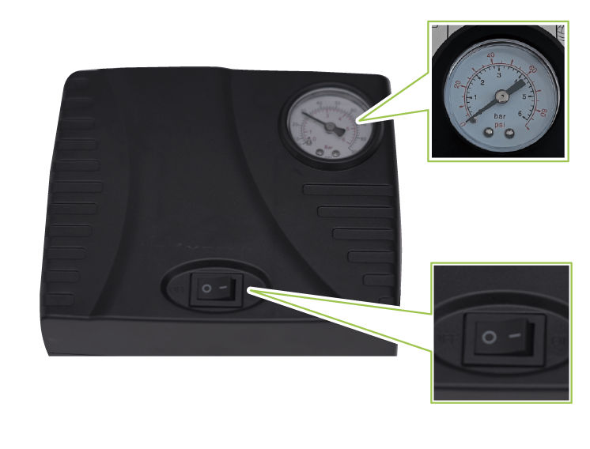

Rescate de Emergencia

7. Apague el compresor.

• Después de ajustar la presión del neumático, si el
indicador del Sistema de Monitoreo de Presión de Neumáticos (TPMS)
no se apaga, conduzca el vehículo
a 40 km/h una corta distancia y verifique
el estado del indicador.

• Por favor, infle el neumático al valor de presión
estándar; de lo contrario, la presión de neumático excesivamente alta
o baja puede acelerar el desgaste del neumático.

precaución

• Durante la operación del vehículo, la presión del neumático
puede aumentar ligeramente debido al aumento de la temperatura del neumático,
que es un fenómeno físico normal.

• Si la presión del neumático es demasiado alta, reduzca la
presión liberando aire.

– Pasos de operación: retire la manguera de inflado y presione el perno de metal en el centro de la válvula para liberar aire. Durante este proceso, puede reconectar la manguera para monitorear el manómetro hasta que la presión disminuya al valor estándar.

• Si el indicador TPMS permanece encendido, contacte al Centro de Servicio XPENG.

Equipo de Rescate y Protección

Introducción

El vehículo es impulsado por batería, y un impacto grave puede llevar a la fuga de alto voltaje. Por esta razón, el rescate del vehículo debe ser realizado por profesionales que usen equipo de protección personal apropiado.

Rescate de Emergencia

advertencia

Para evitar lesiones eléctricas, retire objetos metálicos, como un collar o reloj, al operar el vehículo.

Protección contra lesiones eléctricas

Para evitar lesiones eléctricas de alto voltaje, use el siguiente equipo de protección personal:

• Guantes de aislamiento de caucho (para voltaje superior a 500V);

• Gafas protectoras;

• Herramientas con mangas aislantes.

• Zapatos de caucho aislante;

Protección contra lesiones químicas

Si la batería de tracción gotea electrolito, use el siguiente equipo de protección personal para proteger su piel, rostro y otras partes del cuerpo de lesiones:

• Máscara protectora;

• Guantes aislados con solvente;

Rescate de Emergencia

Protección Contra Choques

para desbloquear o iniciar debido al agotamiento de la batería LV.

Introducción

Si el vehículo no puede iniciarse debido al agotamiento de la batería LV, puede iniciarse usando una fuente de alimentación CC de 12V externa.

El vehículo cuenta con funciones de corte de alto voltaje y descarga. En caso de un choque, si se cumplen las condiciones de disparo, el vehículo cortará automáticamente el suministro de energía de alto voltaje e instruirá a los ocupantes a salir inmediatamente del vehículo para prevenir riesgos a su seguridad.

Arranque de Emergencia

Operación

Cuando la batería LV es baja, la batería de tracción cargará automáticamente la batería LV. Sin embargo, si la batería de tracción es baja, la carga a la batería LV se detendrá para prevenir daños por sobre-descarga de la batería de tracción. Una vez que el vehículo está bloqueado, el sistema anti-robo comienza su operación, consumiendo continuamente energía de la batería LV. Si el vehículo no se carga oportunamente, puede llevar a que el vehículo sea incapaz de

1.
Abra el maletero delantero y retire la placa de cubierta de mantenimiento.

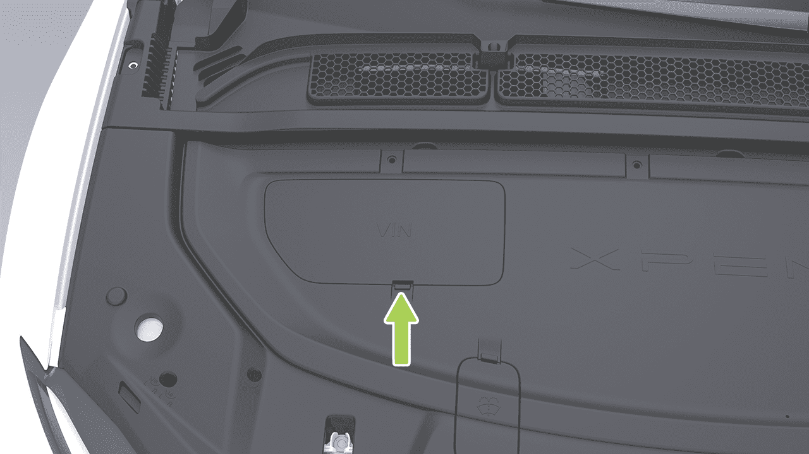

Rescate de Emergencia

3. Conecte un extremo del cable rojo al perno positivo (+) de la caja de fusibles del vehículo, y el otro extremo a la terminal positiva (+) de la fuente de alimentación auxiliar.

2. Abra la placa de cubierta de la caja de fusibles del maletero delantero.

4. Conecte un extremo del cable negro a la terminal negativa (-) de la batería del vehículo, y el otro extremo a la terminal negativa (-) de la fuente de alimentación auxiliar.

5. Después de conectar la energía auxiliar, si el panel de instrumentos o la pantalla de control central aún están iluminados, debe presionar primero el interruptor de apagado de emergencia para apagar; de lo contrario,

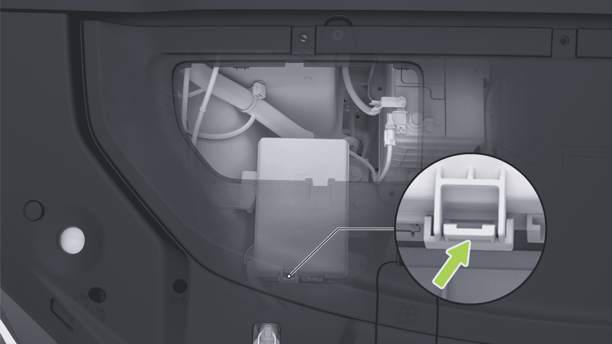

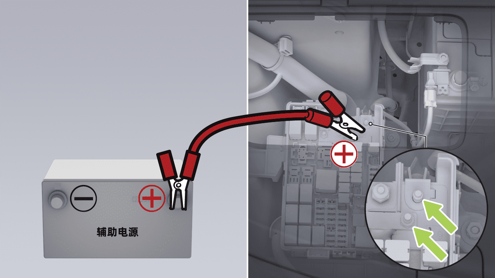

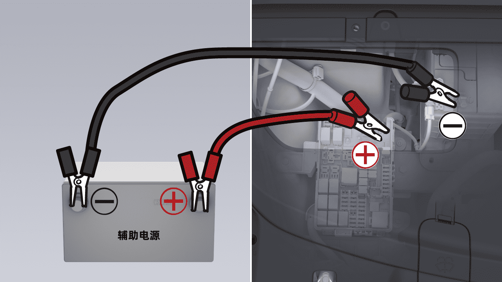

Rescate de Emergencia

el vehículo no arranca. Después de apagar, asegúrese de que la llave del control remoto* o la llave de tarjeta NFC esté dentro del vehículo, o que la llave del teléfono esté conectada al vehículo. Luego, puede presionar el pedal del freno y cambiar de marcha para arrancar el vehículo.

• El voltaje de la fuente auxiliar debe ser el mismo que el voltaje y la capacidad de la batería del vehículo; de lo contrario, puede ocurrir una explosión.

• La batería no debe entrar en contacto con llamas abiertas o electricidad estática; de lo contrario, el gas combustible producido por la batería puede ser encendido por chispas, causando una explosión.

precaución

Energía auxiliar de emergencia, no puede mantener una salida de alta potencia durante un largo período de tiempo, generalmente para completar la operación de energía auxiliar - reinicio dentro de 30 s, de lo contrario realizar la operación de devolución de energía.

• No toque componentes de alto voltaje durante la operación, tenga cuidado de evitar lesiones por descarga eléctrica de alto voltaje.

E-call*

6. Arranque el vehículo. Una vez que arranque exitosamente, desconecte los cables en orden inverso y reinstale la placa de cubierta de mantenimiento.

Introducción

E-call es el sistema inteligente de llamadas de emergencia del vehículo que marca automática o manualmente a los servicios de emergencia cuando ocurren accidentes o emergencias, proporcionando la ubicación del vehículo e información sobre lesiones de pasajeros para ayudar al personal de rescate a llegar rápidamente a la escena y asistir a los ocupantes atrapados.

• El uso inadecuado del cable de conexión puede causar que la batería explote y cause lesiones personales.

advertencia

Rescate de Emergencia

Operación

• Reintento de llamada: Si la llamada no se conecta o se interrumpe, el sistema admite redial dentro de un período determinado.

• El indicador del interruptor SOS se ilumina en verde cuando Call Assist está esperando o activado. El indicador del interruptor SOS se ilumina en rojo en caso de fallo del sistema y debe buscar asistencia por otros medios.

Consejos

• Una vez que Call Assist está activado, la llamada solo puede ser finalizada por el operador.

En caso de una emergencia, se pueden utilizar los siguientes métodos para llamar en busca de asistencia:

• Call Assistance ha superado su fecha de vencimiento y no se puede proporcionar un servicio adicional; consulte la fecha de vencimiento de Call Assistance a tiempo en la pantalla de control central.

• Llamada manual: Mantenga presionado el interruptor SOS durante más de 3 segundos para iniciar una llamada de emergencia. Si desea cancelar la llamada mientras espera la conexión, presione el interruptor nuevamente.

• En caso de fallo de la batería, Call Assist puede continuar apoyando una llamada durante un período de tiempo.

• Llamada automática: Cuando el vehículo está involucrado en un choque que desencadena el despliegue de airbag, el sistema iniciará automáticamente una llamada de emergencia.

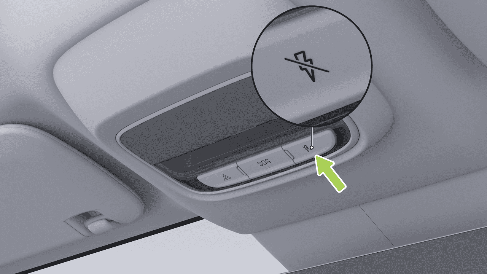
