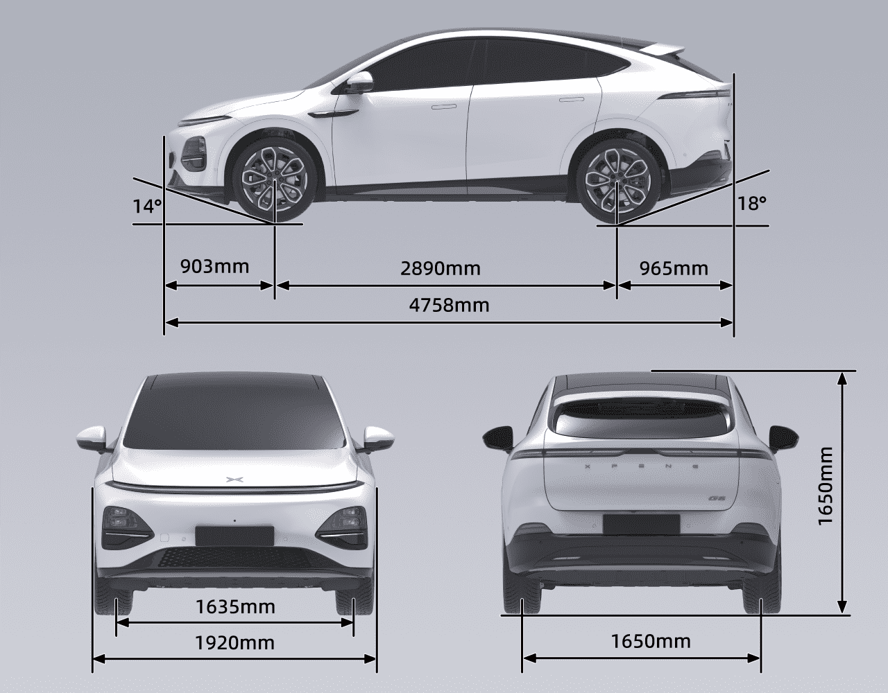
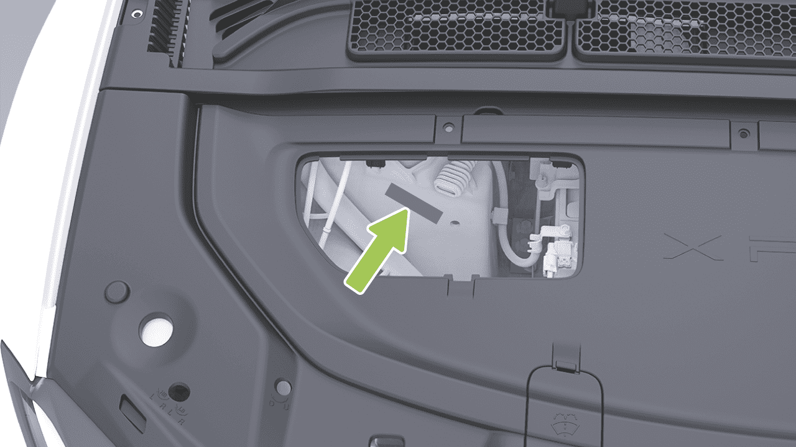
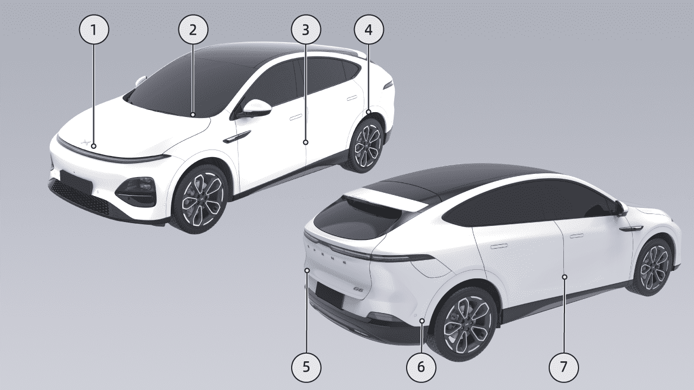
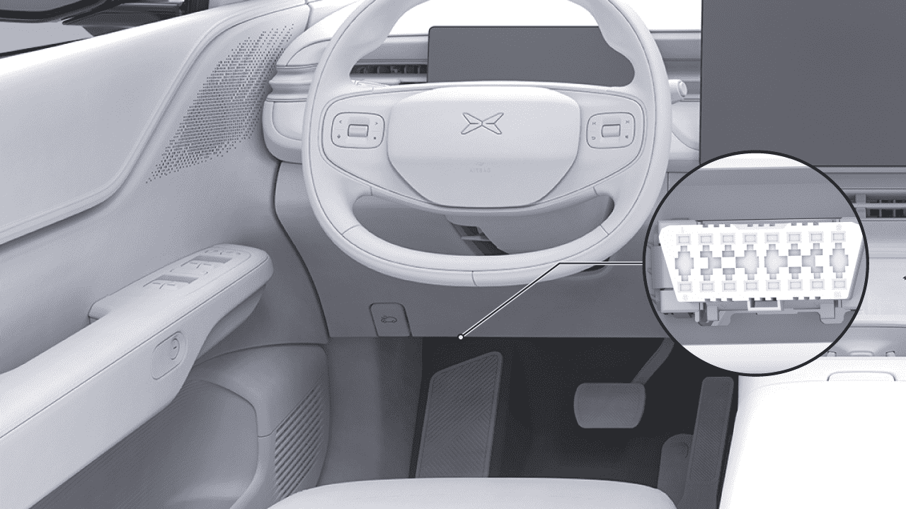
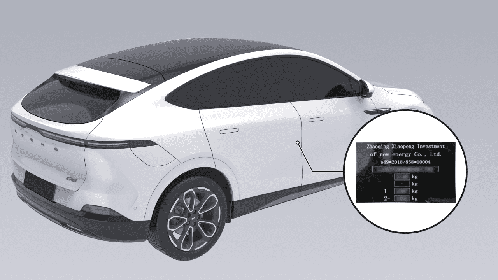
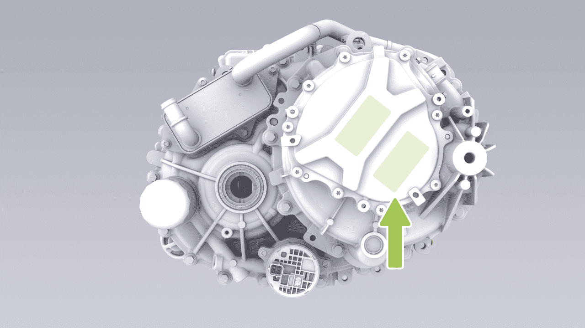
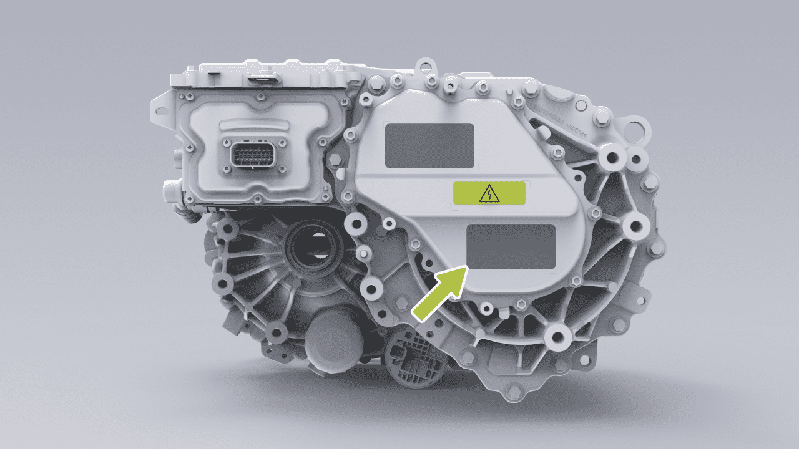
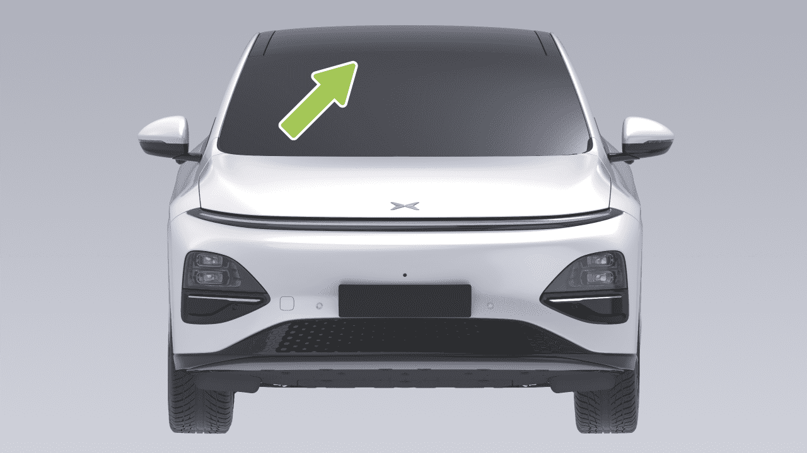

# Información del Vehículo

Información del Vehículo

Parámetros del Vehículo

Dimensiones

Información del Vehículo

Longitud (mm)
4758

Dimensión

Ancho (mm)
1920

Altura (mm)
1650

Distancia entre ruedas delanteras
(mm)
1635

Distancia entre ejes

Distancia entre ruedas traseras
(mm)
1650

Batalla (mm)
2890

Suspensión delantera (mm)

Suspensión trasera (mm)

Número de ocupantes

Ángulo de aproximación (carga completa) (°)

Ángulo de salida (carga completa) (°)

Información del Vehículo

Consejos

Los espejos retrovisores exteriores (uno en cada lado) no se incluyen en el ancho exterior. La tolerancia de los parámetros dimensionales del vehículo es ±1%.
Peso

Nombre del artículo
2WD largo alcance
2WD alcance ultra largo

4WD alcance ultra largo

Peso en vacío del vehículo (kg)
2065, 2085
(gancho de remolque)

2115, 2140 (gancho de
remolque)

2220, 2240
(gancho de remolque)

Eje delantero (kg)
979, 969 (gancho de
remolque)

984, 978 (gancho de
remolque)

1088, 1080
(gancho de remolque)

En vacío

Eje trasero (kg)
1086, 1116 (gancho de
remolque)

1131, 1162 (gancho de
remolque)

1132, 1160 (gancho de
remolque)

Masa bruta del vehículo (kg)
2535
2590
2690

Máximo

Eje delantero (kg)
1090
1098
1200

Eje trasero (kg)
1445
1492
1490

Información del Vehículo

Consejos

El rango de tolerancia del parámetro de masa es ±3%, excepto para la masa total máxima.

Información del Vehículo

Parámetros de Rendimiento

Diámetro mínimo de giro
(m)
11.6

Velocidad máxima (km/h)

Pendiente máxima (%)

Información del Vehículo

Ruedas y Neumáticos

Neumáticos
235/60R18
255/45R20

Llanta
18×7.5J
20×8.5J

Ruedas delanteras (sin carga/
media carga/carga completa)
(kPa)

Presión

Ruedas traseras (sin carga/
media carga/carga completa)
(kPa)

Ruedas delanteras, lado interior
(g)
≤8

Ruedas delanteras, lado exterior
(g)
≤8

Equilibrado de ruedas (después de
montar los contrapesos)

Ruedas traseras, lado interior
(g)
≤8

Ruedas traseras, lado exterior
(g)
≤8

Información del Vehículo

Frenos y Suspensión

Tipo
Tipo de disco de ventilación con pinza flotante

Tipo de asistencia
Dirección asistida eléctrica

Límite de desgaste de la pastilla de freno de la rueda delantera (sin incluir
la placa de soporte) (mm)

Recorrido libre o recorrido sin carga del pedal de freno (mm)
≤2

Límite de desgaste de la pastilla de freno de la rueda trasera (sin incluir
la placa de soporte) (mm)
3.3

Límite de desgaste del disco de freno delantero (mm)

Límite de desgaste del disco de freno trasero (mm)

Tipo de suspensión delantera
Suspensión independiente de doble brazo

Tipo de suspensión trasera
Suspensión independiente de múltiples brazos

Información del Vehículo

Especificaciones de alineación de cuatro ruedas

Convergencia de rueda delantera individual
0.15°±0.05°

Ángulo de pivote individual
6.8°±1°

Ángulo de inclinación de rueda delantera individual
-0.5°±0.5°

Ángulo de inclinación del pivote individual
10.2°±1°

Convergencia de rueda trasera individual
0.1°±0.05°

Ángulo de inclinación de rueda trasera
-1.36°±0.5°

Información del Vehículo

Parámetros del Sistema de Propulsión Eléctrica

Configuración de propulsión
Largo alcance
2WD

Alcance ultra largo 2WD
Alcance ultra largo 4WD

Nombre del artículo
Sistema de propulsión
eléctrica trasero

Sistema de propulsión
eléctrica trasero

Sistema de propulsión
eléctrica delantero

Sistema de propulsión
eléctrica trasero

Información del Vehículo

Síncrono de imán
permanente

Síncrono de imán
permanente

Asíncrono de CA

Síncrono de imán
permanente

Tipo

Potencia nominal (kW)
110*/218/185
218/185

Par nominal
(N·m)

Motor eléctrico

Velocidad nominal
(rpm)
6190
6190
7300
6190

Potencia máxima
(kW)

Par máximo
(N·m)

Velocidad máxima
(rpm)
18000
18000
18000
18000

Modelo
1ETP45A
1ETP45A
1ETP22A
1ETP45A

Reductor

Número de engranajes

Información del vehículo

Parámetros de ajuste del asiento

En la posición inicial, los parámetros de ajuste
del asiento son los siguientes:

Tipo de asiento
Artículo
Parámetro

Ajuste adelante
y atrás

Recorrido total: 260 mm; 212 mm adelante, 48 mm
atrás

Asiento del
conductor

Ajuste del
respaldo
Recorrido total 91°, 16° adelante y 75° atrás

Ajuste
arriba/abajo

Recorrido total 69,5 mm, 35,6 mm hacia arriba y 33,9 mm
hacia abajo

Ajuste del
cojín
El recorrido total es 6°, con 5° hacia arriba y 1° hacia abajo

Información del vehículo

Ajuste adelante
y atrás

Recorrido total: 260 mm; 212 mm adelante, 48 mm
atrás

Asiento del pasajero delantero

Ajuste del
respaldo
Recorrido total 91°, 16° adelante y 75° atrás

Ajuste
arriba/abajo

Recorrido total 69,5 mm, 35,6 mm hacia arriba y 33,9 mm
hacia abajo

Información del vehículo

Fluidos y capacidad

Introducción

Nombre del artículo
Modelo
Cantidad de llenado

Aceite lubricante del accionamiento
eléctrico delantero* (L)

FUCHS 4101

1,35 L

Aceite lubricante del accionamiento
eléctrico trasero (L)
1,4 L

Refrigerante (L)
Mezcla de glicol y
agua

Modelo 2WD
Aprox. 14,8 L

Modelo 4WD
Aprox. 15,2 L

Refrigerante del aire acondicionado (g)

R1234yf*
1150±15

Líquido de frenos (L)
DOT4
1,04 L

R134a*
1250±15

Líquido limpiaparabrisas
(L)
/

Información del vehículo

Placa de identificación y etiquetas

Número de identificación del vehículo (VIN)

1.
Colocada en el lado interior del capó.

2. Colocada en la esquina inferior izquierda del
parabrisas delantero.

El código de identificación del vehículo está grabado
en la torre derecha del asiento de la cabina
delantera del molde de aluminio.

3. Colocada en el pilar B izquierdo.

4. Colocada en la casa de ruedas trasera izquierda.

5. Colocada en el lado izquierdo de la tapa del
maletero.

Otros VIN se encuentran en las siguientes posiciones
del vehículo:

6. Colocada en el miembro transversal frontal del
piso trasero.

7. Colocada en el panel interno de la puerta trasera
derecha.

Información del vehículo

Puerto de diagnóstico OBD

Placa de identificación del producto del vehículo

El puerto OBD para leer el VIN electrónico
se encuentra en la parte inferior derecha del
panel de instrumentos. El VIN electrónico, la
información de estado del vehículo y otros datos
se pueden leer con el aparato de diagnóstico
del fabricante original o con equipo de
diagnóstico aprobado oficialmente por el
fabricante original.

La placa de identificación del producto se
encuentra en el pilar B del lado del pasajero y
se puede ver después de abrir la puerta del lado
del pasajero.

Información del vehículo

Modelo y número del motor eléctrico

Motor de tracción trasera

Motor eléctrico delantero*

El modelo y número de serie del motor de
tracción se muestran en la carcasa del motor de
tracción y en la etiqueta del motor de tracción.

El modelo y número de serie del motor de tracción se muestran en la carcasa del motor de tracción y en la etiqueta del motor de tracción.

## Piezas y Modificaciones

### Introducción

Solo se pueden usar piezas originales XPENG genuinas o aprobadas. XPENG ha realizado pruebas rigurosas en las piezas para garantizar su idoneidad, seguridad y confiabilidad. Estas piezas solo pueden ser

Vehicle Information

compradas en el Centro de Servicio XPENG, instaladas por profesionales de XPENG, y los vehículos pueden ser modificados según las recomendaciones de expertos de XPENG.

Está prohibido reemplazar, modificar o agregar radares o cámaras sin permiso. De lo contrario, puede afectar el funcionamiento normal de funciones relacionadas como la asistencia del conductor y también puede causar interferencia de radio. XPENG no asume ninguna responsabilidad por ninguna pérdida directa o indirecta causada como resultado. En caso de cualquier falla de radar o cámara, visite el Centro de Servicio XPENG para reparaciones.

No modifique el vehículo utilizando piezas no originales de XPENG o no aprobadas, ya que esto puede afectar la operabilidad, seguridad y durabilidad del vehículo, y también puede violar las regulaciones del gobierno local.

No modifique los sistemas de suspensión o frenos del vehículo, ya que esto puede afectar adversamente el manejo y la seguridad del vehículo.

Al modificar la carrocería del vehículo (como aplicar película cambiante de color, película transparente de protección de pintura o franjas anti-colisión), evite áreas con radar ultrasónico, SRR, cámaras AVM y cámaras de alta percepción, ya que esto puede afectar el funcionamiento normal de funciones relacionadas como la asistencia del conductor.

Está prohibido modificar la caja de fusibles del vehículo, de lo contrario puede afectar adversamente el sistema eléctrico del vehículo.

El SRR se encuentra ubicado dentro de los parachoques delantero y trasero. Está prohibido pintar, agregar molduras u otras modificaciones a los parachoques delantero y trasero sin permiso, ya que esto puede afectar el funcionamiento normal de funciones relacionadas como la asistencia del conductor.

Las modificaciones de componentes electrónicos, software o cableado pueden afectar la funcionalidad y el funcionamiento normal de componentes relacionados, particularmente sistemas relacionados con la seguridad, impactando así la operación del vehículo e incrementando el riesgo de accidentes o lesiones.

Vehicle Information

Por lo tanto, no modifique el cableado, los componentes electrónicos o su software.

Ventanas Ondas de radio

Además, el daño al vehículo o problemas de rendimiento causados por el uso de piezas no originales de XPENG o no aprobadas para reemplazo, instalación o modificación no están cubiertos por la garantía. XPENG no asume ninguna responsabilidad por ninguna pérdida directa o indirecta causada como resultado.

### Introducción

Requisitos de Reciclaje y Procedimientos de la Batería de Tracción

### Introducción

Cuando la batería de tracción necesite ser reemplazada o desechada, asegúrese de contactar al Centro de Servicio XPENG para reciclaje y manejo.
El desecho inadecuado de la batería de tracción puede causar contaminación ambiental o peligros de seguridad, y el propietario del vehículo asumirá la responsabilidad correspondiente.

La ventana de ondas de radio está ubicada en el parabrisas.

advertencia

• Bloqueo de la posición de la ventana de ondas de radio.

• Seleccione la ubicación alrededor de la ventana de ondas de radio al colocar las marcas necesarias para las regulaciones de tráfico.

